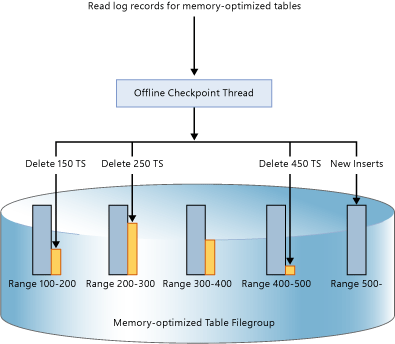

# Durability for Memory-Optimized Tables
 [!INCLUDE [SQL Server](../../includes/applies-to-version/sqlserver.md)]

  [!INCLUDE[inmemory](../../includes/inmemory-md.md)] provides full durability for memory-optimized tables. When a transaction that changed a memory-optimized table commits, [!INCLUDE[ssNoVersion](../../includes/ssnoversion-md.md)] (as it does for disk-based tables), guarantees that the changes are permanent (will survive a database restart), provided the underlying storage is available. There are two key components of durability: transaction logging and persisting data changes to on-disk storage.  
  
 For details on any size limitations for durable tables see [Estimate Memory Requirements for Memory-Optimized Tables](../../relational-databases/in-memory-oltp/estimate-memory-requirements-for-memory-optimized-tables.md). 
  
## Transaction Log  
 All changes made to disk-based tables or durable memory-optimized tables are captured in one or more transaction log records. When a transaction commits, [!INCLUDE[ssNoVersion](../../includes/ssnoversion-md.md)] writes the log records associated with the transaction to disk before communicating to the application or user session that the transaction has committed. This guarantees that changes made by the transaction are durable. The transaction log for memory-optimized tables is fully integrated with the same log stream used by disk-based tables. This integration allows existing transaction log backup, recover, and restore operations to continue to work without requiring any additional steps. However, since [!INCLUDE[inmemory](../../includes/inmemory-md.md)] can increase transaction throughput of your workload significantly, log IO may become a performance bottleneck. To sustain this increased throughput, ensure the log IO subsystem can handle the increased load.  
  
## Data and Delta Files  
 The data in memory-optimized tables is stored as free-form data rows in an in-memory heap data structure, and are linked through one or more indexes in memory. There are no page structures for data rows, such as those used for disk-based tables. For long term persistence and to allow truncation of the transction log, operations on memory-optimized tables are persisted in a set of data and delta files. These files are generated based on the transaction log, using an asynchronous background process. The data and delta files are located in one or more containers (using the same mechanism used for FILESTREAM data). These containers are part of a memory-optimized filegroup.  
  
 Data is written to these files in a strictly sequential fashion, which minimizes disk latency for spinning media. You can use multiple containers on different disks to distribute the I/O activity. Data and delta files in multiple containers on different disks will increase database restore/recovery performance when data is read from the data and delta files on disk, into memory.  
  
 User transactions do not directly access data and delta files. All data reads and writes use in-memory data structures.  
  
### The Data File  
 A data file contains rows from one or more memory-optimized tables that were inserted by multiple transactions as part of INSERT or UPDATE operations. For example, one row can be from memory-optimized table T1 and the next row can be from memory-optimized table T2. The rows are appended to the data file in the order of transactions in the transaction log, making data access sequential. This enables an order of magnitude better I/O throughput compared to random I/O.  
  
 Once the data file is full, the rows inserted by new transactions are stored in another data file. Over time, the rows from durable memory-optimized tables are stored in one of more data files and each data file containing rows form a disjoint but contiguous range of transactions. For example a data file with transaction commit timestamp in the range of (100, 200) has all the rows inserted by transactions that have commit timestamp greater than 100 and less than or equal to 200. The commit timestamp is a monotonically increasing number assigned to a transaction when it is ready to commit. Each transaction has a unique commit timestamp.  
  
 When a row is deleted or updated, the row is not removed or changed in-place in the data file but the deleted rows are tracked in another type of file: the delta file. Update operations are processed as a tuple of delete and insert operations for each row. This eliminates random IO on the data file.  
 
   Size: Each data file is sized approximately to 128MB for computers with memory greater than 16GB, and 16MB for computers with less than or equal to 16GB. In [!INCLUDE[sssql16-md](../../includes/sssql16-md.md)] SQL Server can use large checkpoint mode if it deems the storage subsystem is fast enough. In large checkpoint mode, data files are sized at 1GB. This allows for greater efficiency in the storage subsystem for high-throughput workloads.  
   
### The Delta File  
 Each data file is paired with a delta file that has the same transaction range and tracks the deleted rows inserted by transactions in the transaction range. This data and delta file is referred to as a Checkpoint File Pair (CFP) and it is the unit of allocation and deallocation as well as the unit for Merge operations. For example, a delta file corresponding to transaction range (100, 200) will store deleted rows that were inserted by transactions in the range (100, 200). Like data files, the delta file is accessed sequentially.  
  
 When a row is deleted, the row is not removed from the data file but a reference to the row is appended to the delta file associated with the transaction range where this data row was inserted. Since the row to be deleted already exists in the data file, the delta file only stores the reference information `{inserting_tx_id, row_id, deleting_tx_id }` and it follows the transactional log order of the originating delete or update operations.  
  

 Size: Each delta file is sized approximately to 16MB for computers with memory greater than 16GB, and 1MB for computers with less than or equal to 16GB. Starting [!INCLUDE[sssql16-md](../../includes/sssql16-md.md)] SQL Server can use large checkpoint mode if it deems the storage subsystem is fast enough. In large checkpoint mode, delta files are sized at 128MB.  
 
## Populating Data and Delta Files  
 Data and delta file are populated based on the transaction log records generated by committed transactions on memory-optimized tables and appends information about the inserted and deleted rows into appropriate data and delta files. Unlike disk-based tables where data/index pages are flushed with random I/O when checkpoint is done, the persistence of memory-optimized table is continuous background operation. Multiple delta files are accessed because a transaction can delete or update any row that was inserted by any previous transaction. Deletion information is always appended at the end of the delta file. For example, a transaction with a commit timestamp of 600 inserts one new row and deletes rows inserted by transactions with a commit timestamp of 150, 250 and 450 as shown in the picture below. All 4 file I/O operations (three for deleted rows and 1 for the newly inserted rows), are append-only operations to the corresponding delta and data files.  
  
   
  
## Accessing Data and Delta Files  
 Data and delta file pairs are accessed when the following occurs.  
  
 Offline checkpoint worker(s)  
 This thread appends inserts and deletes to memory-optimized data rows, to the corresponding data and delta file pairs. In [!INCLUDE[ssSQL14](../../includes/sssql14-md.md)] there is one offline checkpoint worker; starting [!INCLUDE[sssql16-md](../../includes/sssql16-md.md)] there are multiple checkpoint workers.  
  
 Merge operation  
 The operation merges one or more data and delta file pairs and creates a new data and delta file pair.  
  
 During crash recovery  
 When [!INCLUDE[ssNoVersion](../../includes/ssnoversion-md.md)] is restarted or the database is brought back online, the memory-optimized data is populated using the data and delta file pairs. The delta file acts as a filter for the deleted rows when reading the rows from the corresponding data file. Because each data and delta file pair is independent, these files are loaded in parallel to reduce the time taken to populate data into memory. Once the data has been loaded into memory, the In-Memory OLTP engine applies the active transaction log records not yet covered by the checkpoint files so that the memory-optimized data is complete.  
  
 During restore operation  
 The In-Memory OLTP checkpoint files are created from the database backup, and then one or more transaction log backups are applied. As with crash recovery, the In-Memory OLTP engine loads data into memory in parallel, to minimize the impact on recovery time.  
  
## Merging Data and Delta Files  
 The data for memory optimized tables is stored in one or more data and delta file pairs (also called a checkpoint file pair, or CFP). Data files store inserted rows and delta files reference deleted rows. During the execution of an OLTP workload, as the DML operations update, insert, and delete rows, new CFPs are created to persist the new rows, and the reference to the deleted rows is appended to delta files.  
  
 Over time, with DML operations, the number of data and delta files grow causing, causing increased disk space usage and increased recovery time..  
  
 To help prevent these inefficiencies, the older closed data and delta files are merged, based on a merge policy described below, so the storage array is compacted to represent the same set of data, with a reduced number of files.  
  
 The merge operation takes as input one or more adjacent closed checkpoint file pairs (CFPs), which are pairs of data and delta files, (called merge source) based on an internally defined merge policy, and produces one resultant CFP, called the merge target. The entries in each delta file of the source CFPs are used to filter rows from the corresponding data file to remove the data rows that are not needed. The remaining rows in the source CFPs are consolidated into one target CFP. After the merge is complete, the resultant merge-target CFP replaces the source CFPs (merge sources). The merge-source CFPs go through a transition phase before they are removed from storage.  
  
 In the example below, the memory-optimized table file group has four data and delta file pairs at timestamp 500 containing data from previous transactions. For example, the rows in the first data file correspond to transactions with timestamp greater than 100 and less than or equal to 200; alternatively represented as (100, 200]. The second and third data files are shown to be less than 50 percent full after accounting for the rows marked as deleted. The merge operation combines these two CFPs and creates a new CFP containing transactions with timestamp greater than 200 and less than or equal to 400, which is the combined range of these two CFPs. You see another CFP with range (500, 600] and non-empty delta file for transaction range (200, 400] shows that merge operation can be done concurrently with transactional activity including deleting more rows from the source CFPs.  
  
   
  
 A background thread evaluates all closed CFPs using a merge policy and then initiates one or more merge requests for the qualifying CFPs. These merge requests are processed by the offline checkpoint thread. The evaluation of merge policy is done periodically and also when a checkpoint is closed.  
  
### [!INCLUDE[ssNoVersion](../../includes/ssnoversion-md.md)] Merge Policy  
 [!INCLUDE[ssNoVersion](../../includes/ssnoversion-md.md)] implements the following merge policy:  
  
-   A merge is scheduled if 2 or more consecutive CFPs can be consolidated, after accounting for deleted rows, such that the resultant rows can fit into 1 CFP of target size. The target size of data and delta files corresponds to the original sizing, as described above.  
  
-   A single CFP can be self-merged if the data file exceeds double the target size and more than half of the rows are deleted. A data file can grow larger than the target size if, for example, a single transaction or multiple concurrent transactions inserts or updates a large amount of data, forcing the data file to grow beyond its target size, because a transaction cannot span multiple CFPs.  
  
 Here are some examples that show the CFPs that will be merged under the merge policy:  
  
|Adjacent CFPs Source Files (% full)|Merge Selection|  
|-------------------------------------------|---------------------|  
|CFP0 (30%), CFP1 (50%), CFP2 (50%), CFP3 (90%)|(CFP0, CFP1)   CFP2 is not chosen as it will make resultant data file greater than 100% of the ideal size.|  
|CFP0 (30%), CFP1 (20%), CFP2 (50%), CFP3 (10%)|(CFP0, CFP1, CFP2). Files are chosen starting from left.   CTP3 is not chosen as it will make resultant data file greater than 100% of the ideal size.|  
|CFP0 (80%), CFP1 (30%), CFP2 (10%), CFP3 (40%)|(CFP1, CFP2, CFP3). Files are chosen starting from left.   CFP0 is skipped because if combined with CFP1, the resultant data file will be greater than 100% of the ideal size.|  
  
 Not all CFPs with available space qualify for merge. For example, if two adjacent CFPs are 60% full, they will not qualify for merge and each of these CFPs will have 40% storage unused. In the worst case, all CFPs will be 50% full, a storage utilization of only 50%. While the deleted rows may exist in storage because the CFPs don't qualify for merge, the deleted rows may have already been removed from memory by in-memory garbage collection. The management of storage and the memory is independent from garbage collection. Storage taken by active CFPs (not all CFPs are being updated) can be up to 2 times larger than the size of durable tables in memory.  
  
### Life Cycle of a CFP  
 CFPs transition through several states before they can be deallocated. Database checkpoints and log backups need to happen to transition the files through the phases, and ultimately clean up files that are no longer needed. For a description of these phases, see [sys.dm_db_xtp_checkpoint_files &#40;Transact-SQL&#41;](../../relational-databases/system-dynamic-management-views/sys-dm-db-xtp-checkpoint-files-transact-sql.md).  
  
 You can manually force the checkpoint followed by log backup to expedite the garbage collection. In production scenarios, the automatic checkpoints and log backups taken as part of backup strategy will seamlessly transition CFPs through these phases without requiring any manual intervention. The impact of the garbage collection process is that databases with memory-optimized tables may have a larger storage size compared to its size in memory. If checkpoint and log backups do not happen, the on-disk footprint of checkpoint files continues to grow.  
  
## See Also  
 [Creating and Managing Storage for Memory-Optimized Objects](../../relational-databases/in-memory-oltp/creating-and-managing-storage-for-memory-optimized-objects.md)  
  
  
