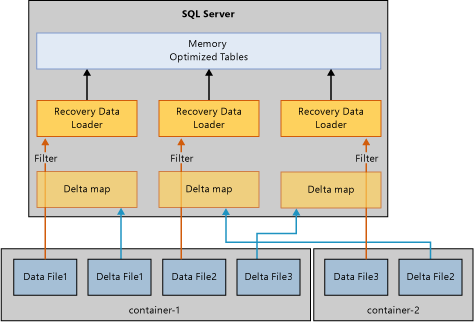

# Restore and recovery of memory-optimized tables
[!INCLUDE[appliesto-ss-xxxx-xxxx-xxx-md](../../includes/appliesto-ss-xxxx-xxxx-xxx-md.md)]

The basic mechanism to recover or restore a database that uses memory-optimized tables is similar to the mechanism for a database that uses only disk-based tables. But unlike disk-based tables, memory-optimized tables must be loaded into memory before the database is available for user access. This requirement adds a new step in the database recovery.  
  
If the server does not have enough available memory, database recovery fails and the database is marked as suspect. To resolve this problem, see [Resolve out-of-memory issues](resolve-out-of-memory-issues.md). 
  
## Factors that affect load time
During recovery or restore operations, the In-Memory OLTP engine reads data and delta files for loading into physical memory. The load time is determined by:  
  
-   The amount of data to load.  
  
-   Sequential I/O bandwidth.  
  
-   The degree of parallelism, determined by the number of file containers and processor cores.  
  
-   The number of log records in the active portion of the log that need to be redone.  

## Phases of recovery
When [!INCLUDE[ssNoVersion](../../includes/ssnoversion-md.md)] restarts, each database goes through a recovery process that consists of three phases:  
  
1.  **Analysis**. In this phase, a pass is made on the active transaction logs to detect committed and uncommitted transactions. The In-Memory OLTP engine identifies the checkpoint to load and preloads its system table log entries. It also processes some file allocation log records.  
  
2.  **Redo**. This phase is run concurrently on both disk-based and memory-optimized tables.  
  
    - For disk-based tables, the database is moved to the current point in time and acquires locks taken by uncommitted transactions.  
  
    - For memory-optimized tables, data from the data and delta file pairs are loaded into memory. Data is then updated with the active transaction log based on the last durable checkpoint.  
  
    When the preceding operations on disk-based and memory-optimized tables are complete, the database is available for access.  
  
3.  **Undo**. In this phase, the uncommitted transactions are rolled back.  
  
## Process for improving load time
Loading memory-optimized tables into memory can affect performance of the recovery time objective (RTO). To improve the load time of memory-optimized data from data and delta files, the In-Memory OLTP engine loads the data/delta files in parallel as follows:  
  
-   **Creating a delta map filter**. Delta files store references to the deleted rows. One thread per container reads the delta files and creates a delta map filter. (A memory-optimized data file group can have one or more containers.)  
  
-   **Streaming the data files**. After the delta map filter is created, data files are read by as many threads as there are logical CPUs. Each thread reads the data rows, checks the associated delta map, and inserts a row into the table only if the row has not been marked deleted. This part of recovery can be CPU bound in some cases, as noted in this diagram:  
  
      
  
## Specific cases of slow load times
Memory-optimized tables can generally be loaded into memory at the speed of I/O, but loading data rows into memory is sometimes slower. Specific cases are:  
  
-   Low bucket count for a hash index can lead to excessive collision, which causes data row inserts to be slower. This generally results in high CPU utilization throughout, and especially toward the end of recovery. If you configured the hash index correctly, it should not affect the recovery time.  
  
-   Large memory-optimized tables with one or more nonclustered indexes can cause high CPU utilization. Unlike a hash index whose bucket count is sized at create time, nonclustered indexes grow dynamically.  
  
## See also  
 [Backup, Restore, and Recovery of Memory-Optimized Tables](https://msdn.microsoft.com/library/3f083347-0fbb-4b19-a6fb-1818d545e281)  
  
  
