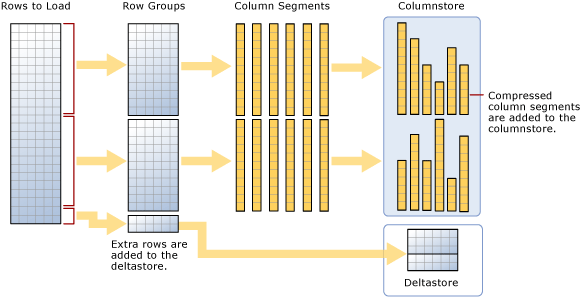

# Columnstore indexes - Data loading guidance

[!INCLUDE[SQL Server Azure SQL Database Synapse Analytics PDW ](../../includes/applies-to-version/sql-asdb-asdbmi-asa-pdw.md)]

Options and recommendations for loading data into a columnstore index by using the standard SQL bulk loading and trickle insert methods. Loading data into a columnstore index is an essential part of any data warehousing process because it moves data into the index in preparation for analytics.
  
 New to columnstore indexes? See [Columnstore indexes - overview](../../relational-databases/indexes/columnstore-indexes-overview.md) and [Columnstore Index Architecture](../../relational-databases/sql-server-index-design-guide.md#columnstore_index).
  
## What is bulk loading?
*Bulk loading* refers to the way large numbers of rows are added to a data store. It is the most performant way to move data into a columnstore index because it operates on batches of rows. Bulk loading fills rowgroups to maximum capacity and compresses them directly into the columnstore. Only rows at the end of a load that don't meet the minimum of 102,400 rows per rowgroup go to the deltastore.  

To perform a bulk load, you can use [bcp Utility](../../tools/bcp-utility.md), [Integration Services](../../integration-services/sql-server-integration-services.md), or select rows from a staging table.

  
  
As the diagram suggests, a bulk load:
  
- Does not pre-sort the data. Data is inserted into rowgroups in the order it is received.
- If the batch size is >= 102400, the rows are directly into the compressed rowgroups. It is recommended that you choose a batch size >=102400 for efficient bulk import because you can avoid moving data rows to delta rowgroups before the rows are  eventually moved  to compressed rowgroups by a background thread, Tuple mover (TM).
- If the batch size < 102,400 or if the remaining rows are < 102,400, the rows are loaded into delta rowgroups.

> [!NOTE]
> On a rowstore table with a nonclustered columnstore index data, [!INCLUDE[ssNoVersion](../../includes/ssnoversion-md.md)] always inserts data into the base table. The data is never inserted directly into the columnstore index.  

Bulk loading has these built-in performance optimizations:
-   **Parallel loads:** You can have multiple concurrent bulk loads (bcp or bulk insert) that are each loading a separate data file. Unlike rowstore bulk loads into [!INCLUDE[ssNoVersion](../../includes/ssnoversion-md.md)], you don't need to specify `TABLOCK` because each bulk import thread will load data exclusively into separate rowgroups (compressed or delta rowgroups) with exclusive lock on it. 

-   **Reduced Logging:** The data that is directly loaded into compressed row groups leads to significant reduction in the size of the log. For example, if data was compressed 10x, the corresponding transaction log will be roughly 10x smaller without requiring TABLOCK or Bulk-logged/Simple recovery model. Any data that goes to a delta rowgroup is fully logged. This includes any batch sizes that are less than 102,400 rows.  Best practice is to use batchsize >= 102400. Since there is no TABLOCK required, you can load the data in parallel. 

-   **Minimal logging:** You can get further reduction in logging if you follow the prerequisites for [minimal logging](../import-export/prerequisites-for-minimal-logging-in-bulk-import.md). However, unlike loading data into a rowstore, TABLOCK leads to an X lock on the table rather than a BU (Bulk Update) lock and therefore parallel data load cannot be done. For more information on locking, see [Locking and row versioning](../sql-server-transaction-locking-and-row-versioning-guide.md).

-   **Locking Optimization:** The X lock on a row group is automatically acquired when loading data into a compressed row group. However, when bulk loading into a delta rowgroup, an X lock is acquired at rowgroup but [!INCLUDE[ssNoVersion](../../includes/ssnoversion-md.md)] still locks the PAGE/EXTENT because X rowgroup lock is not part of locking hierarchy.  
  
If you have a nonclustered B-tree index on a columnstore index, there is no locking or logging optimization for the index itself but the optimizations on clustered columnstore index as described above are applicable.  

Please note, DML (insert, delete, update) is not a batch mode operation because it is not parallel.
  
## Plan bulk load sizes to minimize delta rowgroups
Columnstore indexes perform best when most of the rows are compressed into the columnstore and not sitting in delta rowgroups. It's best to size your loads so that rows go directly to the columnstore and bypass the deltastore as much as possible.

These scenarios describe when loaded rows go directly to the columnstore or when they go to the deltastore. In the example, each rowgroup can have 102,400-1,048,576 rows per rowgroup. In practice, the maximum size of a rowgroup can be smaller than 1,048,576 rows when there is memory pressure.  
  
|Rows to Bulk Load|Rows Added to the Compressed Rowgroup|Rows Added to the Delta Rowgroup|  
|-----------------------|-------------------------------------------|--------------------------------------|  
|102,000|0|102,000|  
|145,000|145,000<br /><br /> Rowgroup size: 145,000|0|  
|1,048,577|1,048,576<br /><br /> Rowgroup size: 1,048,576.|1|  
|2,252,152|2,252,152<br /><br /> Rowgroup sizes: 1,048,576, 1,048,576, 155,000.|0|  
  
 The following example shows the results of loading 1,048,577 rows into a table. The results show that one COMPRESSED rowgroup in the columnstore (as compressed column segments), and 1 row in the deltastore.  
  
```sql  
SELECT object_id, index_id, partition_number, row_group_id, delta_store_hobt_id, 
  state, state_desc, total_rows, deleted_rows, size_in_bytes   
FROM sys.dm_db_column_store_row_group_physical_stats  
```  
  
   
  
## Use a staging table to improve performance
If you are loading data only to stage it before running more transformations, loading the table to heap table will be much faster than loading the data to a clustered columnstore table. In addition, loading data to a [temporary table][Temporary] will also load much faster than loading a table to permanent storage.  

 A common pattern for data load is to load the data into a staging table, do some transformation and then load it into the target table using the following command  
  
```sql  
INSERT INTO [<columnstore index>]
SELECT col1 /* include actual list of columns in place of col1*/
FROM [<Staging Table>]
```  
  
 This command loads the data into the columnstore index in similar ways to BCP or Bulk Insert but in a single batch. If the number of rows in the staging table < 102400, the rows are loaded into a delta rowgroup otherwise the rows are directly loaded into compressed rowgroup. One key limitation was that this `INSERT` operation was single threaded. To load data in parallel, you could create multiple staging table or issue `INSERT`/`SELECT` with non-overlapping ranges of rows from the staging table. This limitation goes away with [!INCLUDE[sssql16-md](../../includes/sssql16-md.md)]. The command below loads the data from staging table in parallel but you will need to specify `TABLOCK`. You may find this contradictory to what was said earlier with bulkload but the key difference is the parallel data load from the staging table is executed under the same transaction.
  
```sql  
INSERT INTO [<columnstore index>] WITH (TABLOCK) 
SELECT col1 /* include actual list of columns in place of col1*/
FROM [<Staging Table>]
```  
  
 There are following optimizations available when loading into a clustered columnstore index from staging table:
-   **Log Optimization:** Reduced logging when the data is loaded into a compressed rowgroup.   
-   **Locking Optimization:** When loading into a compressed rowgroup, the X lock on rowgroup is acquired. However, with delta rowgroup, an X lock is acquired at rowgroup but [!INCLUDE[ssNoVersion](../../includes/ssnoversion-md.md)] still locks the locks PAGE/EXTENT because X rowgroup lock is not part of locking hierarchy.  
  
 If you have one or more nonclustered indexes, there is no locking or logging optimization for the index itself, but the optimizations on the clustered columnstore index as described above are still there.  
  
## What is trickle insert?

*Trickle insert* refers to the way individual rows move into the columnstore index. Trickle inserts use the [INSERT INTO](../../t-sql/statements/insert-transact-sql.md) statement. With trickle insert, all of the rows go to the deltastore. This is useful for small numbers of rows, but not practical for large loads.
  
```sql  
INSERT INTO [<table-name>] VALUES ('some value' /*replace with actual set of values*/)  
```  
  
 > [!NOTE]
 > Concurrent threads using INSERT INTO to insert values into a clustered columnstore index can insert rows into the same deltastore rowgroup.  
  
 Once the rowgroup contains 1,048,576 rows, the delta rowgroup us marked closed but it is still available for queries and update/delete operations but the newly inserted rows go into an existing or newly created deltastore rowgroup. There is a background thread *Tuple Mover (TM)* that compresses the closed delta rowgroups periodically every 5 minutes or so. You can explicitly invoke the following command to compress the closed delta rowgroup  
  
```sql  
ALTER INDEX [<index-name>] on [<table-name>] REORGANIZE  
```  
  
 If you want to force a delta rowgroup closed and compressed, you can execute the following command. You may want run this command if you are done loading the rows and don't expect any new rows. By explicitly closing and compressing the delta rowgroup, you can save storage further and improve the analytics query performance. A best practice is to invoke this command if you  don't expect new rows to be inserted.  
  
```sql  
ALTER INDEX [<index-name>] on [<table-name>] REORGANIZE with (COMPRESS_ALL_ROW_GROUPS = ON)  
```  
  
## How loading into a partitioned table works  
 For partitioned data, [!INCLUDE[ssNoVersion](../../includes/ssnoversion-md.md)] first assigns each row to a partition, and then performs columnstore operations on the data within the partition. Each partition has its own rowgroups and at least one delta rowgroup.  
  
## Next steps

Blog post now hosted on _techcommunity_, written 2015-03-11: [Data Loading performance considerations with Clustered Columnstore indexes](https://techcommunity.microsoft.com/t5/DataCAT/Data-Loading-performance-considerations-with-Clustered/ba-p/305223).
