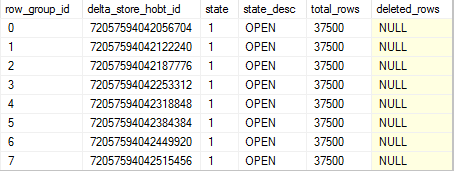
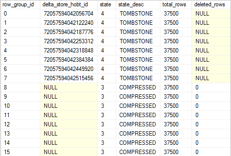

# Columnstore indexes - defragmentation
[!INCLUDE[appliesto-ss-asdb-asdw-pdw-md](../../includes/appliesto-ss-asdb-asdw-pdw-md.md)]

  Tasks for defragmenting columnstore indexes.  
  
## Use ALTER INDEX REORGANIZE to defragment a columnstore index online  
 **Applies to:** [!INCLUDE[ssNoVersion](../../includes/ssnoversion-md.md)] (starting with [!INCLUDE[ssSQL15](../../includes/sssql15-md.md)]), [!INCLUDE[ssSDS](../../includes/sssds-md.md)]  
  
After performing loads of any type, you can have multiple small rowgroups in the deltastore. You can use `ALTER INDEX REORGANIZE` to force all of the rowgroups into the columnstore, and then to combine the rowgroups into fewer rowgroups with more rows.  The reorganize operation will also remove rows that have been deleted from the columnstore.  
  
For more information, refer to the following blog posts on the SQL Database Engine Team Blog.  
-   [Minimizing index fragmentation in columnstore indexes](https://blogs.msdn.microsoft.com/sqlserverstorageengine/2016/03/07/columnstore-index-defragmentation-using-reorganize-command/)  
-   [Columnstore indexes and the merge policy for rowgroups](https://blogs.msdn.microsoft.com/sqlserverstorageengine/2016/03/08/columnstore-index-merge-policy-for-reorganize/)  
  
### Recommendations for reorganizing  
Reorganize a columnstore index after one or more data loads to achieve query performance benefits as quickly as possible. Reorganizing will initially require additional CPU resources to compress the data, which could slow overall system performance. However, as soon as the data is compressed, query performance can improve.  
  
Use the example in [sys.dm_db_column_store_row_group_physical_stats &#40;Transact-SQL&#41;](../../relational-databases/system-dynamic-management-views/sys-dm-db-column-store-row-group-physical-stats-transact-sql.md) to compute the fragmentation. This helps you to determine whether it is worthwhile to perform a REORGANIZE operation.  
  
### Example: How reorganizing works  
 This example shows how ALTER INDEX REORGANIZE can force all deltastore rowgroups into the columnstore and then combine the rowgroups.  
  
1.  Run this Transact-SQL to create a staging table that contains 300,000 rows. We will use this to bulk load rows into a columnstore index.  
  
    ```sql  
    USE master;  
    GO  
  
    IF EXISTS (SELECT name FROM sys.databases  
        WHERE name = N'[columnstore]')  
        DROP DATABASE [columnstore];  
    GO  
  
    CREATE DATABASE [columnstore];  
    GO  
  
    IF EXISTS (SELECT name FROM sys.tables  
        WHERE name = N'staging'  
        AND object_id = OBJECT_ID (N'staging'))  
    DROP TABLE dbo.staging;  
    GO  
  
    CREATE TABLE [staging] (  
         AccountKey int NOT NULL,  
         AccountDescription nvarchar (50),  
         AccountType nvarchar(50),  
         AccountCodeAlternateKey int  
    );  
    GO  
  
    -- Load data  
    DECLARE @loop int;  
    DECLARE @AccountDescription varchar(50);  
    DECLARE @AccountKey int;  
    DECLARE @AccountType varchar(50);  
    DECLARE @AccountCode int;  
  
    SELECT @loop = 0;  
    BEGIN TRAN  
        WHILE (@loop < 300000)   
          BEGIN  
            SELECT @AccountKey = CAST (RAND()*10000000 AS int);  
            SELECT @AccountDescription = 'accountdesc ' + CONVERT(varchar(20), @AccountKey);  
            SELECT @AccountType = 'AccountType ' + CONVERT(varchar(20), @AccountKey);  
            SELECT @AccountCode =  CAST (RAND()*10000000 AS int);  
  
            INSERT INTO staging VALUES (  
               @AccountKey,   
               @AccountDescription,   
               @AccountType,   
               @AccountCode  
            );  
  
            SELECT @loop = @loop + 1;  
          END  
    COMMIT  
    ```  
  
2.  Create a table stored as a columnstore index.  
  
    ```sql  
    IF EXISTS (SELECT name FROM sys.tables  
        WHERE name = N'cci_target'  
        AND object_id = OBJECT_ID (N'cci_target'))  
    DROP TABLE dbo.cci_target;  
    GO  
  
    -- Create a table with a clustered columnstore index  
    -- and the same columns as the rowstore staging table.  
    CREATE TABLE cci_target (  
         AccountKey int NOT NULL,  
         AccountDescription nvarchar (50),  
         AccountType nvarchar(50),  
         AccountCodeAlternateKey int,  
         INDEX idx_cci_target CLUSTERED COLUMNSTORE  
    )  
    GO  
    ```  
  
3.  Bulk insert the staging table rows into the columnstore table. `INSERT INTO ... SELECT` performs a bulk insert. The `TABLOCK` allows the `INSERT` to execute with parallelism.  
  
    ```sql  
    -- Insert rows in parallel  
    INSERT INTO cci_target WITH (TABLOCK)  
    SELECT TOP (300000) * FROM staging;  
    GO  
    ```  
  
4.  View the rowgroups by using the *sys.dm_db_column_store_row_group_physical_stats* dynamic management view (DMV).  
  
    ```sql  
    -- Run this dynamic management view (DMV) to see the OPEN rowgroups.   
    -- The number of rowgroups depends on the degree of parallelism.   
    -- You will see multiple OPEN rowgroups depending on the degree of parallelism.   
    -- This is because insert operation can run in parallel in [!INCLUDE[ssSQL15](../../includes/sssql15-md.md)].  
  
    SELECT *   
    FROM sys.dm_db_column_store_row_group_physical_stats   
    WHERE object_id  = object_id('cci_target')  
    ORDER BY row_group_id;  
    ```  
  
     In this example, the results show 8 OPEN rowgroups that each have 37,500 rows. The number of OPEN rowgroups depends on the *max_degree_of_parallelism* setting.  
  
       
  
5.  Use `ALTER INDEX REORGANIZE` with the `COMPRESS_ALL_ROW_GROUPS` option to force all rowgroups to be compressed into the columnstore.  
  
    ```sql  
    -- This command will force all CLOSED and OPEN rowgroups into the columnstore.  
    ALTER INDEX idx_cci_target ON cci_target   
    REORGANIZE WITH (COMPRESS_ALL_ROW_GROUPS = ON);  
  
    SELECT *   
    FROM sys.dm_db_column_store_row_group_physical_stats   
    WHERE object_id  = object_id('cci_target')  
    ORDER BY row_group_id;  
    ```  
  
     The results show 8 COMPRESSED rowgroups and 8 TOMBSTONE rowgroups. Each rowgroup got compressed into the columnstore regardless of its size. The TOMBSTONE rowgroups will be removed by the system.  
  
       
  
6.  For query performance, its much better to combine small rowgroups together. `ALTER INDEX REORGANIZE` will combine `COMPRESSED` rowgroups together. Now that the delta rowgroups are compressed into the columnstore, run ALTER INDEX REORGANIZE again to combine the small COMPRESSED rowgroups. This time you don't need the `COMPRESS_ALL_ROW_GROUPS` option.  
  
    ```sql  
    -- Run this again and you will see that smaller rowgroups   
    -- combined into one compressed rowgroup with 300,000 rows  
    ALTER INDEX idx_cci_target ON cci_target REORGANIZE;  
  
    SELECT *   
    FROM sys.dm_db_column_store_row_group_physical_stats   
    WHERE object_id  = object_id('cci_target')  
    ORDER BY row_group_id;  
    ```  
  
     The results show the 8 COMPRESSED rowgroups are now combined into one COMPRESSED rowgroup.  
  
       
  
## <a name="rebuild"></a> Use ALTER INDEX REBUILD to defragment the columnstore index offline  
 For [!INCLUDE[ssSQL15](../../includes/sssql15-md.md)] and later, rebuilding the columnstore index is usually not needed since `REORGANIZE` performs the essentials of a rebuild in the background as an online operation.  
  
 Rebuilding a columnstore index removes fragmentation, and moves all rows into the columnstore. Use [CREATE COLUMNSTORE INDEX &#40;Transact-SQL&#41;](../../t-sql/statements/create-columnstore-index-transact-sql.md) or [ALTER INDEX &#40;Transact-SQL&#41;](../../t-sql/statements/alter-index-transact-sql.md) to perform a full rebuild of an existing clustered columnstore index. Additionally, you can use ALTER INDEX ... REBUILD to rebuild a specific partition.  
  
### Rebuild Process  
 To rebuild a columnstore index, [!INCLUDE[ssNoVersion](../../includes/ssnoversion-md.md)]:  
  
1.  Acquires an exclusive lock on the table or partition while the rebuild occurs. The data is "offline" and unavailable during the rebuild, even when using `NOLOCK`, RCSI, or SI.  
  
2.  Re-compresses all data into the columnstore. Two copies of the columnstore index exist while the rebuild is taking place. When the rebuild is finished, [!INCLUDE[ssNoVersion](../../includes/ssnoversion-md.md)] deletes the original columnstore index.  
  
### Recommendations for Rebuilding a Columnstore Index  
 Rebuilding a columnstore index is useful for removing fragmentation, and for moving all rows into the columnstore. We have the following recommendations:  
  
1.  Rebuild a partition instead of the entire table.  
    -   Rebuilding the entire table takes a long time if the index is large, and it requires enough disk space to store an additional copy of the index during the rebuild. Usually it is only necessary to rebuild the most recently used partition.  
    -   For partitioned tables, you do not need to rebuild the entire columnstore index because fragmentation is likely to occur in only the partitions that have been modified recently. Fact tables and large dimension tables are usually partitioned in order to perform backup and management operations on chunks of the table.  

2.  Rebuild a partition after heavy DML operations.  
    -   Rebuilding a partition will defragment the partition and reduce disk storage. Rebuilding will delete all rows from the columnstore that are marked for deletion, and it will move all rowgroups from the deltastore into the columnstore. Note, there can be multiple rowgroups in the deltastore that each have less than one million rows.  
  
3.  Rebuild a partition after loading data.  
    -   This ensures all data is stored in the columnstore. When concurrent processes each load less than 100K rows into the same partition at the same time, the partition can end up with multiple deltastores. Rebuilding will move all deltastore rows into the columnstore.  

## Automatic index and statistics management

Leverage solutions such as [Adaptive Index Defrag](https://github.com/Microsoft/tigertoolbox/tree/master/AdaptiveIndexDefrag) to automatically manage index defragmentation and statistics updates for one or more databases. This procedure automatically chooses whether to rebuild or reorganize an index according to its fragmentation level, amongst other parameters, and update statistics with a linear threshold.

## See Also        
[Columnstore indexes - what's new](../../relational-databases/indexes/columnstore-indexes-what-s-new.md)    
[Columnstore Indexes Query Performance](../../relational-databases/indexes/columnstore-indexes-query-performance.md)   
[Get started with Columnstore for real-time operational analytics](../../relational-databases/indexes/get-started-with-columnstore-for-real-time-operational-analytics.md)   
[Columnstore Indexes for Data Warehousing](../../relational-databases/indexes/columnstore-indexes-data-warehouse.md)  
[Columnstore Index Architecture](../../relational-databases/sql-server-index-design-guide.md#columnstore_index)    
[Adaptive Index Defrag](https://github.com/Microsoft/tigertoolbox/tree/master/AdaptiveIndexDefrag)    
  
  
