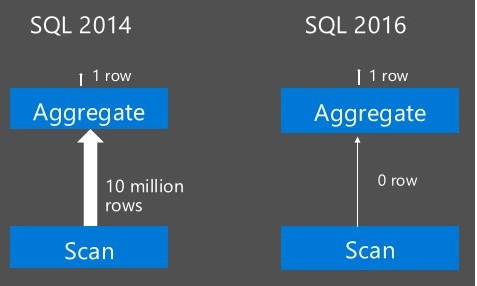

# Columnstore indexes - Query performance

[!INCLUDE[appliesto-ss-asdb-asdw-pdw-md](../../includes/appliesto-ss-asdb-asdw-pdw-md.md)]

  Recommendations for achieving the very fast query performance that columnstore indexes are designed to provide.    
    
 Columnstore indexes can achieve up to 100x better performance on analytics and data warehousing workloads and up to 10x better data compression than traditional rowstore indexes. These recommendations help your queries achieve the very fast query performance that columnstore indexes are designed to provide. Further explanations about columnstore performance are at the end.    
    
## Recommendations for improving query performance    
 Here are some recommendations for achieving the high-performance columnstore indexes are designed to provide.    
    
### 1. Organize data to eliminate more rowgroups from a full table scan    
    
-   **Leverage insert order.** In common case in traditional data warehouse, the data is indeed inserted in time order and analytics is done in time dimension. For example,  analyzing sales by quarter. For this kind of  workload, the rowgroup elimination happens automatically. In [!INCLUDE[ssSQL15](../../includes/sssql15-md.md)], you can find out number rowgroups skipped as part of query processing.    
    
-   **Leverage the rowstore clustered index.** If the common query predicate is on a column (e.g. C1) that is unrelated to insert order of the row, you can create a rowstore clustered index on columns C1 and then create clustered columnstore index by dropping the rowstore clustered index. if you create the clustered columnstore index explicitly using `MAXDOP = 1`, the resulting clustered columnstore index is perfectly ordered on column C1. If you specify `MAXDOP = 8`, then you will see overlap of values across 8 rowgroups. A common case of this strategy when you initially create columnstore index with large set of data. Note, for nonclustered columnstore index (NCCI), if the base rowstore table has a clustered index, the rows are already ordered. In this case, the resultant nonclustered columnstore index will automatically be ordered. One important point to note is that columnstore index does not inherently maintain the order of rows. As new rows are inserted or older rows are updated, you may need to repeat the process as the analytics query performance may deteriorate    
    
-   **Leverage table partitioning.** You can partition the columnstore index and then use partition elimination to reduce number of rowgroups to scan. For example, a fact table stores purchases made by customers and a common query pattern is to find quarterly purchases done by a specific customer, you can combine the insert order with partitioning on customer column. Each  partition will contain rows in time order for specific customer.    
    
### 2. Plan for enough memory to create columnstore indexes in parallel    
 Creating a columnstore index is by default a parallel operation unless memory is constrained. Creating the index in parallel requires more memory than creating the index serially. When there is ample memory, creating a columnstore index takes on the order of 1.5 times as long as building a B-tree on the same columns.    
    
 The memory required for creating a columnstore index depends on the number of columns, the number of string columns, the degree of parallelism (DOP), and the characteristics of the data. For example, if your table has fewer than one million rows, [!INCLUDE[ssNoVersion](../../includes/ssnoversion-md.md)] will use only one thread to create the columnstore index.    
    
 If your table has more than one million rows, but [!INCLUDE[ssNoVersion](../../includes/ssnoversion-md.md)] cannot get a large enough memory grant to create the index using MAXDOP, [!INCLUDE[ssNoVersion](../../includes/ssnoversion-md.md)] will automatically decrease `MAXDOP` as needed to fit into the available memory grant.  In some cases, DOP must be decreased to one in order to build the index under constrained memory.    
    
 Beginning with [!INCLUDE[ssSQL15](../../includes/sssql15-md.md)], the query will always operate in batch mode. In previous releases, batch execution is only used when DOP is greater than one.    
    
## Columnstore Performance Explained    
 Columnstore indexes achieve high query performance by combining high-speed in-memory batch mode processing with techniques that greatly reduce I/O requirements.  Since analytics queries scan large numbers of rows, they are typically IO-bound, and therefore reducing I/O during query execution is critical to the design of columnstore indexes.  Once data has been read into memory, it is critical to reduce the number of  in-memory operations.    
    
 Columnstore indexes reduce I/O and optimize in-memory operations through high data compression, columnstore elimination, rowgroup elimination, and batch processing.    
    
### Data compression    
 Columnstore indexes achieve up to 10x greater data compression than rowstore indexes. This greatly reduces the I/O required to execute analytics queries and therefore improves query performance.    
    
-   Columnstore indexes read compressed data from disk, which means fewer bytes of data need to be read into memory.    
    
-   Columnstore indexes store data in compressed form in memory which reduces I/O by reducing the number of times the same data is read into memory. For example, with 10x compression, columnstore indexes can keep 10x more data in memory compared to storing the data in uncompressed form. With more data in memory, it is more likely that the columnstore index will find the data it needs in memory with incurring additional reads from disk.    
    
-   Columnstore indexes compress data by columns instead of by rows which achieves high compression rates and reduces the size of the data stored on disk. Each column is compressed and stored independently.  Data within a column always has the same data type and tends to have similar values. Data compression techniques are very good at achieving higher compression rates when values are similar.    
    
-   For example, if a fact table stores customer addresses and has a column for country, the total number of possible values is fewer than 200. Some of those values will be repeated many times. If the fact table has 100 million rows, the country column will compress easily and require very little storage. Row-by-row compression is not able to capitalize on the similarity of column values in this way and will use more bytes to compress the values in the country column.    
    
### Column elimination    
 Columnstore indexes skip reading in columns that are not required for the query result. This ability, called column elimination, further reduces I/O for query execution and therefore improves query performance.    
    
-   Column elimination is possible because the data is organized and compressed column by column. In contrast, when data is stored row-by-row, the column values in each row are physically stored together and cannot be easily separated. The query processor needs to read in an entire row to retrieve specific column values, which increases I/O because extra data is unnecessarily read into memory.    
    
-   For example, if a table has 50 columns and the query only uses 5 of those columns, the columnstore index only fetches the 5 columns from disk. It skips reading in the other 45 columns. This reduces I/O by another 90% assuming all columns are of similar size. If the same data are stored in a rowstore, the query processor needs to read the additional 45 columns.    
    
### Rowgroup elimination    
 For full table scans, a large percentage of the data usually does not match the query predicate criteria. By using metadata, the columnstore index is able to skip reading in the rowgroups that do not contain data required for the query result, all without actual I/O. This ability, called rowgroup elimination, reduces I/O for full table scans and therefore improves query performance.    
    
 **When does a columnstore index need to perform a full table scan?**    
    
 Starting with [!INCLUDE[ssSQL15](../../includes/sssql15-md.md)], you can create one or more regular nonclustered B-tree indexes on a clustered columnstore index just like you can on a rowstore heap. The nonclustered B-tree indexes can speed up a query that has an equality predicate or  a predicate with a small range of values.  For more complicated predicates, the query optimizer might choose a full table scan. Without the ability to skip rowgroups, a full table scan would be very time-consuming, especially for large tables.    
    
 **When does an analytics query benefit from rowgroup elimination for a full-table scan?**    
    
 For example, a retail business has modeled their sales data using a fact table with clustered columnstore index. Each new sale stores various attributes of the transaction including the date a product was sold. Interestingly, even though columnstore indexes do not guarantee a sorted order, the rows in this table will be loaded in a date-sorted order. Over time this table will grow. Although the retail business might keep sales data for the last 10 years, an analytics query might only need to compute an aggregate for last quarter. Columnstore indexes can eliminate accessing the data for the previous 39 quarters by just looking at the metadata for the date column. This is an additional 97% reduction in the amount of data that is read into memory and processed.    
    
 **Which rowgroups are skipped in a full table scan?**    
    
 To determine which rows groups to eliminate, the columnstore index uses metadata to store the minimum and maximum values of each column segment for each rowgroup. When none of the column segment ranges meet the query predicate criteria, the entire rowgroup is skipped without doing any actual IO. This works because the data is usually loaded in a sorted order and although rows are not guaranteed to be sorted, similar data values are often located within the same rowgroup or a neighboring rowgroup.    
    
 For more details about rowgroups, see Columnstore Indexes Guide    
    
### Batch Mode Execution    
 Batch mode  execution refers to processing a set of rows, typically up to 900 rows, together for execution efficiency. For example, the query `SELECT SUM (Sales) FROM SalesData` aggregates the total sales from the table SalesData. In batch mode execution, the query execution engine computes the aggregate in group of 900 values. This spreads metadata  the access costs and other types of overhead over all the rows in a batch, rather than paying the cost for each row thereby significantly reducing the code path. Batch mode processing operates on compressed data when possible and eliminates some of the exchange operators used by row mode processing. This speeds up execution of analytics queries by orders of magnitude.    
    
 Not all query execution operators can be executed in batch mode. For example, DML operations such as Insert, Delete or Update are executed row at a time. Batch mode operators target  operators for speeding up query performance such as Scan, Join, Aggregate, sort and so on. Since the columnstore index was introduced in [!INCLUDE[ssSQL11](../../includes/sssql11-md.md)], there is a sustained effort to expand the operators that can be executed int the batch mode. The table below shows the operators that run in batch mode according to the product version.    
    
|Batch Mode Operators|When is this used?|[!INCLUDE[ssSQL11](../../includes/sssql11-md.md)]|[!INCLUDE[ssSQL14](../../includes/sssql14-md.md)]|[!INCLUDE[ssSQL15](../../includes/sssql15-md.md)] and [!INCLUDE[ssSDS](../../includes/sssds-md.md)]¹|Comments|    
|---------------------------|------------------------|---------------------|---------------------|---------------------------------------|--------------|    
|DML operations (insert, delete, update, merge)||no|no|no|DML is not a batch mode operation because it is not parallel. Even when we enable serial mode batch processing, we don't see significant gains by allowing DML to be processed in batch mode.|    
|columnstore index scan|SCAN|NA|yes|yes|For columnstore indexes, we can push the predicate to the SCAN node.|    
|columnstore Index Scan (nonclustered)|SCAN|yes|yes|yes|yes|    
|index seek||NA|NA|no|We perform a seek operation through a nonclustered B-tree index in rowmode.|    
|compute scalar|Expression that evaluates to a scalar value.|yes|yes|yes|There are some restrictions on data type. This is true for all batch mode operators.|    
|concatenation|UNION and UNION ALL|no|yes|yes||    
|filter|Applying predicates|yes|yes|yes||    
|hash match|Hash-based aggregate functions, outer hash join, right hash join, left hash join, right inner join, left inner join|yes|yes|yes|Restrictions for aggregation: no min/max for strings. Aggregation functions available are sum/count/avg/min/max.<br />Restrictions for join: no mismatched type joins on non-integer types.|    
|merge join||no|no|no||    
|multi-threaded queries||yes|yes|yes||    
|nested loops||no|no|no||    
|single-threaded queries running under MAXDOP 1||no|no|yes||    
|single-threaded queries with a serial query plan||no|no|yes||    
|sort|Order by clause on SCAN with columnstore index.|no|no|yes||    
|top sort||no|no|yes||    
|window aggregates||NA|NA|yes|New operator in [!INCLUDE[ssSQL15](../../includes/sssql15-md.md)].|    
    
 ¹Applies to [!INCLUDE[ssSQL15](../../includes/sssql15-md.md)], [!INCLUDE[ssSDS](../../includes/sssds-md.md)] Premium tiers, Standard tiers - S3 and above, and all vCore tiers, and [!INCLUDE[ssPDW](../../includes/sspdw-md.md)]    
    
### Aggregate Pushdown    
 A normal execution path for aggregate computation to fetch the qualifying rows from the SCAN node and aggregate the values in Batch Mode. While this delivers good performance, but with [!INCLUDE[ssSQL15](../../includes/sssql15-md.md)], the aggregate operation can be pushed to the SCAN node to improve the performance of aggregate computation by orders of magnitude on top of Batch Mode execution provided the following conditions are met: 
 
-	 The aggregates are `MIN`, `MAX`, `SUM`, `COUNT` and `COUNT(*)`. 
-  Aggregate operator must be on top of SCAN node or SCAN node with `GROUP BY`.
-  This aggregate is not a distinct aggregate.
-  The aggregate column is not a string column.
-  The aggregate column is not a virtual column. 
-  The input and output datatype must be one of the following and must fit within 64 bits.
    -  `tinyint`, `int`, `bigint`, `smallint`, `bit`
    -  `smallmoney`, `money`, `decimal` and `numeric` with precision <= 18
    -  `smalldate`, `date`, `datetime`, `datetime2`, `time`
    
 Aggregate push down is further accelerated by efficient Aggregation on compressed/encoded data in cache-friendly execution and by leveraging SIMD    
    
     
    
For example, aggregate pushdown is done in both of the queries below:    
    
```sql     
SELECT  productkey, SUM(TotalProductCost)    
FROM FactResellerSalesXL_CCI    
GROUP BY productkey    
    
SELECT  SUM(TotalProductCost)    
FROM FactResellerSalesXL_CCI    
```    
    
### String predicate pushdown    
When designing a data warehouse schema, the recommended schema modeling is to use star-schema or snowflake schema consisting of one or more fact tables and many dimension tables. The [fact table](https://wikipedia.org/wiki/Fact_table) stores the business measurements or transactions and [dimension table](https://wikipedia.org/wiki/Dimension_table) store the dimensions across which facts need to be analyzed.    
    
For example, a fact can be a record representing a sale of a particular product in a specific region while the dimension represents a set of regions, products and so on. The fact and dimension tables are connected through a primary/foreign key relationship. Most commonly used analytics queries join one or more dimension tables with the fact table.    
    
Let us consider a dimension table `Products`. A typical primary key will be `ProductCode` which is commonly represented as string data type. For performance of queries, it is a best practice to create surrogate key, typically an integer column, to refer to the row in the dimension table from the fact table.    
    
The columnstore index runs analytics queries with joins/predicates involving numeric or integer based keys very efficiently. However, in many customer workloads, we find the use to string based columns linking fact/dimension tables and with the result the query performance with columnstore index was not as performing. [!INCLUDE[ssSQL15](../../includes/sssql15-md.md)] improves the performance of analytics queries with string based columns significantly by pushing down the predicates with string columns to the SCAN node.    
    
String predicate pushdown leverages the primary/secondary dictionary created for column(s) to improve the query performance. For example, let us consider string column segment within a rowgroup consisting of 100 distinct string values. This means each distinct string value is referenced 10,000 times on average assuming 1 million rows.    
    
With string predicate pushdown, the query execution computes the predicate against the values in the dictionary and if it qualifies, all rows referring to the dictionary value are automatically qualified. This improves the performance in two ways:
1.  Only the qualified row is returned reducing number of the rows that need to flow out of SCAN node. 
2.  The number of string comparisons are significantly reduced. In this example, only 100 string comparisons are required as against 1 million comparisons. There are some limitations as described below:    
    -   No string predicate pushdown for delta rowgroups. There is no dictionary for columns in delta rowgroups.    
    -   No string predicate pushdown if dictionary exceeds 64 KB entries.    
    -   Expression evaluating NULLs are not supported.    
    
## See Also    
 [Columnstore Indexes Design Guidance](../../relational-databases/indexes/columnstore-indexes-design-guidance.md)   
 [Columnstore Indexes Data Loading Guidance](../../relational-databases/indexes/columnstore-indexes-data-loading-guidance.md)   
 [Get started with Columnstore for real time operational analytics](../../relational-databases/indexes/get-started-with-columnstore-for-real-time-operational-analytics.md)     
 [Columnstore Indexes for Data Warehousing](../../relational-databases/indexes/columnstore-indexes-data-warehouse.md)   
 [Columnstore Indexes Defragmentation](../../relational-databases/indexes/columnstore-indexes-defragmentation.md)    
 [Columnstore Index Architecture](../../relational-databases/sql-server-index-design-guide.md#columnstore_index)   
 [CREATE INDEX &#40;Transact-SQL&#41;](../../t-sql/statements/create-index-transact-sql.md)    
 [ALTER INDEX &#40;Transact-SQL&#41;](../../t-sql/statements/alter-index-transact-sql.md)     
  
