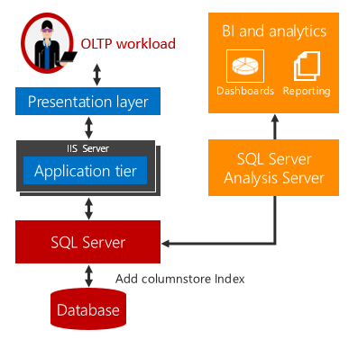
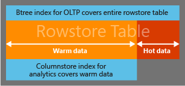
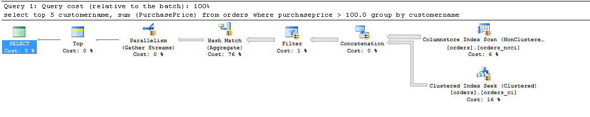

# Get started with Columnstore for real time operational analytics
[!INCLUDE[appliesto-ss-asdb-xxxx-xxx-md](../../includes/appliesto-ss-asdb-xxxx-xxx-md.md)]

  SQL Server 2016 introduces real-time operational analytics, the ability to run both analytics and OLTP workloads on the same database tables at the same time. Besides running analytics in real-time, you can also eliminate the need for ETL and a data warehouse.  
  
## Real-Time Operational Analytics Explained  
 Traditionally, businesses have had separate systems for operational (i.e. OLTP) and analytics workloads. For such systems, Extract, Transform, and Load (ETL) jobs regularly move the data from the operational store to an analytics store. The analytics data is usually stored in a data warehouse or data mart dedicated to running analytics queries. While this solution has been the standard, it has these three key challenges:  
  
-   **Complexity.** Implementing  ETL can require considerable coding especially to load only the modified rows. It can be complex to identify which rows have been modified.  
  
-   **Cost.** Implementing ETL requires the cost of purchasing additional hardware and software licenses.  
  
-   **Data Latency.** Implementing ETL adds a time delay for running the analytics. For example, if the ETL job runs at the at end of each business day, the analytics queries will run on data that is at least a day old. For many businesses this delay is unacceptable because the business depends on analyzing data in real-time. For example, fraud-detection requires real-time analytics on operational data.  
  
   
  
 Real-time operational analytics offers a solution to these challenges.   
        There is no time delay when analytics and OLTP workloads run on the same underlying table.   For scenarios that can use real-time analytics, the costs and complexity are greatly reduced by eliminating the need for ETL and the need to purchase and maintain a separate data warehouse.  
  
> [!NOTE]  
>  Real-time operational analytics targets the scenario of a single data source such as an enterprise resource planning (ERP) application on which you can run both the operational and the analytics workload. This does not replace the need for a separate data warehouse when you need to integrate data from multiple sources before running the analytics workload or when you require extreme analytics performance using pre-aggregated data such as cubes.  
  
 Real-time analytics uses an updateable columnstore index on a rowstore table.  The columnstore index maintains a copy of the data, so the OLTP and analytics workloads run against separate copies of the data. This minimizes the performance impact of both workloads running at the same time.  SQL Server automatically maintains index changes so OLTP changes are always up-to-date for analytics. With this design, it is possible and practical to run analytics in real-time on up-to-date data. This works for both disk-based and memory-optimized tables.  
  
## Get Started Example  
 To get started with real-time analytics:  
  
1.  Identify the tables in your operational schema that contain data required for analytics.  
  
2.  For each table, drop all btree indexes that are primarily designed to speed up existing analytics on your OLTP workload. Replace them with a single columnstore index.  This can improve the overall performance of your OLTP workload since there will be fewer indexes to maintain.  
  
    ```  
    --This example creates a nonclustered columnstore index on an existing OLTP table.  
    --Create the table  
    CREATE TABLE t_account (  
        accountkey int PRIMARY KEY,  
        accountdescription nvarchar (50),  
        accounttype nvarchar(50),  
        unitsold int  
    );  
  
    --Create the columnstore index with a filtered condition  
    CREATE NONCLUSTERED COLUMNSTORE INDEX account_NCCI   
    ON t_account (accountkey, accountdescription, unitsold)   
    ;  
  
    ```  
  
     The columnstore index on an in-memory table allows operational analytics by integrating in-memory OLTP and in-memory columnstore technologies to deliver high performance for both  OLTP and analytics workloads. The columnstore index on an in-memory table must include all the columns.  
  
    ```  
    -- This example creates a memory-optimized table with a columnstore index.  
    CREATE TABLE t_account (  
        accountkey int NOT NULL PRIMARY KEY NONCLUSTERED,  
        Accountdescription nvarchar (50),  
        accounttype nvarchar(50),  
        unitsold int,  
        INDEX t_account_cci CLUSTERED COLUMNSTORE  
        )  
        WITH (MEMORY_OPTIMIZED = ON );  
    GO  
  
    ```  
  
3.  This is all you need to do!  
  
 You are now ready to run  real-time operational analytics without making any changes to your application.  Analytics queries will run against the columnstore index and OLTP operations will keep running against your OLTP btree indexes. The OLTP workloads will continue to perform, but will incur some additional overhead to maintain the columnstore index. See the performance optimizations in the next section.  
  
## Blog Posts  
 Read Sunil Agarwal's blog posts to learn more  about real-time operational analytics.  It might be easier to understand the performance tips sections if you look at the blog posts first.  
  
-   [Business case for real-time operational analytics](https://blogs.technet.microsoft.com/dataplatforminsider/2015/12/09/real-time-operational-analytics-using-in-memory-technology/)  
  
-   [Using a nonclustered columnstore index for real-time operational analytics](https://blogs.msdn.microsoft.com/sqlserverstorageengine/2016/02/29/real-time-operational-analytics-using-nonclustered-columnstore-index/)  
  
-   [A simple example using a nonclustered columnstore index](https://blogs.msdn.microsoft.com/sqlserverstorageengine/2016/02/29/real-time-operational-analytics-simple-example-using-nonclustered-clustered-columnstore-index-ncci/)  
  
-   [How SQL Server maintains a nonclustered columnstore index  on a transactional workload](https://blogs.msdn.microsoft.com/sqlserverstorageengine/2016/03/04/real-time-operational-analytics-dml-operations-and-nonclustered-columnstore-index-ncci-in-sql-server-2016/)  
  
-   [Minimizing the impact of nonclustered columnstore index maintenance by using a filtered index](https://blogs.msdn.microsoft.com/sqlserverstorageengine/2016/03/06/real-time-operational-analytics-filtered-nonclustered-columnstore-index-ncci/)  
  
-   [Minimizing the impact of nonclustered columnstore index maintenance by using compression delay](https://blogs.msdn.microsoft.com/sqlserverstorageengine/2016/03/06/real-time-operational-analytics-compression-delay-option-for-nonclustered-columnstore-index-ncci/)  
  
-   [Minimizing impact of a nonclustered columnstore index maintenance by using compression delay - performance numbers](https://blogs.msdn.microsoft.com/sqlserverstorageengine/2016/03/06/real-time-operational-analytics-compression-delay-option-with-ncci-and-the-performance/)  
  
-   [Real time operational analytics with memory-optimized tables](https://blogs.msdn.microsoft.com/sqlserverstorageengine/2016/03/07/real-time-operational-analytics-memory-optimized-table-and-columnstore-index/)  
  
-   [Minimize index fragmentation in a columnstore indes](https://blogs.msdn.microsoft.com/sqlserverstorageengine/2016/03/07/columnstore-index-defragmentation-using-reorganize-command/)  
  
-   [Columnstore index and the merge policy for rowgroups](https://blogs.msdn.microsoft.com/sqlserverstorageengine/2016/03/08/columnstore-index-merge-policy-for-reorganize/)  
  
## Performance tip #1: Use filtered indexes to improve query performance  
 Running real-time operational analytics can impact the performance of the OLTP workload.  This impact should be minimal. The example below shows how to use filtered indexes to minimize impact of nonclustered columnstore index on transactional workload while still delivering analytics in real-time.  
  
 To minimize the overhead  of maintaining a nonclustered columnstore index  on an operational workload, you can use a filtered condition to create a nonclustered columnstore index only on the *warm* or slowly changing data. For example, in an order management application, you can create a nonclustered columnstore index on the orders that have already been shipped. Once the order has shipped, it  rarely changes and therefore can be considered warm data. With Filtered index, the data in nonclustered columnstore index requires fewer updates thereby lowering the impact on transactional workload.  
  
 Analytics queries transparently access both warm and hot data as needed to provide real-time analytics. If a  significant part of the operational workload is touching the 'hot' data, those operations will not require additional maintenance of the columnstore index. A best practice is to have a rowstore clustered index on the column(s) used in the filtered index definition.   SQL Server uses the clustered index to quickly scan the rows that did not meet the filtered condition. Without this clustered index, a full table scan of the rowstore table will be required to find these rows which can negatively impact the performance of analytics query significantly. In the absence of clustered index, you could create a complementary filtered nonclustered btree  index to identify such rows but it is not recommended because accessing large range of rows through  nonclustered btree indexes is expensive.  
  
> [!NOTE]  
>  A filtered nonclustered columnstore index is only supported on disk-based tables. It is not supported on memory-optimized tables  
  
### Example A: Access hot data from btree index, warm data from columnstore index  
 This example uses a filtered condition (accountkey > 0) to establish which rows will be in the columnstore index. The goal is to design the filtered condition and subsequent queries to access frequently changing "hot" data from the btree index, and to access the more stable "warm" data from the columnstore index.  
  
   
  
> [!NOTE]  
>  The query optimizer will consider, but not always choose, the columnstore index for the query plan. When the query optimizer chooses the filtered columnstore index, it  transparently combines the rows both from columnstore index as well as the rows that do not meet the filtered condition to allow real-time analytics. This is different from a regular nonclustered filtered index which can be used only in queries that restrict themselves to the rows present in the index.  
  
```  
--Use a filtered condition to separate hot data in a rowstore table  
-- from "warm" data in a columnstore index.  
  
-- create the table  
CREATE TABLE  orders (  
         AccountKey         int not null,  
         Customername       nvarchar (50),  
        OrderNumber         bigint,  
        PurchasePrice       decimal (9,2),  
        OrderStatus         smallint not null,  
        OrderStatusDesc     nvarchar (50))  
  
-- OrderStatusDesc  
-- 0 => 'Order Started'  
-- 1 => 'Order Closed'  
-- 2 => 'Order Paid'  
-- 3 => 'Order Fullfillment Wait'  
-- 4 => 'Order Shipped'  
-- 5 => 'Order Received'  
  
CREATE CLUSTERED INDEX  orders_ci ON orders(OrderStatus)  
  
--Create the columnstore index with a filtered condition  
CREATE NONCLUSTERED COLUMNSTORE INDEX orders_ncci ON orders  (accountkey, customername, purchaseprice, orderstatus)  
where orderstatus = 5  
;  
  
-- The following query returns the total purchase done by customers for items > $100 .00  
-- This query will pick  rows both from NCCI and from 'hot' rows that are not part of NCCI  
SELECT top 5 customername, sum (PurchasePrice)  
FROM orders  
WHERE purchaseprice > 100.0   
Group By customername  
```  
  
 The analytics query will execute with the following query plan. You can see that the rows not meeting the filtered condition are accessed through clustered btree index.  
  
   
  
 Please refer to the blog for details on [filtered nonclustered columnstore index.](https://blogs.msdn.microsoft.com/sqlserverstorageengine/2016/03/06/real-time-operational-analytics-filtered-nonclustered-columnstore-index-ncci/)  
  
## Performance tip #2: Offload analytics to Always On readable secondary  
 Even though you can minimize the columnstore index maintenance by using a filtered columnstore index, the analytics queries can still require significant computing resources (CPU, IO, memory) which impact the operational workload performance. For most mission critical workloads, our recommendation is to use the Always On configuration. In this configuration, you can eliminate the impact of running analytics by offloading it to a readable secondary.  
  
## Performance Tip #3: Reducing Index fragmentation by keeping hot data in delta rowgroups  
 Tables with columnstore index may get significantly fragmented (i.e. deleted rows) if the workload updates/deletes rows that have been compressed. A fragmented columnstore index leads to inefficient utilization of memory/storage. Besides inefficient use of resources, it also negatively impacts the analytics query performance because of extra IO and the need to filter the deleted rows from the result set.  
  
 The deleted rows are not physically removed until you run index defragmentation with REORGANIZE command or rebuild the columnstore index on the entire table or the affected partition(s). Both REORGANIZE and Index REBUILD are expensive operations taking resources away which otherwise could be used for the workload. Additionally, if rows compressed too early, it may need to be re-compressed multiple times due to updates leading to wasted compression overhead.  
You can minimize index fragmentation using COMPRESSION_DELAY option.  
  
```  
  
-- Create a sample table  
create table t_colstor (  
               accountkey                      int not null,  
               accountdescription              nvarchar (50) not null,  
               accounttype                     nvarchar(50),  
               accountCodeAlternatekey         int)  
  
-- Creating nonclustered columnstore index with COMPRESSION_DELAY. The columnstore index will keep the rows in closed delta rowgroup for 100 minutes   
-- after it has been marked closed  
CREATE NONCLUSTERED COLUMNSTORE index t_colstor_cci on t_colstor (accountkey, accountdescription, accounttype)   
                       WITH (DATA_COMPRESSION= COLUMNSTORE, COMPRESSION_DELAY = 100);  
  
;  
```  
  
 Please refer to the blog for details on [compression delay.](https://blogs.msdn.microsoft.com/sqlserverstorageengine/2016/03/06/real-time-operational-analytics-compression-delay-option-for-nonclustered-columnstore-index-ncci/)  
  
 Here are the recommended best practices  
  
-   **Insert/Query workload:**If your workload is primarily inserting data and querying it, the default COMPRESSION_DELAY of 0 is the recommended option. The newly inserted rows will get compressed once 1 million rows have been inserted into a single delta rowgroup.  
    Some example of such workload are (a) traditional DW workload (b) click-stream analysis when you need to analyze the click pattern in a web application.  
  
-   **OLTP workload:** If the workload is DML heavy (i.e. heavy mix of Update, Delete and Insert), you may see columnstore index fragmentation by examining the DMV sys. dm_db_column_store_row_group_physical_stats. If you see that > 10% rows are marked deleted in recently compressed rowgroups, you can use COMPRESSION_DELAY option to add time delay when rows become eligible for compression. For example, if for your workload, the newly inserted stays 'hot' (i.e. gets updated multiple times) for say 60 minutes, you should choose COMPRESSION_DELAY to be 60.  
  
 We expect most customers do not need to anything. The default value of COMPRESSION_DELAY option should work for them.  
For advance users, we recommend running the query below and collect % of deleted rows over the last 7 days.  
  
```  
SELECT row_group_id,cast(deleted_rows as float)/cast(total_rows as float)*100 as [% fragmented], created_time  
FROM sys. dm_db_column_store_row_group_physical_stats  
WHERE object_id = object_id('FactOnlineSales2')   
             AND  state_desc='COMPRESSED'   
             AND deleted_rows>0   
             AND created_time > GETDATE() - 7  
ORDER BY created_time DESC  
```  
  
 If the number of deleted rows in compressed rowgroups > 20%, plateauing in older rowgroups with < 5% variation (referred to as cold rowgroups) set COMPRESSION_DELAY = (youngest_rowgroup_created_time -  current_time). Note that this approach works best with a stable and relatively homogeneous workload.  
  
## See Also  
 [Columnstore Indexes Guide](../../relational-databases/indexes/columnstore-indexes-overview.md)   
 [Columnstore Indexes Data Loading](../../relational-databases/indexes/columnstore-indexes-data-loading-guidance.md)   
 [Columnstore Indexes Query Performance](../../relational-databases/indexes/columnstore-indexes-query-performance.md)   
 [Columnstore Indexes for Data Warehousing](../../relational-databases/indexes/columnstore-indexes-data-warehouse.md)   
 [Columnstore Indexes Defragmentation](../../relational-databases/indexes/columnstore-indexes-defragmentation.md)  
  
  
