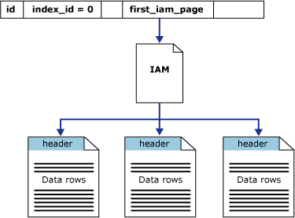

# Heaps (Tables without Clustered Indexes)
[!INCLUDE[appliesto-ss-asdb-xxxx-xxx-md](../../includes/appliesto-ss-asdb-xxxx-xxx-md.md)]

  A heap is a table without a clustered index. One or more nonclustered indexes can be created on tables stored as a heap. Data is stored in the heap without specifying an order. Usually data is initially stored in the order in which is the rows are inserted into the table, but the [!INCLUDE[ssDE](../../includes/ssde-md.md)] can move data around in the heap to store the rows efficiently; so the data order cannot be predicted. To guarantee the order of rows returned from a heap, you must use the **ORDER BY** clause. To specify the order for storage of the rows, create a clustered index on the table, so that the table is not a heap.  
  
> [!NOTE]  
>  There are sometimes good reasons to leave a table as a heap instead of creating a clustered index, but using heaps effectively is an advanced skill. Most tables should have a carefully chosen clustered index unless a good reason exists for leaving the table as a heap.  
  
## When to Use a Heap  
 If a table is a heap and does not have any nonclustered indexes, then the entire table must be examined (a table scan) to find any row. This can be acceptable when the table is tiny, such as a list of the 12 regional offices of a company.  
  
 When a table is stored as a heap, individual rows are identified by reference to a row identifier (RID) consisting of the file number, data page number, and slot on the page. The row id is a small and efficient structure. Sometimes data architects use heaps when data is always accessed through nonclustered indexes and the RID is smaller than a clustered index key.  
  
## When Not to Use a Heap  
 Do not use a heap when the data is frequently returned in a sorted order. A clustered index on the sorting column could avoid the sorting operation.  
  
 Do not use a heap when the data is frequently grouped together. Data must be sorted before it is grouped, and a clustered index on the sorting column could avoid the sorting operation.  
  
 Do not use a heap when ranges of data are frequently queried from the table.  A clustered index on the range column will avoid sorting the entire heap.  
  
 Do not use a heap when there are no nonclustered indexes and the table is large. In a heap, all rows of the heap must be read to find any row.  
  
## Managing Heaps  
 To create a heap, create a table without a clustered index. If a table already has a clustered index, drop the clustered index to return the table to a heap.  
  
 To remove a heap, create a clustered index on the heap.  
  
 To rebuild a heap to reclaim wasted space, create a clustered index on the heap, and then drop that clustered index.  
  
> [!WARNING]  
>  Creating or dropping clustered indexes requires rewriting the entire table. If the table has nonclustered indexes, all the nonclustered indexes must all be recreated whenever the clustered index is changed. Therefore, changing from a heap to a clustered index structure or back can take a lot of time and require disk space for reordering data in tempdb.  

## Heap Structures

A heap is a table without a clustered index. Heaps have one row in [sys.partitions](../../relational-databases/system-catalog-views/sys-partitions-transact-sql.md), with `index_id = 0` for each partition used by the heap. By default, a heap has a single partition. When a heap has multiple partitions, each partition has a heap structure that contains the data for that specific partition. For example, if a heap has four partitions, there are four heap structures; one in each partition.

Depending on the data types in the heap, each heap structure will have one or more allocation units to store and manage the data for a specific partition. At a minimum, each heap will have one `IN_ROW_DATA` allocation unit per partition. The heap will also have one `LOB_DATA` allocation unit per partition, if it contains large object (LOB) columns. It will also have one `ROW_OVERFLOW_DATA` allocation unit per partition, if it contains variable length columns that exceed the 8,060 byte row size limit.

The column `first_iam_page` in the `sys.system_internals_allocation_units` system view points to the first IAM page in the chain of IAM pages that manage the space allocated to the heap in a specific partition. SQL Server uses the IAM pages to move through the heap. The data pages and the rows within them are not in any specific order and are not linked. The only logical connection between data pages is the information recorded in the IAM pages.

> [!IMPORTANT]  
> The `sys.system_internals_allocation_units` system view is reserved for Microsoft SQL Server internal use only. Future compatibility is not guaranteed.
 
Table scans or serial reads of a heap can be performed by scanning the IAM pages to find the extents that are holding pages for the heap. Because the IAM represents extents in the same order that they exist in the data files, this means that serial heap scans progress sequentially through each file. Using the IAM pages to set the scan sequence also means that rows from the heap are not typically returned in the order in which they were inserted.

The following illustration shows how the SQL Server Database Engine uses IAM pages to retrieve data rows in a single partition heap. 

  
## Related Content  
[CREATE INDEX &#40;Transact-SQL&#41;](../../t-sql/statements/create-index-transact-sql.md)     
[DROP INDEX &#40;Transact-SQL&#41;](../../t-sql/statements/drop-index-transact-sql.md)     
[Clustered and Nonclustered Indexes Described](../../relational-databases/indexes/clustered-and-nonclustered-indexes-described.md)     
  
  
