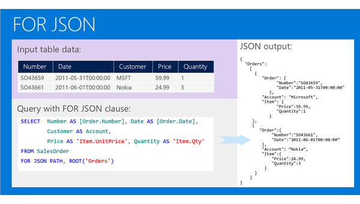
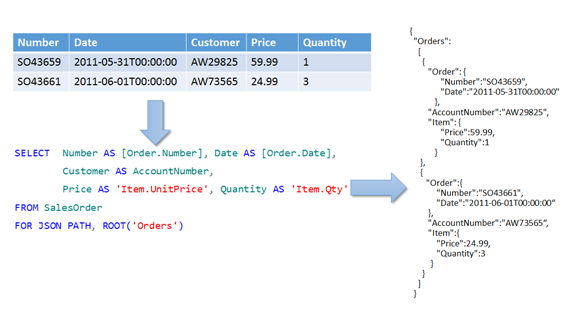
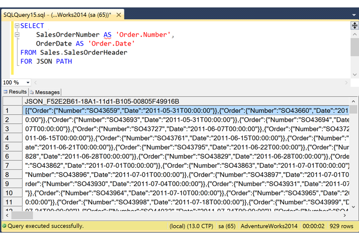

# Format Query Results as JSON with FOR JSON (SQL Server)
[!INCLUDE[appliesto-ss-asdb-xxxx-xxx-md](../../includes/appliesto-ss-asdb-xxxx-xxx-md.md)]

Format query results as JSON, or export data from SQL Server as JSON, by adding the **FOR JSON** clause to a **SELECT** statement. Use the **FOR JSON** clause to simplify client applications by delegating the formatting of JSON output from the app to [!INCLUDE[ssNoVersion](../../includes/ssnoversion-md.md)].
  
 When you use the **FOR JSON** clause, you can specify the structure of the JSON output explicitly, or let the structure of the SELECT statement determine the output.  
  
-   To maintain full control over the format of the JSON output, use **FOR JSON PATH**. You can create wrapper objects and nest complex properties.  
  
-   To format the JSON output automatically based on the structure of the SELECT statement, use **FOR JSON AUTO**.  
  
Here's an example of a **SELECT** statement with the **FOR JSON** clause and its output.
  
 
  
## Option 1 - You control output with FOR JSON PATH
In **PATH** mode, you can use the dot syntax - for example, `'Item.Price'` - to format nested output.  

Here's a sample query that uses **PATH** mode with the **FOR JSON** clause. The following example also uses the **ROOT** option to specify a named root element. 
  
  

### More info about FOR JSON PATH
For more detailed info and examples, see [Format Nested JSON Output with PATH Mode &#40;SQL Server&#41;](../../relational-databases/json/format-nested-json-output-with-path-mode-sql-server.md).

For syntax and usage, see [FOR Clause &#40;Transact-SQL&#41;](../../t-sql/queries/select-for-clause-transact-sql.md).  

## Option 2 - SELECT statement controls output with FOR JSON AUTO
In **AUTO** mode, the structure of the SELECT statement determines the format of the JSON output.

By default, **null** values are not included in the output. You can use the **INCLUDE_NULL_VALUES** to change this behavior.  

Here's a sample query that uses **AUTO** mode with the **FOR JSON** clause.
 
**Query:**  
  
```sql  
SELECT name, surname  
FROM emp  
FOR JSON AUTO  
```  
  
 **Results**  
  
```json  
[{
	"name": "John"
}, {
	"name": "Jane",
	"surname": "Doe"
}]
```
 
### More info about FOR JSON AUTO
For more detailed info and examples, see [Format JSON Output Automatically with AUTO Mode &#40;SQL Server&#41;](../../relational-databases/json/format-json-output-automatically-with-auto-mode-sql-server.md).

For syntax and usage, see [FOR Clause &#40;Transact-SQL&#41;](../../t-sql/queries/select-for-clause-transact-sql.md).  
  
## Control other JSON output options  
Control the output of the **FOR JSON** clause by using the following additional options.  
  
-   **ROOT**. To add a single, top-level element to the JSON output, specify the **ROOT** option. If you don't specify this option, the JSON output doesn't have a root element. For more info, see [Add a Root Node to JSON Output with the ROOT Option &#40;SQL Server&#41;](../../relational-databases/json/add-a-root-node-to-json-output-with-the-root-option-sql-server.md).  
  
-   **INCLUDE_NULL_VALUES**. To include null values in the JSON output, specify the **INCLUDE_NULL_VALUES** option. If you don't specify this option, the output doesn't include JSON properties for NULL values in the query results. For more info, see [Include Null Values in JSON Output with the INCLUDE_NULL_VALUES Option &#40;SQL Server&#41;](../../relational-databases/json/include-null-values-in-json-include-null-values-option.md).   

-   **WITHOUT_ARRAY_WRAPPER**. To remove the square brackets that surround the JSON output of the **FOR JSON** clause by default, specify the **WITHOUT_ARRAY_WRAPPER** option. Use this option to generate a single JSON object as output from a single-row result. If you don't specify this option, the JSON output is formatted as an array - that is, it's enclosed within square brackets. For more info, see [Remove Square Brackets from JSON Output with the WITHOUT_ARRAY_WRAPPER Option &#40;SQL Server&#41;](../../relational-databases/json/remove-square-brackets-from-json-without-array-wrapper-option.md). 
   
## Output of the FOR JSON clause  
The output of the **FOR JSON** clause has the following characteristics:  
  
1.  The result set contains a single column.
    -   A small result set may contain a single row.
    -   A large result set splits the long JSON string across multiple rows.
        -   By default, SQL Server Management Studio (SSMS) concatenates the results into a single row when the output setting is **Results to Grid**. The SSMS status bar displays the actual row count.
        -   Other client applications may require code to recombine lengthy results into a single, valid JSON string by concatenating the contents of multiple rows. For an example of this code in a C# application, see [Use FOR JSON output in a C# client app](../../relational-databases/json/use-for-json-output-in-sql-server-and-in-client-apps-sql-server.md#use-for-json-output-in-a-c-client-app).
  
       
  
2.  The results are formatted as an array of JSON objects.  
  
    -   The number of elements in the JSON array is equal to the number of rows in the results of the SELECT statement (before the FOR JSON clause is applied). 
  
    -   Each row in the results of the SELECT statement (before the FOR JSON clause is applied) becomes a separate JSON object in the array.  
  
    -   Each column in the results of the SELECT statement (before the FOR JSON clause is applied) becomes a property of the JSON object.  
  
3.  Both the names of columns and their values are escaped according to JSON syntax. For more info, see [How FOR JSON escapes special characters and control characters &#40;SQL Server&#41;](../../relational-databases/json/how-for-json-escapes-special-characters-and-control-characters-sql-server.md).
  
### Example
Here's an example that demonstrates how the **FOR JSON** clause formats the JSON output.  
  
**Query results**  
  
|||||  
|-|-|-|-|  
|**A**|**B**|**C**|**D**|  
|10|11|12|X|  
|20|21|22|Y|  
|30|31|32|Z|  
  
 **JSON output**  
  
```json  
[{
	"A": 10,
	"B": 11,
	"C": 12,
	"D": "X"
}, {
	"A": 20,
	"B": 21,
	"C": 22,
	"D": "Y"
}, {
	"A": 30,
	"B": 31,
	"C": 32,
	"D": "Z"
}] 
```  

 For more info about what you see in the output of the **FOR JSON** clause, see the following topics.  

-   [How FOR JSON converts SQL Server data types to JSON data types &#40;SQL Server&#41;](../../relational-databases/json/how-for-json-converts-sql-server-data-types-to-json-data-types-sql-server.md)  
    The **FOR JSON** clause uses the rules described in this topic to convert SQL data types to JSON types in the JSON output.  

-   [How FOR JSON escapes special characters and control characters &#40;SQL Server&#41;](../../relational-databases/json/how-for-json-escapes-special-characters-and-control-characters-sql-server.md)  
    The **FOR JSON** clause escapes special characters and represents control characters in the JSON output as described in this topic.  

## Learn more about JSON in SQL Server and Azure SQL Database  
  
### Microsoft videos

For a visual introduction to the built-in JSON support in SQL Server and Azure SQL Database, see the following videos:

-   [SQL Server 2016 and JSON Support](https://channel9.msdn.com/Shows/Data-Exposed/SQL-Server-2016-and-JSON-Support)

-   [Using JSON in SQL Server 2016 and Azure SQL Database](https://channel9.msdn.com/Shows/Data-Exposed/Using-JSON-in-SQL-Server-2016-and-Azure-SQL-Database)

-   [JSON as a bridge between NoSQL and relational worlds](https://channel9.msdn.com/events/DataDriven/SQLServer2016/JSON-as-a-bridge-betwen-NoSQL-and-relational-worlds)
  
## See Also  
 [FOR Clause &#40;Transact-SQL&#41;](../../t-sql/queries/select-for-clause-transact-sql.md)   
 [Use FOR JSON output in SQL Server and in client apps &#40;SQL Server&#41;](../../relational-databases/json/use-for-json-output-in-sql-server-and-in-client-apps-sql-server.md)  
  
  
