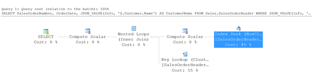
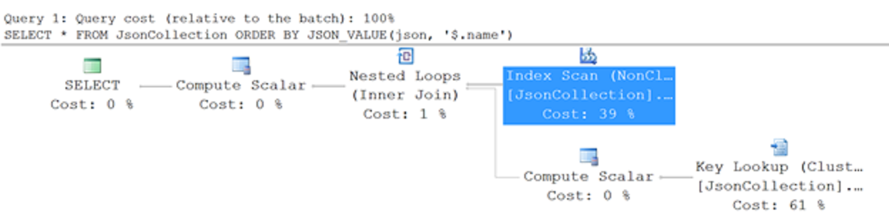
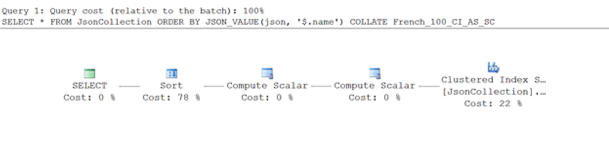

# Index JSON data
[!INCLUDE[appliesto-ss-asdb-xxxx-xxx-md](../../includes/appliesto-ss-asdb-xxxx-xxx-md.md)]

In SQL Server and SQL Database, JSON is not a built-in data type, and SQL Server does not have custom JSON indexes. You can optimize your queries over JSON documents, however, by using standard indexes. 

Database indexes improve the performance of filter and sort operations. Without indexes, SQL Server has to perform a full table scan every time you query data.  
  
## Index JSON properties by using computed columns  
When you store JSON data in SQL Server, typically you want to filter or sort query results by one or more *properties* of the JSON documents.  

### Example 
In this example, assume that the AdventureWorks `SalesOrderHeader` table has an `Info` column that contains various information in JSON format about sales orders. For example, it contains information about customer, sales person, shipping and billing addresses, and so forth. You want to use values from the `Info` column to filter sales orders for a customer.

### Query to optimize
Here's an example of the type of query that you want to optimize by using an index.  
  
```sql  
SELECT SalesOrderNumber,
    OrderDate,
    JSON_VALUE(Info, '$.Customer.Name') AS CustomerName
FROM Sales.SalesOrderHeader
WHERE JSON_VALUE(Info, '$.Customer.Name') = N'Aaron Campbell' 
```  

### Example index
If you want to speed up your filters or `ORDER BY` clauses over a property in a JSON document, you can use the same indexes that you're already using on other columns. However, you can't *directly* reference properties in the JSON documents.
    
1.  First, you have to create a "virtual column" that returns the values that you want to use for filtering.
2.  Then you have to create an index on that virtual column.  
  
The following example creates a computed column that can be used for indexing. Then it creates an index on the new computed column. This example creates a column that exposes the customer name, which is stored in the `$.Customer.Name` path in the JSON data. 
  
```sql  
ALTER TABLE Sales.SalesOrderHeader
ADD vCustomerName AS JSON_VALUE(Info,'$.Customer.Name')

CREATE INDEX idx_soh_json_CustomerName
ON Sales.SalesOrderHeader(vCustomerName)  
```  
### More info about the computed column 
The computed column is not persisted. It's computed only when the index needs to be rebuilt. It does not occupy additional space in the table.   
  
It's important that you create the computed column with the same expression that you plan to use in your queries - in this example, the expression is `JSON_VALUE(Info, '$.Customer.Name')`.  
  
You don't have to rewrite your queries. If you use expressions with the `JSON_VALUE` function, as shown in the preceding example query, SQL Server sees that there's an equivalent computed column with the same expression and applies an index if possible.

### Execution plan for this example
Here's the execution plan for the query in this example.  
  
  
  
Instead of a full table scan, SQL Server uses an index seek into the non-clustered index and finds the rows that satisfy the specified conditions. Then it uses a key lookup in the `SalesOrderHeader` table to fetch the other columns that are referenced in the query -  in this example, `SalesOrderNumber` and `OrderDate`.  
 
### Optimize the index further with included columns
If you add required columns in the index, you can avoid this additional lookup in the table. You can add these columns as standard included columns, as shown in the following example, which extends the preceding `CREATE INDEX` example.  
  
```sql  
CREATE INDEX idx_soh_json_CustomerName
ON Sales.SalesOrderHeader(vCustomerName)
INCLUDE(SalesOrderNumber,OrderDate)
```  
  
In this case SQL Server doesn't have to read additional data from the `SalesOrderHeader` table because everything it needs is included in the non-clustered JSON index. This type of index is a good way to combine JSON and column data in queries and to create optimal indexes for your workload.  
  
## JSON indexes are collation-aware indexes  
An important feature of indexes over JSON data is that the indexes are collation-aware. The result of the `JSON_VALUE` function that you use when you create the computed column is a text value that inherits its collation from the input expression. Therefore, values in the index are ordered using the collation rules defined in the source columns.  
  
To demonstrate that the indexes are collation-aware, the following example creates a simple collection table with a primary key and JSON content.  
  
```sql  
CREATE TABLE JsonCollection
 (
  id INT IDENTITY CONSTRAINT PK_JSON_ID PRIMARY KEY,
  json NVARCHAR(MAX) COLLATE SERBIAN_CYRILLIC_100_CI_AI
  CONSTRAINT [Content should be formatted as JSON]
  CHECK(ISJSON(json)>0)
 ) 
```  
  
The preceding command specifies the Serbian Cyrillic collation for the JSON column. The following example populates the table and creates an index on the name property.  
  
```sql  
INSERT INTO JsonCollection
VALUES
(N'{"name":"Иво","surname":"Андрић"}'),
(N'{"name":"Андрија","surname":"Герић"}'),
(N'{"name":"Владе","surname":"Дивац"}'),
(N'{"name":"Новак","surname":"Ђоковић"}'),
(N'{"name":"Предраг","surname":"Стојаковић"}'),
(N'{"name":"Михајло","surname":"Пупин"}'),
(N'{"name":"Борислав","surname":"Станковић"}'),
(N'{"name":"Владимир","surname":"Грбић"}'),
(N'{"name":"Жарко","surname":"Паспаљ"}'),
(N'{"name":"Дејан","surname":"Бодирога"}'),
(N'{"name":"Ђорђе","surname":"Вајферт"}'),
(N'{"name":"Горан","surname":"Бреговић"}'),
(N'{"name":"Милутин","surname":"Миланковић"}'),
(N'{"name":"Никола","surname":"Тесла"}')
GO
  
ALTER TABLE JsonCollection
ADD vName AS JSON_VALUE(json,'$.name')

CREATE INDEX idx_name
ON JsonCollection(vName)
```  
  
The preceding commands create a standard index on the computed column `vName`, which represents the value from the JSON `$.name` property. In the Serbian Cyrillic code page, the order of the letters is 'А','Б','В','Г','Д','Ђ','Е', etc. The order of items in the index is compliant with Serbian Cyrillic rules because the result of the `JSON_VALUE` function inherits its collation from the source column. The following example queries this collection and sorts the results by name.  
  
```sql  
SELECT JSON_VALUE(json,'$.name'),*
FROM JsonCollection
ORDER BY JSON_VALUE(json,'$.name')
```  
  
 If you look at the actual execution plan, you see that it uses sorted values from the non-clustered index.  
  
   
  
 Although the query has an `ORDER BY` clause, the execution plan doesn't use a Sort operator. The JSON index is already ordered according to Serbian Cyrillic rules. Therefore SQL Server can use the non-clustered index where results are already sorted.  
  
 However, if you change the collation of the `ORDER BY` expression - for example, if you add `COLLATE French_100_CI_AS_SC` after the `JSON_VALUE` function - you get a different query execution plan.  
  
   
  
 Since the order of values in the index is not compliant with French collation rules, SQL Server can't use the index to order results. Therefore, it adds a Sort operator that sorts results using French collation rules.  
 
## Learn more about JSON in SQL Server and Azure SQL Database  
  
### Microsoft videos

For a visual introduction to the built-in JSON support in SQL Server and Azure SQL Database, see the following videos:

-   [SQL Server 2016 and JSON Support](https://channel9.msdn.com/Shows/Data-Exposed/SQL-Server-2016-and-JSON-Support)

-   [Using JSON in SQL Server 2016 and Azure SQL Database](https://channel9.msdn.com/Shows/Data-Exposed/Using-JSON-in-SQL-Server-2016-and-Azure-SQL-Database)

-   [JSON as a bridge between NoSQL and relational worlds](https://channel9.msdn.com/events/DataDriven/SQLServer2016/JSON-as-a-bridge-betwen-NoSQL-and-relational-worlds)
