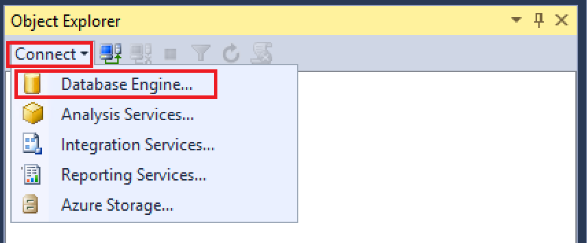

# Lesson 1: Connecting to the Database Engine

[!INCLUDE[sqlserver](../includes/applies-to-version/sqlserver.md)]

When you install the [!INCLUDE[ssDEnoversion](../includes/ssdenoversion-md.md)], the tools that are installed depend upon the edition and your setup choices. This lesson reviews the principal tools, and shows you how to connect and perform a basic function (authorizing more users).  

This lesson contains the following tasks:  
- [Tools for getting started](#tools)  
- [Connecting with Management Studio](#connect)  
- [Authorizing extra connections](#additional) 

## <a name="tools">Tools for getting started</a> 
- The [!INCLUDE[ssDEnoversion](../includes/ssdenoversion-md.md)] ships with various tools. This topic describes the first tools you'll need, and helps you select the right tool for the job. All tools can be accessed from the **Start** menu. Some tools, such as [SQL Server Management Studio (SSMS)](../ssms/download-sql-server-management-studio-ssms.md), aren't installed by default. Select the tools you want as part of the client components during setup. For a complete description of the tools described below, search for them in [!INCLUDE[ssNoVersion](../includes/ssnoversion-md.md)] Books Online. [!INCLUDE[ssExpress](../includes/ssexpress-md.md)] contains only a subset of the tools.  

### Basic tools
- [SQL Server Management Studio (SSMS)](../ssms/download-sql-server-management-studio-ssms.md) is the principal tool for administering the [!INCLUDE[ssDE](../includes/ssde-md.md)] and writing [!INCLUDE[tsql](../includes/tsql-md.md)] code. It's hosted in the [!INCLUDE[vsprvs](../includes/vsprvs-md.md)] shell. SSMS is available as a free download. The latest version can be used with older versions of the [!INCLUDE[ssDE_md](../includes/ssde-md.md)].  

- [!INCLUDE[ssNoVersion](../includes/ssnoversion-md.md)] Configuration Manager installs with both [!INCLUDE[ssNoVersion](../includes/ssnoversion-md.md)] and the client tools. It lets you enable server protocols, configure protocol options such as TCP ports, configure server services to start automatically, and configure client computers to connect in your preferred manner. This tool configures the more advanced connectivity elements but doesn't enable features.  

### Sample database
The sample databases and samples aren't included with [!INCLUDE[ssNoVersion](../includes/ssnoversion-md.md)]. Most of the examples that are described in [!INCLUDE[ssNoVersion](../includes/ssnoversion-md.md)] Books Online use the [AdventureWorks sample databases](../samples/adventureworks-install-configure.md).  

##### To start SQL Server Management Studio
- On current versions of Windows, on the **Start** page, type SSMS, and then select **Microsoft SQL Server Management Studio**.  
- When using older versions of Windows, on the **Start** menu, point to **All Programs**, point to [!INCLUDE[ssCurrentUI](../includes/sscurrentui-md.md)], and then select **SQL Server Management Studio**.  

##### To start SQL Server Configuration Manager  
- On current versions of Windows, on the **Start** page, type **Configuration Manager**, and then click **SQL Server *version* Configuration Manager**.   
- When using older versions of Windows, on the **Start** menu, point to **All Programs**, point to [!INCLUDE[ssCurrentUI](../includes/sscurrentui-md.md)], point to **Configuration Tools**, and then click **SQL Server Configuration Manager**.  

## Connecting with Management Studio  
- It's easy to connect to the [!INCLUDE[ssDE](../includes/ssde-md.md)] from tools that are running on the same computer if you know the name of the instance, and if you're connecting as a member of the local Administrators group on the computer. The following procedures must be performed on the same computer that hosts [!INCLUDE[ssNoVersion](../includes/ssnoversion-md.md)].  

> [!NOTE]  
> This topic discusses connecting to an on-premises SQL Server. To connect to Azure SQL Database, see [Quickstart: Use SSMS to connect to and query Azure SQL Database or Azure SQL Managed Instance](/azure/azure-sql/database/connect-query-ssms).  

##### To determine the name of the instance of the Database Engine  

1.  Log into Windows as a member of the Administrators group, and open [!INCLUDE[ssManStudio](../includes/ssmanstudio-md.md)].  
2.  In the **Connect to Server** dialog box, select **Cancel**.  
3.  If Registered Servers isn't displayed, on the **View** menu, select **Registered Servers**.
4.  With **Database Engine** selected on the Registered Servers toolbar, expand **Database Engine**, right-click **Local Server Groups**, point to **Tasks**, and then select **Register Local Servers**. Expand **Local Server Groups** to see all the instances of the [!INCLUDE[ssDE](../includes/ssde-md.md)] installed on the computer displayed. The default instance is unnamed and is shown as the computer name. A named instance displays as the computer name followed by a backward slash (\\) and then the name of the instance. For [!INCLUDE[ssExpress](../includes/ssexpress-md.md)], the instance is named *<computer_name>*\sqlexpress unless the name was changed during setup.  

##### To verify that the Database Engine is running

1.  In Registered Servers, if the name of your instance of [!INCLUDE[ssNoVersion](../includes/ssnoversion-md.md)] has a green dot with a white arrow next to the name, the [!INCLUDE[ssDE](../includes/ssde-md.md)] is running and no further action is necessary.  

2.  If the name of your instance of [!INCLUDE[ssNoVersion](../includes/ssnoversion-md.md)] has a red dot with a white square next to the name, the [!INCLUDE[ssDE](../includes/ssde-md.md)] is stopped. Right-click the name of the [!INCLUDE[ssDE](../includes/ssde-md.md)], select **Service Control**, and then select **Start**. After a confirmation dialog box, the [!INCLUDE[ssDE](../includes/ssde-md.md)] should start and the circle should turn green with a white arrow.  

##### To connect to the Database Engine  

At least one administrator account was selected when [!INCLUDE[ssNoVersion_md](../includes/ssnoversion-md.md)] was being installed. Perform the following step while logged into Windows as an administrator.

1. In [!INCLUDE[ssManStudio](../includes/ssmanstudio-md.md)], on the **File** menu, select **Connect Object Explorer**. 
- The **Connect to Server** dialog box opens. The **Server type** box displays the type of component that was last used.  

2. Select **Database Engine**.

3. In the **Server name** box, type the name of the instance of the Database Engine. For the default instance of SQL Server, the server name is the computer name. For a named instance of SQL Server, the server name is the _\<computer_name\>_**\\**_\<instance_name\>_, such as **ACCTG_SRVR\SQLEXPRESS**. The following screenshot shows connecting to the default (unnamed) instance of [!INCLUDE[ssNoVersion_md](../includes/ssnoversion-md.md)] on a computer named `PracticeComputer`. The user logged into Windows is Mary from the Contoso domain. When using Windows Authentication, you cannot change the user name.

4. Select **Connect**.

> [!NOTE]
> This tutorial assumes you are new to [!INCLUDE[ssNoVersion](../includes/ssnoversion-md.md)] and have no special problems connecting. This should be sufficient for most people and this keeps this tutorial simple. For detailed troubleshooting steps, see [Troubleshooting Connecting to the SQL Server Database Engine](/troubleshoot/sql/connect/network-related-or-instance-specific-error-occurred-while-establishing-connection).

## Authorizing extra connections

Now that you've connected to [!INCLUDE[ssNoVersion](../includes/ssnoversion-md.md)] as an administrator, one of your first tasks is to authorize other users to connect. You do this by creating a login and authorizing that login to access a database as a user. Logins can be either Windows Authentication logins, which use credentials from Windows, or SQL Server Authentication logins, which store the authentication information in [!INCLUDE[ssNoVersion](../includes/ssnoversion-md.md)] and are independent of your Windows credentials. Extra login options include Azure Active Directory logins, which you can find out more information by following the article, [Use Azure Active Directory authentication](/azure/azure-sql/database/authentication-aad-overview). 

Use Windows Authentication whenever possible.

> [!TIP]
> Most organizations have domain users and will use Windows Authentication. You can experiment on your own, by creating additional local users on your computer. Local users will be authenticated by your computer, so the domain is the computer name. For example if your computer is named `MyComputer` and you create a user named `Test`, then the Windows description of the user is `Mycomputer\Test`.  

##### Create a Windows Authentication login 

1.  In the previous task, you connected to the [!INCLUDE[ssDE](../includes/ssde-md.md)] using [!INCLUDE[ssManStudio](../includes/ssmanstudio-md.md)]. In Object Explorer, expand your server instance, expand **Security**, right-click **Logins**, and then select **New Login**. The **Login - New** dialog box appears.  

2.  On the **General** page, in the **Login name** box, type a Windows login in the format: `<domain>\<login>`

3.  In the **Default database** box, select the AdventureWorks database if available. Otherwise select `master` database.  
4.  On the **Server Roles** page, if the new login is to be an administrator, select **sysadmin**, otherwise leave this blank.  
5.  On the **User Mapping** page, select **Map** for the [!INCLUDE[ssSampleDBobject](../includes/sssampledbobject-md.md)] database if it's available. Otherwise select **master**. The **User** box is populated with the login. When closed, the dialog box will create this user in the database.  
6.  In the **Default Schema** box, type **dbo** to map the login to the database owner schema.   
7.  Accept the default settings for the **Securables** and **Status** boxes and select **OK** to create the login.  

> [!IMPORTANT]  
> This is basic information to get you started. [!INCLUDE[ssNoVersion](../includes/ssnoversion-md.md)] provides a rich security environment, and security is obviously an important aspect of database operations.  

## Next Lesson  

[Lesson 2: Connecting from Another Computer](../relational-databases/lesson-2-connecting-from-another-computer.md)    
