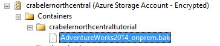

# Lesson 3: Database backup to URL
In this lesson, you will back up the AdventureWorks2014 database in your on-premises SQL Server 2016 instance to the Azure container that you created in [Lesson 1: Create a stored access policy and a shared access signature  on an Azure container](../relational-databases/lesson-1-create-stored-access-policy-and-shared-access-signature.md).  
  
> [!NOTE]  
> If you wish to backup a SQL Server 2012 SP1 CU2 or later database or a SQL Server 2014 database to this Azure container, you can use the  deprecated syntax documented [here](https://technet.microsoft.com/en-US/library/dn435916(v=sql.120).aspx) to backup to URL using the WITH CREDENTIAL syntax.  
  
To back up a database to Blob storage, follow these steps:  
  
1.  Connect to SQL Server Management Studio.  
  
2.  Open a new query window and connect to the SQL Server 2016 instance of the database engine in your Azure virtual machine.  
  
3.  Copy and paste the following Transact-SQL script into the query window. Modify the URL appropriately for your storage account name and the container that you specified in Lesson 1 and then execute this script.  
  
    ```  
  
    -- To permit log backups, before the full database backup, modify the database to use the full recovery model.  
    USE master;  
    ALTER DATABASE AdventureWorks2014  
       SET RECOVERY FULL;  
  
    -- Back up the full AdventureWorks2014 database to the container that you created in Lesson 1  
    BACKUP DATABASE AdventureWorks2014   
       TO URL = 'https://<mystorageaccountname>.blob.core.windows.net/<mystorageaccountcontainername>/AdventureWorks2014_onprem.bak'  
  
    ```  
  
4.  Open Object Explorer and connect to Azure storage using your storage account and account key.  
  
5.  Expand Containers,  expand the container that your created in Lesson 1 and verify that the backup from step 3 above appears in this container.  
  
      
  
**Next Lesson:**  
  
[Lesson 4: Restore database to virtual machine from URL](../relational-databases/lesson-4-restore-database-to-virtual-machine-from-url.md)  
  
