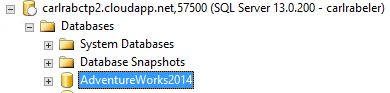
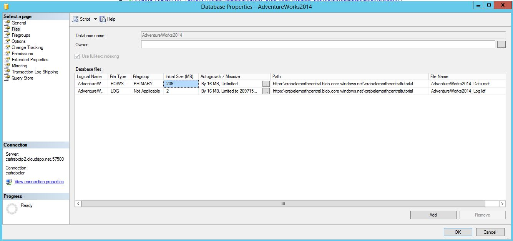
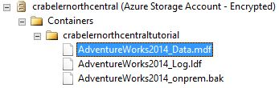

# Lesson 4: Restore database to virtual machine from URL
In this lesson, you will restore the AdventureWorks2014 database to your SQL Server 2016 instance in your Azure virtual machine the AdventureWorks2014 database.  
  
> [!NOTE]  
> For the purposes of simplicity in this tutorial, we are using the same container for the data and log files that we used for the database backup. In a production environment, you would likely use multiple containers, and frequently multiple data files as well. With SQL Server 2016, you could also consider striping your backup across multiple blobs to increase backup performance when backing up a large database.  
  
To restore the SQL Server 2014 database from Azure blob storage to your SQL Server 2016 instance in your Azure virtual machine, follow these steps:  
  
1.  Connect to SQL Server Management Studio.  
  
2.  Open a new query window and connect to the SQL Server 2016 instance of the database engine in your Azure virtual machine.  
  
3.  Copy and paste the following Transact-SQL script into the query window. Modify the URL appropriately for your storage account name and the container that you specified in Lesson 1 and then execute this script.  
  
    ```  
  
    -- Restore AdventureWorks2014 from URL to SQL Server instance using Azure blob storage for database files  
    RESTORE DATABASE AdventureWorks2014   
       FROM URL = 'https://<mystorageaccountname>.blob.core.windows.net/<mystorageaccountcontainername>/AdventureWorks2014_onprem.bak'   
       WITH  
          MOVE 'AdventureWorks2014_data' to 'https://<mystorageaccountname>.blob.core.windows.net/<mystorageaccountcontainername>/AdventureWorks2014_Data.mdf'  
         ,MOVE 'AdventureWorks2014_log' to 'https://<mystorageaccountname>.blob.core.windows.net/<mystorageaccountcontainername>/AdventureWorks2014_Log.ldf'  
    --, REPLACE  
  
    ```  
  
4.  Open Object Explorer and connect to your Azure SQL Server 2016 instance.  
  
5.  In Object Explorer, expand the Databases node and verify that the AdventureWorks2014 database has been restored (refresh the node as necessary).  
  
      
  
6.  In Object Explorer, right-click AdventureWorks2014, and click Properties (click Cancel when done).  
  
7.  Click Files and verify that the path for the two database files are URLs pointing to blobs in your Azure blog container.  
  
      
  
8.  In Object Explorer, connect to Azure storage.  
  
9. Expand Containers,  expand the container that your created in Lesson 1 and verify that the AdventureWorks2014_Data.mdf and AdventureWorks2014_Log.ldf  from step 3 above appears in this container, along with the backup file from Lesson 3 (refresh the node as necessary).  
  
      
  
**Next Lesson:**  
  
[Lesson 5: Backup database using file-snapshot backup](../relational-databases/lesson-5-backup-database-using-file-snapshot-backup.md)  
  
  
  
