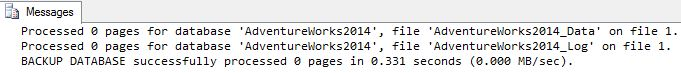
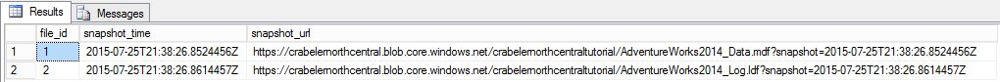
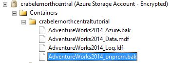

# Lesson 5: Backup database using file-snapshot backup
In this lesson, you will back up the AdventureWorks2014 database in your Azure virtual machine using file-snapshot backup to perform a nearly instantaneous backup  using Azure snapshots. For more information on file-snapshot backups, see [File-Snapshot Backups for Database Files in Azure](../relational-databases/backup-restore/file-snapshot-backups-for-database-files-in-azure.md)  
  
To back up the AdventureWorks2014 database using file-snapshot backup, follow these steps:  
  
1.  Connect to SQL Server Management Studio.  
  
2.  Open a new query window and connect to the SQL Server 2016 instance of the database engine in your Azure virtual machine.  
  
3.  Copy, paste and execute the following Transact-SQL script into the query window (do not close this query window - you will execute this script again in step 5. This system stored procedure enables you to view the existing file snapshot backups for each file that comprises a specified database. You will notice that there are no file snapshot backups for this database.  
  
    ```  
  
    -- Verify that no file snapshot backups exist  
    SELECT * FROM sys.fn_db_backup_file_snapshots ('AdventureWorks2014');  
  
    ```  
  
4.  Copy and paste the following Transact-SQL script into the query window. Modify the URL appropriately for your storage account name and the container that you specified in Lesson 1 and then execute this script. Notice how quickly this backup occurs.  
  
    ```  
  
    -- Backup the AdventureWorks2014 database with FILE_SNAPSHOT  
    BACKUP DATABASE AdventureWorks2014   
       TO URL = 'https://<mystorageaccountname>.blob.core.windows.net/<mystorageaccountcontainername>/AdventureWorks2014_Azure.bak'   
       WITH FILE_SNAPSHOT;  
  
    ```  
  
      
  
5.  After verifying that the script in step 4 executed successfully, execute the following script again. Notice that the file-snapshot backup operation in step 4 generated file-snapshots of both the data and log file.  
  
    ```  
  
    -- Verify that two file-snapshot backups exist  
    SELECT * FROM sys.fn_db_backup_file_snapshots ('AdventureWorks2014');  
  
    ```  
  
      
  
6.  In Object Explorer, in your SQL Server 2016 instance in your Azure virtual machine, expand the Databases node and verify that the AdventureWorks2014 database has been restored to this instance (refresh the node as necessary).  
  
7.  In Object Explorer, connect to Azure storage.  
  
8.  Expand Containers,  expand the container that you created in Lesson 1 and verify that the AdventureWorks2014_Azure.bak from step 4 above appears in this container, along with the backup file from Lesson 3 and the database files from Lesson 4 (refresh the node as necessary).  
  
      
  
**Next Lesson:**  
  
[Lesson 6: Generate activity and backup log using file-snapshot backup](../relational-databases/lesson-6-generate-activity-and-backup-log-using-file-snapshot-backup.md)  
  
## See Also  
[File-Snapshot Backups for Database Files in Azure](../relational-databases/backup-restore/file-snapshot-backups-for-database-files-in-azure.md)  
[sys.fn_db_backup_file_snapshots &#40;Transact-SQL&#41;](../relational-databases/system-functions/sys-fn-db-backup-file-snapshots-transact-sql.md)  
  
  
  
