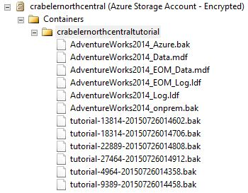
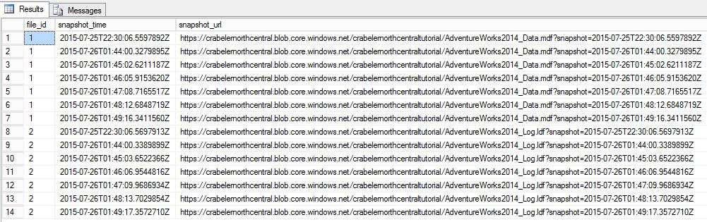

# Lesson 9: Manage backup sets and file-snapshot backups
In this lesson, you will delete a backup set using the [sp_delete_backup &#40;Transact-SQL&#41;](../relational-databases/system-stored-procedures/snapshot-backup-sp-delete-backup.md) system stored procedure. This system stored procedure deletes the backup file and the file snapshot on each database file associated with this backup set.  
  
> [!NOTE]  
> If you attempt to delete a backup set by simply deleting the backup file from the Azure blob container, you will only delete the backup file itself - the associated file snapshots will remain. If you find yourself in this scenario, use the [sys.fn_db_backup_file_snapshots &#40;Transact-SQL&#41;](../relational-databases/system-functions/sys-fn-db-backup-file-snapshots-transact-sql.md) system function to identify the URL of the orphaned file snapshots and use the [sp_delete_backup_file_snapshot &#40;Transact-SQL&#41;](../relational-databases/system-stored-procedures/snapshot-backup-sp-delete-backup-file-snapshot.md) system stored procedure to delete each orphaned file snapshot. For more information, see  [File-Snapshot Backups for Database Files in Azure](../relational-databases/backup-restore/file-snapshot-backups-for-database-files-in-azure.md).  
  
To delete a file-snapshot backup set, follow these steps:  
  
1.  Connect to SQL Server Management Studio.  
  
2.  Open a new query window and connect to the SQL Server 2016 instance of the database engine in your Azure virtual machine (or to any SQL Server 2016 instance with permissions to read and write on this container).  
  
3.  Copy and paste the following Transact-SQL script into the query window. Select the log backup you wish to delete along with its associated file snapshots. Modify the URL appropriately for your storage account name and the container that you specified in Lesson 1, provide the log backup file name and then execute this script.  
  
    ```  
  
    sys.sp_delete_backup 'https://<mystorageaccountname>.blob.core.windows.net/<mystorageaccountcontainername>/tutorial-9164-20150726012420.bak';  
  
    ```  
  
4.  In Object Explorer, connect to Azure storage.  
  
5.  Expand Containers, expand the container that your created in Lesson 1 and verify that the backup file you used in step 3 no longer appears in this container (refresh the node as necessary).  
  
      
  
6.  Copy, paste and execute the following Transact-SQL script into the query window to verify that two file snapshots have been deleted.  
  
    ```  
  
    -- verify that two file snapshots have been removed  
    SELECT * from sys.fn_db_backup_file_snapshots ('AdventureWorks2014');  
  
    ```  
  
      
  
**End of Tutorial**  
  
## See Also  
[File-Snapshot Backups for Database Files in Azure](../relational-databases/backup-restore/file-snapshot-backups-for-database-files-in-azure.md)  
[sp_delete_backup &#40;Transact-SQL&#41;](../relational-databases/system-stored-procedures/snapshot-backup-sp-delete-backup.md)  
[sys.fn_db_backup_file_snapshots &#40;Transact-SQL&#41;](../relational-databases/system-functions/sys-fn-db-backup-file-snapshots-transact-sql.md)  
[sp_delete_backup_file_snapshot &#40;Transact-SQL&#41;](../relational-databases/system-stored-procedures/snapshot-backup-sp-delete-backup-file-snapshot.md)  
  
  
  

