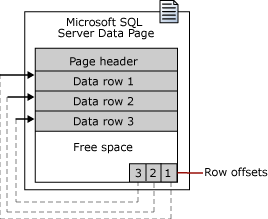
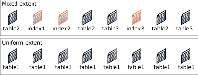
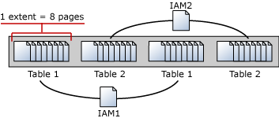
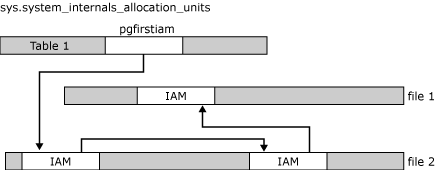

# Pages and Extents Architecture Guide
[!INCLUDE[appliesto-ss-asdb-asdw-pdw-md](../includes/appliesto-ss-asdb-asdw-pdw-md.md)]

The page is the fundamental unit of data storage in [!INCLUDE[ssNoVersion](../includes/ssnoversion-md.md)]. An extent is a collection of eight physically contiguous pages. Extents help efficiently manage pages. This guide describes the data structures that are used to manage pages and extents in all versions of SQL Server. Understanding the architecture of pages and extents is important for designing and developing databases that perform efficiently.

## Pages and Extents

The fundamental unit of data storage in [!INCLUDE[ssNoVersion](../includes/ssnoversion-md.md)] is the page. The disk space allocated to a data file (.mdf or .ndf) in a database is logically divided into pages numbered contiguously from 0 to n. Disk I/O operations are performed at the page level. That is, SQL Server reads or writes whole data pages.

Extents are a collection of eight physically contiguous pages and are used to efficiently manage the pages. All pages are stored in extents.

### Pages

In [!INCLUDE[ssNoVersion](../includes/ssnoversion-md.md)], the page size is 8-KB. This means [!INCLUDE[ssNoVersion](../includes/ssnoversion-md.md)] databases have 128 pages per megabyte. Each page begins with a 96-byte header that is used to store system information about the page. This information includes the page number, page type, the amount of free space on the page, and the allocation unit ID of the object that owns the page.

The following table shows the page types used in the data files of a [!INCLUDE[ssNoVersion](../includes/ssnoversion-md.md)] database.

|Page type | Contents |
|-------|-------|
|Data |Data rows with all data, except text, ntext, image, nvarchar(max), varchar(max), varbinary(max), and xml data, when text in row is set to ON. |
|Index |Index entries. |
|Text/Image |Large object data types: (text, ntext, image, nvarchar(max), varchar(max), varbinary(max), and xml data)   Variable length columns when the data row exceeds 8 KB: (varchar, nvarchar, varbinary, and sql_variant) |
|Global Allocation Map, Shared Global Allocation Map |Information about whether extents are allocated. |
|Page Free Space (PFS) |Information about page allocation and free space available on pages. |
|Index Allocation Map |Information about extents used by a table or index per allocation unit. |
|Bulk Changed Map |Information about extents modified by bulk operations since the last BACKUP LOG statement per allocation unit. |
|Differential Changed Map |Information about extents that have changed since the last BACKUP DATABASE statement per allocation unit. |

> [!NOTE]
> Log files do not contain pages; they contain a series of log records.

Data rows are put on the page serially, starting immediately after the header. A row offset table starts at the end of the page, and each row offset table contains one entry for each row on the page. Each entry records how far the first byte of the row is from the start of the page. The entries in the row offset table are in reverse sequence from the sequence of the rows on the page.

#### Large Row Support  

Rows cannot span pages, however portions of the row may be moved off the row's page so that the row can actually be very large. The maximum amount of data and overhead that is contained in a single row on a page is 8,060 bytes (8-KB). However, this does not include the data stored in the Text/Image page type. 

This restriction is relaxed for tables that contain varchar, nvarchar, varbinary, or sql_variant columns. When the total row size of all fixed and variable columns in a table exceeds the 8,060-byte limitation, [!INCLUDE[ssNoVersion](../includes/ssnoversion-md.md)] dynamically moves one or more variable length columns to pages in the ROW_OVERFLOW_DATA allocation unit, starting with the column with the largest width. 

This is done whenever an insert or update operation increases the total size of the row beyond the 8,060-byte limit. When a column is moved to a page in the ROW_OVERFLOW_DATA allocation unit, a 24-byte pointer on the original page in the IN_ROW_DATA allocation unit is maintained. If a subsequent operation reduces the row size, [!INCLUDE[ssNoVersion](../includes/ssnoversion-md.md)] dynamically moves the columns back to the original data page. 

##### Row-Overflow Considerations 

When you combine varchar, nvarchar, varbinary, sql_variant, or CLR user-defined type columns that exceed 8,060 bytes per row, consider the following: 
-  Moving large records to another page occurs dynamically as records are lengthened based on update operations. Update operations that shorten records may cause records to be moved back to the original page in the IN_ROW_DATA allocation unit. 
   Querying and performing other select operations, such as sorts or joins on large records that contain row-overflow data slows processing time, because these records are processed synchronously instead of asynchronously.   
   Therefore, when you design a table with multiple varchar, nvarchar, varbinary, sql_variant, or CLR user-defined type columns, consider the percentage of rows that are likely to flow over and the frequency with which this overflow data is likely to be queried. If there are likely to be frequent queries on many rows of row-overflow data, consider normalizing the table so that some columns are moved to another table. This can then be queried in an asynchronous JOIN operation. 
-  The length of individual columns must still fall within the limit of 8,000 bytes for varchar, nvarchar, varbinary, sql_variant, and CLR user-defined type columns. Only their combined lengths can exceed the 8,060-byte row limit of a table.
-  The sum of other data type columns, including char and nchar data, must fall within the 8,060-byte row limit. Large object data is also exempt from the 8,060-byte row limit. 
-  The index key of a clustered index cannot contain varchar columns that have existing data in the ROW_OVERFLOW_DATA allocation unit. If a clustered index is created on a varchar column and the existing data is in the IN_ROW_DATA allocation unit, subsequent insert or update actions on the column that would push the data off-row will fail. For more information about allocation units, see Table and Index Organization.
-  You can include columns that contain row-overflow data as key or nonkey columns of a nonclustered index.
-  The record-size limit for tables that use sparse columns is 8,018 bytes. When the converted data plus existing record data exceeds 8,018 bytes, [MSSQLSERVER ERROR 576](../relational-databases/errors-events/database-engine-events-and-errors.md) is returned. When columns are converted between sparse and nonsparse types, Database Engine keeps a copy of the current record data. This temporarily doubles the storage that is required for the record.
-  To obtain information about tables or indexes that might contain row-overflow data, use the [sys.dm_db_index_physical_stats](../relational-databases/system-dynamic-management-views/sys-dm-db-index-physical-stats-transact-sql.md) dynamic management function.

### Extents 

Extents are the basic unit in which space is managed. An extent is eight physically contiguous pages, or 64 KB. This means SQL Server databases have 16 extents per megabyte.

[!INCLUDE[ssNoVersion](../includes/ssnoversion-md.md)] has two types of extents: 

* **Uniform** extents are owned by a single object; all eight pages in the extent can only be used by the owning object.
* **Mixed** extents are shared by up to eight objects. Each of the eight pages in the extent can be owned by a different object.

Up to, and including, [!INCLUDE[ssSQL14](../includes/sssql14-md.md)], [!INCLUDE[ssNoVersion](../includes/ssnoversion-md.md)] does not allocate whole extents to tables with small amounts of data. A new table or index generally allocates pages from mixed extents. When the table or index grows to the point that it has eight pages, it then switches to use uniform extents for subsequent allocations. If you create an index on an existing table that has enough rows to generate eight pages in the index, all allocations to the index are in uniform extents. However, starting with [!INCLUDE[ssSQL15](../includes/sssql15-md.md)], the default for all allocations in the database is uniform extents.

> [!NOTE]
> Up to, and including, [!INCLUDE[ssSQL14](../includes/sssql14-md.md)], trace flag 1118 can be used to change the default allocation to always use uniform extents. For more information about this trace flag, see [DBCC TRACEON - Trace Flags](../t-sql/database-console-commands/dbcc-traceon-trace-flags-transact-sql.md).   
>   
> Starting with [!INCLUDE[ssSQL15](../includes/sssql15-md.md)], the functionality provided by TF 1118 is automatically enabled for TempDB. For user databases, this behavior is controlled by the `SET MIXED_PAGE_ALLOCATION` option of `ALTER DATABASE`, with the default value set to OFF, and trace flag 1118 has no effect. For more information, see [ALTER DATABASE SET Options (Transact-SQL)](../t-sql/statements/alter-database-transact-sql-set-options.md).

## Managing Extent Allocations and Free Space 

The [!INCLUDE[ssNoVersion](../includes/ssnoversion-md.md)] data structures that manage extent allocations and track free space have a relatively simple structure. This has the following benefits: 

* The free space information is densely packed, so relatively few pages contain this information.   
  This increases speed by reducing the amount of disk reads that are required to retrieve allocation information. This also increases the chance that the allocation pages will remain in memory and not require more reads. 

* Most of the allocation information is not chained together. This simplifies the maintenance of the allocation information.    
  Each page allocation or deallocation can be performed quickly. This decreases the contention between concurrent tasks having to allocate or deallocate pages. 

### Managing Extent Allocations

[!INCLUDE[ssNoVersion](../includes/ssnoversion-md.md)] uses two types of allocation maps to record the allocation of extents: 

- **Global Allocation Map (GAM)**   
  GAM pages record what extents have been allocated. Each GAM covers 64,000 extents, or almost 4 gigabytes (GB) of data. The GAM has 1-bit for each extent in the interval it covers. If the bit is 1, the extent is free; if the bit is 0, the extent is allocated. 

- **Shared Global Allocation Map (SGAM)**   
  SGAM pages record which extents are currently being used as mixed extents and also have at least one unused page. Each SGAM covers 64,000 extents, or almost 4-GB of data. The SGAM has 1-bit for each extent in the interval it covers. If the bit is 1, the extent is being used as a mixed extent and has a free page. If the bit is 0, the extent is not used as a mixed extent, or it is a mixed extent and all its pages are being used. 

Each extent has the following bit patterns set in the GAM and SGAM, based on its current use. 

|Current use of extent | GAM bit setting | SGAM bit setting |
|---------|----------|------| 
|Free, not being used |1 |0 |
|Uniform extent, or full mixed extent |0 |0 |
|Mixed extent with free pages |0 |1 |
 
This causes simple extent management algorithms. 
-   To allocate a uniform extent, the [!INCLUDE[ssDEnoversion](../includes/ssdenoversion-md.md)] searches the GAM for a 1 bit and sets it to 0. 
-   To find a mixed extent with free pages, the [!INCLUDE[ssDEnoversion](../includes/ssdenoversion-md.md)] searches the SGAM for a 1 bit. 
-   To allocate a mixed extent, the [!INCLUDE[ssDEnoversion](../includes/ssdenoversion-md.md)] searches the GAM for a 1 bit, sets it to 0, and then also sets the corresponding bit in the SGAM to 1. 
-   To deallocate an extent, the [!INCLUDE[ssDEnoversion](../includes/ssdenoversion-md.md)] makes sure that the GAM bit is set to 1 and the SGAM bit is set to 0. 
The algorithms that are actually used internally by the [!INCLUDE[ssDEnoversion](../includes/ssdenoversion-md.md)] are more sophisticated than what is described in this article, because the [!INCLUDE[ssDEnoversion](../includes/ssdenoversion-md.md)] distributes data evenly in a database. However, even the real algorithms are simplified by not having to manage chains of extent allocation information.

### Tracking free space

**Page Free Space (PFS)** pages record the allocation status of each page, whether an individual page has been allocated, and the amount of free space on each page. The PFS has 1-byte for each page, recording whether the page is allocated, and if so, whether it is empty, 1 to 50 percent full, 51 to 80 percent full, 81 to 95 percent full, or 96 to 100 percent full.

After an extent has been allocated to an object, the [!INCLUDE[ssDEnoversion](../includes/ssdenoversion-md.md)] uses the PFS pages to record which pages in the extent are allocated or free. This information is used when the [!INCLUDE[ssDEnoversion](../includes/ssdenoversion-md.md)] has to allocate a new page. The amount of free space in a page is only maintained for heap and Text/Image pages. It is used when the [!INCLUDE[ssDEnoversion](../includes/ssdenoversion-md.md)] has to find a page with free space available to hold a newly inserted row. Indexes do not require that the page free space be tracked, because the point at which to insert a new row is set by the index key values.

A PFS page is the first page after the file header page in a data file (page ID 1). This is followed by a GAM page (page ID 2), and then an SGAM page (page ID 3). There is a new PFS page approximately 8,000 pages after the first PFS page, and additional PFS pages in subsequent 8,000 page intervals. There is another GAM page 64,000 extents after the first GAM page on page 2, another SGAM page 64,000 extents after the first SGAM page on page 3, and additional GAM and SGAM pages in subsequent 64,000 extent intervals. The following illustration shows the sequence of pages used by the [!INCLUDE[ssDEnoversion](../includes/ssdenoversion-md.md)] to allocate and manage extents.

## Managing space used by objects 

An **Index Allocation Map (IAM)** page maps the extents in a 4-GB part of a database file used by an allocation unit. An allocation unit is one of three types:

- IN_ROW_DATA   
    Holds a partition of a heap or index.

- LOB_DATA   
   Holds large object (LOB) data types, such as xml, varbinary(max), and varchar(max).

- ROW_OVERFLOW_DATA   
   Holds variable length data stored in varchar, nvarchar, varbinary, or sql_variant columns that exceed the 8,060 byte row size limit. 

Each partition of a heap or index contains at least an IN_ROW_DATA allocation unit. It may also contain a LOB_DATA or ROW_OVERFLOW_DATA allocation unit, depending on the heap or index schema.

An IAM page covers a 4-GB range in a file and is the same coverage as a GAM or SGAM page. If the allocation unit contains extents from more than one file, or more than one 4-GB range of a file, there will be multiple IAM pages linked in an IAM chain. Therefore, each allocation unit has at least one IAM page for each file on which it has extents. There may also be more than one IAM page on a file, if the range of the extents on the file allocated to the allocation unit exceeds the range that a single IAM page can record. 

IAM pages are allocated as required for each allocation unit and are located randomly in the file. The system view, sys.system_internals_allocation_units, points to the first IAM page for an allocation unit. All the IAM pages for that allocation unit are linked in a chain.

> [!IMPORTANT]
> The `sys.system_internals_allocation_units` system view is for internal use only and is subject to change. Compatibility is not guaranteed.

 
IAM pages linked in a chain per allocation unit
An IAM page has a header that indicates the starting extent of the range of extents mapped by the IAM page. The IAM page also has a large bitmap in which each bit represents one extent. The first bit in the map represents the first extent in the range, the second bit represents the second extent, and so on. If a bit is 0, the extent it represents is not allocated to the allocation unit owning the IAM. If the bit is 1, the extent it represents is allocated to the allocation unit owning the IAM page.

When the [!INCLUDE[ssDEnoversion](../includes/ssdenoversion-md.md)] has to insert a new row and no space is available in the current page, it uses the IAM and PFS pages to find a page to allocate, or, for a heap or a Text/Image page, a page with sufficient space to hold the row. The [!INCLUDE[ssDEnoversion](../includes/ssdenoversion-md.md)] uses the IAM pages to find the extents allocated to the allocation unit. For each extent, the [!INCLUDE[ssDEnoversion](../includes/ssdenoversion-md.md)] searches the PFS pages to see if there is a page that can be used. Each IAM and PFS page covers lots of data pages, so there are few IAM and PFS pages in a database. This means that the IAM and PFS pages are generally in memory in the [!INCLUDE[ssNoVersion](../includes/ssnoversion-md.md)] buffer pool, so they can be searched quickly. For indexes, the insertion point of a new row is set by the index key, but when a new page is needed, the previously described process occurs.

The [!INCLUDE[ssDEnoversion](../includes/ssdenoversion-md.md)] allocates a new extent to an allocation unit only when it cannot quickly find a page in an existing extent with sufficient space to hold the row being inserted. 

 The [!INCLUDE[ssDEnoversion](../includes/ssdenoversion-md.md)] allocates extents from those available in the filegroup using a **proportional fill allocation algorithm**. If in the same filegroup with two files, one file has two times the free space as the other, two pages will be allocated from the file with the available space for every one page allocated from the other file. This means that every file in a filegroup should have a similar percentage of space used. 

## Tracking Modified Extents 

[!INCLUDE[ssNoVersion](../includes/ssnoversion-md.md)] uses two internal data structures to track extents modified by bulk copy operations and extents modified since the last full backup. These data structures greatly speed up differential backups. They also speed up the logging of bulk copy operations when a database is using the bulk-logged recovery model. Like the Global Allocation Map (GAM) and Shared Global Allocation Map (SGAM) pages, these structures are bitmaps in which each bit represents a single extent. 

- **Differential Changed Map (DCM)**   
   This tracks the extents that have changed since the last `BACKUP DATABASE` statement. If the bit for an extent is 1, the extent has been modified since the last `BACKUP DATABASE` statement. If the bit is 0, the extent has not been modified. 
   Differential backups read just the DCM pages to determine which extents have been modified. This greatly reduces the number of pages that a differential backup must scan. The length of time that a differential backup runs is proportional to the number of extents modified since the last BACKUP DATABASE statement and not the overall size of the database. 

- **Bulk Changed Map (BCM)**   
   This tracks the extents that have been modified by bulk logged operations since the last `BACKUP LOG` statement. If the bit for an extent is 1, the extent has been modified by a bulk logged operation after the last `BACKUP LOG` statement. If the bit is 0, the extent has not been modified by bulk logged operations. 
   Although BCM pages appear in all databases, they are only relevant when the database is using the bulk-logged recovery model. In this recovery model, when a `BACKUP LOG` is performed, the backup process scans the BCMs for extents that have been modified. It then includes those extents in the log backup. This lets the bulk logged operations be recovered if the database is restored from a database backup and a sequence of transaction log backups. BCM pages are not relevant in a database that is using the simple recovery model, because no bulk logged operations are logged. They are not relevant in a database that is using the full recovery model, because that recovery model treats bulk logged operations as fully logged operations. 

The interval between DCM pages and BCM pages is the same as the interval between GAM and SGAM page, 64,000 extents. The DCM and BCM pages are located behind the GAM and SGAM pages in a physical file:

## See Also
[sys.allocation_units &#40;Transact-SQL&#41;](../relational-databases/system-catalog-views/sys-allocation-units-transact-sql.md)     
[Heaps &#40;Tables without Clustered Indexes&#41;](../relational-databases/indexes/heaps-tables-without-clustered-indexes.md#heap-structures)       
[Reading Pages](../relational-databases/reading-pages.md)   
[Writing Pages](../relational-databases/writing-pages.md)   
