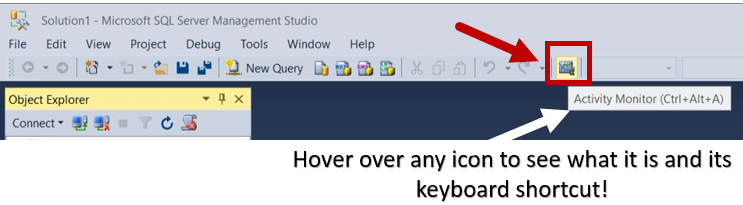

# Open Activity Monitor (SQL Server Management Studio)
[!INCLUDE[appliesto-ss-xxxx-xxxx-xxx-md](../../includes/appliesto-ss-xxxx-xxxx-xxx-md.md)]
   
 Activity Monitor runs queries on the monitored instance to obtain information for the Activity Monitor display panes. When the refresh interval is set to less than 10 seconds, the time that is used to run these queries can affect server performance  
  
  
##   Check your permissions!  
 To view actual activity, you must have VIEW SERVER STATE permission. To view the Data File I/O section of Activity Monitor, you must have CREATE DATABASE, ALTER ANY DATABASE, or VIEW ANY DEFINITION permission in addition to VIEW SERVER STATE.  
  
 To KILL a process, a user must be a member of the sysadmin or processadmin fixed server roles.  
  
  
## Open Activity Monitor  

### Keyboard shortcut  
 - Type **CTRL+ALT+A** to open Activity Monitor at any time.

 >**Hint!** Hover over any icon in SSMS to learn what it is and what keyboard shortcut activates it!

### Toolbar

From the Standard toolbar, click the **Activity Monitor** icon. It is in the middle, just to the right of the undo/redo buttons.
  
  
Complete the **Connect to Server** dialog box if you are not already connected to an instance of SQL Server you want to monitor.
  
## Launch Activity Monitor and Object Explorer on startup
  
1.  From the **Tools** menu, click **Options**.  
  
2.  In the **Options** dialog box, expand **Environment**, and then select **Startup**.  
  
3.  From the **At startup** drop-down list, select **Open Object Explorer and Activity Monitor**.  

4.  Click **OK**.
  

  
  
## Set the Activity Monitor refresh interval  
  
1.   Open the Activity Monitor.  
  
2.   Right-click **Overview**, select **Refresh Interval**, and then select the interval in which Activity Monitor should obtain new instance information.  
  
  
