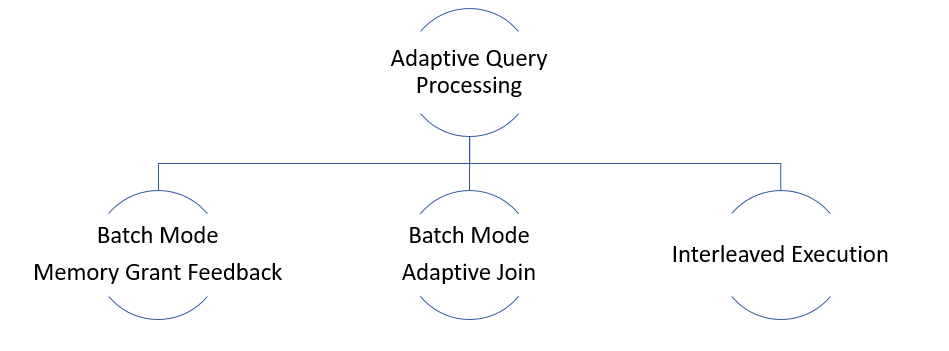

# Adaptive Query Processing
SQL Server 2017 addresses optimization issues with new adaptive query processing features. This article introduces the three features that you can use to improve query performance in SQL Server and Azure SQL Database.
- Batch mode memory grant feedback.
- Batch mode adaptive join.
- Interleaved execution. 

This article describes the features and how to enable them, gives customer examples, and results you can expect. 
At a general level, SQL Server executes a query as follows:
1. The query optimization process generates a set of feasible execution plans for a specific query. During this time, the cost of plan options is estimated and the plan with the lowest estimated cost is used.
1. The query execution process takes the plan chosen by the query optimizer and uses it for execution.
    
Sometimes the plan chosen by the query optimizer is not optimal for a variety of reasons. For example, the estimated number of rows flowing through the query plan may be incorrect. The estimated costs help determine which plan gets selected for use in execution. If cardinality estimates are incorrect, the original plan is still used despite the poor original assumptions.




### How to enable adaptive query processing
You can make workloads automatically eligible for adaptive query processing by enabling compatibility level 140 for the database.  You can set this using Transact-SQL. For example:
```sql
ALTER DATABASE \[WideWorldImportersDW\] SET COMPATIBILITY\_LEVEL = 140;
```
## Batch mode memory grant feedback
A query’s post-execution plan in SQL Server includes the minimum required memory needed for execution and the ideal memory grant size to have all rows fit in memory. Performance suffers when memory grant sizes are incorrectly sized. Excessive grants result in wasted memory and reduced concurrency. Insufficient memory grants cause expensive spills to disk. By addressing repeating workloads, batch mode memory grant feedback recalculates the actual memory required for a query and then updates the grant value for the cached plan.  When an identical query statement is executed, the query uses the revised memory grant size, reducing excessive memory grants that impact concurrency and fixing underestimated memory grants that cause expensive spills to disk.
The following graph shows one example of using batch mode adaptive memory grant feedback. For the first execution of the query, duration was *88 seconds* due to high spills:
```sql
DECLARE @EndTime datetime = '2016-09-22 00:00:00.000';
DECLARE @StartTime datetime = '2016-09-15 00:00:00.000';
SELECT TOP 10 hash\_unique\_bigint\_id
FROM dbo.TelemetryDS
WHERE Timestamp BETWEEN @StartTime and @EndTime
GROUP BY hash\_unique\_bigint\_id
ORDER BY MAX(max\_elapsed\_time\_microsec) DESC;
```


With memory grant feedback enabled, for the second execution, duration is *1 second* (down from 88 seconds), spills are removed entirely, and the grant is higher: 


### Memory grant feedback sizing
*For excessive grants*, if the granted memory is more than two times the size of the actual used memory, memory grant feedback will recalculate the memory grant and update the cached plan.  Plans with memory grants under 1 MB will not be recalculated for overages.
*For insufficiently sized memory grants* that result in a spill to disk for batch mode operators, memory grant feedback will trigger a recalculation of the memory grant. Spill events are reported to memory grant feedback and can be surfaced via the *spilling\_report\_to\_memory\_grant\_feedback* XEvent event. This event returns the node id from the plan and spilled data size of that node.

### Memory grant feedback and parameter sensitive scenarios
Different parameter values may also require different query plans in order to remain optimal. This type of query is defined as “parameter-sensitive.” For parameter-sensitive plans, memory grant feedback will disable itself on a query if it has unstable memory requirements.  The plan is disabled after several repeated runs of the query and this can be observed by monitoring the *memory\_grant\_feedback\_loop\_disabled* XEvent.

### Memory grant feedback caching
Feedback can be stored in the cached plan for a single execution. It is the consecutive executions of that statement, however, that benefit from the memory grant feedback adjustments. This feature applies to repeated execution of statements. Memory grant feedback will change only the cached plan. Changes are currently not captured in the query Ssore.
Feedback is not persisted if the plan is evicted from cache. Feedback will also be lost if there is a failover. A statement using OPTION(RECOMPILE) creates a new plan and does not cache it. Since it is not cached, no memory grant feedback is produced and it is not stored for that compilation and execution.  However, if an equivalent statement (that is, with the same query hash) that did *not* use OPTION(RECOMPILE) was cached and then re-executed, the consecutive statement can benefit from memory grant feedback.

### Tracking memory grant feedback activity
You can track memory grant feedback events using the *memory\_grant\_updated\_by\_feedback* XEvent event.  This event tracks the current execution count history, the number of times the plan has been updated by memory grant feedback, the ideal additional memory grant before modification and the ideal additional memory grant after memory grant feedback has modified the cached plan.

### Memory grant feedback, resource governor and query hints
The actual memory granted honors the query memory limit determined by the resource governor or query hint.

## Batch mode adaptive joins
The batch mode adaptive joins feature enables the choice of a hash join or nested loop join method to be deferred until *after* the first input has been scanned.  The adaptive join operator defines a threshold that is used to decide when to switch to a nested loop plan. Your plan can therefore dynamically switch to a better join strategy during execution.
Here’s how it works:
- If the row count of the build join input is small enough that a nested loop join would be more optimal than a hash join, your plan switches to a nested loop algorithm.
- If the build join input exceeds a specific row count threshold, no switch occurs and your plan continues with a hash join.
The following query is used to illustrate an adaptive join example:
```sql
SELECT  \[fo\].\[Order Key\], \[si\].\[Lead Time Days\],
\[fo\].\[Quantity\]
FROM    \[Fact\].\[Order\] AS \[fo\]
INNER JOIN \[Dimension\].\[Stock Item\] AS \[si\]
       ON \[fo\].\[Stock Item Key\] = \[si\].\[Stock Item Key\]
WHERE   \[fo\].\[Quantity\] = 360;
```
The query returns 336 rows.  Enabling Live Query Statistics we see the following plan:


In the plan, we see the following:
- We have a columnstore index scan used to provide rows for the hash join build phase.
- We have the new adaptive join operator. This operator defines a threshold that is used to decide when to switch to a nested loop plan.  For our example, the threshold is 78 rows.  Anything with &gt;= 78 rows will use a hash join.  If less than the threshold, a nested loop join will be used.
- Since we return 336 rows, we are exceeding the threshold and so the second branch represents the probe phase of a standard hash join operation. Notice that Live Query Statistics shows rows flowing through the operators – in this case “672 of 672”.
- And the last branch is our Clustered Index Seek for use by the nested loop join had the threshold not been exceeded. Notice that we see “0 of 336” rows displayed (the branch is unused).
 Now let’s contrast the plan with the same query, but this time for a Quantity value that only has one row in the table:
```sql
SELECT  \[fo\].\[Order Key\], \[si\].\[Lead Time Days\],
\[fo\].\[Quantity\]
FROM    \[Fact\].\[Order\] AS \[fo\]
INNER JOIN \[Dimension\].\[Stock Item\] AS \[si\]
       ON \[fo\].\[Stock Item Key\] = \[si\].\[Stock Item Key\]
WHERE   \[fo\].\[Quantity\] = 361;
```
The query returns one row.  Enabling Live Query Statistics we see the following plan:


In the plan, we see the following:
- With one row returned, you see the Clustered Index Seek now has rows flowing through it.
- And since we did not continue with the hash join build phase, you’ll see zero rows flowing through the second branch.

### Adaptive join benefits
Workloads with frequent oscillations between small and large join input scans will benefit most from this feature.

### Adaptive join overhead
Adaptive joins introduce a higher memory requirement than an index nested loop join equivalent plan. The additional memory is requested as if the nested loop was a hash join. There is also overhead for the build phase as a stop-and-go operation versus a nested loop streaming equivalent join. With that additional cost comes flexibility for scenarios where row counts may fluctuate in the build input.

### Adaptive join caching and re-use
Batch mode adaptive joins work for the initial execution of a statement, and once compiled, consecutive executions will remain adaptive based on the compiled adaptive join threshold and the runtime rows flowing through the build phase of the outer input.

### Tracking adaptive join activity
The adaptive join operator has the following plan operator attributes:

| Plan attribute | Description |
|--- |--- |
| AdaptiveThresholdRows | Shows the threshold use to switch from a hash join to nested loop join. |
| EstimatedJoinType | What the join type is likely to be. |
| ActualJoinType | In an actual plan, shows what join algorithm was ultimately chosen based on the threshold. |

The estimated plan shows the adaptive join plan shape, along with a defined adaptive join threshold and estimated join type.

### Adaptive join and query store Interoperability
Query store captures and is able to force a batch mode adaptive join plan.

### Adaptive join eligible statements
A few conditions make a logical join eligible for a batch mode adaptive join:
- The database compatibility level is 140
- The query is a SELECT statement (data modification statements are currently ineligible)
- The join is eligible to be executed both by an indexed nested loop join or a hash join physical algorithm
- The hash join uses batch mode – either through the presence of a Columnstore index in the query overall or a Columnstore indexed table being referenced directly by the join
- The generated alternative solutions of the nested loop join and hash join should have the same first child (outer reference)

### Adaptive joins and nested loop efficiency
If an adaptive join switches to a nested loop operation, it uses the rows already read by the hash join build. The operator does *not* re-read the outer reference rows again.

### Adaptive threshold rows
The following chart shows an example intersection between the cost of a hash join vs. the cost of a nested loop join alternative.  At this intersection point, the threshold is determined that in turn determines the actual algorithm used for the join operation.


## Interleaved execution for multi-statement table valued functions
Interleaved execution changes the unidirectional boundary between the optimization and execution phases for a single-query execution and enables plans to adapt based on the revised cardinality estimates. During optimization if we encounter a candidate for interleaved execution, which is currently **multi-statement table valued functions (MSTVFs)**, we will pause optimization, execute the applicable subtree, capture accurate cardinality estimates, and then resume optimization for downstream operations.
MSTVFs have a fixed cardinality guess of “100” in SQL Server 2014 and SQL Server 2016, and “1” for earlier versions. Interleaved execution helps workload performance issues that are due to these fixed cardinality estimates associated with multi-statement table valued functions.
The following is a subset of an overall execution plan that shows the impact of fixed cardinality estimates from MSTVFs (below shows Live Query Statistics output, so you can see the actual row flow vs. estimated rows):


Three noteworthy areas in the plan are numbered 1 through 3:
1. The MSTVF Table Scan has a fixed estimate of 100 rows. For this example, however, there are *527,597* rows flowing through this MSTVF Table Scan as seen in Live Query Statistics via the “527597 of 100” actual of estimated – so the fixed estimate is significantly skewed.
1. For the Nested Loops operation, only 100 rows are assumed to be returned by the outer side of the join. Given the high number of rows actually being returned by the MSTVF, you are likely better off with a different join algorithm altogether.
1. For the Hash Match operation, notice the small warning symbol, which in this case is indicating a spill to disk.
Contrast the prior plan with the actual plan generated with interleaved execution enabled:


Three noteworthy areas in the plan are numbered 1 through 3:
1. Notice that the MSTVF table scan now reflects an accurate cardinality estimate. Also notice the re-ordering of this table scan and the other operations.
1. And regarding join algorithms, we have switched from a Nested Loop operation to a Hash Match operation instead, which is more optimal given the large number of rows involved.
1. Also notice that we no longer have spill-warnings, as we’re granting more memory based on the true row count flowing from the MSTVF table scan.

### Interleaved execution eligible statements
MSTVF referencing statements in interleaved execution must currently be read-only and not part of a data modification operation. Also, the MSTVFs are not be eligible for interleaved execution if they are used on the inside of a CROSS APPLY.

### Interleaved execution benefits
In general, the higher the skew between the estimated vs. actual number of rows, coupled with the number of downstream plan operations, the greater the performance impact.
In general, interleaved execution benefits queries where:
1. There is a large skew between the estimated vs. actual number of rows for the intermediate result set (in this case, the MSTVF), and…
1. …the overall query is sensitive to a change in the size of the intermediate result. This typically happens when there is a complex tree above that subtree in the query plan.
A simply "SELECT \*" from an MSTVF will not benefit from interleaved execution.

### Interleaved execution overhead
The overhead should be minimal-to-none. MSTVFs were already being materialized prior to the introduction of interleaved execution, however the difference is that now we’re now allowing deferred optimization and are then leveraging the cardinality estimate of the materialized row set.
As with any plan affecting changes, some plans could change such that with better cardinality for the subtree we get a worse plan for the query overall. Mitigation can include reverting the compatibility level or using Query Store to force the non-regressed version of the plan.

### Interleaved execution and consecutive executions
Once an interleaved execution plan is cached, the plan with the revised estimates on the first execution is used for consecutive executions without re-instantiating interleaved execution.

### Tracking interleaved execution activity
You can see usage attributes in the actual query execution plan:

| Plan attribute | Description |
| --- | --- |
| ContainsInterleavedExecutionCandidates | Applying to the *QueryPlan* node, when “true”, it means the plan contains interleaved execution candidates. |
| IsInterleavedExecuted | The attribute is inside the RuntimeInformation element under the RelOp for the TVF node. When “true”, it means the operation was materialized as part of an interleaved execution operation. |

You can also track interleaved execution occurrences via the following XEvents:

| XEvent | Description |
| ---- | --- |
| interleaved\_exec\_status | This event fires when interleaved execution is occurring. |
| interleaved\_exec\_stats\_update | This event describes the cardinality estimates updated by interleaved execution. |
| Interleaved\_exec\_disabled\_reason | This event fires when a query with a possible candidate for interleaved execution does not actually get interleaved execution. |

A query must be executed in order to allow interleaved execution to revise MSTVF cardinality estimates. However, the estimated execution plan still shows when there are interleaved execution candidates via the ContainsInterleavedExecutionCandidates attribute.

### Interleaved execution caching
If a plan is cleared or evicted from cache, upon query execution there is a fresh compilation that uses interleaved execution.
A statement using OPTION(RECOMPILE) will create a new plan using interleaved execution and not cache it.

### Interleaved execution and query store interoperability
Plans using interleaved execution can be forced. The plan is the version that has corrected cardinality estimates based on initial execution.

See also
[Performance Center for SQL Server Database Engine and Azure SQL Database](https://docs.microsoft.com/en-us/sql/relational-databases/performance/performance-center-for-sql-server-database-engine-and-azure-sql-database)


