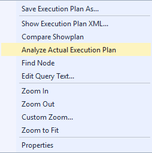
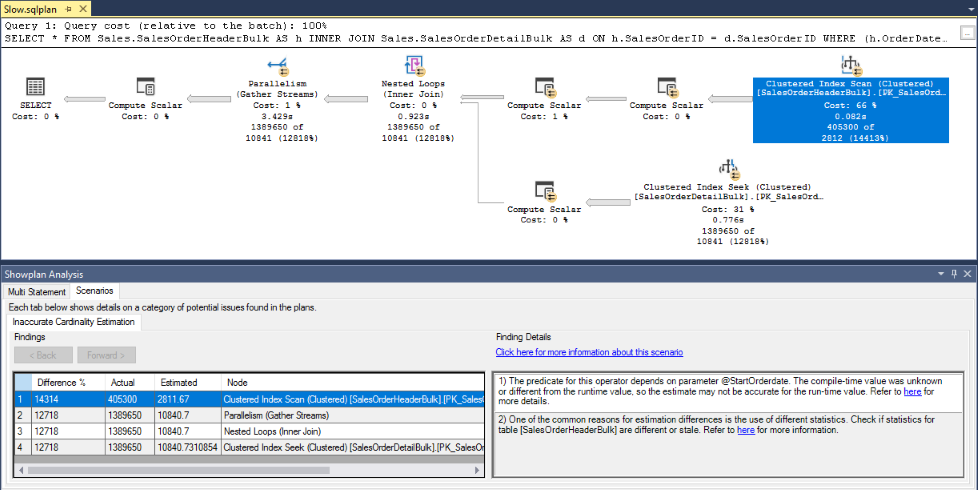

# Analyze an Actual Execution Plan

 [!INCLUDE [SQL Server](../../includes/applies-to-version/sqlserver.md)]

This topic describes how you can analyze actual graphical execution plans by using [!INCLUDE[ssManStudioFull](../../includes/ssmanstudiofull-md.md)] Plan Analysis feature. This feature is available starting with [!INCLUDE[ssManStudioFull](../../includes/ssmanstudiofull-md.md)] v17.4. We generally recommend that you [install the latest version of SSMS](../../ssms/download-sql-server-management-studio-ssms.md).

> [!NOTE]
> Actual execution plans are generated after the [!INCLUDE[tsql](../../includes/tsql-md.md)] queries or batches execute. Because of this, an actual execution plan contains runtime information, such as actual number of rows, resource usage metrics and runtime warnings (if any). For more information, see [Display an Actual Execution Plan](../../relational-databases/performance/display-an-actual-execution-plan.md).
  
Query performance troubleshooting requires significant expertise in understanding query processing and execution plans, in order to be able to actually find and fix root causes.

[!INCLUDE[ssManStudioFull](../../includes/ssmanstudiofull-md.md)] includes functionality that implements some degree of automation in the task of actual execution plan analysis, especially for large and complex plans. The goal is to make it easier to find scenarios of inaccurate [Cardinality Estimation](../../relational-databases/performance/cardinality-estimation-sql-server.md) and get recommendations on which possible mitigations may be available.

> [!IMPORTANT]
> Ensure proper testing of proposed mitigations before applying them on production environments.
  
## To analyze an execution plan for a query  
  
1.  Open a previously saved query execution plan file (.sqlplan) using the **File** menu and clicking on **Open File**, or drag a plan file to [!INCLUDE[ssManStudio](../../includes/ssManStudio-md.md)] window. Alternatively, if you just executed a query and chose to display its execution plan, move to the **Execution Plan** tab in the results pane. 

2.  Right-click in a blank area of the execution plan and click **Analyze Actual Execution Plan**. 

       

3.  The **Showplan Analysis** window opens on the bottom. The **Multi Statement** tab is useful when analyzing plans with multiple statements, by allowing the right statement to be analyzed.

4.  Select the Scenarios tab to see details on the issues found for the actual execution plan. For each listed operator on the left pane, the right pane shows details about the scenario in the *Click here for more information about this scenario* link, and possible reasons to explain that scenario are listed.

     
