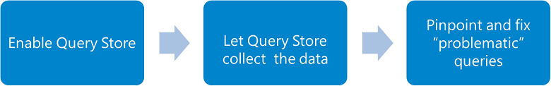
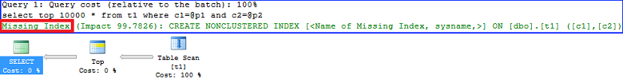

# Best practices for monitoring workloads with Query Store

[!INCLUDE [SQL Server ASDB, ASDBMI](../../includes/applies-to-version/sql-asdb-asdbmi.md)]

This article outlines the best practices for using [!INCLUDE[ssNoVersion](../../includes/ssnoversion-md.md)] Query Store with your workload.

- For more information on configuring and administering with the Query Store, see [Monitoring performance by using the Query Store](monitoring-performance-by-using-the-query-store.md).
- For information on discovering actionable information and tune performance with the Query Store, see [Tuning performance by using the Query Store](tune-performance-with-the-query-store.md).
- For information about operating the Query Store in Azure [!INCLUDE[ssSDS](../../includes/sssds-md.md)], see [Operating the Query Store in Azure SQL Database](best-practice-with-the-query-store.md#Insight).
- In Azure Synapse Analytics, Query Store is not enabled by default for dedicated SQL pools, but can be enabled. Further configuration options for Query Store are not supported. For more information, see [Historical query storage and analysis in Azure Synapse Analytics](/azure/synapse-analytics/sql/query-history-storage-analysis).

## <a name="SSMS"></a> Use the latest [!INCLUDE[ssManStudioFull](../../includes/ssmanstudiofull-md.md)]

[!INCLUDE[ssManStudioFull](../../includes/ssmanstudiofull-md.md)] has a set of user interfaces designed for configuring Query Store and for consuming collected data about your workload. [Download the latest version of [!INCLUDE[ssManStudioFull](../../includes/ssmanstudiofull-md.md)]](../../ssms/download-sql-server-management-studio-ssms.md).

For a quick description on how to use Query Store in troubleshooting scenarios, see [Query Store @Azure blogs](https://azure.microsoft.com/blog/query-store-a-flight-data-recorder-for-your-database/).

## <a name="Insight"></a> Use Query Performance Insight in Azure SQL Database

If you run Query Store in [!INCLUDE[ssSDSfull](../../includes/sssdsfull-md.md)], you can use [Query Performance Insight](/azure/sql-database/sql-database-query-performance) to analyze resource consumption over time. While you can use [!INCLUDE[ssManStudio](../../includes/ssmanstudio-md.md)] and [Azure Data Studio](../../azure-data-studio/what-is-azure-data-studio.md) to get detailed resource consumption for all your queries, such as CPU, memory, and I/O, Query Performance Insight gives you a quick and efficient way to determine their impact on overall DTU consumption for your database. For more information, see [Azure SQL Database Query Performance Insight](/azure/azure-sql/database/query-performance-insight-use).

## Use Query Store with Elastic Pool databases

You can use Query Store in all databases without concerns, in even densely packed Azure SQL Database elastic pools. All previous issues related to excessive resource usage that might have occurred when Query Store was enabled for the large number of databases in the elastic pools have been resolved.

## Start with query performance troubleshooting

The troubleshooting workflow with Query Store is simple, as shown in the following diagram:



Enable Query Store by using [!INCLUDE[ssManStudio](../../includes/ssmanstudio-md.md)], as described in the previous section, or execute the following [!INCLUDE[tsql](../../includes/tsql-md.md)] statement:

```sql
ALTER DATABASE [DatabaseOne] SET QUERY_STORE = ON;
```

It takes some time until Query Store collects the data set that accurately represents your workload. Usually, one day is enough even for very complex workloads. However, you can start exploring the data and identify queries that need your attention immediately after you enable the feature. Go to the Query Store subfolder under the database node in Object Explorer of [!INCLUDE[ssManStudio](../../includes/ssmanstudio-md.md)] to open troubleshooting views for specific scenarios.

[!INCLUDE[ssManStudio](../../includes/ssmanstudio-md.md)] Query Store views operate with the set of execution metrics, each expressed as any of the following statistic functions:

|[!INCLUDE[ssNoVersion](../../includes/ssnoversion-md.md)] version|Execution metric|Statistic function|
|----------------------|----------------------|------------------------|
|[!INCLUDE[sssql16-md](../../includes/sssql16-md.md)]|CPU time, Duration, Execution count, Logical reads, Logical writes, Memory consumption, Physical reads, CLR time, Degree of parallelism (DOP), and Row count|Average, Maximum, Minimum, Standard Deviation, Total|
|[!INCLUDE[ssSQL17](../../includes/sssql17-md.md)]|CPU time, Duration, Execution count, Logical reads, Logical writes, Memory consumption, Physical reads, CLR time, Degree of parallelism, Row count, Log memory, TempDB memory, and Wait times|Average, Maximum, Minimum, Standard Deviation, Total|

The following graphic shows how to locate Query Store views:


The following table explains when to use each of the Query Store views:

|[!INCLUDE[ssNoVersion](../../includes/ssnoversion-md.md)] Management Studio view|Scenario|
|---------------|--------------|
|**Regressed Queries**|Pinpoint queries for which execution metrics have recently regressed (for example, changed to worse). <br />Use this view to correlate observed performance problems in your application with the actual queries that need to be fixed or improved.|
|**Overall Resource Consumption**|Analyze the total resource consumption for the database for any of the execution metrics.<br />Use this view to identify resource patterns (daily vs. nightly workloads) and optimize overall consumption for your database.|
|**Top Resource Consuming Queries**|Choose an execution metric of interest, and identify queries that had the most extreme values for a provided time interval. <br />Use this view to focus your attention on the most relevant queries that have the biggest impact to database resource consumption.|
|**Queries With Forced Plans**|Lists previously forced plans using Query Store. <br />Use this view to quickly access all currently forced plans.|
|**Queries With High Variation**|Analyze queries with high-execution variation as it relates to any of the available dimensions, such as Duration, CPU time, IO, and Memory usage, in the desired time interval.<br />Use this view to identify queries with widely variant performance that can be affecting user experience across your applications.|
|**Query Wait Statistics**|Analyze wait categories that are most active in a database and which queries contribute most to the selected wait category.<br />Use this view to analyze wait statistics and identify queries that might be affecting user experience across your applications.<br /><br />Applies to: Starting with [!INCLUDE[ssManStudioFull](../../includes/ssmanstudiofull-md.md)] v18.0 and [!INCLUDE[ssSQL17](../../includes/sssql17-md.md)].|
|**Tracked Queries**|Track the execution of the most important queries in real time. Typically, you use this view when you have queries with forced plans and you want to make sure that query performance is stable.|

> [!TIP]
> For a detailed description of how to use [!INCLUDE[ssManStudio](../../includes/ssmanstudio-md.md)] to identify the top resource-consuming queries and fix those that regressed due to the change of a plan choice, see [Query Store @Azure Blogs](https://azure.microsoft.com/blog/query-store-a-flight-data-recorder-for-your-database/).

When you identify a query with suboptimal performance, your action depends on the nature of the problem.

- If the query was executed with multiple plans and the last plan is significantly worse than the previous plan, you can use the plan forcing mechanism to force it. [!INCLUDE[ssNoVersion](../../includes/ssnoversion-md.md)] tries to force the plan in the optimizer. If plan forcing fails, an XEvent is fired and the optimizer is instructed to optimize in the normal way.

  

  > [!NOTE]
  > The previous graphic might feature different shapes for specific query plans, with the following meanings for each possible status:<br />
  >
  > |Shape|Meaning|
  > |-------------------|-------------|
  > |Circle|Query completed, which means that a regular execution successfully finished.|
  > |Square|Cancelled, which means that a client-initiated aborted execution.|
  > |Triangle|Failed, which means that an exception aborted execution.|
  >
  > Also, the size of the shape reflects the query execution count within the specified time interval. The size increases with a higher number of executions.

- You might conclude that your query is missing an index for optimal execution. This information is surfaced within the query execution plan. Create the missing index, and check the query performance by usingQuery Store.

   

If you run your workload on [!INCLUDE[ssSDS](../../includes/sssds-md.md)], sign up for [!INCLUDE[ssSDS](../../includes/sssds-md.md)] Index Advisor to automatically receive index recommendations.

- In some cases, you might enforce statistic recompilation if you see that the difference between the estimated and the actual number of rows in the execution plan is significant.
- Rewrite problematic queries, for example, to take advantage of query parameterization or to implement more optimal logic.

> [!TIP]
> In [!INCLUDE[ssSDSfull](../../includes/sssdsfull-md.md)], consider the [Query Store hints](query-store-hints.md) feature for forcing query hints on queries without code changes. For more information and examples, see [Query Store hints](query-store-hints.md).

## <a name="Verify"></a> Verify that Query Store collects query data continuously

Query Store can silently change the operation mode. Regularly monitor the state of Query Store to ensure that Query Store is operating, and to take action to avoid failures due to preventable causes. Execute the following query to determine the operation mode and view the most relevant parameters:

```sql
USE [QueryStoreDB];
GO

SELECT actual_state_desc, desired_state_desc, current_storage_size_mb,
    max_storage_size_mb, readonly_reason, interval_length_minutes,
    stale_query_threshold_days, size_based_cleanup_mode_desc,
    query_capture_mode_desc
FROM sys.database_query_store_options;
```

The difference between the `actual_state_desc` and `desired_state_desc` indicates that a change of the operation mode occurred automatically. The most common change is for Query Store to silently switch to read-only mode. In extremely rare circumstances, Query Store can end up in the [ERROR state](#error-state) because of internal errors.

When the actual state is read-only, use the `readonly_reason` column to determine the root cause. Typically, you find that Query Store transitioned to read-only mode because the size quota was exceeded. In that case, the `readonly_reason` is set to 65536. For other reasons, see [sys.database_query_store_options &#40;Transact-SQL&#41;](../../relational-databases/system-catalog-views/sys-database-query-store-options-transact-sql.md).

Consider the following steps to switch Query Store to read-write mode and activate data collection:

- Increase the maximum storage size by using the **MAX_STORAGE_SIZE_MB** option of `ALTER DATABASE`.
- Clean up Query Store data by using the following statement:

  ```sql
  ALTER DATABASE [QueryStoreDB] SET QUERY_STORE CLEAR;
  ```

You can apply one or both of these steps by executing the following statement that explicitly changes the operation mode back to read-write:

```sql
ALTER DATABASE [QueryStoreDB]
SET QUERY_STORE (OPERATION_MODE = READ_WRITE);
```

Take the following steps to be proactive:

- You can prevent silent changes of operation mode by applying best practices. Ensure that Query Store size is always below the maximally allowed value to dramatically reduce a chance of transitioning to read-only mode. Activate size-based policy as described in the [Configure Query Store](#Configure) section so that Query Store automatically cleans data when the size approaches the limit.
- To make sure that most recent data is retained, configure time-based policy to remove stale information regularly.
- Finally, consider setting **Query Store Capture Mode** to **Auto** because it filters out queries that are usually less relevant for your workload.

### ERROR state

To recover Query Store, try explicitly setting the read-write mode and check the actual state again.

```sql
ALTER DATABASE [QueryStoreDB]
SET QUERY_STORE (OPERATION_MODE = READ_WRITE);
GO

SELECT actual_state_desc, desired_state_desc, current_storage_size_mb,
    max_storage_size_mb, readonly_reason, interval_length_minutes,
    stale_query_threshold_days, size_based_cleanup_mode_desc,
    query_capture_mode_desc
FROM sys.database_query_store_options;
```

If the problem persists, it indicates that corruption of Query Store data is persisted on the disk.

Starting with [!INCLUDE[ssSQL17](../../includes/sssql17-md.md)], Query Store can be recovered by executing the `sys.sp_query_store_consistency_check` stored procedure within the affected database. Query Store must be disabled before you attempt the recovery operation. Here is a sample query to use or modify to accomplish the consistency check and recovery of QDS:

```sql
IF EXISTS (SELECT * FROM sys.database_query_store_options WHERE actual_state=3) 
BEGIN
  BEGIN TRY
    ALTER DATABASE [QDS] SET QUERY_STORE = OFF
    Exec [QDS].dbo.sp_query_store_consistency_check
    ALTER DATABASE [QDS] SET QUERY_STORE = ON
    ALTER DATABASE [QDS] SET QUERY_STORE (OPERATION_MODE = READ_WRITE)
  END TRY
 
  BEGIN CATCH 
    SELECT  
      ERROR_NUMBER() AS ErrorNumber  
      ,ERROR_SEVERITY() AS ErrorSeverity  
      ,ERROR_STATE() AS ErrorState  
      ,ERROR_PROCEDURE() AS ErrorProcedure  
      ,ERROR_LINE() AS ErrorLine  
      ,ERROR_MESSAGE() AS ErrorMessage; 
  END CATCH;   
END
```


For [!INCLUDE[sssql16-md](../../includes/sssql16-md.md)], you need to clear the data from Query Store as shown.

If the recovery was unsuccessful, you can try clearing Query Store before you set the read-write mode.

```sql
ALTER DATABASE [QueryStoreDB]
SET QUERY_STORE CLEAR;
GO

ALTER DATABASE [QueryStoreDB]
SET QUERY_STORE (OPERATION_MODE = READ_WRITE);
GO

SELECT actual_state_desc, desired_state_desc, current_storage_size_mb,
    max_storage_size_mb, readonly_reason, interval_length_minutes,
    stale_query_threshold_days, size_based_cleanup_mode_desc,
    query_capture_mode_desc
FROM sys.database_query_store_options;
```
## <a name="Parameterize"></a> Avoid using non-parameterized queries

Using non-parameterized queries when that isn't necessary isn't a best practice. An example is in the case of ad-hoc analysis. Cached plans can't be reused, which forces Query Optimizer to compile queries for every unique query text. For more information, see [Guidelines for using forced parameterization](../../relational-databases/query-processing-architecture-guide.md#forced-parameterization).

Also, Query Store can rapidly exceed the size quota because of a potentially large number of different query texts and consequently a large number of different execution plans with similar shape. As a result, performance of your workload is suboptimal, and Query Store might switch to read-only mode or constantly delete data to try to keep up with the incoming queries.

Consider the following options:

- Parameterize queries where applicable. For example, wrap queries inside a stored procedure or `sp_executesql`. For more information, see [Parameters and execution plan reuse](../../relational-databases/query-processing-architecture-guide.md#parameters-and-execution-plan-reuse).
- Use the [optimize for ad hoc workloads](../../database-engine/configure-windows/optimize-for-ad-hoc-workloads-server-configuration-option.md) option if your workload contains many single-use ad-hoc batches with different query plans.
  - Compare the number of distinct query_hash values with the total number of entries in `sys.query_store_query`. If the ratio is close to 1, your ad-hoc workload generates different queries.
- Apply [forced parameterization](../../relational-databases/query-processing-architecture-guide.md#forced-parameterization) for the database or for a subset of queries if the number of different query plans isn't large.
  - Use a [plan guide](../../relational-databases/performance/specify-query-parameterization-behavior-by-using-plan-guides.md) to force parameterization only for the selected query.
  - Configure forced parameterization by using the [parameterization database option](../../relational-databases/databases/database-properties-options-page.md#miscellaneous) command, if there are a small number of different query plans in your workload. An example is when the ratio between the count of distinct query_hash and the total number of entries in `sys.query_store_query` is much less than 1.
- Set QUERY_CAPTURE_MODE to AUTO to automatically filter out ad-hoc queries with small resource consumption.

> [!TIP]
> When using an Object-Relational Mapping (ORM) solution such as Entity Framework (EF), application queries like manual LINQ query trees or certain raw SQL queries may not be parameterized, which impacts plan re-use and the ability to track queries in the Query Store. For more information, see [EF Query caching and parameterization](/ef/core/performance/advanced-performance-topics) and [EF Raw SQL Queries](/ef/core/querying/raw-sql).

### Find non-parameterized queries in Query Store

You can find the number of plans stored in Query Store using the below query, using query store DMVs, in [!INCLUDE[ssNoVersion](../../includes/ssnoversion-md.md)], [!INCLUDE[ssazuremi_md](../../includes/ssazuremi_md.md)], or [!INCLUDE[ssSDSfull](../../includes/sssdsfull-md.md)]:

```sql
SELECT count(Pl.plan_id) AS plan_count, Qry.query_hash, Txt.query_text_id, Txt.query_sql_text
FROM sys.query_store_plan AS Pl
INNER JOIN sys.query_store_query AS Qry
    ON Pl.query_id = Qry.query_id
INNER JOIN sys.query_store_query_text AS Txt
    ON Qry.query_text_id = Txt.query_text_id
GROUP BY Qry.query_hash, Txt.query_text_id, Txt.query_sql_text
ORDER BY plan_count desc;
```

The following sample creates an [Extended Events session](../extended-events/extended-events.md) to capture the event `query_store_db_diagnostics`, which can be useful in diagnosing query resource consumption. In [!INCLUDE[ssNoVersion](../../includes/ssnoversion-md.md)], this extended event session creates an event file in the SQL Server Log folder by default. For example, in a default [!INCLUDE[sssql19-md](../../includes/sssql19-md.md)] installation on Windows, the event file (.xel file) should be created in the folder `C:\Program Files\Microsoft SQL Server\MSSQL15.MSSQLSERVER\MSSQL\Log`. For [!INCLUDE[ssazuremi_md](../../includes/ssazuremi_md.md)], specify an Azure Blob Storage location instead. For more information, see [XEvent event_file for Azure SQL Managed Instance](/azure/azure-sql/database/xevent-code-event-file#phase-2-transact-sql-code-that-uses-azure-storage-container). The event 'qds.query_store_db_diagnostics' is not available for [!INCLUDE[ssSDSfull](../../includes/sssdsfull-md.md)].  


```sql
CREATE EVENT SESSION [QueryStore_Troubleshoot] ON SERVER 
ADD EVENT qds.query_store_db_diagnostics(
      ACTION(sqlos.system_thread_id,sqlos.task_address,sqlos.task_time,sqlserver.database_id,sqlserver.database_name))
ADD TARGET package0.event_file(SET filename=N'QueryStore',max_file_size=(100))
WITH (MAX_MEMORY=4096 KB,EVENT_RETENTION_MODE=ALLOW_SINGLE_EVENT_LOSS,MAX_DISPATCH_LATENCY=30 SECONDS,MAX_EVENT_SIZE=0 KB,MEMORY_PARTITION_MODE=NONE,TRACK_CAUSALITY=OFF,STARTUP_STATE=OFF);
```

With this data you can find plan count in the Query Store, and also many other stats as well. Look for the `plan_count`, `query_count`, `max_stmt_hash_map_size_kb`, and `max_size_mb` columns in the event data, in order to understand the amount of memory used and number of plans that are tracked by Query Store. If the plan count is higher than normal, it may indicate an increase in non-parameterized queries. Use the below Query Store DMVs query to review the parameterized queries and non-parameterized queries in the Query Store.

For parameterized queries:

```sql
SELECT qsq.query_id, qsqt.query_sql_text
FROM sys.query_store_query AS qsq 
INNER JOIN sys.query_store_query_text AS qsqt
ON qsq.query_text_id= qsqt.query_text_id 
WHERE qsq.query_parameterization_type<>0 or qsqt.query_sql_text like '%@%';
```

For non-parameterized queries:

```sql
SELECT qsq.query_id, qsqt.query_sql_text
FROM sys.query_store_query AS qsq 
INNER JOIN sys.query_store_query_text AS qsqt
ON qsq.query_text_id= qsqt.query_text_id 
WHERE query_parameterization_type=0;
```

## <a name="Drop"></a> Avoid a DROP and CREATE pattern for containing objects

Query Store associates query entry with a containing object, such as stored procedure, function, and trigger. When you re-create a containing object, a new query entry is generated for the same query text. This prevents you from tracking performance statistics for that query over time and using a plan forcing mechanism. To avoid this situation, use the `ALTER <object>` process to change a containing object definition whenever it's possible.

## <a name="CheckForced"></a> Check the status of forced plans regularly

Plan forcing is a convenient mechanism to fix performance for the critical queries and make them more predictable. As with plan hints and plan guides, forcing a plan isn't a guarantee that it will be used in future executions. Typically, when database schema changes in a way that objects referenced by the execution plan are altered or dropped, plan forcing starts failing. In that case, [!INCLUDE[ssNoVersion](../../includes/ssnoversion-md.md)] falls back to query recompilation while the actual forcing failure reason is surfaced in [sys.query_store_plan](../../relational-databases/system-catalog-views/sys-query-store-plan-transact-sql.md). The following query returns information about forced plans:

```sql
USE [QueryStoreDB];
GO

SELECT p.plan_id, p.query_id, q.object_id as containing_object_id,
    force_failure_count, last_force_failure_reason_desc
FROM sys.query_store_plan AS p
JOIN sys.query_store_query AS q on p.query_id = q.query_id
WHERE is_forced_plan = 1;
```

For a full list of reasons, see [sys.query_store_plan](../../relational-databases/system-catalog-views/sys-query-store-plan-transact-sql.md). You can also use the **query_store_plan_forcing_failed** XEvent to track and troubleshoot plan forcing failures.

> [!TIP]
> In [!INCLUDE[ssSDSfull](../../includes/sssdsfull-md.md)], consider the [Query Store hints](query-store-hints.md) feature for forcing query hints on queries without code changes. For more information and examples, see [Query Store hints](query-store-hints.md).


## <a name="Renaming"></a> Avoid renaming databases for queries with forced plans

Execution plans reference objects by using three-part names like `database.schema.object`.

If you rename a database, plan forcing fails, which causes recompilation in all subsequent query executions.

## <a name="Recovery"></a> Use Query Store in mission-critical servers

The global trace flags 7745 and 7752 can be used to improve availability of databases by using Query Store. For more information, see [Trace flags](../../t-sql/database-console-commands/dbcc-traceon-trace-flags-transact-sql.md).

- Trace flag 7745 prevents the default behavior where Query Store writes data to disk before [!INCLUDE[ssNoVersion](../../includes/ssnoversion-md.md)] can be shut down. This means that Query Store data that has been collected but not yet persisted to disk will be lost, up to the time window defined with `DATA_FLUSH_INTERVAL_SECONDS`.
- Trace flag 7752 enables asynchronous load of Query Store. This allows a database to become online and queries to be executed before Query Store has been fully recovered. The default behavior is to do a synchronous load of Query Store. The default behavior prevents queries from executing before Query Store has been recovered but also prevents any queries from being missed in the data collection.

> [!NOTE]
> Starting with [!INCLUDE[sql-server-2019](../../includes/sssql19-md.md)], this behavior is controlled by the engine, and trace flag 7752 has no effect.

> [!IMPORTANT]
> If you're using Query Store for just-in-time workload insights in [!INCLUDE[sssql16-md](../../includes/sssql16-md.md)], plan to install the performance scalability improvements in [!INCLUDE[sssql16-md](../../includes/sssql16-md.md)] SP2 CU2 ([KB 4340759](https://support.microsoft.com/help/4340759)) as soon as possible. Without these improvements, when the database is under heavy workloads, spinlock contention may occur and server performance may become slow. In particular, you may see heavy contention on the `QUERY_STORE_ASYNC_PERSIST` spinlock or `SPL_QUERY_STORE_STATS_COOKIE_CACHE` spinlock. After this improvement is applied, Query Store will no longer cause spinlock contention.

> [!IMPORTANT]
> If you're using Query Store for just-in-time workload insights in [!INCLUDE[ssNoVersion](../../includes/ssnoversion-md.md)] ([!INCLUDE[sssql16-md](../../includes/sssql16-md.md)] through [!INCLUDE[ssSQL17](../../includes/sssql17-md.md)]), plan to install the performance scalability improvement in [!INCLUDE[sssql16-md](../../includes/sssql16-md.md)] SP2 CU15, [!INCLUDE[ssSQL17](../../includes/sssql17-md.md)] CU23, and [!INCLUDE[sql-server-2019](../../includes/sssql19-md.md)] CU9 as soon as possible. Without this improvement, when the database is under heavy ad-hoc workloads, the Query Store may use a large amount of memory and server performance may become slow. After this improvement is applied, Query Store imposes internal limits to the amount of memory its various components can use, and can automatically change the operation mode to read-only until enough memory has been returned to the [!INCLUDE[ssde_md](../../includes/ssde_md.md)]. Note that Query Store internal memory limits are not documented because they are subject to change.  


## <a name="geosyncreplicas"></a> Using Query Store in Azure SQL Database active geo-replication

Query Store on a secondary active geo-replica of [!INCLUDE[ssSDSfull](../../includes/sssdsfull-md.md)] will be a read-only copy of the activity on the primary replica. 

Avoid mismatched tiers with [!INCLUDE[ssSDSfull](../../includes/sssdsfull-md.md)] geo-replication. A secondary database should be at or near the same compute size of the primary database, and in the same service tier of the primary database. Look for the HADR_THROTTLE_LOG_RATE_MISMATCHED_SLO wait type in [sys.dm_db_wait_stats](../system-dynamic-management-views/sys-dm-db-wait-stats-azure-sql-database.md) which indicates transaction log rate throttling on the primary replica due to secondary lag.

For more on estimating and configuring the size of the secondary Azure SQL database of active geo-replication, see [Configuring secondary database](/azure/azure-sql/database/active-geo-replication-overview#configuring-secondary-database).


## <a id="QueryStoreOptions"></a><a id="Configure"></a><a id="set-the-optimal-query-store-capture-mode"></a><a id="keep-the-most-relevant-data-in-query-store"></a>Keep Query Store adjusted to your workload

Best practices and recommendations for configuring and managing Query Store have been expanded in this article: [Best practices for managing the Query Store](manage-the-query-store.md).

## See also

 - [ALTER DATABASE SET options &#40;Transact-SQL&#41;](../../t-sql/statements/alter-database-transact-sql-set-options.md)
 - [Query Store catalog views &#40;Transact-SQL&#41;](../../relational-databases/system-catalog-views/query-store-catalog-views-transact-sql.md)
 - [Query Store stored procedures &#40;Transact-SQL&#41;](../../relational-databases/system-stored-procedures/query-store-stored-procedures-transact-sql.md)
 - [Use Query Store with In-Memory OLTP](../../relational-databases/performance/using-the-query-store-with-in-memory-oltp.md)
 - [Query processing architecture guide](../../relational-databases/query-processing-architecture-guide.md)
 - [Query Store Hints](query-store-hints.md)
 
## Next steps

 - [Monitoring performance by using the Query Store](monitoring-performance-by-using-the-query-store.md)
 - [Tuning performance by using the Query Store](tune-performance-with-the-query-store.md)
 - [Historical query storage and analysis in Azure Synapse Analytics](/azure/synapse-analytics/sql/query-history-storage-analysis)