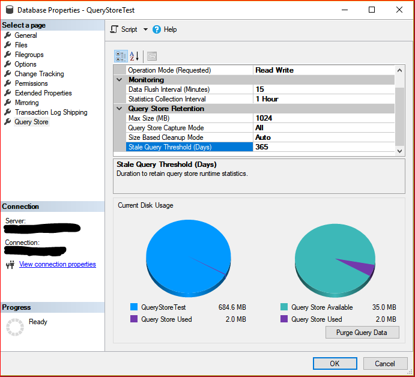

# Best Practice with the Query Store
[!INCLUDE[appliesto-ss-asdb-asdw-xxx-md](../../includes/appliesto-ss-asdb-asdw-xxx-md.md)]

  This article outlines the best practices for using the Query Store with your workload.  
  
##  <a name="SSMS"></a> Use the latest [!INCLUDE[ssManStudioFull](../../includes/ssmanstudiofull-md.md)]  
 [!INCLUDE[ssManStudioFull](../../includes/ssmanstudiofull-md.md)] has set of user interfaces designed for configuring Query Store as well as for consuming collected data about your workload.  
Download the latest version of [!INCLUDE[ssManStudio](../../includes/ssmanstudio-md.md)] [here](https://docs.microsoft.com/sql/ssms/download-sql-server-management-studio-ssms).  
  
 For a quick description on how to use Query Store in troubleshooting scenarios refer to [Query Store @Azure Blogs](https://azure.microsoft.com/blog/query-store-a-flight-data-recorder-for-your-database/).  
  
##  <a name="Insight"></a> Use Query Performance Insight in Azure SQL Database  
 If you run Query Store in [!INCLUDE[ssSDS](../../includes/sssds-md.md)] you can use **Query Performance Insight** to analyze DTU consumption over time.  
While you can use [!INCLUDE[ssManStudio](../../includes/ssmanstudio-md.md)] to get detailed resource consumption for all your queries (CPU, memory, I/O, etc.), Query Performance Insight gives you a quick and efficient way to determine their impact on overall DTU consumption for your database.  
For more information, see [Azure SQL Database Query Performance Insight](https://azure.microsoft.com/documentation/articles/sql-database-query-performance/).    

##  Using Query Store with Elastic Pool Databases
You can use Query Store in all databases without concerns, in even densely packed pools. All issues related to excessive resource usage, that might have occurred when Query Store was enabled for the large number of databases in the Elastic Pools, have been resolved.

##  <a name="Configure"></a> Keep Query Store adjusted to your workload  
 Configure Query Store based on your workload and performance troubleshooting requirements.   
The default parameters are good enough to start, but you should monitor how Query Store behaves over time and adjust its configuration accordingly:  
  
   
  
 Here are guidelines to follow for setting parameter values:  
  
 **Max Size (MB):** Specifies the limit for the data space that Query Store will take inside your database. This is the most important setting that directly affects operation mode of the Query Store.  
  
 While Query Store collects queries, execution plans and statistics, its size in the database grows until this limit is reached. When that happens, Query Store automatically changes the operation mode to read-only and stops collecting new data, which means that your performance analysis is no longer accurate.  
  
 The default value (100 MB) may not be sufficient if your workload generates large number of different queries and plans or if you want to keep query history for a longer period of time. Keep track of current space usage and increase the Max Size (MB) to prevent Query Store from transitioning to read-only mode. Use [!INCLUDE[ssManStudio](../../includes/ssmanstudio-md.md)] or execute the following script to get the latest information about Query Store size:  
  
```sql 
USE [QueryStoreDB];  
GO  
  
SELECT actual_state_desc, desired_state_desc, current_storage_size_mb,   
    max_storage_size_mb, readonly_reason  
FROM sys.database_query_store_options;  
```  
  
 The following script sets a new Max Size (MB):  
  
```sql  
ALTER DATABASE [QueryStoreDB]  
SET QUERY_STORE (MAX_STORAGE_SIZE_MB = 1024);  
```  

 **Data Flush Interval:** Defines frequency in seconds to persist collected runtime statistics to disk (the default is 900 seconds, which is 15 minutes). Consider using higher value if your workload does not generates large number of different queries and plans, or if you can withstand longer time to persist data before a database shutdown. 
 
> [!NOTE]
> Using trace flag 7745 will prevent Query Store data from being written to disk in case of a failover or shutdown command. See the [Use trace flags on mission critical servers to improve recovery from disaster](#Recovery) section for more detail.

Use [!INCLUDE[ssManStudioFull](../../includes/ssmanstudiofull-md.md)] or [!INCLUDE[tsql](../../includes/tsql-md.md)] to set different value for Data Flush Interval:  
  
```sql  
ALTER DATABASE [QueryStoreDB] 
SET QUERY_STORE (DATA_FLUSH_INTERVAL_SECONDS = 900);  
```  

 **Statistics Collection Interval:** Defines level of granularity for the collected runtime statistic (the default is 60 minutes). Consider using lower value if you require finer granularity or less time to detect and mitigate issues but keep in mind that it will directly affect the size of Query Store data. Use [!INCLUDE[ssManStudioFull](../../includes/ssmanstudiofull-md.md)] or [!INCLUDE[tsql](../../includes/tsql-md.md)] to set different value for Statistics Collection Interval:  
  
```sql  
ALTER DATABASE [QueryStoreDB] 
SET QUERY_STORE (INTERVAL_LENGTH_MINUTES = 60);  
```  
  
 **Stale Query Threshold (Days):** Time-based cleanup policy that controls the retention period of persisted runtime statistics and inactive queries.  
By default, Query Store is configured to keep the data for 30 days which may be unnecessarily long for your scenario.  
  
 Avoid keeping historical data that you do not plan to use. This will reduce changes to read-only status. The size of Query Store data as well as the time to detect and mitigate the issue will be more predictable. Use [!INCLUDE[ssManStudio](../../includes/ssmanstudio-md.md)] or the following script to configure time-based cleanup policy:  
  
```sql  
ALTER DATABASE [QueryStoreDB]   
SET QUERY_STORE (CLEANUP_POLICY = (STALE_QUERY_THRESHOLD_DAYS = 90));  
```  
  
 **Size Based Cleanup Mode:** Specifies whether automatic data cleanup will take place when Query Store data size approaches the limit.  
  
 It is strongly recommended to activate size-based cleanup to makes sure that Query Store always runs in read-write mode and collects the latest data.  
  
```sql  
ALTER DATABASE [QueryStoreDB]   
SET QUERY_STORE (SIZE_BASED_CLEANUP_MODE = AUTO);  
```  
  
 **Query Store Capture Mode:** Specifies the query capture policy for the Query Store.  
  
-   **All** - Captures all queries. This is the default option.  
  
-   **Auto** - Infrequent queries and queries with insignificant compile and execution duration are ignored. Thresholds for execution count, compile and runtime duration are internally determined.  
  
-   **None** - Query Store stops capturing new queries.  
  
 The following script sets the Query Capture mode to Auto:  
  
```sql  
ALTER DATABASE [QueryStoreDB]   
SET QUERY_STORE (QUERY_CAPTURE_MODE = AUTO);  
```  
  
## How to start with query performance troubleshooting  
 Troubleshooting workflow with Query Store is simple, as shown on the following diagram:  
  
   
  
 Enable Query Store by using [!INCLUDE[ssManStudio](../../includes/ssmanstudio-md.md)] as described in the previous section, or execute the following [!INCLUDE[tsql](../../includes/tsql-md.md)] statement:  
  
```sql  
ALTER DATABASE [DatabaseOne] SET QUERY_STORE = ON;  
```  
  
 It will take some time until Query Store collects the data set that accurately represents your workload. Usually, one day is enough even for very complex workloads. However, you can start exploring the data and identify queries that need your attention immediately after you enabled the feature.   
Navigate to the Query Store sub-folder under the database node in Object Explorer of [!INCLUDE[ssManStudio](../../includes/ssmanstudio-md.md)] to open troubleshooting views for specific scenarios.   
[!INCLUDE[ssManStudio](../../includes/ssmanstudio-md.md)] Query Store views operate with the set of execution metrics, each expressed as any of the following statistic functions:  
  
|[!INCLUDE[ssNoVersion](../../includes/ssnoversion-md.md)] version|Execution metric|Statistic function|  
|----------------------|----------------------|------------------------|  
|[!INCLUDE[ssSQL15](../../includes/sssql15-md.md)]|CPU time, Duration, Execution Count, Logical Reads, Logical writes, Memory consumption, Physical Reads, CLR time, Degree of Parallelism (DOP), and Row count|Average, Maximum, Minimum, Standard Deviation, Total|
|[!INCLUDE[ssSQL17](../../includes/sssql17-md.md)]|CPU time, Duration, Execution Count, Logical Reads, Logical writes, Memory consumption, Physical Reads, CLR time, Degree of Parallelism (DOP), Row count, Log memory, TempDB memory, and Wait times|Average, Maximum, Minimum, Standard Deviation, Total|
  
 The following graphic shows how to locate Query Store views:  
  
   
  
 The following table explains when to use each of the Query Store views:  
  
|SSMS view|Scenario|  
|---------------|--------------|  
|Regressed Queries|Pinpoint queries for which execution metrics have recently regressed (i.e. changed to worse). <br />Use this view to correlate observed performance problems in your application with the actual queries that needs to be fixed or improved.|  
|Overall Resource Consumption|Analyze the total resource consumption for the database for any of the execution metrics.<br />Use this view to identify resource patterns (daily vs. nightly workloads) and optimize overall consumption for your database.|  
|Top Resource Consuming Queries|Choose an execution metric of interest and identify queries that had the most extreme values for a provided time interval. <br />Use this view to focus your attention on the most relevant queries which have the biggest impact to database resource consumption.|  
|Queries With Forced Plans|Lists previously forced plans using Query Store. <br />Use this view to quickly access all currently forced plans.|  
|Queries With High Variation|Analyze queries with high execution variation as it relates to any of the available dimensions, such as Duration, CPU time, IO, and Memory usage in the desired time interval.<br />Use this view to identify queries with widely variant performance that can be impacting user experience across your applications.|  
|Query Wait Statistics|Analyze wait categories that are most active in a database, and which queries contribute most to the selected wait category.<br />Use this view to analyze wait statistics and identify queries that may be impacting user experience across your applications.<br /><br />**Applies to:** Starting with [!INCLUDE[ssManStudioFull](../../includes/ssmanstudiofull-md.md)] v18.0 and [!INCLUDE[ssSQL17](../../includes/sssql17-md.md)]|  
|Tracked Queries|Track the execution of the most important queries in real time. Typically, you use this view when you have queries with forced plans and you want to make sure that query performance is stable.|
  
> [!TIP]
> For a detailed description how to use [!INCLUDE[ssManStudio](../../includes/ssmanstudio-md.md)] to identify the top resource consuming queries and fix those that regressed due to the change of a plan choice, see [Query Store @Azure Blogs](https://azure.microsoft.com/blog/query-store-a-flight-data-recorder-for-your-database/).  
  
 When you identify a query with sub-optimal performance, your action depends on the nature of the problem.  
  
-   If the query was executed with multiple plans and the last plan is significantly worse than previous plan, you can use the plan forcing mechanism to force it. [!INCLUDE[ssNoVersion](../../includes/ssnoversion-md.md)] tries to force the plan in the optimizer. If plan forcing fails, an XEvent is fired and the optimizer is instructed to optimize in the normal way. 
  
       

> [!NOTE]
> The above graphic may feature different shapes for specific query plans, with the following meanings for each possible status:<br />  
> |Shape|Meaning|  
> |-------------------|-------------|
> |Circle|Query Completed (Regular Execution successfully finished)|
> |Square|Cancelled (Client initiated aborted execution)|
> |Triangle|Failed (Exception aborted execution)|
> Also, the size of the shape reflects query execution count within the specified time interval, increasing in size with a higher number of executions.  

-   You may conclude that your query is missing an index for optimal execution. This information is surfaced within the query execution plan. Create the missing index and check the query performance using the Query Store.  
  
       
  
     If you run your workload on [!INCLUDE[ssSDS](../../includes/sssds-md.md)], sign up for [!INCLUDE[ssSDS](../../includes/sssds-md.md)] Index Advisor to automatically receive index recommendations.  
  
-   In some cases you may enforce statistic recompilation if you see that the difference between the estimated and the actual number of rows in the execution plan is significant.  
  
-   Rewrite problematic queries. For example to take advantages of query parameterization or to implement more optimal logic.  
  
##  <a name="Verify"></a> Verify Query Store is collecting query data continuously  
 Query Store can silently change operations mode. You should regularly monitor the state of the Query Store to ensure that the Query Store is operating, and to take action to avoid failures due to preventable causes. Execute the following query to determine the operation mode and view the most relevant parameters:  
  
```sql
USE [QueryStoreDB];  
GO  
  
SELECT actual_state_desc, desired_state_desc, current_storage_size_mb,   
    max_storage_size_mb, readonly_reason, interval_length_minutes,   
    stale_query_threshold_days, size_based_cleanup_mode_desc,   
    query_capture_mode_desc  
FROM sys.database_query_store_options;  
```  
  
 The difference between the `actual_state_desc` and `desired_state_desc` indicates that a change of operations mode occurred automatically. The most common change is for the Query Store to silently switch to read-only mode. In extremely rarely circumstances, Query Store can end up in the ERROR state because of internal errors.  
  
 When the actual state is read-only, use the **readonly_reason** column to determine the root cause. Typically you will find that Query Store transitioned to read-only mode because the size quota was exceeded. In that case the **readonly_reason** is set to 65536. For other reasons, see [sys.database_query_store_options &#40;Transact-SQL&#41;](../../relational-databases/system-catalog-views/sys-database-query-store-options-transact-sql.md).  
  
 Consider the following steps to switch Query Store to read-write mode and activate data collection:  
  
-   Increase the maximum storage size by using the **MAX_STORAGE_SIZE_MB** option of **ALTER DATABASE**.  
  
-   Clean up Query Store data by using the following statement:  
  
    ```sql  
    ALTER DATABASE [QueryStoreDB] SET QUERY_STORE CLEAR;  
    ```  
  
You can apply one or both of these steps by the executing the following statement that explicitly changes operation mode back to read-write:  
  
```sql  
ALTER DATABASE [QueryStoreDB]   
SET QUERY_STORE (OPERATION_MODE = READ_WRITE);  
```  
  
 Take the following steps to be proactive:  
  
-   You can prevent silent changes of operation mode by applying best practices. If you ensure that Query Store size is always below the maximally allowed value that will dramatically reduce a chance of transitioning to read-only mode. Activate size-based policy as described in the [Configure Query Store](#Configure) section, so that the Query Store automatically cleans data when the size approaches the limit.  
  
-   In order to make sure that most recent data is retained, configure time-based policy to remove stale information regularly.  
  
-   Finally, you should consider setting Query Capture Mode to Auto as it filters out queries that are usually less relevant for your workload.  
  
### Error State  
 To recover Query Store try explicitly setting the read-write mode and check actual state again.  
  
```sql  
ALTER DATABASE [QueryStoreDB]   
SET QUERY_STORE (OPERATION_MODE = READ_WRITE);    
GO  
  
SELECT actual_state_desc, desired_state_desc, current_storage_size_mb,   
    max_storage_size_mb, readonly_reason, interval_length_minutes,   
    stale_query_threshold_days, size_based_cleanup_mode_desc,   
    query_capture_mode_desc  
FROM sys.database_query_store_options;  
```  
  
 If the problem persists, it indicates corruption of the Query Store data is persisted on the disk.
 
 Query Store could be recovered by executing **sp_query_store_consistency_check** stored procedure within the affected database.
 
 If that did not help, you can try to clear Query Store before requesting read-write mode.  
  
```sql  
ALTER DATABASE [QueryStoreDB]   
SET QUERY_STORE CLEAR;  
GO  
  
ALTER DATABASE [QueryStoreDB]   
SET QUERY_STORE (OPERATION_MODE = READ_WRITE);    
GO  
  
SELECT actual_state_desc, desired_state_desc, current_storage_size_mb,   
    max_storage_size_mb, readonly_reason, interval_length_minutes,   
    stale_query_threshold_days, size_based_cleanup_mode_desc,   
    query_capture_mode_desc  
FROM sys.database_query_store_options;  
```  
  
## Set the optimal query capture mode  
 Keep the most relevant data in Query Store. The following table describes typical scenarios for each Query Capture Mode:  
  
|Query Capture Mode|Scenario|  
|------------------------|--------------|  
|All|Analyze your workload thoroughly in terms of all queries shapes and their execution frequencies and other statistics.<br /><br /> Identify new queries in your workload.<br /><br /> Detect if ad-hoc queries are used to identify opportunities for user or auto parameterization.|  
|Auto|Focus your attention on relevant and actionable queries; those queries that execute regularly or that have significant resource consumption.|  
|None|You have already captured the query set that you want to monitor in runtime and you want to eliminate the distractions  that other queries may introduce.<br /><br /> None is suitable for testing and bench-marking environments.<br /><br /> None is also appropriate for software vendors who ship Query Store configuration configured to monitor their application workload.<br /><br /> None should be used with caution as you might miss the opportunity to track and optimize important new queries. Avoid using None unless you have a specific scenario that requires it.|  
  
## Keep the most relevant data in Query Store  
 Configure the Query Store to contain only the relevant data and it will run continuously providing great troubleshooting experience with a minimal impact on your regular workload.  
The following table provides best practices:  
  
|Best Practice|Setting|  
|-------------------|-------------|  
|Limit retained historical data.|Configure time-based policy to activate auto-cleanup.|  
|Filter out non-relevant queries.|Configure Query Capture Mode to Auto.|  
|Delete less relevant queries when maximum size is reached.|Activate size-based cleanup policy.|  
  
##  <a name="Parameterize"></a> Avoid using non-parameterized queries  
Using non-parameterized queries when that is not absolutely necessary (for example in case of ad-hoc analysis) is not a best practice.  Cached plans cannot be reused which forces Query Optimizer to compile queries for every unique query text. For more information, see [Guidelines for Using Forced Parameterization](../../relational-databases/query-processing-architecture-guide.md#ForcedParamGuide).  
Also, Query Store can rapidly exceed the size quota because of potentially a large number of different query texts and consequently a large number of different execution plans with similar shape.  
As a result, performance of your workload will be sub-optimal and Query Store might switch to read-only mode or might be constantly deleting the data trying to keep up with the incoming queries.  
  
Consider following options:  

-   Parameterize queries where applicable, for example wrap queries inside a stored procedure or sp_executesql. For more information, see [Parameters and Execution Plan Reuse](../../relational-databases/query-processing-architecture-guide.md#PlanReuse).    
  
-   Use the [**Optimize for Ad Hoc Workloads**](../../database-engine/configure-windows/optimize-for-ad-hoc-workloads-server-configuration-option.md) option if your workload contains many single use ad-hoc batches with different query plans.  
  
    -   Compare the number of  distinct query_hash values with the total number of entries in sys.query_store_query. If the ratio is close to 1 your ad-hoc workload generates different queries.  
  
-   Apply [**forced parameterization**](../../relational-databases/query-processing-architecture-guide.md#ForcedParam), for the database or for a subset of queries if the number of different query plans is not large.  
  
    -   Use [plan guide](../../relational-databases/performance/specify-query-parameterization-behavior-by-using-plan-guides.md) to force parameterization only for the selected query.  
  
    -   Configure forced parameterization as using the [Parameterization database option](../../relational-databases/databases/database-properties-options-page.md#miscellaneous) command, if there are a small number of different query plans in your workload: when the ratio between the count of distinct query_hash and the total number of entries in sys.query_store_query is much less than 1.  
  
-   Set the **Query Capture Mode** to AUTO to automatically filter out ad-hoc queries with small resource consumption.  
  
##  <a name="Drop"></a> Avoid a DROP and CREATE pattern when maintaining containing objects for the queries  
Query Store associates query entry with a containing object (stored procedure, function, and trigger).  When you recreate a containing object, a new query entry will be generated for the same query text. This will prevent you from tracking performance statistics for that query over time and use plan forcing mechanism. To avoid this, use the `ALTER <object>` process to change a containing object definition whenever it is possible.  
  
##  <a name="CheckForced"></a> Check the status of Forced Plans regularly  

Plan forcing is a convenient mechanism to fix performance for the critical queries and make them more predictable. However, as with plan hints and plan guides, forcing a plan is not a guarantee that it will be used in future executions. Typically, when database schema changes in a way that objects referenced by the execution plan are altered or dropped, plan forcing will start failing. In that case [!INCLUDE[ssNoVersion](../../includes/ssnoversion-md.md)] falls back to query recompilation while the actual forcing failure reason is surfaced in [sys.query_store_plan](../../relational-databases/system-catalog-views/sys-query-store-plan-transact-sql.md). The following query returns information about forced plans:  
  
```sql  
USE [QueryStoreDB];  
GO  
  
SELECT p.plan_id, p.query_id, q.object_id as containing_object_id,  
    force_failure_count, last_force_failure_reason_desc  
FROM sys.query_store_plan AS p  
JOIN sys.query_store_query AS q on p.query_id = q.query_id  
WHERE is_forced_plan = 1;  
```  
  
 For full list of reasons, refer to [sys.query_store_plan](../../relational-databases/system-catalog-views/sys-query-store-plan-transact-sql.md). You can also use the **query_store_plan_forcing_failed** XEvent to track and troubleshoot plan forcing failures.  
  
##  <a name="Renaming"></a> Avoid renaming databases if you have queries with Forced Plans  

Execution plans reference objects using three-part names `database.schema.object`.   

If you rename a database, plan forcing will fail which will cause recompilation in all subsequent query executions.  

##  <a name="Recovery"></a> Use trace flags on mission critical servers
 
The global trace flags 7745 and 7752 can be used to improve availability of databases using Query Store. For more information, refer to [Trace Flags](../../t-sql/database-console-commands/dbcc-traceon-trace-flags-transact-sql.md).
  
-  Trace flag 7745 will prevent the default behavior where Query Store writes data to disk before [!INCLUDE[ssNoVersion](../../includes/ssnoversion-md.md)] can be shut down. This means that Query Store data that has been collected but not been yet persisted to disk will be lost. 
  
-  Trace flag 7752 enables asynchronous load of Query Store. This allows a database to become online and queries to be executed before the Query Store has been fully recovered. The default behavior is to do synchoronous load of Query Store. The default behavior prevents queries from executing before the Query Store has been recovered but also prevents any queries from being missed in the data collection.

> [!IMPORTANT]
> If you are using Query Store for just in time workload insights in [!INCLUDE[ssSQL15](../../includes/sssql15-md.md)], plan to install the performance scalability fixes in [KB 4340759](https://support.microsoft.com/help/4340759) as soon as possible. 

## See Also  
 [Query Store Catalog Views &#40;Transact-SQL&#41;](../../relational-databases/system-catalog-views/query-store-catalog-views-transact-sql.md)   
 [Query Store Stored Procedures &#40;Transact-SQL&#41;](../../relational-databases/system-stored-procedures/query-store-stored-procedures-transact-sql.md)   
 [Using the Query Store with In-Memory OLTP](../../relational-databases/performance/using-the-query-store-with-in-memory-oltp.md)   
 [Monitoring Performance By Using the Query Store](../../relational-databases/performance/monitoring-performance-by-using-the-query-store.md)     
 [Query Processing Architecture Guide](../../relational-databases/query-processing-architecture-guide.md)  
  
