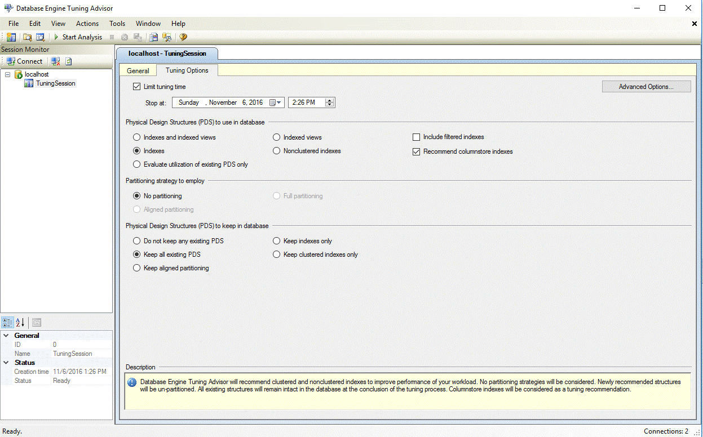
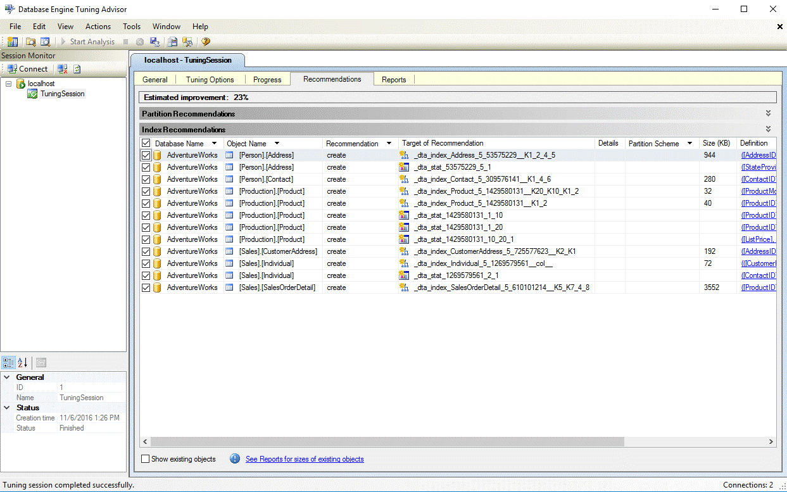
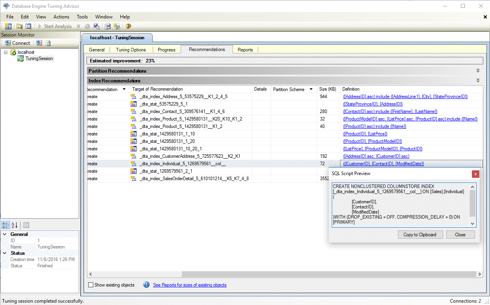

# Columnstore index recommendations in Database Engine Tuning Advisor (DTA)
[!INCLUDE[appliesto-ss-xxxx-xxxx-xxx-md](../../includes/appliesto-ss-xxxx-xxxx-xxx-md.md)]

 
  Data warehousing and analytic workloads can greatly benefit from [columnstore indexes](../../t-sql/statements/create-columnstore-index-transact-sql.md) as well as traditional rowstore indexes. The choice of which rowstore and columnstore indexes to build for your database is dependent on your application's workload. In SQL Server 2016, the [Database Engine Tuning Advisor (DTA)](../../relational-databases/performance/database-engine-tuning-advisor.md) can analyze your workload and recommend an appropriate combination of rowstore and columnstore indexes to build on the database. 
  
 This feature is available with SQL Server Management Studio version **16.4** or higher. 
  
## How to enable columnstore index recommendations in Database Engine Tuning Advisor GUI

  
  1. Launch Database Engine Tuning Advisor and open a new tuning session.
  
  2. Select database(s) and workload for tuning in the **General** pane.
  
  3. In the Tuning Options pane select the checkbox **Recommend columnstore indexes** (see figure below).
  
 
  4. Select other tuning options and click on **Start Analysis** button.
  
  5. Once tuning is complete,  view all recommendations including any columnstore indexes in the **Recommendations** pane (see figure below).      
  
  
  6. Click on the **Definition** hyperlink to view the SQL Data Definition Language (DDL) statement that can create the recommended index. By default, DTA uses the suffix **col** in the name of columnstore indexes to make it easier to identify columnstore indexes (see figure below).
   
  
  
  ## How to enable columnstore index recommendations in dta.exe Utility

To  enable columnstore recommendations when using dta.exe command line utility, use the **-fc** command line parameter.

For more information on dta.exe command line utility, see [dta Utility](../../tools/dta/dta-utility.md)

## See Also
[Columnstore Indexes Guide](../../relational-databases/indexes/columnstore-indexes-overview.md)       
[Database Engine Tuning Advisor](../../relational-databases/performance/database-engine-tuning-advisor.md)      
[Tutorial: Database Engine Tuning Advisor](Tutorial:%20Database%20Engine%20Tuning%20Advisor.md)

  

