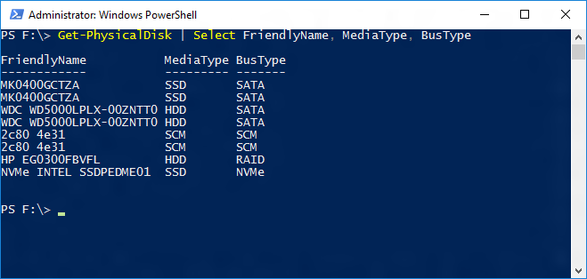
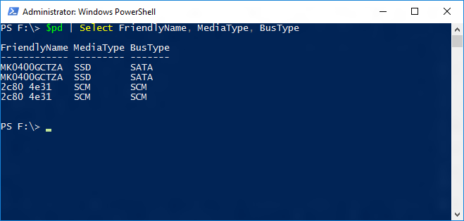
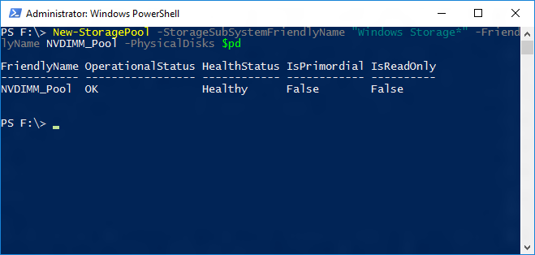
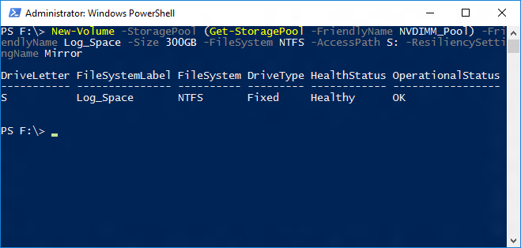
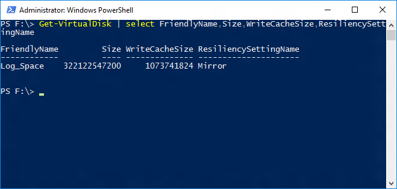
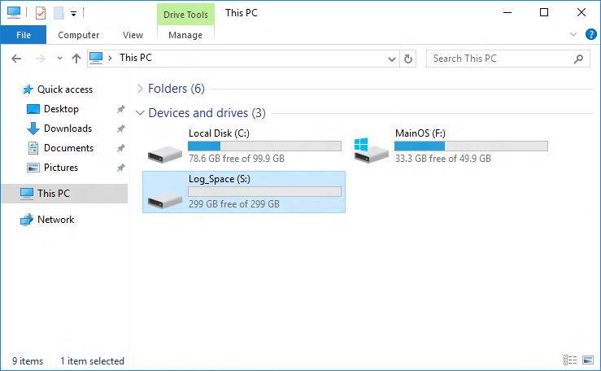

# Configuring Storage Spaces with a NVDIMM-N write-back cache
 [!INCLUDE [SQL Server](../../includes/applies-to-version/sqlserver.md)]
  Windows Server 2016 introduced support for NVDIMM-N devices that allow for extremely fast input/output (I/O) operations. One attractive way of using such devices is as a write-back cache to achieve low write latencies. This article discusses how to set up a mirrored storage space with a mirrored NVDIMM-N write-back cache as a virtual drive to store the SQL Server transaction log. If you are looking to utilize it to also store data tables or other data, you may include more disks in the storage pool, or create multiple pools, if isolation is important.  
    
## Identify the right disks  
 Setup of storage spaces in Windows Server 2016, especially with advanced features, such as write-back caches is most easily achieved through PowerShell. The first step is to identify which disks should be part of the Storage Spaces pool that the virtual disk will be created from. NVDIMM-Ns have a media type and bus-type of SCM (storage class memory), which can be queried via the `Get-PhysicalDisk` PowerShell cmdlet.  
  
```powershell  
Get-PhysicalDisk | Select FriendlyName, MediaType, BusType  
```  
  
   
  
> [!NOTE]  
>  With NVDIMM-N devices, you no longer need to specifically select the devices that can be write-back cache targets.  
  
 In order to build a mirrored virtual disk with mirrored write-back cache, at least two NVDIMM-Ns, and two other disks are needed. Assigning the desired physical disks to a variable before building the pool makes the process easier.  
  
```powershell  
$pd =  Get-PhysicalDisk | Select FriendlyName, MediaType, BusType | WHere-Object {$_.FriendlyName -like 'MK0*' -or $_.FriendlyName -like '2c80*'}  
```  
  
 The screenshot shows the $pd variable and the two SSDs and two NVDIMM-Ns it is assigned to returned using the following PowerShell cmdlet:
  
```powershell  
$pd | Select FriendlyName, MediaType, BusType  
```  
  
   
  
## Create the Storage Pool  
 Using the $pd variable containing the PhysicalDisks, it is easy to build the storage pool using the `New-StoragePool` PowerShell cmdlet.  
  
```powershell  
New-StoragePool -StorageSubSystemFriendlyName "Windows Storage*" -FriendlyName NVDIMM_Pool -PhysicalDisks $pd  
```  
  
   
  
## Create the Virtual Disk and Volume  
 Now that a pool has been created, the next step is to carve out a virtual disk and format it. In this case only one virtual disk will be created and the `New-Volume` PowerShell cmdlet can be used to streamline this process:  
  
```powershell  
New-Volume -StoragePool (Get-StoragePool -FriendlyName NVDIMM_Pool) -FriendlyName Log_Space -Size 300GB -FileSystem NTFS -AccessPath S: -ResiliencySettingName Mirror  
```  
  
   
  
 The virtual disk has been created, initialized, and formatted with NTFS. The screen capture below shows that it has a size of 300 GB and a write-cache size of 1 GB, which will be hosted on the NVDIMM-Ns.  
  
   
  
 You can now view this new volume visible in your server. You can now use this drive for your SQL Server transaction log.  
  
   
  
## Next Steps

 - [Windows Storage Spaces in Windows 10 and Windows 11](https://windows.microsoft.com/windows-10/storage-spaces-windows-10)   
 - [Windows Storage Spaces in Windows 2012 R2](/previous-versions/windows/it-pro/windows-server-2012-R2-and-2012/hh831739(v=ws.11))   
 - [The Transaction Log &#40;SQL Server&#41;](../../relational-databases/logs/the-transaction-log-sql-server.md)   
 - [View or Change the Default Locations for Data and Log Files &#40;SQL Server Management Studio&#41;](../../database-engine/configure-windows/view-or-change-the-default-locations-for-data-and-log-files.md)  
