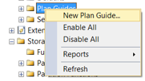
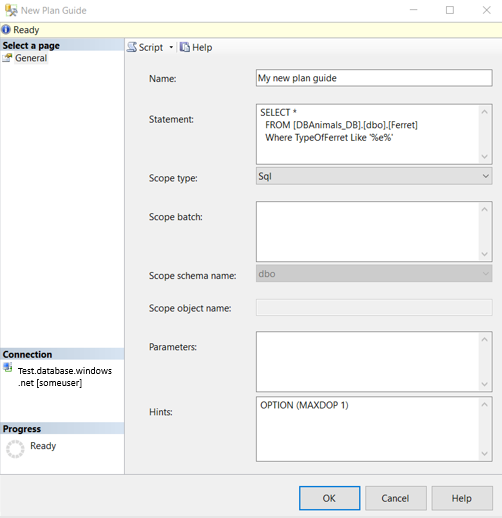

# Create a New Plan Guide
[!INCLUDE [SQL Server Azure SQL Database Azure SQL Managed Instance](../../includes/applies-to-version/sql-asdb-asdbmi.md)]
Plan guides influence query optimization by attaching query hints or a fixed query plan to them. In the plan guide, you specify the statement that you want optimized, and either an OPTION clause that contains query hints you want to use. or a specific query plan you want to use to optimize the query. When the query executes, the query optimizer matches the [!INCLUDE[tsql](../../includes/tsql-md.md)] statement to the plan guide and either attaches the OPTION clause to the query at run time or uses the specified query plan.  

A Plan Guide applies either a fixed query plan, and/or query hints, to a query.
  
##  <a name="Restrictions"></a> Limitations and restrictions  
-   The arguments to sp_create_plan_guide must be provided in the order that is shown. When you supply values for the parameters of **sp_create_plan_guide**, all parameter names must be specified explicitly, or none at all. For example, if **@name =** is specified, then **@stmt =** , **@type =**, and so on, must also be specified. Likewise, if **@name =** is omitted and only the parameter value is provided, the remaining parameter names must also be omitted, and only their values provided. Argument names are for descriptive purposes only, to help understand the syntax. [!INCLUDE[ssNoVersion](../../includes/ssnoversion-md.md)] does not verify that the specified parameter name matches the name for the parameter in the position where the name is used.  
  
-   You can create more than one OBJECT or SQL plan guide for the same query and batch or module. However, only one plan guide can be enabled at any given time.  
  
-   Plan guides of type OBJECT cannot be created for an @module_or_batch value that references a stored procedure, function, or DML trigger that specifies the WITH ENCRYPTION clause or that is temporary.  
  
-   Trying to drop or modify a function, stored procedure, or DML trigger that is referenced by a plan guide, either enabled or disabled, causes an error. Trying to drop a table that has a trigger defined on it that is referenced by a plan guide also causes an error.  

##  <a name="Permissions"></a> Permissions  
 To create a plan guide of type OBJECT, you need ALTER permission on the referenced object. To create a plan guide of type SQL or TEMPLATE, you need ALTER permission on the current database.  
  
##  <a name="SSMSProcedure"></a> Create a plan guide using SSMS  
1.  Click the plus sign to expand the database in which you want to create a plan guide, and then click the plus sign to expand the **Programmability** folder.  
  
2.  Right-click the **Plan Guides** folder and select **New Plan Guide...**.

  
3.  In the **New Plan Guide** dialog box, in the **Name** box, enter the name of the plan guide.  
  
4.  In the **Statement** box, enter the [!INCLUDE[tsql](../../includes/tsql-md.md)] statement against which the plan guide is to be applied.  
  
5.  In the **Scope type** list, select the type of entity in which the [!INCLUDE[tsql](../../includes/tsql-md.md)] statement appears. This specifies the context for matching the [!INCLUDE[tsql](../../includes/tsql-md.md)] statement to the plan guide. Possible values are **OBJECT**, **SQL**, and **TEMPLATE**.  
  
6.  In the **Scope batch** box, enter the batch text in which the [!INCLUDE[tsql](../../includes/tsql-md.md)] statement appears. The batch text cannot include a `USE`*database* statement. The **Scope batch** box is only available when **SQL** is selected as a scope type. If nothing is entered in the scope batch box when SQL is the scope type, then the value of the batch text is set to the same value as is in the **Statement** box.  
  
7.  In the **Scope schema name** list, enter the name of the schema in which the object is contained. The **Scope schema name** box is only available when **Object** is selected as a scope type.  
  
8.  In the **Scope object name** box, enter the name of the [!INCLUDE[tsql](../../includes/tsql-md.md)] stored procedure, user-defined scalar function, multistatement table-valued function, or DML trigger in which the [!INCLUDE[tsql](../../includes/tsql-md.md)] statement appears. The **Scope object name** box is only available when **Object** is selected as a scope type.  
  
9. In the **Parameters** box, enter the parameter name and data type of all parameters that are embedded in the [!INCLUDE[tsql](../../includes/tsql-md.md)] statement.  
  
   Parameters apply only when either of the following is true:  
  
   -   The scope type is **SQL** or **TEMPLATE**. If **TEMPLATE**, parameters must not be NULL.  
  
   -   The [!INCLUDE[tsql](../../includes/tsql-md.md)] statement is submitted by using sp_executesql and a value for the parameter is specified, or [!INCLUDE[ssNoVersion](../../includes/ssnoversion-md.md)] internally submits a statement after parameterizing it.  
  
10. In the **Hints** box, enter the query hints or query plan to be applied to the [!INCLUDE[tsql](../../includes/tsql-md.md)] statement. To specify one or more query hints, enter a valid OPTION clause.  
  
11. Click **OK**.  

  

##  <a name="TsqlProcedure"></a> Create a plan guide using T-SQL  
1.  In **Object Explorer**, connect to an instance of [!INCLUDE[ssDE](../../includes/ssde-md.md)].  
  
2.  On the Standard bar, click **New Query**.  
  
3.  Copy and paste the following example into the query window and click **Execute**.  
  
    ```sql  
    -- creates a plan guide named Guide1 based on a SQL statement  
    EXEC sp_create_plan_guide   
        @name = N'Guide1',   
        @stmt = N'SELECT TOP 1 *   
                  FROM Sales.SalesOrderHeader   
                  ORDER BY OrderDate DESC',   
        @type = N'SQL',  
        @module_or_batch = NULL,   
        @params = NULL,   
        @hints = N'OPTION (MAXDOP 1)';  
  
    ```  

For more information, see [sp_create_plan_guide &#40;Transact-SQL&#41;](../../relational-databases/system-stored-procedures/sp-create-plan-guide-transact-sql.md).  

  
