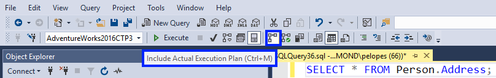

# Display an Actual Execution Plan
[!INCLUDE[appliesto-ss-asdb-xxxx-xxx-md](../../includes/appliesto-ss-asdb-xxxx-xxx-md.md)]
  This topic describes how to generate actual graphical execution plans by using [!INCLUDE[ssManStudioFull](../../includes/ssmanstudiofull-md.md)]. Actual execution plans are generated after the [!INCLUDE[tsql](../../includes/tsql-md.md)] queries or batches execute. Because of this, an actual execution plan contains runtime information, such as actual resource usage metrics and runtime warnings (if any). The execution plan that is generated displays the actual query execution plan that the [!INCLUDE[ssDEnoversion](../../includes/ssdenoversion-md.md)] used to execute the queries.  
  
 To use this feature, users must have the appropriate permissions to execute the [!INCLUDE[tsql](../../includes/tsql-md.md)] queries for which a graphical execution plan is being generated, and they must be granted the SHOWPLAN permission for all databases referenced by the query.  
  
## To include an execution plan for a query during execution  
  
1.  On the [!INCLUDE[ssManStudioFull](../../includes/ssmanstudiofull-md.md)] toolbar, click **Database Engine Query**. You can also open an existing query and display the estimated execution plan by clicking the **Open File** toolbar button and locating the existing query. 
  
2.  Enter the query for which you would like to display the actual execution plan.  
  
3.  On the **Query** menu, click **Include Actual Execution Plan** or click the **Include Actual Execution Plan** toolbar button.

       
  
4.  Execute the query by clicking the **Execute** toolbar button. The plan used by the query optimizer is displayed on the **Execution Plan** tab in the results pane. 

       

5.  Pause the mouse over the logical and physical operators to view the description and properties of the operators in the displayed ToolTip, including properties of the overall execution plan, by selecting the root node operator (the SELECT node in the picture above).   
  
    Alternatively, you can view operator properties in the Properties window. If Properties is not visible, right-click an operator and click **Properties**. Select an operator to view its properties.  

        
  
6.  You can alter the display of the execution plan by right-clicking the execution plan and selecting **Zoom In**, **Zoom Out**, **Custom Zoom**, or **Zoom to Fit**. **Zoom In** and **Zoom Out** allow you to zoom in or out on the execution plan, while **Custom Zoom** allows you to define your own zoom, such as zooming at 80 percent. **Zoom to Fit** magnifies the execution plan to fit the result pane. Alternatively, use a combination of the CTRL key and your mouse wheel to activate **dynamic zoom**.  

7.  To navigate the display of the execution plan, use the vertical and horizontal scroll bars, or **click and hold on any blank area** of the execution plan, and **drag your mouse**. Alternatively, click and hold the plus (+) sign in the right lower corner of the execution plan window, to display a miniature map of the entire execution plan.

> [!NOTE] 
> Alternatively, use [SET STATISTICS XML](../../t-sql/statements/set-statistics-xml-transact-sql.md) to return execution plan information for each statement after executing it. If used in [!INCLUDE[ssManStudioFull](../../includes/ssmanstudiofull-md.md)], the *Results* tab will have a link to open the execution plan in graphical format.   
> For more information, see [Query Profiling Infrastructure](../../relational-databases/performance/query-profiling-infrastructure.md).
