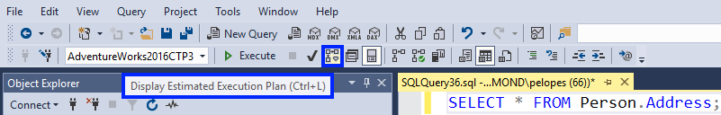

# Display the Estimated Execution Plan
[!INCLUDE [SQL Server Azure SQL Database Azure SQL Managed Instance](../../includes/applies-to-version/sql-asdb-asdbmi.md)]
  This topic describes how to generate graphical estimated execution plans by using [!INCLUDE[ssManStudioFull](../../includes/ssmanstudiofull-md.md)]. When estimated execution plans are generated, the [!INCLUDE[tsql](../../includes/tsql-md.md)] queries or batches do not execute. Because of this, an estimated execution plan does not contain any runtime information, such as actual resource usage metrics or runtime warnings. Instead, the execution plan that is generated displays the query execution plan that [!INCLUDE[ssDEnoversion](../../includes/ssdenoversion-md.md)] would most probably use if the queries were actually executed, and displays the estimated rows flowing through the several operators in the plan.  
  
 To use this feature, users must have the appropriate permissions to execute the [!INCLUDE[tsql](../../includes/tsql-md.md)] query for which a graphical execution plan is being generated, and they must be granted the SHOWPLAN permission for all databases referenced by the query.  
  
## To display the estimated execution plan for a query  
  
1.  On the toolbar, click **Database Engine Query**. You can also open an existing query and display the estimated execution plan by clicking the **Open File** toolbar button and locating the existing query.  
  
2.  Enter the query for which you would like to display the estimated execution plan.  
  
3.  On the **Query** menu, click **Display Estimated Execution Plan** or click the **Display Estimated Execution Plan** toolbar button. The estimated execution plan is displayed on the **Execution Plan** tab in the results pane. 

        

    To view additional information, pause the mouse over the logical and physical operator icons and view the description and properties of the operator in the displayed ToolTip. Alternatively, you can view operator properties in the Properties window. If Properties is not visible, right-click an operator and click **Properties**. Select an operator to view its properties.  

        
  
4.  To alter the display of the execution plan, right-click the execution plan and select **Zoom In**, **Zoom Out**, **Custom Zoom**, or **Zoom to Fit**. **Zoom In** and **Zoom Out** allow you to magnify or reduce the execution plan by fixed amounts. **Custom Zoom** allows you to define your own display magnification, such as zooming at 80 percent. **Zoom to Fit** magnifies the execution plan to fit the result pane. Alternatively, use a combination of the CTRL key and your mouse wheel to activate **dynamic zoom**.  

5.  To navigate the display of the execution plan, use the vertical and horizontal scroll bars, or **click and hold on any blank area** of the execution plan, and **drag your mouse**. Alternatively, click and hold the plus (+) sign in the right lower corner of the execution plan window, to display a miniature map of the entire execution plan.
 
> [!NOTE] 
> Alternatively, use [SET SHOWPLAN_XML](../../t-sql/statements/set-showplan-xml-transact-sql.md) to return execution plan information for each statement without executing it. If used in [!INCLUDE[ssManStudioFull](../../includes/ssmanstudiofull-md.md)], the *Results* tab will have a link to open the execution plan in graphical format.   
  
## See Also  
 [Execution Plans](../../relational-databases/performance/execution-plans.md)    
 [Query Processing Architecture Guide](../../relational-databases/query-processing-architecture-guide.md)  
