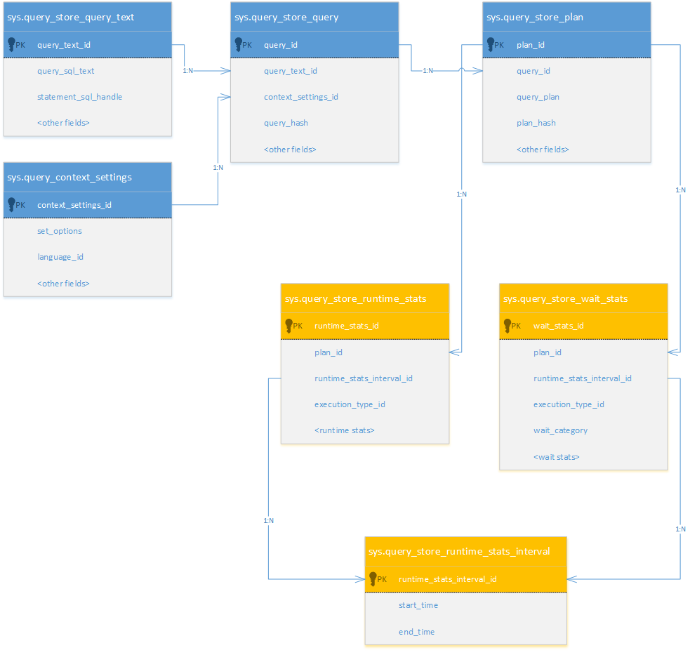
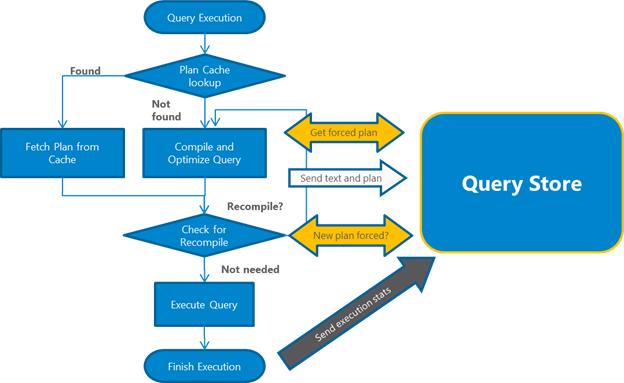
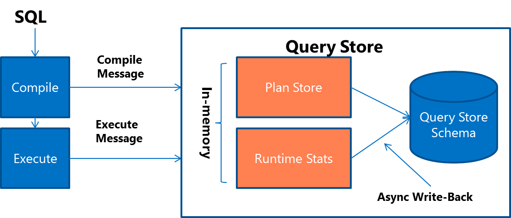
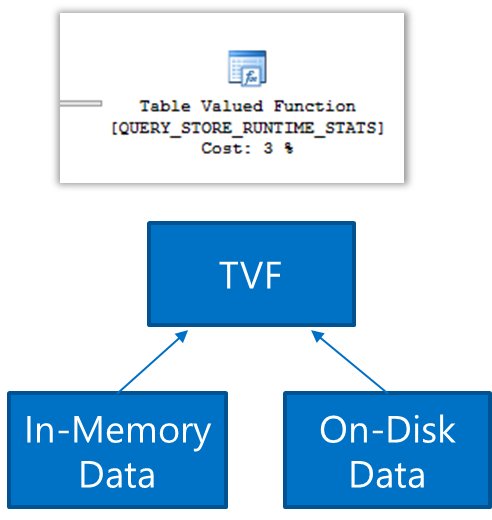

# How Query Store collects data
[!INCLUDE [SQL Server ASDB, ASDBMI, ASDW ](../../includes/applies-to-version/sql-asdb-asdbmi-asa.md)]

SQL Server Query Store works much like a flight data recorder, constantly collecting compile and runtime information related to queries and plans. Query-related data is persisted in the internal tables and presented to users through a set of views.
  
## Views 
 The following diagram shows Query Store views and their logical relationships, with compile time information presented as blue entities:
  
   
**View descriptions**  
  
|View|Description|  
|----------|-----------------|  
|**sys.query_store_query_text**|Presents unique query texts executed against the database. Comments and spaces before and after the query text are ignored. Comments and spaces inside text aren't ignored. Every statement in the batch generates a separate query text entry.|  
|**sys.query_context_settings**|Presents unique combinations of plan-affecting settings under which queries are executed. The same query text executed with different plan-affecting settings produces a separate query entry in Query Store because `context_settings_id` is part of the query key.|  
|**sys.query_store_query**|Query entries that are tracked and forced separately in Query Store. A single query text can produce multiple query entries if it's executed under different context settings or if it's executed outside versus inside different [!INCLUDE[tsql](../../includes/tsql-md.md)] modules, such as stored procedures and triggers.|  
|**sys.query_store_plan**|Presents estimated plan for the query with the compile time statistics. Stored plan is equivalent to one that you get by using `SET SHOWPLAN_XML ON`.|  
|**sys.query_store_runtime_stats_interval**|Query Store divides time into automatically generated time windows (intervals) and stores aggregated statistics on that interval for every executed plan. The size of the interval is controlled by the configuration option **Statistics Collection Interval** (in [!INCLUDE[ssManStudio](../../includes/ssmanstudio-md.md)]) or `INTERVAL_LENGTH_MINUTES` using [ALTER DATABASE SET Options &#40;Transact-SQL&#41;](../../t-sql/statements/alter-database-transact-sql-set-options.md).|  
|**sys.query_store_runtime_stats**|Aggregated runtime statistics for executed plans. All captured metrics are expressed in the form of four statistic functions: Average, Minimum, Maximum, and Standard Deviation.|  
  
 For more information on Query Store views, see the "Related Views, Functions, and Procedures" section of [Monitoring performance by using the Query Store](monitoring-performance-by-using-the-query-store.md). 
  
## Query processing
 Query Store interacts with the query processing pipeline at the following key points:
  
1.  When a query gets compiled for the first time, query text and the initial plan are sent to Query Store.
  
2.  When a query gets recompiled, the plan is updated in Query Store. If a new plan is created, Query Store adds the new plan entry for the query and keeps the previous ones along with their execution statistics.
  
3.  Upon the query execution, runtime statistics are sent to Query Store. Query Store keeps aggregated statistics accurate for every plan that was executed within the currently active interval. 
  
4.  During the compile and check for recompile phases, [!INCLUDE[ssNoVersion](../../includes/ssnoversion-md.md)] determines if there's a plan in Query Store that should be applied for the currently running query. If there's a forced plan and the plan in the procedure cache is different than the forced plan, the query gets recompiled. This is effectively the same way as if PLAN HINT was applied to that query. This process happens transparently to the user application. 
  
 The following diagram depicts the points of integration explained in the previous steps:
  
  

## Remarks
 To minimize I/O overhead, new data is captured in-memory. Write operations are queued and flushed to disk afterwards. Query and plan information, shown as Plan Store in the following diagram, are flushed with minimal latency. The runtime statistics, shown as Runtime Stats, are kept in memory for a period of time defined with the `DATA_FLUSH_INTERVAL_SECONDS` option of the `SET QUERY_STORE` statement. You can use the [!INCLUDE[ssManStudio](../../includes/ssManStudio-md.md)] Query Store dialog box to enter a value for **Data Flush Interval (Minutes)**, which is internally converted to seconds. 
  
  
  
 If the system crashes or a shutdown occurs while using [trace flag 7745](../../relational-databases/performance/best-practice-with-the-query-store.md#Recovery), Query Store can lose runtime data that has been collected but not yet persisted, up to a time window defined with `DATA_FLUSH_INTERVAL_SECONDS`. We recommend the default value of 900 seconds (15 minutes) as a balance between query capture performance and data availability.
 
 > [!IMPORTANT] 
 > The **Max Size (MB)** limit isn't strictly enforced. Storage size is checked only when Query Store writes data to disk. This interval is set by the **Data Flush Interval** value. If Query Store has breached the maximum size limit between storage size checks, it transitions to read-only mode. If **Size Based Cleanup Mode** is enabled, the cleanup mechanism to enforce the maximum size limit is also triggered.
 
 > [!NOTE]
 > If the system is under memory pressure, runtime statistics can be flushed to disk earlier than defined with `DATA_FLUSH_INTERVAL_SECONDS`.
 
 During the read of the Query Store data, in-memory and on-disk data are unified transparently. 
 
 If a session is terminated or the client application restarts or crashes, query statistics won't be recorded. 
  
     

## See also
 [Monitoring performance by using the Query Store](../../relational-databases/performance/monitoring-performance-by-using-the-query-store.md)  
 [Best practice with Query Store](../../relational-databases/performance/best-practice-with-the-query-store.md)  
 [Query Store Catalog Views &#40;Transact-SQL&#41;](../../relational-databases/system-catalog-views/query-store-catalog-views-transact-sql.md) 
  
  
