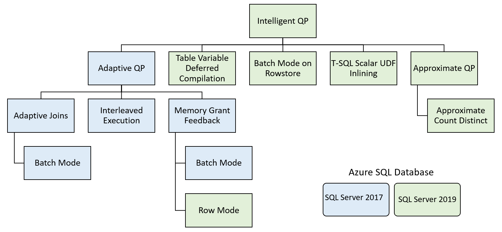
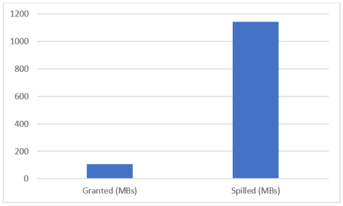
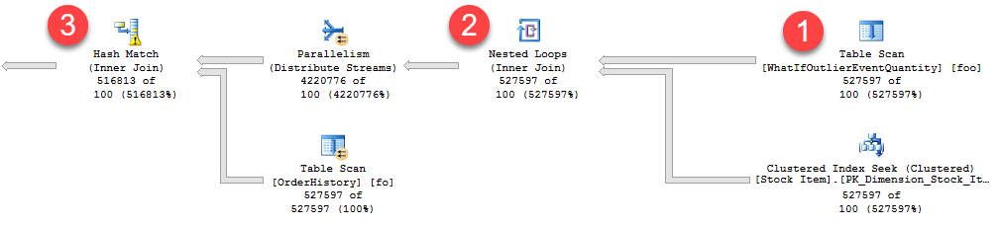
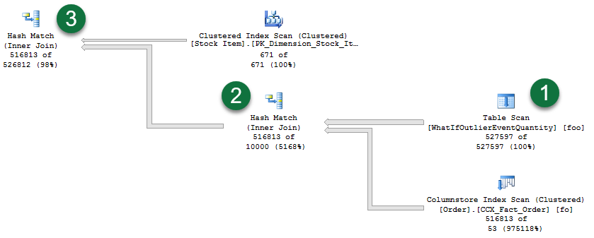

# Intelligent query processing in SQL databases

[!INCLUDE [SQL Server Azure SQL Database](../../includes/applies-to-version/sql-asdb.md)]

The intelligent query processing (IQP) feature family includes features with broad impact that improve the performance of existing workloads with minimal implementation effort to adopt. 



Watch this 6-minute video for an overview of intelligent query processing:

> [!VIDEO https://channel9.msdn.com/Shows/Data-Exposed/Overview-Intelligent-Query-processing-in-SQL-Server-2019/player?WT.mc_id=dataexposed-c9-niner]


You can make workloads automatically eligible for intelligent query processing by enabling the applicable database compatibility level for the database. You can set this using [!INCLUDE[tsql](../../includes/tsql-md.md)]. For example:  

```sql
ALTER DATABASE [WideWorldImportersDW] SET COMPATIBILITY_LEVEL = 150;
```

The following table details all intelligent query processing features, along with any requirement they have for database compatibility level.

| **IQP Feature** | **Supported in Azure SQL Database** | **Supported in SQL Server** |**Description** |
| --- | --- | --- |--- |
| [Adaptive Joins (Batch Mode)](#batch-mode-adaptive-joins) | Yes, under compatibility level 140| Yes, starting in [!INCLUDE[ssSQL17](../../includes/sssql17-md.md)] under compatibility level 140|Adaptive joins dynamically select a join type during runtime based on actual input rows.|
| [Approximate Count Distinct](#approximate-query-processing) | Yes| Yes, starting in [!INCLUDE[sql-server-2019](../../includes/sssqlv15-md.md)]|Provide approximate COUNT DISTINCT for big data scenarios with the benefit of high performance and a low memory footprint. |
| [Batch Mode on Rowstore](#batch-mode-on-rowstore) | Yes, under compatibility level 150| Yes, starting in [!INCLUDE[sql-server-2019](../../includes/sssqlv15-md.md)] under compatibility level 150|Provide batch mode for CPU-bound relational DW workloads without requiring columnstore indexes.  | 
| [Interleaved Execution](#interleaved-execution-for-mstvfs) | Yes, under compatibility level 140| Yes, starting in [!INCLUDE[ssSQL17](../../includes/sssql17-md.md)] under compatibility level 140|Use the actual cardinality of the multi-statement table valued function encountered on first compilation instead of a fixed guess.|
| [Memory Grant Feedback (Batch Mode)](#batch-mode-memory-grant-feedback) | Yes, under compatibility level 140| Yes, starting in [!INCLUDE[ssSQL17](../../includes/sssql17-md.md)] under compatibility level 140|If a batch mode query has operations that spill to disk, add more memory for consecutive executions. If a query wastes > 50% of the memory allocated to it, reduce the memory grant side for consecutive executions.|
| [Memory Grant Feedback (Row Mode)](#row-mode-memory-grant-feedback) | Yes, under compatibility level 150| Yes, starting in [!INCLUDE[sql-server-2019](../../includes/sssqlv15-md.md)] under compatibility level 150|If a row mode query has operations that spill to disk, add more memory for consecutive executions. If a query wastes > 50% of the memory allocated to it, reduce the memory grant side for consecutive executions.|
| [Scalar UDF Inlining](#scalar-udf-inlining) | No | Yes, starting in [!INCLUDE[sql-server-2019](../../includes/sssqlv15-md.md)] under compatibility level 150|Scalar UDFs are transformed into equivalent relational expressions that are "inlined" into the calling query, often resulting in significant performance gains.|
| [Table Variable Deferred Compilation](#table-variable-deferred-compilation) | Yes, under compatibility level 150| Yes, starting in [!INCLUDE[sql-server-2019](../../includes/sssqlv15-md.md)] under compatibility level 150|Use the actual cardinality of the table variable encountered on first compilation instead of a fixed guess.|

## Batch mode Adaptive joins
The batch mode Adaptive Joins feature enables the choice of a [Hash Join or Nested Loops Join](../../relational-databases/performance/joins.md) method to be deferred until **after** the first input has been scanned, by using a single cached plan. The Adaptive Join operator defines a threshold that is used to decide when to switch to a Nested Loops plan. Your plan can therefore dynamically switch to a better join strategy during execution.

For more information, including how to disable Adaptive joins without changing the compatibility level, see [Understanding Adaptive joins](../../relational-databases/performance/joins.md#adaptive).

## Batch mode memory grant feedback
A query's post-execution plan in [!INCLUDE[ssNoVersion](../../includes/ssnoversion-md.md)] includes the minimum required memory needed for execution and the ideal memory grant size to have all rows fit in memory. Performance suffers when memory grant sizes are incorrectly sized. Excessive grants result in wasted memory and reduced concurrency. Insufficient memory grants cause expensive spills to disk. By addressing repeating workloads, batch mode memory grant feedback recalculates the actual memory required for a query and then updates the grant value for the cached plan. When an identical query statement is executed, the query uses the revised memory grant size, reducing excessive memory grants that impact concurrency and fixing underestimated memory grants that cause expensive spills to disk.
The following graph shows one example of using batch mode adaptive memory grant feedback. For the first execution of the query, duration was **88 seconds** due to high spills:   

```sql
DECLARE @EndTime datetime = '2016-09-22 00:00:00.000';
DECLARE @StartTime datetime = '2016-09-15 00:00:00.000';
SELECT TOP 10 hash_unique_bigint_id
FROM dbo.TelemetryDS
WHERE Timestamp BETWEEN @StartTime and @EndTime
GROUP BY hash_unique_bigint_id
ORDER BY MAX(max_elapsed_time_microsec) DESC;
```



With memory grant feedback enabled, for the second execution, duration is **1 second** (down from 88 seconds), spills are removed entirely, and the grant is higher: 


### Memory grant feedback sizing
For an excessive memory grant condition, if the granted memory is more than two times the size of the actual used memory, memory grant feedback will recalculate the memory grant and update the cached plan. Plans with memory grants under 1 MB will not be recalculated for overages.
For an insufficiently sized memory grant condition, that result in a spill to disk for batch mode operators, memory grant feedback will trigger a recalculation of the memory grant. Spill events are reported to memory grant feedback and can be surfaced via the *spilling_report_to_memory_grant_feedback* xEvent. This event returns the node ID from the plan and spilled data size of that node.

### Memory grant feedback and parameter sensitive scenarios
Different parameter values may also require different query plans in order to remain optimal. This type of query is defined as "parameter-sensitive." For parameter-sensitive plans, memory grant feedback will disable itself on a query if it has unstable memory requirements. The plan is disabled after several repeated runs of the query and this can be observed by monitoring the *memory_grant_feedback_loop_disabled* xEvent. For more information about parameter sniffing and parameter sensitivity, refer to the [Query Processing Architecture Guide](../../relational-databases/query-processing-architecture-guide.md#ParamSniffing).

### Memory grant feedback caching
Feedback can be stored in the cached plan for a single execution. It is the consecutive executions of that statement, however, that benefit from the memory grant feedback adjustments. This feature applies to repeated execution of statements. Memory grant feedback will change only the cached plan. Changes are currently not captured in the Query Store.
Feedback is not persisted if the plan is evicted from cache. Feedback will also be lost if there is a failover. A statement using `OPTION (RECOMPILE)` creates a new plan and does not cache it. Since it is not cached, no memory grant feedback is produced and it is not stored for that compilation and execution. However, if an equivalent statement (that is, with the same query hash) that did **not** use `OPTION (RECOMPILE)` was cached and then re-executed, the consecutive statement can benefit from memory grant feedback.

### Tracking memory grant feedback activity
You can track memory grant feedback events using the *memory_grant_updated_by_feedback* xEvent. This event tracks the current execution count history, the number of times the plan has been updated by memory grant feedback, the ideal additional memory grant before modification and the ideal additional memory grant after memory grant feedback has modified the cached plan.

### Memory grant feedback, resource governor and query hints
The actual memory granted honors the query memory limit determined by the resource governor or query hint.

### Disabling batch mode memory grant feedback without changing the compatibility level
Memory grant feedback can be disabled at the database or statement scope while still maintaining database compatibility level 140 and higher. To disable batch mode memory grant feedback for all query executions originating from the database, execute the following within the context of the applicable database:

```sql
-- SQL Server 2017
ALTER DATABASE SCOPED CONFIGURATION SET DISABLE_BATCH_MODE_MEMORY_GRANT_FEEDBACK = ON;

-- Starting with SQL Server 2019, and in Azure SQL Database
ALTER DATABASE SCOPED CONFIGURATION SET BATCH_MODE_MEMORY_GRANT_FEEDBACK = OFF;
```

When enabled, this setting will appear as enabled in [sys.database_scoped_configurations](../../relational-databases/system-catalog-views/sys-database-scoped-configurations-transact-sql.md).

To re-enable batch mode memory grant feedback for all query executions originating from the database, execute the following within the context of the applicable database:

```sql
-- SQL Server 2017
ALTER DATABASE SCOPED CONFIGURATION SET DISABLE_BATCH_MODE_MEMORY_GRANT_FEEDBACK = OFF;

-- Azure SQL Database, SQL Server 2019 and higher
ALTER DATABASE SCOPED CONFIGURATION SET BATCH_MODE_MEMORY_GRANT_FEEDBACK = ON;
```

You can also disable batch mode memory grant feedback for a specific query by designating `DISABLE_BATCH_MODE_MEMORY_GRANT_FEEDBACK` as a [USE HINT query hint](../../t-sql/queries/hints-transact-sql-query.md#use_hint). For example:

```sql
SELECT * FROM Person.Address  
WHERE City = 'SEATTLE' AND PostalCode = 98104
OPTION (USE HINT ('DISABLE_BATCH_MODE_MEMORY_GRANT_FEEDBACK')); 
```

A USE HINT query hint takes precedence over a database scoped configuration or trace flag setting.

## Row mode memory grant feedback

**Applies to:** [!INCLUDE[ssNoVersion](../../includes/ssnoversion-md.md)] (Starting with [!INCLUDE[sql-server-2019](../../includes/sssqlv15-md.md)]), [!INCLUDE[ssSDSfull](../../includes/sssdsfull-md.md)] 

Row mode memory grant feedback expands on the batch mode memory grant feedback feature by adjusting memory grant sizes for both batch and row mode operators.  

To enable row mode memory grant feedback in [!INCLUDE[ssSDSfull](../../includes/sssdsfull-md.md)], enable database compatibility level 150 for the database you are connected to when executing the query.

Row mode memory grant feedback activity will be visible via the **memory_grant_updated_by_feedback** XEvent. 

Starting with row mode memory grant feedback, two new query plan attributes will be shown for actual post-execution plans: ***IsMemoryGrantFeedbackAdjusted*** and ***LastRequestedMemory***, which are added to the *MemoryGrantInfo* query plan XML element. 

*LastRequestedMemory* shows the granted memory in Kilobytes (KB) from the prior query execution. *IsMemoryGrantFeedbackAdjusted* attribute allows you to check the state of memory grant feedback for the statement within an actual query execution plan. Values surfaced in this attribute are as follows:

| IsMemoryGrantFeedbackAdjusted Value | Description |
|---|---|
| No: First Execution | Memory grant feedback does not adjust memory for the first compile and associated execution.  |
| No: Accurate Grant | If there is no spill to disk and the statement uses at least 50% of the granted memory, then memory grant feedback is not triggered. |
| No: Feedback disabled | If memory grant feedback is continually triggered and fluctuates between memory-increase and memory-decrease operations, we will disable memory grant feedback for the statement. |
| Yes: Adjusting | Memory grant feedback has been applied and may be further adjusted for the next execution. |
| Yes: Stable | Memory grant feedback has been applied and granted memory is now stable, meaning that what was last granted for the previous execution is what was granted for the current execution. |

### Disabling row mode memory grant feedback without changing the compatibility level
Row mode memory grant feedback can be disabled at the database or statement scope while still maintaining database compatibility level 150 and higher. To disable row mode memory grant feedback for all query executions originating from the database, execute the following within the context of the applicable database:

```sql
ALTER DATABASE SCOPED CONFIGURATION SET ROW_MODE_MEMORY_GRANT_FEEDBACK = OFF;
```

To re-enable row mode memory grant feedback for all query executions originating from the database, execute the following within the context of the applicable database:

```sql
ALTER DATABASE SCOPED CONFIGURATION SET ROW_MODE_MEMORY_GRANT_FEEDBACK = ON;
```

You can also disable row mode memory grant feedback for a specific query by designating `DISABLE_ROW_MODE_MEMORY_GRANT_FEEDBACK` as a [USE HINT query hint](../../t-sql/queries/hints-transact-sql-query.md#use_hint). For example:

```sql
SELECT * FROM Person.Address  
WHERE City = 'SEATTLE' AND PostalCode = 98104
OPTION (USE HINT ('DISABLE_ROW_MODE_MEMORY_GRANT_FEEDBACK')); 
```

A USE HINT query hint takes precedence over a database scoped configuration or trace flag setting.

## Interleaved execution for MSTVFs
With interleaved execution, the actual row counts from the function are used to make better-informed downstream query plan decisions. For more information on multi-statement table-valued functions (MSTVFs), see [Table-valued functions](../../relational-databases/user-defined-functions/create-user-defined-functions-database-engine.md#TVF).

Interleaved execution changes the unidirectional boundary between the optimization and execution phases for a single-query execution and enables plans to adapt based on the revised cardinality estimates. During optimization if we encounter a candidate for interleaved execution, which is currently **multi-statement table-valued functions (MSTVFs)**, we will pause optimization, execute the applicable subtree, capture accurate cardinality estimates, and then resume optimization for downstream operations.   

MSTVFs have a fixed cardinality guess of 100 starting with [!INCLUDE[ssSQL14](../../includes/sssql14-md.md)], and 1 for earlier [!INCLUDE[ssNoVersion](../../includes/ssnoversion-md.md)] versions. Interleaved execution helps workload performance issues that are due to these fixed cardinality estimates associated with MSTVFs. For more information on MSTVFs, see [Create User-defined Functions (Database Engine)](../../relational-databases/user-defined-functions/create-user-defined-functions-database-engine.md#TVF).

The following image depicts a [Live Query Statistics](../../relational-databases/performance/live-query-statistics.md) output, a subset of an overall execution plan that shows the impact of fixed cardinality estimates from MSTVFs. You can see the actual row flow vs. estimated rows. There are three noteworthy areas of the plan (flow is from right to left):
1. The MSTVF Table Scan has a fixed estimate of 100 rows. For this example, however, there are 527,597 rows flowing through this MSTVF Table Scan, as seen in Live Query Statistics via the *527597 of 100* actual of estimated - so the fixed estimate is significantly skewed.
1. For the Nested Loops operation, only 100 rows are assumed to be returned by the outer side of the join. Given the high number of rows actually being returned by the MSTVF, you are likely better off with a different join algorithm altogether.
1. For the Hash Match operation, notice the small warning symbol, which in this case is indicating a spill to disk.



Contrast the prior plan with the actual plan generated with interleaved execution enabled:



1. Notice that the MSTVF table scan now reflects an accurate cardinality estimate. Also notice the re-ordering of this table scan and the other operations.
1. And regarding join algorithms, we have switched from a Nested Loop operation to a Hash Match operation instead, which is more optimal given the large number of rows involved.
1. Also notice that we no longer have spill-warnings, as we're granting more memory based on the true row count flowing from the MSTVF table scan.

### Interleaved execution eligible statements
MSTVF referencing statements in interleaved execution must currently be read-only and not part of a data modification operation. Also, MSTVFs are not eligible for interleaved execution if they do not use runtime constants.

### Interleaved execution benefits
In general, the higher the skew between the estimated vs. actual number of rows, coupled with the number of downstream plan operations, the greater the performance impact.
In general, interleaved execution benefits queries where:
1. There is a large skew between the estimated vs. actual number of rows for the intermediate result set (in this case, the MSTVF).
1. And the overall query is sensitive to a change in the size of the intermediate result. This typically happens when there is a complex tree above that subtree in the query plan.
A simple `SELECT *` from an MSTVF will not benefit from interleaved execution.

### Interleaved execution overhead
The overhead should be minimal-to-none. MSTVFs were already being materialized prior to the introduction of interleaved execution, however the difference is that now we're now allowing deferred optimization and are then leveraging the cardinality estimate of the materialized row set.
As with any plan affecting changes, some plans could change such that with better cardinality for the subtree we get a worse plan for the query overall. Mitigation can include reverting the compatibility level or using Query Store to force the non-regressed version of the plan.

### Interleaved execution and consecutive executions
Once an interleaved execution plan is cached, the plan with the revised estimates on the first execution is used for consecutive executions without re-instantiating interleaved execution.

### Tracking interleaved execution activity
You can see usage attributes in the actual query execution plan:

| Execution Plan attribute | Description |
| --- | --- |
| ContainsInterleavedExecutionCandidates | Applies to the *QueryPlan* node. When *true*, means the plan contains interleaved execution candidates. |
| IsInterleavedExecuted | Attribute of the *RuntimeInformation* element under the RelOp for the TVF node. When *true*, means the operation was materialized as part of an interleaved execution operation. |

You can also track interleaved execution occurrences via the following xEvents:

| xEvent | Description |
| ---- | --- |
| interleaved_exec_status | This event fires when interleaved execution is occurring. |
| interleaved_exec_stats_update | This event describes the cardinality estimates updated by interleaved execution. |
| Interleaved_exec_disabled_reason | This event fires when a query with a possible candidate for interleaved execution does not actually get interleaved execution. |

A query must be executed in order to allow interleaved execution to revise MSTVF cardinality estimates. However, the estimated execution plan still shows when there are interleaved execution candidates via the `ContainsInterleavedExecutionCandidates` showplan attribute.    

### Interleaved execution caching
If a plan is cleared or evicted from cache, upon query execution there is a fresh compilation that uses interleaved execution.
A statement using `OPTION (RECOMPILE)` will create a new plan using interleaved execution and not cache it.     

### Interleaved execution and query store interoperability
Plans using interleaved execution can be forced. The plan is the version that has corrected cardinality estimates based on initial execution.    

### Disabling interleaved execution without changing the compatibility level
Interleaved execution can be disabled at the database or statement scope while still maintaining database compatibility level 140 and higher.  To disable interleaved execution for all query executions originating from the database, execute the following within the context of the applicable database:

```sql
-- SQL Server 2017
ALTER DATABASE SCOPED CONFIGURATION SET DISABLE_INTERLEAVED_EXECUTION_TVF = ON;

-- Starting with SQL Server 2019, and in Azure SQL Database
ALTER DATABASE SCOPED CONFIGURATION SET INTERLEAVED_EXECUTION_TVF = OFF;
```

When enabled, this setting will appear as enabled in [sys.database_scoped_configurations](../../relational-databases/system-catalog-views/sys-database-scoped-configurations-transact-sql.md).
To re-enable interleaved execution for all query executions originating from the database, execute the following within the context of the applicable database:

```sql
-- SQL Server 2017
ALTER DATABASE SCOPED CONFIGURATION SET DISABLE_INTERLEAVED_EXECUTION_TVF = OFF;

-- Starting with SQL Server 2019, and in Azure SQL Database
ALTER DATABASE SCOPED CONFIGURATION SET INTERLEAVED_EXECUTION_TVF = ON;
```

You can also disable interleaved execution for a specific query by designating `DISABLE_INTERLEAVED_EXECUTION_TVF` as a [USE HINT query hint](../../t-sql/queries/hints-transact-sql-query.md#use_hint). For example:

```sql
SELECT [fo].[Order Key], [fo].[Quantity], [foo].[OutlierEventQuantity]
FROM [Fact].[Order] AS [fo]
INNER JOIN [Fact].[WhatIfOutlierEventQuantity]('Mild Recession',
                            '1-01-2013',
                            '10-15-2014') AS [foo] ON [fo].[Order Key] = [foo].[Order Key]
                            AND [fo].[City Key] = [foo].[City Key]
                            AND [fo].[Customer Key] = [foo].[Customer Key]
                            AND [fo].[Stock Item Key] = [foo].[Stock Item Key]
                            AND [fo].[Order Date Key] = [foo].[Order Date Key]
                            AND [fo].[Picked Date Key] = [foo].[Picked Date Key]
                            AND [fo].[Salesperson Key] = [foo].[Salesperson Key]
                            AND [fo].[Picker Key] = [foo].[Picker Key]
OPTION (USE HINT('DISABLE_INTERLEAVED_EXECUTION_TVF'));
```

A USE HINT query hint takes precedence over a database scoped configuration or trace flag setting.

## Table variable deferred compilation

**Applies to:** [!INCLUDE[ssNoVersion](../../includes/ssnoversion-md.md)] (Starting with [!INCLUDE[sql-server-2019](../../includes/sssqlv15-md.md)]), [!INCLUDE[ssSDSfull](../../includes/sssdsfull-md.md)] 

**Table variable deferred compilation** improves plan quality and overall performance for queries referencing table variables. During optimization and initial plan compilation, this feature will propagate cardinality estimates that are based on actual table variable row counts. This exact row count information will then be used for optimizing downstream plan operations.

With table variable deferred compilation, compilation of a statement that references a table variable is deferred until the first actual execution of the statement. This deferred compilation behavior is identical to the behavior of temporary tables. This change results in the use of actual cardinality instead of the original one-row guess. 

To enable table variable deferred compilation, enable database compatibility level 150 for the database you're connected to when the query runs.

Table variable deferred compilation **doesn't** change any other characteristics of table variables. For example, this feature doesn't add column statistics to table variables.

Table variable deferred compilation **doesn't increase recompilation frequency**. Rather, it shifts where the initial compilation occurs. The resulting cached plan generates based on the initial deferred compilation table variable row count. The cached plan is reused by consecutive queries. It's reused until the plan is evicted or recompiled. 

Table variable row count that is used for initial plan compilation represents a typical value might be different from a fixed row count guess. If it's different, downstream operations will benefit. Performance may not be improved by this feature if the table variable row count varies significantly across executions.

### Disabling table variable deferred compilation without changing the compatibility level
Disable table variable deferred compilation at the database or statement scope while still maintaining database compatibility level 150 and higher. To disable table variable deferred compilation for all query executions originating from the database, execute the following example within the context of the applicable database:

```sql
ALTER DATABASE SCOPED CONFIGURATION SET DEFERRED_COMPILATION_TV = OFF;
```

To re-enable table variable deferred compilation for all query executions originating from the database, execute the following example within the context of the applicable database:

```sql
ALTER DATABASE SCOPED CONFIGURATION SET DEFERRED_COMPILATION_TV = ON;
```

You can also disable table variable deferred compilation for a specific query by assigning DISABLE_DEFERRED_COMPILATION_TV as a USE HINT query hint.  For example:

```sql
DECLARE @LINEITEMS TABLE 
	(L_OrderKey INT NOT NULL,
	 L_Quantity INT NOT NULL
	);

INSERT @LINEITEMS
SELECT L_OrderKey, L_Quantity
FROM dbo.lineitem
WHERE L_Quantity = 5;

SELECT	O_OrderKey,
	O_CustKey,
	O_OrderStatus,
	L_QUANTITY
FROM	
	ORDERS,
	@LINEITEMS
WHERE	O_ORDERKEY	=	L_ORDERKEY
	AND O_OrderStatus = 'O'
OPTION (USE HINT('DISABLE_DEFERRED_COMPILATION_TV'));
```

## Scalar UDF inlining

**Applies to:** [!INCLUDE[ssNoVersion](../../includes/ssnoversion-md.md)] (Starting with [!INCLUDE[sql-server-2019](../../includes/sssqlv15-md.md)])

Scalar UDF inlining automatically transforms [scalar UDFs](../../relational-databases/user-defined-functions/create-user-defined-functions-database-engine.md#Scalar) into relational expressions. It embeds them in the calling SQL query. This transformation improves the performance of workloads that take advantage of scalar UDFs. Scalar UDF inlining facilitates cost-based optimization of operations inside UDFs. The results are efficient, set-oriented, and parallel instead of inefficient, iterative, serial execution plans. This feature is enabled by default under database compatibility level 150.

For more information, see [Scalar UDF inlining](../user-defined-functions/scalar-udf-inlining.md).

## Approximate query processing

**Applies to:** [!INCLUDE[ssNoVersion](../../includes/ssnoversion-md.md)] (Starting with [!INCLUDE[sql-server-2019](../../includes/sssqlv15-md.md)]), [!INCLUDE[ssSDSfull](../../includes/sssdsfull-md.md)] 

Approximate query processing is a new feature family. It aggregates across large datasets where responsiveness is more critical than absolute precision. An example is calculating a **COUNT(DISTINCT())** across 10 billion rows, for display on a dashboard. In this case, absolute precision isn't important, but responsiveness is critical. The new **APPROX_COUNT_DISTINCT** aggregate function returns the approximate number of unique non-null values in a group.

For more information, see [APPROX_COUNT_DISTINCT (Transact-SQL)](../../t-sql/functions/approx-count-distinct-transact-sql.md).

## Batch mode on rowstore 

**Applies to:** [!INCLUDE[ssNoVersion](../../includes/ssnoversion-md.md)] (Starting with [!INCLUDE[sql-server-2019](../../includes/sssqlv15-md.md)]), [!INCLUDE[ssSDSfull](../../includes/sssdsfull-md.md)] 

Batch mode on rowstore enables batch mode execution for analytic workloads without requiring columnstore indexes.  This feature supports batch mode execution and bitmap filters for on-disk heaps and B-tree indexes. Batch mode on rowstore enables support for all existing batch mode-enabled operators.

### Background
[!INCLUDE[ssSQL11](../../includes/sssql11-md.md)] introduced a new feature to accelerate analytical workloads: columnstore indexes. We expanded the use cases and improved the performance of columnstore indexes in each subsequent release. Until now, we surfaced and documented all these capabilities as a single feature. You create columnstore indexes on your tables. And your analytical workload goes faster. However, there are two related but distinct sets of technologies:
- With **columnstore** indexes, analytical queries access only the data in the columns they need. Page compression in the columnstore format is also more effective than compression in traditional **rowstore** indexes. 
- With **batch mode** processing, query operators process data more efficiently. They work on a batch of rows instead of one row at a time. A number of other scalability improvements are tied to batch mode processing. For more information on batch mode, see [Execution modes](../../relational-databases/query-processing-architecture-guide.md#execution-modes).

The two sets of features work together to improve input/output (I/O) and CPU utilization:
- By using columnstore indexes, more of your data fits in memory. That reduces the I/O workload.
- Batch mode processing uses CPU more efficiently.

The two technologies take advantage of each other whenever possible. For example, batch mode aggregates can be evaluated as part of a columnstore index scan. Also columnstore data that's compressed is processed by using run-length encoding much more efficiently with batch mode joins and batch mode aggregates. 
 
It is importand to understand however, that the two features are independent:
* You can get row mode plans that use columnstore indexes.
* You can get batch mode plans that use only rowstore indexes. 

You usually get the best results when you use the two features together. So until now, the SQL Server query optimizer considered batch mode processing only for queries that involve at least one table with a columnstore index.

Columnstore indexes may not be appropriate for some applications. An application might use some other feature that isn't supported with columnstore indexes. For example, in-place modifications are not compatible with columnstore compression. Therefore, triggers aren't supported on tables with clustered columnstore indexes. More importantly, columnstore indexes add overhead for **DELETE** and **UPDATE** statements. 

For some hybrid transactional-analytical workloads, the overhead of a transactional workload outweighs the benefits gained from using columnstore indexes. Such scenarios can benefit from improved CPU usage by employing batch mode processing alone. That is why the batch-mode-on-rowstore feature considers batch mode for all queries regardless of what type of indexes are involved.

### Workloads that might benefit from batch mode on rowstore
The following workloads might benefit from batch mode on rowstore:
* A significant part of the workload consists of analytical queries. Usually, these queries use operators like joins or aggregates that process hundreds of thousands of rows or more.
* The workload is CPU bound. If the bottleneck is I/O, it is still recommended that you consider a columnstore index, where possible.
* Creating a columnstore index adds too much overhead to the transactional part of your workload. Or, creating a columnstore index is not feasible because your application depends on a feature that's not yet supported with columnstore indexes.


> [!NOTE]
> Batch mode on rowstore helps only by reducing CPU consumption. If your bottleneck is I/O-related, and data isn't already cached ("cold" cache), batch mode on rowstore will not improve query elapsed time. Similarly, if there is no sufficient memory on the machine to cache all data, a performance improvement is unlikely.

### What changes with batch mode on rowstore?

Set the database to to compatibility level 150. No other changes are required.

Even if a query does not access any tables with columnstore indexes, the query processor, using heuristics, will decide whether to consider batch mode. The heuristics consist of these checks:
1. An initial check of table sizes, operators used, and estimated cardinalities in the input query.
2. Additional checkpoints, as the optimizer discovers new, cheaper plans for the query. If these alternative plans don't make significant use of batch mode, the optimizer stops exploring batch mode alternatives.


If batch mode on rowstore is used, you see the actual run mode as **batch mode** in the query plan. The scan operator uses batch mode for on-disk heaps and B-tree indexes. This batch mode scan can evaluate batch mode bitmap filters. You might also see other batch mode operators in the plan. Examples are hash joins, hash-based aggregates, sorts, window aggregates, filters, concatenation, and compute scalar operators.

### Remarks

Query plans don't always use batch mode. The Query Optimizer might decide that batch mode isn't beneficial for the query. 

The Query Optimizer search space is changing. So if you get a row mode plan, it might not be the same as the plan you get in a lower compatibility level. And if you get a batch mode plan, it might not be the same as the plan you get with a columnstore index. 

Plans might also change for queries that mix columnstore and rowstore indexes because of the new batch mode rowstore scan.

There are current limitations for the new batch mode on rowstore scan: 
- It won't kick in for in-memory OLTP tables or for any index other than on-disk heaps and B-trees. 
- It also won't kick in if a large object (LOB) column is fetched or filtered. This limitation includes sparse column sets and XML columns.

There are queries that batch mode isn't used for even with columnstore indexes. Examples are queries that involve cursors. These same exclusions also extend to batch mode on rowstore.

### Configure batch mode on rowstore
The **BATCH_MODE_ON_ROWSTORE** database scoped configuration is on by default. It disables batch mode on rowstore without requiring a change in database compatibility level:

```sql
-- Disabling batch mode on rowstore
ALTER DATABASE SCOPED CONFIGURATION SET BATCH_MODE_ON_ROWSTORE = OFF;

-- Enabling batch mode on rowstore
ALTER DATABASE SCOPED CONFIGURATION SET BATCH_MODE_ON_ROWSTORE = ON;
```

You can disable batch mode on rowstore via database scoped configuration. But you can still override the setting at the query level by using the **ALLOW_BATCH_MODE** query hint. The following example enables batch mode on rowstore even with the feature disabled via database scoped configuration:

```sql
SELECT [Tax Rate], [Lineage Key], [Salesperson Key], SUM(Quantity) AS SUM_QTY, SUM([Unit Price]) AS SUM_BASE_PRICE, COUNT(*) AS COUNT_ORDER
FROM Fact.OrderHistoryExtended
WHERE [Order Date Key]<=DATEADD(dd, -73, '2015-11-13')
GROUP BY [Tax Rate], [Lineage Key], [Salesperson Key]
ORDER BY [Tax Rate], [Lineage Key], [Salesperson Key]
OPTION(RECOMPILE, USE HINT('ALLOW_BATCH_MODE'));
```

You can also disable batch mode on rowstore for a specific query by using the **DISALLOW_BATCH_MODE** query hint. See the following example:

```sql
SELECT [Tax Rate], [Lineage Key], [Salesperson Key], SUM(Quantity) AS SUM_QTY, SUM([Unit Price]) AS SUM_BASE_PRICE, COUNT(*) AS COUNT_ORDER
FROM Fact.OrderHistoryExtended
WHERE [Order Date Key]<=DATEADD(dd, -73, '2015-11-13')
GROUP BY [Tax Rate], [Lineage Key], [Salesperson Key]
ORDER BY [Tax Rate], [Lineage Key], [Salesperson Key]
OPTION(RECOMPILE, USE HINT('DISALLOW_BATCH_MODE'));
```

## See also
[Performance Center for SQL Server Database Engine and Azure SQL Database](../../relational-databases/performance/performance-center-for-sql-server-database-engine-and-azure-sql-database.md)     
[Query processing architecture guide](../../relational-databases/query-processing-architecture-guide.md)    
[Showplan logical and physical operators reference](../../relational-databases/showplan-logical-and-physical-operators-reference.md)    
[Joins](../../relational-databases/performance/joins.md)       
[Demonstrating Intelligent Query Processing](https://github.com/Microsoft/sql-server-samples/tree/master/samples/features/intelligent-query-processing)   
