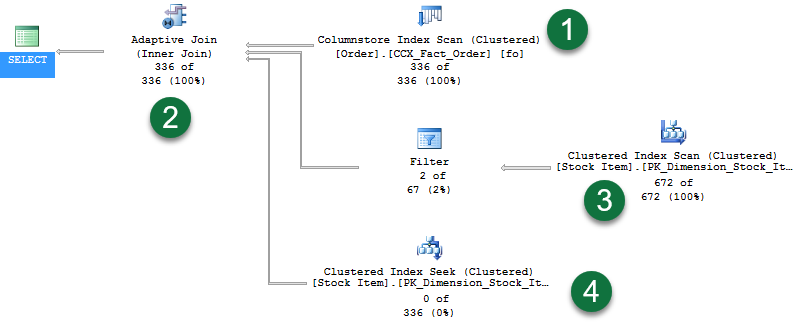
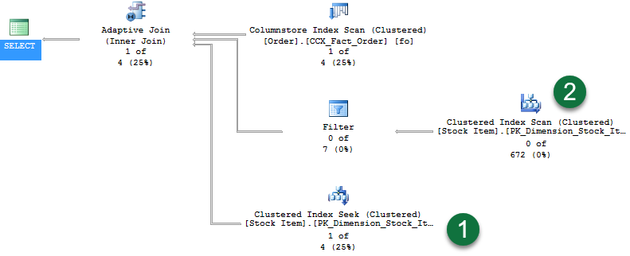
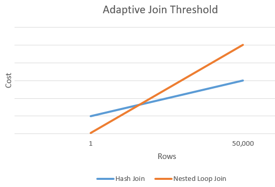

# Joins (SQL Server)
[!INCLUDE[SQL Server Azure SQL Database Synapse Analytics PDW ](../../includes/applies-to-version/sql-asdb-asdbmi-asa-pdw.md)]

[!INCLUDE[ssNoVersion](../../includes/ssnoversion-md.md)] performs sort, intersect, union, and difference operations using in-memory sorting and hash join technology. Using this type of query plan, [!INCLUDE[ssNoVersion](../../includes/ssnoversion-md.md)] supports vertical table partitioning.   

[!INCLUDE[ssNoVersion](../../includes/ssnoversion-md.md)] implements logical join operations, as determined by [!INCLUDE[tsql](../../includes/tsql-md.md)] syntax:
-   Inner join
-   Left outer join
-   Right outer join
-   Full outer join
-   Cross join

> [!NOTE]
> For more information on join syntax, see [FROM clause plus JOIN, APPLY, PIVOT (Transact-SQL)](../../t-sql/queries/from-transact-sql.md).

[!INCLUDE[ssNoVersion](../../includes/ssnoversion-md.md)] employs four types of physical join operations to carry out the logical join operations:    
-   Nested Loops joins     
-   Merge joins   
-   Hash joins   
-   Adaptive joins (starting with [!INCLUDE[ssSQL17](../../includes/sssql17-md.md)])

## <a name="fundamentals"></a> Join Fundamentals
By using joins, you can retrieve data from two or more tables based on logical relationships between the tables. Joins indicate how [!INCLUDE[ssNoVersion](../../includes/ssnoversion-md.md)] should use data from one table to select the rows in another table.    

A join condition defines the way two tables are related in a query by:    
-   Specifying the column from each table to be used for the join. A typical join condition specifies a foreign key from one table and its associated key in the other table.    
-   Specifying a logical operator (for example, = or <>,) to be used in comparing values from the columns.   

Joins are expressed logically using the following [!INCLUDE[tsql](../../includes/tsql-md.md)] syntax:
-   INNER JOIN
-   LEFT [ OUTER ] JOIN
-   RIGHT [ OUTER ] JOIN
-   FULL [ OUTER ] JOIN
-   CROSS JOIN

**Inner joins** can be specified in either the `FROM` or `WHERE` clauses. **Outer joins** and **cross joins** can be specified in the `FROM` clause only. The join conditions combine with the `WHERE` and `HAVING` search conditions to control the rows that are selected from the base tables referenced in the `FROM` clause.    

Specifying the join conditions in the `FROM` clause helps separate them from any other search conditions that may be specified in a `WHERE` clause, and is the recommended method for specifying joins. A simplified ISO `FROM` clause join syntax is:

```sql
FROM first_table < join_type > second_table [ ON ( join_condition ) ]
```

*join_type* specifies what kind of join is performed: an inner, outer, or cross join. *join_condition* defines the predicate to be evaluated for each pair of joined rows. The following is an example of a `FROM` clause join specification:

```sql
FROM Purchasing.ProductVendor INNER JOIN Purchasing.Vendor
     ON ( ProductVendor.BusinessEntityID = Vendor.BusinessEntityID )
```

The following is a simple `SELECT` statement using this join:

```sql
SELECT ProductID, Purchasing.Vendor.BusinessEntityID, Name
FROM Purchasing.ProductVendor INNER JOIN Purchasing.Vendor
    ON (Purchasing.ProductVendor.BusinessEntityID = Purchasing.Vendor.BusinessEntityID)
WHERE StandardPrice > $10
  AND Name LIKE N'F%'
GO
```

The `SELECT` statement returns the product and supplier information for any combination of parts supplied by a company for which the company name starts with the letter F and the price of the product is more than $10.   

When multiple tables are referenced in a single query, all column references must be unambiguous. In the previous example, both the `ProductVendor` and `Vendor` table have a column named `BusinessEntityID`. Any column name that is duplicated between two or more tables referenced in the query must be qualified with the table name. All references to the `Vendor` columns in the example are qualified.   

When a column name is not duplicated in two or more tables used in the query, references to it do not have to be qualified with the table name. This is shown in the previous example. Such a `SELECT` clause is sometimes difficult to understand because there is nothing to indicate the table that provided each column. The readability of the query is improved if all columns are qualified with their table names. The readability is further improved if table aliases are used, especially when the table names themselves must be qualified with the database and owner names. The following is the same example, except that table aliases have been assigned and the columns qualified with table aliases to improve readability:

```sql
SELECT pv.ProductID, v.BusinessEntityID, v.Name
FROM Purchasing.ProductVendor AS pv 
INNER JOIN Purchasing.Vendor AS v
    ON (pv.BusinessEntityID = v.BusinessEntityID)
WHERE StandardPrice > $10
    AND Name LIKE N'F%';
```

The previous examples specified the join conditions in the `FROM` clause, which is the preferred method. The following query contains the same join condition specified in the `WHERE` clause:

```sql
SELECT pv.ProductID, v.BusinessEntityID, v.Name
FROM Purchasing.ProductVendor AS pv, Purchasing.Vendor AS v
WHERE pv.BusinessEntityID=v.BusinessEntityID
    AND StandardPrice > $10
    AND Name LIKE N'F%';
```

The `SELECT` list for a join can reference all the columns in the joined tables, or any subset of the columns. The `SELECT` list is not required to contain columns from every table in the join. For example, in a three-table join, only one table can be used to bridge from one of the other tables to the third table, and none of the columns from the middle table have to be referenced in the select list. This is also called an **anti semi join**.  

Although join conditions usually have equality comparisons (=), other comparison or relational operators can be specified, as can other predicates. For more information, see [Comparison Operators &#40;Transact-SQL&#41;](../../t-sql/language-elements/comparison-operators-transact-sql.md) and [WHERE &#40;Transact-SQL&#41;](../../t-sql/queries/where-transact-sql.md).  

When [!INCLUDE[ssNoVersion](../../includes/ssnoversion-md.md)] processes joins, the Query Optimizer chooses the most efficient method (out of several possibilities) of processing the join. This includes choosing the most efficient type of physical join, the order in which the tables will be joined, and even using types of logical join operations that cannot be directly expressed with [!INCLUDE[tsql](../../includes/tsql-md.md)] syntax, such as **semi joins** and **anti semi joins**. The physical execution of various joins can use many different optimizations and therefore cannot be reliably predicted. For more information on semi joins and anti semi joins, see [Showplan Logical and Physical Operators Reference](../../relational-databases/showplan-logical-and-physical-operators-reference.md).  

Columns used in a join condition are not required to have the same name or be the same data type. However, if the data types are not identical, they must be compatible, or be types that [!INCLUDE[ssNoVersion](../../includes/ssnoversion-md.md)] can implicitly convert. If the data types cannot be implicitly converted, the join condition must explicitly convert the data type using the `CAST` function. For more information about implicit and explicit conversions, see [Data Type Conversion &#40;Database Engine&#41;](../../t-sql/data-types/data-type-conversion-database-engine.md).    

Most queries using a join can be rewritten using a subquery (a query nested within another query), and most subqueries can be rewritten as joins. For more information about subqueries, see [Subqueries](../../relational-databases/performance/subqueries.md).   

> [!NOTE]
> Tables cannot be joined directly on ntext, text, or image columns. However, tables can be joined indirectly on ntext, text, or image columns by using `SUBSTRING`.    
> For example, `SELECT * FROM t1 JOIN t2 ON SUBSTRING(t1.textcolumn, 1, 20) = SUBSTRING(t2.textcolumn, 1, 20)` performs a two-table inner join on the first 20 characters of each text column in tables t1 and t2.   
> In addition, another possibility for comparing ntext or text columns from two tables is to compare the lengths of the columns with a `WHERE` clause, for example: `WHERE DATALENGTH(p1.pr_info) = DATALENGTH(p2.pr_info)`

## <a name="nested_loops"></a> Understanding Nested Loops joins
If one join input is small (fewer than 10 rows) and the other join input is fairly large and indexed on its join columns, an index nested loops join is the fastest join operation because they require the least I/O and the fewest comparisons. 

The nested loops join, also called *nested iteration*, uses one join input as the outer input table (shown as the top input in the graphical execution plan) and one as the inner (bottom) input table. The outer loop consumes the outer input table row by row. The inner loop, executed for each outer row, searches for matching rows in the inner input table.   

In the simplest case, the search scans an entire table or index; this is called a *naive nested loops join*. If the search exploits an index, it is called an *index nested loops join*. If the index is built as part of the query plan (and destroyed upon completion of the query), it is called a *temporary index nested loops join*. All these variants are considered by the Query Optimizer.   

A nested loops join is particularly effective if the outer input is small and the inner input is preindexed and large. In many small transactions, such as those affecting only a small set of rows, index nested loops joins are superior to both merge joins and hash joins. In large queries, however, nested loops joins are often not the optimal choice.    

When the OPTIMIZED attribute of a Nested Loops join operator is set to **True**, it means that an Optimized Nested Loops (or Batch Sort) is used to minimize I/O when the inner side table is large, regardless of it being parallelized or not. The presence of this optimization in a given plan may not be very obvious when analyzing an execution plan, given the sort itself is a hidden operation. But by looking in the plan XML for the attribute OPTIMIZED, this indicates the Nested Loops join may try to reorder the input rows to improve I/O performance.

## <a name="merge"></a> Merge joins
If the two join inputs are not small but are sorted on their join column (for example, if they were obtained by scanning sorted indexes), a merge join is the fastest join operation. If both join inputs are large and the two inputs are of similar sizes, a merge join with prior sorting and a hash join offer similar performance. However, hash join operations are often much faster if the two input sizes differ significantly from each other.       

The merge join requires both inputs to be sorted on the merge columns, which are defined by the equality (ON) clauses of the join predicate. The query optimizer typically scans an index, if one exists on the proper set of columns, or it places a sort operator below the merge join. In rare cases, there may be multiple equality clauses, but the merge columns are taken from only some of the available equality clauses.    

Because each input is sorted, the **Merge Join** operator gets a row from each input and compares them. For example, for inner join operations, the rows are returned if they are equal. If they are not equal, the lower-value row is discarded and another row is obtained from that input. This process repeats until all rows have been processed.    

The merge join operation may be either a regular or a many-to-many operation. A many-to-many merge join uses a temporary table to store rows. If there are duplicate values from each input, one of the inputs will have to rewind to the start of the duplicates as each duplicate from the other input is processed.    

If a residual predicate is present, all rows that satisfy the merge predicate evaluate the residual predicate, and only those rows that satisfy it are returned.   

Merge join itself is very fast, but it can be an expensive choice if sort operations are required. However, if the data volume is large and the desired data can be obtained presorted from existing B-tree indexes, merge join is often the fastest available join algorithm.    

## <a name="hash"></a> Hash joins
Hash joins can efficiently process large, unsorted, nonindexed inputs. They are useful for intermediate results in complex queries because:
-   Intermediate results are not indexed (unless explicitly saved to disk and then indexed) and often are not suitably sorted for the next operation in the query plan.
-   Query optimizers estimate only intermediate result sizes. Because estimates can be very inaccurate for complex queries, algorithms to process intermediate results not only must be efficient, but also must degrade gracefully if an intermediate result turns out to be much larger than anticipated.   

The hash join allows reductions in the use of denormalization. Denormalization is typically used to achieve better performance by reducing join operations, in spite of the dangers of redundancy, such as inconsistent updates. Hash joins reduce the need to denormalize. Hash joins allow vertical partitioning (representing groups of columns from a single table in separate files or indexes) to become a viable option for physical database design.     

The hash join has two inputs: the **build** input and **probe** input. The query optimizer assigns these roles so that the smaller of the two inputs is the build input.    

Hash joins are used for many types of set-matching operations: inner join; left, right, and full outer join; left and right semi-join; intersection; union; and difference. Moreover, a variant of the hash join can do duplicate removal and grouping, such as `SUM(salary) GROUP BY department`. These modifications use only one input for both the build and probe roles.   

The following sections describe different types of hash joins: in-memory hash join, grace hash join, and recursive hash join.    

### <a name="inmem_hash"></a> In-Memory Hash Join
The hash join first scans or computes the entire build input and then builds a hash table in memory. Each row is inserted into a hash bucket depending on the hash value computed for the hash key. If the entire build input is smaller than the available memory, all rows can be inserted into the hash table. This build phase is followed by the probe phase. The entire probe input is scanned or computed one row at a time, and for each probe row, the hash key's value is computed, the corresponding hash bucket is scanned, and the matches are produced.    

### <a name="grace_hash"></a> Grace Hash Join
If the build input does not fit in memory, a hash join proceeds in several steps. This is known as a grace hash join. Each step has a build phase and probe phase. Initially, the entire build and probe inputs are consumed and partitioned (using a hash function on the hash keys) into multiple files. Using the hash function on the hash keys guarantees that any two joining records must be in the same pair of files. Therefore, the task of joining two large inputs has been reduced to multiple, but smaller, instances of the same tasks. The hash join is then applied to each pair of partitioned files.    

### <a name="recursive_hash"></a> Recursive Hash Join
If the build input is so large that inputs for a standard external merge would require multiple merge levels, multiple partitioning steps and multiple partitioning levels are required. If only some of the partitions are large, additional partitioning steps are used for only those specific partitions. In order to make all partitioning steps as fast as possible, large, asynchronous I/O operations are used so that a single thread can keep multiple disk drives busy.    

> [!NOTE]
> If the build input is only slightly larger than the available memory, elements of in-memory hash join and grace hash join are combined in a single step, producing a hybrid hash join.   

It is not always possible during optimization to determine which hash join is used. Therefore, SQL Server starts by using an in-memory hash join and gradually transitions to grace hash join, and recursive hash join, depending on the size of the build input.    

If the Query Optimizer anticipates wrongly which of the two inputs is smaller and, therefore, should have been the build input, the build and probe roles are reversed dynamically. The hash join makes sure that it uses the smaller overflow file as build input. This technique is called role reversal. Role reversal occurs inside the hash join after at least one spill to the disk.     

> [!NOTE]
> Role reversal occurs independent of any query hints or structure. Role reversal does not display in your query plan; when it occurs, it is transparent to the user.

### <a name="hash_bailout"></a> Hash Bailout
The term hash bailout is sometimes used to describe grace hash joins or recursive hash joins.    

> [!NOTE]
> Recursive hash joins or hash bailouts cause reduced performance in your server. If you see many Hash Warning events in a trace, update statistics on the columns that are being joined.    

For more information about hash bailout, see [Hash Warning Event Class](../../relational-databases/event-classes/hash-warning-event-class.md).    

## <a name="adaptive"></a> Adaptive joins
[Batch mode](../../relational-databases/query-processing-architecture-guide.md#batch-mode-execution) Adaptive Joins enable the choice of a [Hash Join](#hash) or [Nested Loops](#nested_loops) join method to be deferred until **after** the first input has been scanned. The Adaptive Join operator defines a threshold that is used to decide when to switch to a Nested Loops plan. A query plan can therefore dynamically switch to a better join strategy during execution without having to be recompiled. 

> [!TIP]
> Workloads with frequent oscillations between small and large join input scans will benefit most from this feature.

The runtime decision is based on the following steps:
-  If the row count of the build join input is small enough that a Nested Loops join would be more optimal than a Hash join, the plan switches to a Nested Loops algorithm.
-  If the build join input exceeds a specific row count threshold, no switch occurs and your plan continues with a Hash join.

The following query is used to illustrate an Adaptive Join example:

```sql
SELECT [fo].[Order Key], [si].[Lead Time Days], [fo].[Quantity]
FROM [Fact].[Order] AS [fo]
INNER JOIN [Dimension].[Stock Item] AS [si]
       ON [fo].[Stock Item Key] = [si].[Stock Item Key]
WHERE [fo].[Quantity] = 360;
```

The query returns 336 rows. Enabling [Live Query Statistics](../../relational-databases/performance/live-query-statistics.md) displays the following plan:



In the plan, note the following:
1. A columnstore index scan used to provide rows for the Hash join build phase.
2. The new Adaptive Join operator. This operator defines a threshold that is used to decide when to switch to a Nested Loops plan. For this example, the threshold is 78 rows. Anything with &gt;= 78 rows will use a Hash join. If less than the threshold, a Nested Loops join will be used.
3. Since the query returns 336 rows, this exceeded the threshold and so the second branch represents the probe phase of a standard Hash join operation. Notice that Live Query Statistics shows rows flowing through the operators - in this case "672 of 672".
4. And the last branch is a Clustered Index Seek for use by the Nested Loops join had the threshold not been exceeded. Notice that we see "0 of 336" rows displayed (the branch is unused).

Now contrast the plan with the same query, but when the *Quantity* value only has one row in the table:
 
```sql
SELECT [fo].[Order Key], [si].[Lead Time Days], [fo].[Quantity]
FROM [Fact].[Order] AS [fo]
INNER JOIN [Dimension].[Stock Item] AS [si]
       ON [fo].[Stock Item Key] = [si].[Stock Item Key]
WHERE [fo].[Quantity] = 361;
```
The query returns one row. Enabling Live Query Statistics displays the following plan:



In the plan, note the following:
- With one row returned, the Clustered Index Seek now has rows flowing through it.
- And since the Hash Join build phase did not continue, there are no rows flowing through the second branch.

### Adaptive Join remarks
Adaptive joins introduce a higher memory requirement than an indexed Nested Loops Join equivalent plan. The additional memory is requested as if the Nested Loops was a Hash join. There is also overhead for the build phase as a stop-and-go operation versus a Nested Loops streaming equivalent join. With that additional cost comes flexibility for scenarios where row counts may fluctuate in the build input.

Batch mode Adaptive joins work for the initial execution of a statement, and once compiled, consecutive executions will remain adaptive based on the compiled Adaptive Join threshold and the runtime rows flowing through the build phase of the outer input.

If an Adaptive Join switches to a Nested Loops operation, it uses the rows already read by the Hash Join build. The operator does **not** re-read the outer reference rows again.

### Tracking Adaptive join activity
The Adaptive Join operator has the following plan operator attributes:

|Plan attribute|Description|
|---|---|
|AdaptiveThresholdRows|Shows the threshold use to switch from a hash join to nested loop join.|
|EstimatedJoinType|What the join type is likely to be.|
|ActualJoinType|In an actual plan, shows what join algorithm was ultimately chosen based on the threshold.|

The estimated plan shows the Adaptive Join plan shape, along with a defined Adaptive Join threshold and estimated join type.

> [!TIP]
> Query Store captures and is able to force a batch mode Adaptive Join plan.

### Adaptive join eligible statements
A few conditions make a logical join eligible for a batch mode Adaptive Join:
- The database compatibility level is 140 or higher.
- The query is a `SELECT` statement (data modification statements are currently ineligible).
- The join is eligible to be executed both by an indexed Nested Loops join or a Hash join physical algorithm.
- The Hash join uses Batch mode, enabled through the presence of a Columnstore index in the query overall, a Columnstore indexed table being referenced directly by the join, or through the use of the [Batch mode on rowstore](./intelligent-query-processing-details.md#batch-mode-on-rowstore).
- The generated alternative solutions of the Nested Loops join and Hash join should have the same first child (outer reference).

### Adaptive threshold rows
The following chart shows an example intersection between the cost of a Hash join versus the cost of a Nested Loops join alternative. At this intersection point, the threshold is determined that in turn determines the actual algorithm used for the join operation.



### Disabling Adaptive joins without changing the compatibility level
Adaptive joins can be disabled at the database or statement scope while still maintaining database compatibility level 140 and higher.  
To disable Adaptive joins for all query executions originating from the database, execute the following within the context of the applicable database:

```sql
-- SQL Server 2017
ALTER DATABASE SCOPED CONFIGURATION SET DISABLE_BATCH_MODE_ADAPTIVE_JOINS = ON;

-- Azure SQL Database, SQL Server 2019 and higher
ALTER DATABASE SCOPED CONFIGURATION SET BATCH_MODE_ADAPTIVE_JOINS = OFF;
```

When enabled, this setting will appear as enabled in [sys.database_scoped_configurations](../../relational-databases/system-catalog-views/sys-database-scoped-configurations-transact-sql.md).
To re-enable adaptive joins for all query executions originating from the database, execute the following within the context of the applicable database:

```sql
-- SQL Server 2017
ALTER DATABASE SCOPED CONFIGURATION SET DISABLE_BATCH_MODE_ADAPTIVE_JOINS = OFF;

-- Azure SQL Database, SQL Server 2019 and higher
ALTER DATABASE SCOPED CONFIGURATION SET BATCH_MODE_ADAPTIVE_JOINS = ON;
```

Adaptive joins can also be disabled for a specific query by designating `DISABLE_BATCH_MODE_ADAPTIVE_JOINS` as a [USE HINT query hint](../../t-sql/queries/hints-transact-sql-query.md#use_hint). For example:

```sql
SELECT s.CustomerID,
       s.CustomerName,
       sc.CustomerCategoryName
FROM Sales.Customers AS s
LEFT OUTER JOIN Sales.CustomerCategories AS sc
       ON s.CustomerCategoryID = sc.CustomerCategoryID
OPTION (USE HINT('DISABLE_BATCH_MODE_ADAPTIVE_JOINS')); 
```

> [!NOTE]
> A USE HINT query hint takes precedence over a database scoped configuration or trace flag setting. 

## <a name="nulls_joins"></a> Null Values and Joins
When there are null values in the columns of the tables being joined, the null values do not match each other. The presence of null values in a column from one of the tables being joined can be returned only by using an outer join (unless the `WHERE` clause excludes null values).     

Here are two tables that each have NULL in the column that will participate in the join:     

```
table1                          table2
a           b                   c            d
-------     ------              -------      ------
      1        one                 NULL         two
   NULL      three                    4        four
      4      join4
```    

A join that compares the values in column a against column c does not get a match on the columns that have values of NULL:

```sql
SELECT *
FROM table1 t1 JOIN table2 t2
   ON t1.a = t2.c
ORDER BY t1.a;
GO
```  

Only one row with 4 in column a and c is returned:

```
a           b      c           d      
----------- ------ ----------- ------ 
4           join4  4           four   

(1 row(s) affected)
```   

Null values returned from a base table are also difficult to distinguish from the null values returned from an outer join. For example, the following `SELECT` statement does a left outer join on these two tables:   

```sql
SELECT *
FROM table1 t1 LEFT OUTER JOIN table2 t2
   ON t1.a = t2.c
ORDER BY t1.a;
GO
```   

[!INCLUDE[ssResult](../../includes/ssresult-md.md)]   

```
a           b      c           d      
----------- ------ ----------- ------ 
NULL        three  NULL        NULL 
1           one    NULL        NULL 
4           join4  4           four   

(3 row(s) affected)
```   

The results do not make it easy to distinguish a NULL in the data from a NULL that represents a failure to join. When null values are present in data being joined, it is usually preferable to omit them from the results by using a regular join.    

## Next steps

[Showplan Logical and Physical Operators Reference](../../relational-databases/showplan-logical-and-physical-operators-reference.md)     
[Comparison Operators &#40;Transact-SQL&#41;](../../t-sql/language-elements/comparison-operators-transact-sql.md)    
[Data Type Conversion &#40;Database Engine&#41;](../../t-sql/data-types/data-type-conversion-database-engine.md)   
[Subqueries](../../relational-databases/performance/subqueries.md)      
[Adaptive Joins](../../relational-databases/performance/intelligent-query-processing-details.md#batch-mode-adaptive-joins)    
[FROM clause plus JOIN, APPLY, PIVOT (Transact-SQL)](../../t-sql/queries/from-transact-sql.md)
