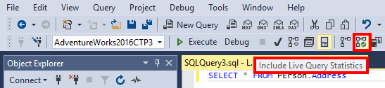
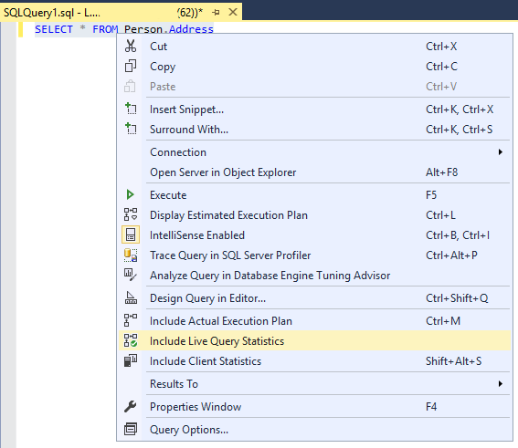
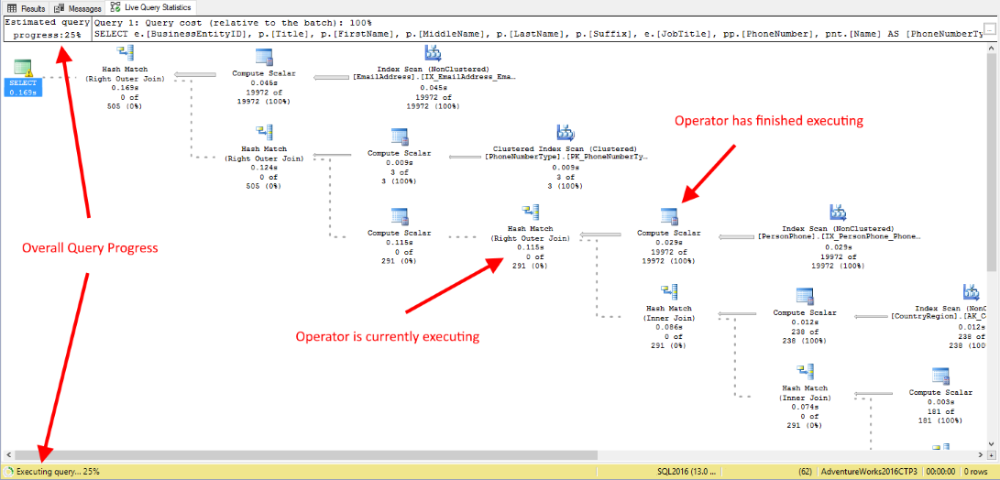
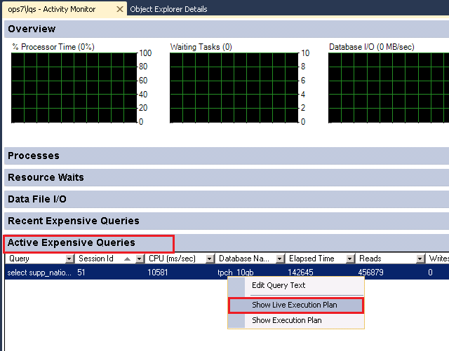

# Live Query Statistics
[!INCLUDE [SQL Server Azure SQL Database Azure SQL Managed Instance](../../includes/applies-to-version/sql-asdb-asdbmi.md)]

[!INCLUDE[ssManStudioFull](../../includes/ssmanstudiofull-md.md)] provides the ability to view the live execution plan of an active query. This live query plan provides real-time insights into the query execution process as the controls flow from one [query plan operator](../../relational-databases/showplan-logical-and-physical-operators-reference.md) to another. The live query plan displays the overall query progress and operator-level run-time execution statistics such as the number of rows produced, elapsed time, operator progress, etc. Because this data is available in real time without needing to wait for the query to complete, these execution statistics are extremely useful for debugging query performance issues. This feature is available starting with [!INCLUDE[sssql16-md](../../includes/sssql16-md.md)] [!INCLUDE[ssManStudio](../../includes/ssmanstudio-md.md)], however it can work with [!INCLUDE[ssSQL14](../../includes/sssql14-md.md)].  

> [!NOTE]
> Internally, live query statistics leverages the [sys.dm_exec_query_profiles](../../relational-databases/system-dynamic-management-views/sys-dm-exec-query-profiles-transact-sql.md) DMV.
  
**Applies to**: [!INCLUDE[ssNoVersion](../../includes/ssnoversion-md.md)] (starting with [!INCLUDE[ssSQL14](../../includes/sssql14-md.md)]) and [!INCLUDE[ssSDSfull](../../includes/sssdsfull-md.md)].  
  
> [!WARNING]  
> This feature is primarily intended for troubleshooting purposes. Using this feature can moderately slow the overall query performance, especially in [!INCLUDE[ssSQL14](../../includes/sssql14-md.md)]. For more information, see [Query Profiling Infrastructure](../../relational-databases/performance/query-profiling-infrastructure.md).  
> This feature can be used with the [Transact-SQL Debugger](../../ssms/scripting/configure-firewall-rules-before-running-the-tsql-debugger.md).  
  
## To view live query statistics for one query 
  
1.  To view the live query execution plan, on the tools menu click the **Include Live Query Statistics** icon.  
  
       
  
     You can also view access the live query execution plan by right-clicking on a selected query in [!INCLUDE[ssManStudio](../../includes/ssmanstudio-md.md)] and then click **Include Live Query Statistics**.  
  
       
  
2.  Now execute the query. The live query plan displays the overall query progress and the run-time execution statistics (e.g. elapsed time, progress, etc.) for the query plan operators. The query progress information and execution statistics are periodically updated while query execution is in progress. Use this information to understand the overall query execution process and to debug long running queries, queries that run indefinitely, queries that cause tempdb overflow, and timeout issues.  
  
       
  
## To view live query statistics for any query 

The live execution plan can also be accessed from the **[Activity Monitor](../../relational-databases/performance-monitor/activity-monitor.md)** by right-clicking on any query in the **Processes** or **Active Expensive Queries** table.  
  
   
  
## Remarks  
 The statistics profile infrastructure must be enabled before live query statistics can capture information about the progress of queries. Depending on the version, the overhead may be significant. For more information on this overhead, see [Query Profiling Infrastructure](../../relational-databases/performance/query-profiling-infrastructure.md).
  
## Permissions  
Requires the database level `SHOWPLAN` permission to populate the **Live Query Statistics** results page, and requires any permissions necessary to execute the query.
On [!INCLUDE[ssNoVersion](../../includes/ssnoversion-md.md)], requires the server level `VIEW SERVER STATE` permission to see the live statistics.  
On [!INCLUDE[ssSDS](../../includes/sssds-md.md)] Premium Tiers, requires the `VIEW DATABASE STATE` permission in the database to see the live statistics. On [!INCLUDE[ssSDS](../../includes/sssds-md.md)] Standard and Basic Tiers, requires the **Server admin** or an **Azure Active Directory admin** account to see the live statistics.
  
## See Also  
 [Execution Plans](../../relational-databases/performance/execution-plans.md)    
 [Query Processing Architecture Guide](../../relational-databases/query-processing-architecture-guide.md)    
 [Monitor and Tune for Performance](../../relational-databases/performance/monitor-and-tune-for-performance.md)     
 [Performance Monitoring and Tuning Tools](../../relational-databases/performance/performance-monitoring-and-tuning-tools.md)     
 [Open Activity Monitor &#40;SQL Server Management Studio&#41;](../../relational-databases/performance-monitor/open-activity-monitor-sql-server-management-studio.md)     
 [Activity Monitor](../../relational-databases/performance-monitor/activity-monitor.md)     
 [Monitoring Performance By Using the Query Store](../../relational-databases/performance/monitoring-performance-by-using-the-query-store.md)     
 [sys.dm_exec_query_statistics_xml](../../relational-databases/system-dynamic-management-views/sys-dm-exec-query-statistics-xml-transact-sql.md)     
 [sys.dm_exec_query_profiles](../../relational-databases/system-dynamic-management-views/sys-dm-exec-query-profiles-transact-sql.md)     
 [Trace flags](../../t-sql/database-console-commands/dbcc-traceon-trace-flags-transact-sql.md)    
 [Showplan Logical and Physical Operators Reference](../../relational-databases/showplan-logical-and-physical-operators-reference.md)     
 [Query Profiling Infrastructure](../../relational-databases/performance/query-profiling-infrastructure.md)
