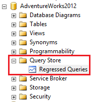

# Monitoring performance by using the Query Store
[!INCLUDE[appliesto-ss-asdb-xxx-xxx-md](../../includes/appliesto-ss-asdb-xxxx-xxx-md.md)]

  The [!INCLUDE[ssNoVersion](../../includes/ssnoversion-md.md)] Query Store feature provides you with insight on query plan choice and performance. It simplifies performance troubleshooting by helping you quickly find performance differences caused by query plan changes. Query Store automatically captures a history of queries, plans, and runtime statistics, and retains these for your review. It separates data by time windows so you can see database usage patterns and understand when query plan changes happened on the server. You can configure query store using the [ALTER DATABASE SET](../../t-sql/statements/alter-database-transact-sql-set-options.md) option. 
  
 For information about operating the Query Store in Azure [!INCLUDE[ssSDS](../../includes/sssds-md.md)], see [Operating the Query Store in Azure SQL Database](https://azure.microsoft.com/documentation/articles/sql-database-operate-query-store/).  
 
> [!IMPORTANT]
> If you are using Query Store for just in time workload insights in [!INCLUDE[ssSQL15](../../includes/sssql15-md.md)], plan to install the performance scalability fixes in [KB 4340759](https://support.microsoft.com/help/4340759) as soon as possible. 
  
##  <a name="Enabling"></a> Enabling the Query Store  
 Query Store is not active for new databases by default.  
  
#### Use the Query Store Page in [!INCLUDE[ssManStudioFull](../../includes/ssmanstudiofull-md.md)]  
  
1.  In Object Explorer, right-click a database, and then click **Properties**.  
  
    > [!NOTE]  
    > Requires at least version 16 of [!INCLUDE[ssManStudio](../../includes/ssmanstudio-md.md)].  
  
2.  In the **Database Properties** dialog box, select the **Query Store** page.  
  
3.  In the **Operation Mode (Requested)** box, select **Read Write**.  
  
#### Use Transact-SQL Statements  
  
Use the **ALTER DATABASE** statement to enable the query store. For example:  
  
```sql  
ALTER DATABASE AdventureWorks2012 SET QUERY_STORE (OPERATION_MODE = READ_WRITE); 
```  
  
For more syntax options related to the query store, see [ALTER DATABASE SET Options &#40;Transact-SQL&#41;](../../t-sql/statements/alter-database-transact-sql-set-options.md).  
  
> [!NOTE]  
> You cannot enable the query store for the **master** or **tempdb** database.  
 
> [!IMPORTANT]
> For information on enabling Query Store and keeping it adjusted to your workload, refer to [Best Practice with the Query Store](../../relational-databases/performance/best-practice-with-the-query-store.md#Configure).
 
## <a name="About"></a> Information in the Query Store  
 Execution plans for any specific query in [!INCLUDE[ssNoVersion](../../includes/ssnoversion-md.md)] typically evolve over time due to a number of different reasons such as statistics changes, schema changes, creation/deletion of indexes, etc. The procedure cache (where cached query plans are stored) only stores the latest execution plan. Plans also get evicted from the plan cache due to memory pressure. As a result, query performance regressions caused by execution plan changes can be non-trivial and time consuming to resolve.  
  
 Since the query store retains multiple execution plans per query, it can enforce policies to direct the query processor to use a specific execution plan for a query. This is referred to as plan forcing. Plan forcing in Query Store is provided by using a mechanism similar to the [USE PLAN](../../t-sql/queries/hints-transact-sql-query.md) query hint, but it does not require any change in user applications. Plan forcing can resolve a query performance regression caused by a plan change in a very short period of time.  

> [!NOTE]
> Query Store collects plans for DML Statements such as SELECT, INSERT, UPDATE, DELETE, MERGE, and BULK INSERT.

 **Wait stats** are another source of information that helps to troubleshoot performance in SQL Server. For a long time, wait statistics were available only on instance level, which made it hard to backtrack it to the actual query. In SQL Server 2017 and Azure SQL Database we added another dimension in Query Store that tracks wait stats. 

 Common scenarios for using the Query Store feature are:  
  
-   Quickly find and fix a plan performance regression by forcing the previous query plan. Fix queries that have recently regressed in performance due to execution plan changes.  
-   Determine the number of times a query was executed in a given time window, assisting a DBA in troubleshooting performance resource problems.  
-   Identify top *n* queries (by execution time, memory consumption, etc.) in the past *x* hours.  
-   Audit the history of query plans for a given query.  
-   Analyze the resource (CPU, I/O, and Memory) usage patterns for a particular database.  
-   Identify top n queries that are waiting on resources. 
-   Understand wait nature for a particular query or plan.
  
The query store contains three stores:
- a **plan store** for persisting the execution plan information.     
- a **runtime stats store** for persisting the execution statistics information.    
- a **wait stats store** for persisting wait statistics information.     
 
The number of unique plans that can be stored for a query in the plan store is limited by the **max_plans_per_query** configuration option. To enhance performance, the information is written to the stores asynchronously. To minimize space usage, the runtime execution statistics in the runtime stats store are aggregated over a fixed time window. The information in these stores is visible by querying the query store catalog views.  
  
The following query returns information about queries and plans in the query store.  
  
```sql  
SELECT Txt.query_text_id, Txt.query_sql_text, Pl.plan_id, Qry.*  
FROM sys.query_store_plan AS Pl  
INNER JOIN sys.query_store_query AS Qry  
    ON Pl.query_id = Qry.query_id  
INNER JOIN sys.query_store_query_text AS Txt  
    ON Qry.query_text_id = Txt.query_text_id ;  
```  
 
##  <a name="Regressed"></a> Use the Regressed Queries Feature  
After enabling the query store, refresh the database portion of the Object Explorer pane to add the **Query Store** section.  
  
    
  
Select **Regressed Queries** to open the **Regressed Queries** pane in [!INCLUDE[ssManStudioFull](../../includes/ssmanstudiofull-md.md)]. The Regressed Queries pane shows you the queries and plans in the query store. Use the drop down boxes at the top to filter queries based on various criteria: **Duration (ms)** (Default), CPU Time (ms), Logical Reads (KB), Logical Writes (KB), Physical Reads (KB), CLR Time (ms), DOP, Memory Consumption (KB), Row Count, Log Memory Used (KB), Temp DB Memory Used (KB), and Wait Time (ms).  
Select a plan to see the graphical query plan. Buttons are available to view the source query, force and unforce a query plan, toggle between grid and chart formats, compare selected plans (if more than one is selected), and refresh the display.  
  
  
  
To force a plan, select a query and plan, and then click **Force Plan**. You can only force plans that were saved by the query plan feature and are still retained in the query plan cache.

##  <a name="Waiting"></a> Finding wait queries

Starting with [!INCLUDE[ssSQL17](../../includes/sssql17-md.md)] CTP 2.0 and [!INCLUDE[ssSDSfull](../../includes/sssdsfull-md.md)], wait statistics per query over time are available in Query Store. 
In Query Store, wait types are combined into **wait categories**. The mapping of wait categories to wait types is available in [sys.query_store_wait_stats &#40;Transact-SQL&#41;](../../relational-databases/system-catalog-views/sys-query-store-wait-stats-transact-sql.md#wait-categories-mapping-table).

Select **Query Wait Statistics** to open the **Query Wait Statistics** pane in [!INCLUDE[ssManStudioFull](../../includes/ssmanstudiofull-md.md)] v18 or higher. The Query Wait Statistics pane shows you a bar chart containing the top wait categories in the Query Store. Use the drop down at the top to select an aggregate criteria for the wait time: avg, max, min, std dev, and **total** (default).

 

Select a wait category by clicking on the bar and a detail view on the selected wait category displays. This new bar chart contains the queries that contributed to that wait category. 
  
 

Use the drop down box at the top to filter queries based on various wait time criteria for the selected wait category: avg, max, min, std dev, and **total** (default). Select a plan to see the graphical query plan. Buttons are available to view the source query, force, and unforce a query plan, and refresh the display.  

**Wait categories** are combining different wait types into buckets similar by nature. Different wait categories require a different follow up analysis to resolve the issue, but wait types from the same category lead to very similar troubleshooting experiences, and providing the affected query on top of waits would be the missing piece to complete the majority of such investigations successfully.

Here are some examples how you can get more insights into your workload before and after introducing wait categories in Query Store:

|||| 
|-|-|-|  
|Previous experience|New experience|Action|
|High RESOURCE_SEMAPHORE waits per database|High Memory waits in Query Store for specific queries|Find the top memory consuming queries in Query Store. These queries are probably delaying further progress of the affected queries. Consider using MAX_GRANT_PERCENT query hint for these queries, or for the affected queries.|
|High LCK_M_X waits per database|High Lock waits in Query Store for specific queries|Check the query texts for the affected queries and identify the target entities. Look in Query Store for other queries modifying the same entity, which are executed frequently and/or have high duration. After identifying these queries, consider changing the application logic to improve concurrency, or use a less restrictive isolation level.|
|High PAGEIOLATCH_SH waits per database|High Buffer IO waits in Query Store for specific queries|Find the queries with a high number of physical reads in Query Store. If they match the queries with high IO waits, consider introducing an index on the underlying entity, in order to do seeks instead of scans, and thus minimize the IO overhead of the queries.|
|High SOS_SCHEDULER_YIELD waits per database|High CPU waits in Query Store for specific queries|Find the top CPU consuming queries in Query Store. Among them, identify the queries for which high CPU trend correlates with high CPU waits for the affected queries. Focus on optimizing those queries - there could be a plan regression, or perhaps a missing index.|

##  <a name="Options"></a> Configuration Options 
The following options are available to configure query store parameters.

*OPERATION_MODE*  
Can be **READ_WRITE** (default) or READ_ONLY.  
  
*CLEANUP_POLICY (STALE_QUERY_THRESHOLD_DAYS)*  
Configure the `STALE_QUERY_THRESHOLD_DAYS` argument to specify the number of days to retain data in the query store. The default value is 30. For [!INCLUDE[sqldbesa](../../includes/sqldbesa-md.md)] Basic edition, default is **7** days.
  
*DATA_FLUSH_INTERVAL_SECONDS*  
Determines the frequency at which data written to the query store is persisted to disk. To optimize for performance, data collected by the query store is asynchronously written to the disk. The frequency at which this asynchronous transfer occurs is configured via `DATA_FLUSH_INTERVAL_SECONDS`. The default value is **900** (15 min).  
  
*MAX_STORAGE_SIZE_MB*  
Configures the maximum size of the query store. If the data in the query store hits the `MAX_STORAGE_SIZE_MB` limit, the query store automatically changes the state from read-write to read-only and stops collecting new data.  The default value is 100 MB. For [!INCLUDE[sqldbesa](../../includes/sqldbesa-md.md)] Premium edition, default is **1 GB** and for [!INCLUDE[sqldbesa](../../includes/sqldbesa-md.md)] Basic edition, default is **10 MB**.
  
*INTERVAL_LENGTH_MINUTES*  
Determines the time interval at which runtime execution statistics data is aggregated into the query store. To optimize for space usage, the runtime execution statistics in the Runtime Stats Store are aggregated over a fixed time window. This fixed time window is configured via `INTERVAL_LENGTH_MINUTES`. The default value is **60**. 
  
*SIZE_BASED_CLEANUP_MODE*  
Controls whether the cleanup process will be automatically activated when total amount of data gets close to maximum size. Can be **AUTO** (default) or OFF.  
  
*QUERY_CAPTURE_MODE*  
Designates if the Query Store captures all queries, or relevant queries based on execution count and resource consumption, or stops adding new queries and just tracks current queries. Can be **ALL** (capture all queries), AUTO (ignore infrequent and queries with insignificant compile and execution duration) or NONE (stop capturing new queries). The default value on [!INCLUDE[ssNoVersion](../../includes/ssnoversion-md.md)] (from [!INCLUDE[ssSQL15](../../includes/sssql15-md.md)] to [!INCLUDE[ssCurrent](../../includes/sscurrent-md.md)]) is ALL, while on Azure [!INCLUDE[ssSDS](../../includes/sssds-md.md)] is AUTO.
  
*MAX_PLANS_PER_QUERY*  
An integer representing the maximum number of plans maintained for each query. The default value is **200**.  
 
*WAIT_STATS_CAPTURE_MODE*  
Controls if Query Store captures wait statistics information. Can be OFF or **ON** (default).  
 
Query the **sys.database_query_store_options** view to determine the current options of the query store. For more information about the values, see [sys.database_query_store_options](../../relational-databases/system-catalog-views/sys-database-query-store-options-transact-sql.md).  
  
For more information about setting options by using [!INCLUDE[tsql](../../includes/tsql-md.md)] statements, see [Option Management](#OptionMgmt).  
  
## <a name="Related"></a> Related Views, Functions, and Procedures  
 View and manage Query Store through [!INCLUDE[ssManStudio](../../includes/ssmanstudio-md.md)] or by using the following views and procedures.  

### Query Store Functions  
 Functions help operations with the Query Store. 
 
||| 
|-|-|  
|[sys.fn_stmt_sql_handle_from_sql_stmt &#40;Transact-SQL&#41;](../../relational-databases/system-functions/sys-fn-stmt-sql-handle-from-sql-stmt-transact-sql.md)|| 
  
### Query Store Catalog Views  
 Catalog views present information about the Query Store.  

||| 
|-|-|  
|[sys.database_query_store_options &#40;Transact-SQL&#41;](../../relational-databases/system-catalog-views/sys-database-query-store-options-transact-sql.md)|[sys.query_context_settings &#40;Transact-SQL&#41;](../../relational-databases/system-catalog-views/sys-query-context-settings-transact-sql.md)|  
|[sys.query_store_plan &#40;Transact-SQL&#41;](../../relational-databases/system-catalog-views/sys-query-store-plan-transact-sql.md)|[sys.query_store_query &#40;Transact-SQL&#41;](../../relational-databases/system-catalog-views/sys-query-store-query-transact-sql.md)|  
|[sys.query_store_query_text &#40;Transact-SQL&#41;](../../relational-databases/system-catalog-views/sys-query-store-query-text-transact-sql.md)|[sys.query_store_runtime_stats &#40;Transact-SQL&#41;](../../relational-databases/system-catalog-views/sys-query-store-runtime-stats-transact-sql.md)|  
|[sys.query_store_wait_stats &#40;Transact-SQL&#41;](../../relational-databases/system-catalog-views/sys-query-store-wait-stats-transact-sql.md)|[sys.query_store_runtime_stats_interval &#40;Transact-SQL&#41;](../../relational-databases/system-catalog-views/sys-query-store-runtime-stats-interval-transact-sql.md)|  
  
### Query Store Stored Procedures  
 Stored procedures configure the Query Store.  

||| 
|-|-|  
|[sp_query_store_flush_db &#40;Transact-SQL&#41;](../../relational-databases/system-stored-procedures/sp-query-store-flush-db-transact-sql.md)|[sp_query_store_reset_exec_stats &#40;Transact-SQL&#41;](../../relational-databases/system-stored-procedures/sp-query-store-reset-exec-stats-transact-sql.md)|  
|[sp_query_store_force_plan &#40;Transact-SQL&#41;](../../relational-databases/system-stored-procedures/sp-query-store-force-plan-transact-sql.md)|[sp_query_store_unforce_plan &#40;Transact-SQL&#41;](../../relational-databases/system-stored-procedures/sp-query-store-unforce-plan-transact-sql.md)|  
|[sp_query_store_remove_plan &#40;Transct-SQL&#41;](../../relational-databases/system-stored-procedures/sp-query-store-remove-plan-transct-sql.md)|[sp_query_store_remove_query &#40;Transact-SQL&#41;](../../relational-databases/system-stored-procedures/sp-query-store-remove-query-transact-sql.md)|  
|sp_query_store_consistency_check &#40;Transct-SQL&#41;||  
 
##  <a name="Scenarios"></a> Key Usage Scenarios  
  
###  <a name="OptionMgmt"></a> Option Management  
 This section provides some guidelines on managing Query Store feature itself.  
  
 **Is Query Store currently active?**  
  
 Query Store stores its data inside the user database and that is why it has size limit (configured  with `MAX_STORAGE_SIZE_MB`). If data in Query Store hits that limit Query Store will automatically change state from read-write to read-only and stop collecting new data.  
  
 Query [sys.database_query_store_options](../../relational-databases/system-catalog-views/sys-database-query-store-options-transact-sql.md) to determine if Query Store is currently active, and whether it is currently collects runtime stats or not.  
  
```sql  
SELECT actual_state, actual_state_desc, readonly_reason,   
    current_storage_size_mb, max_storage_size_mb  
FROM sys.database_query_store_options;  
```  
  
 Query Store status is determined by actual_state column. If it's different than the desired status, the `readonly_reason` column can give you more information.   
When Query Store size exceeds the quota, the feature will switch to readon_only mode.  
  
 **Get Query Store options**  
  
 To find out detailed information about Query Store status, execute following in a user database.  
  
```sql  
SELECT * FROM sys.database_query_store_options;  
```  
  
 **Setting Query Store interval**  
  
 You can override interval for aggregating query runtime statistics (default is 60 minutes).  
  
```sql  
ALTER DATABASE <database_name>   
SET QUERY_STORE (INTERVAL_LENGTH_MINUTES = 15);  
```  
  
 > [!NOTE]
 > Arbitrary values are not allowed for `INTERVAL_LENGTH_MINUTES`. Use one of the following: 1, 5, 10, 15, 30, 60, or 1440 minutes.  
  
 New value for interval is exposed through **sys.database_query_store_options** view.  
  
 **Query Store space usage**  
  
 To check current the Query Store size and limit execute the following statement in the user database.  
  
```sql  
SELECT current_storage_size_mb, max_storage_size_mb   
FROM sys.database_query_store_options;  
```  
  
 If the Query Store storage is full use the following statement to extend the storage.  
  
```sql  
ALTER DATABASE <database_name>   
SET QUERY_STORE (MAX_STORAGE_SIZE_MB = <new_size>);  
```  
  
 **Set all Query Store options**  
  
 You can set multiple Query Store options at once with a single ALTER DATABASE statement.  
  
```sql  
ALTER DATABASE <database name>   
SET QUERY_STORE (  
    OPERATION_MODE = READ_WRITE,  
    CLEANUP_POLICY = (STALE_QUERY_THRESHOLD_DAYS = 30),  
    DATA_FLUSH_INTERVAL_SECONDS = 3000,  
    MAX_STORAGE_SIZE_MB = 500,  
    INTERVAL_LENGTH_MINUTES = 15,  
    SIZE_BASED_CLEANUP_MODE = AUTO,  
    QUERY_CAPTURE_MODE = AUTO,  
    MAX_PLANS_PER_QUERY = 1000,
    WAIT_STATS_CAPTURE_MODE = ON 
);  
```  
  
 **Cleaning up the space**  
  
 Query Store internal tables are created in the PRIMARY filegroup during database creation and that configuration cannot be changed later. If you are running out of space you might want to clear older Query Store data by using the following statement.  
  
```sql  
ALTER DATABASE <db_name> SET QUERY_STORE CLEAR;  
```  
  
 Alternatively, you might want to clear up only ad-hoc query data, since it is less relevant for query optimizations and plan analysis but takes up just as much space.  
  
 **Delete ad-hoc queries** This deletes the queries that were only executed only once and that are more than 24 hours old.  
  
```sql  
DECLARE @id int  
DECLARE adhoc_queries_cursor CURSOR   
FOR   
SELECT q.query_id  
FROM sys.query_store_query_text AS qt  
JOIN sys.query_store_query AS q   
    ON q.query_text_id = qt.query_text_id  
JOIN sys.query_store_plan AS p   
    ON p.query_id = q.query_id  
JOIN sys.query_store_runtime_stats AS rs   
    ON rs.plan_id = p.plan_id  
GROUP BY q.query_id  
HAVING SUM(rs.count_executions) < 2   
AND MAX(rs.last_execution_time) < DATEADD (hour, -24, GETUTCDATE())  
ORDER BY q.query_id ;  
  
OPEN adhoc_queries_cursor ;  
FETCH NEXT FROM adhoc_queries_cursor INTO @id;  
WHILE @@fetch_status = 0  
    BEGIN   
        PRINT @id  
        EXEC sp_query_store_remove_query @id  
        FETCH NEXT FROM adhoc_queries_cursor INTO @id  
    END   
CLOSE adhoc_queries_cursor ;  
DEALLOCATE adhoc_queries_cursor;  
```  
  
 You can define your own procedure with different logic for clearing up data you no longer want.  
  
 The example above uses the **sp_query_store_remove_query** extended stored procedure for removing unnecessary data. You can also use:  
  
-   **sp_query_store_reset_exec_stats** to clear runtime statistics for a given plan.  
-   **sp_query_store_remove_plan** to remove a single plan.  
 
  
###  <a name="Peformance"></a> Performance Auditing and Troubleshooting  
 Query Store keeps a history of compilation and runtime metrics throughout query executions, allowing you to ask questions about your workload.  
  
 **Last *n* queries executed on the database?**  
  
```sql  
SELECT TOP 10 qt.query_sql_text, q.query_id,   
    qt.query_text_id, p.plan_id, rs.last_execution_time  
FROM sys.query_store_query_text AS qt   
JOIN sys.query_store_query AS q   
    ON qt.query_text_id = q.query_text_id   
JOIN sys.query_store_plan AS p   
    ON q.query_id = p.query_id   
JOIN sys.query_store_runtime_stats AS rs   
    ON p.plan_id = rs.plan_id  
ORDER BY rs.last_execution_time DESC;  
```  
  
 **Number of executions for each query?**  
  
```sql  
SELECT q.query_id, qt.query_text_id, qt.query_sql_text,   
    SUM(rs.count_executions) AS total_execution_count  
FROM sys.query_store_query_text AS qt   
JOIN sys.query_store_query AS q   
    ON qt.query_text_id = q.query_text_id   
JOIN sys.query_store_plan AS p   
    ON q.query_id = p.query_id   
JOIN sys.query_store_runtime_stats AS rs   
    ON p.plan_id = rs.plan_id  
GROUP BY q.query_id, qt.query_text_id, qt.query_sql_text  
ORDER BY total_execution_count DESC;  
```  
  
 **The number of queries with the longest average execution time within last hour?**  
  
```sql  
SELECT TOP 10 rs.avg_duration, qt.query_sql_text, q.query_id,  
    qt.query_text_id, p.plan_id, GETUTCDATE() AS CurrentUTCTime,   
    rs.last_execution_time   
FROM sys.query_store_query_text AS qt   
JOIN sys.query_store_query AS q   
    ON qt.query_text_id = q.query_text_id   
JOIN sys.query_store_plan AS p   
    ON q.query_id = p.query_id   
JOIN sys.query_store_runtime_stats AS rs   
    ON p.plan_id = rs.plan_id  
WHERE rs.last_execution_time > DATEADD(hour, -1, GETUTCDATE())  
ORDER BY rs.avg_duration DESC;  
```  
  
 **The number of queries that had the biggest average physical IO reads in last 24 hours, with corresponding average row count and execution count?**  
  
```sql  
SELECT TOP 10 rs.avg_physical_io_reads, qt.query_sql_text,   
    q.query_id, qt.query_text_id, p.plan_id, rs.runtime_stats_id,   
    rsi.start_time, rsi.end_time, rs.avg_rowcount, rs.count_executions  
FROM sys.query_store_query_text AS qt   
JOIN sys.query_store_query AS q   
    ON qt.query_text_id = q.query_text_id   
JOIN sys.query_store_plan AS p   
    ON q.query_id = p.query_id   
JOIN sys.query_store_runtime_stats AS rs   
    ON p.plan_id = rs.plan_id   
JOIN sys.query_store_runtime_stats_interval AS rsi   
    ON rsi.runtime_stats_interval_id = rs.runtime_stats_interval_id  
WHERE rsi.start_time >= DATEADD(hour, -24, GETUTCDATE())   
ORDER BY rs.avg_physical_io_reads DESC;  
```  
  
 **Queries with multiple plans?** These queries are especially interesting because they are candidates for regressions due to plan choice change. The following query identifies these queries along with all plans:  
  
```sql  
WITH Query_MultPlans  
AS  
(  
SELECT COUNT(*) AS cnt, q.query_id   
FROM sys.query_store_query_text AS qt  
JOIN sys.query_store_query AS q  
    ON qt.query_text_id = q.query_text_id  
JOIN sys.query_store_plan AS p  
    ON p.query_id = q.query_id  
GROUP BY q.query_id  
HAVING COUNT(distinct plan_id) > 1  
)  
  
SELECT q.query_id, object_name(object_id) AS ContainingObject,   
    query_sql_text, plan_id, p.query_plan AS plan_xml,  
    p.last_compile_start_time, p.last_execution_time  
FROM Query_MultPlans AS qm  
JOIN sys.query_store_query AS q  
    ON qm.query_id = q.query_id  
JOIN sys.query_store_plan AS p  
    ON q.query_id = p.query_id  
JOIN sys.query_store_query_text qt   
    ON qt.query_text_id = q.query_text_id  
ORDER BY query_id, plan_id;  
```  
  
 **Queries that recently regressed in performance (comparing different point in time)?** The following query example returns all queries for which execution time doubled in last 48 hours due to a plan choice change. Query compares all runtime stat intervals side by side.  
  
```sql  
SELECT   
    qt.query_sql_text,   
    q.query_id,   
    qt.query_text_id,   
    rs1.runtime_stats_id AS runtime_stats_id_1,  
    rsi1.start_time AS interval_1,   
    p1.plan_id AS plan_1,   
    rs1.avg_duration AS avg_duration_1,   
    rs2.avg_duration AS avg_duration_2,  
    p2.plan_id AS plan_2,   
    rsi2.start_time AS interval_2,   
    rs2.runtime_stats_id AS runtime_stats_id_2  
FROM sys.query_store_query_text AS qt   
JOIN sys.query_store_query AS q   
    ON qt.query_text_id = q.query_text_id   
JOIN sys.query_store_plan AS p1   
    ON q.query_id = p1.query_id   
JOIN sys.query_store_runtime_stats AS rs1   
    ON p1.plan_id = rs1.plan_id   
JOIN sys.query_store_runtime_stats_interval AS rsi1   
    ON rsi1.runtime_stats_interval_id = rs1.runtime_stats_interval_id   
JOIN sys.query_store_plan AS p2   
    ON q.query_id = p2.query_id   
JOIN sys.query_store_runtime_stats AS rs2   
    ON p2.plan_id = rs2.plan_id   
JOIN sys.query_store_runtime_stats_interval AS rsi2   
    ON rsi2.runtime_stats_interval_id = rs2.runtime_stats_interval_id  
WHERE rsi1.start_time > DATEADD(hour, -48, GETUTCDATE())   
    AND rsi2.start_time > rsi1.start_time   
    AND p1.plan_id <> p2.plan_id  
    AND rs2.avg_duration > 2*rs1.avg_duration  
ORDER BY q.query_id, rsi1.start_time, rsi2.start_time;  
```  
  
 If you want to see performance all regressions (not only those related to plan choice change) than just remove condition `AND p1.plan_id <> p2.plan_id` from the previous query.  

 **Queries that are waiting the most?**
 This query will return top 10 queries that wait the most. 
 
 ```sql 
  SELECT TOP 10
	qt.query_text_id,
	q.query_id,
	p.plan_id,
	sum(total_query_wait_time_ms) AS sum_total_wait_ms
FROM sys.query_store_wait_stats ws
JOIN sys.query_store_plan p ON ws.plan_id = p.plan_id
JOIN sys.query_store_query q ON p.query_id = q.query_id
JOIN sys.query_store_query_text qt ON q.query_text_id = qt.query_text_id
GROUP BY qt.query_text_id, q.query_id, p.plan_id
ORDER BY sum_total_wait_ms DESC
 ```
 
 **Queries that recently regressed in performance (comparing recent vs. history execution)?** The next query compares query execution based periods of execution. In this particular example the query compares execution in recent period (1 hour) vs. history period (last day) and identifies those that introduced `additional_duration_workload`. This metrics is calculated as a difference between recent average execution and history average execution multiplied by the number of recent executions. It actually represents how much of additional duration recent executions introduced compared to history:  
  
```sql  
--- "Recent" workload - last 1 hour  
DECLARE @recent_start_time datetimeoffset;  
DECLARE @recent_end_time datetimeoffset;  
SET @recent_start_time = DATEADD(hour, -1, SYSUTCDATETIME());  
SET @recent_end_time = SYSUTCDATETIME();  
  
--- "History" workload  
DECLARE @history_start_time datetimeoffset;  
DECLARE @history_end_time datetimeoffset;  
SET @history_start_time = DATEADD(hour, -24, SYSUTCDATETIME());  
SET @history_end_time = SYSUTCDATETIME();  
  
WITH  
hist AS  
(  
    SELECT   
        p.query_id query_id,   
        CONVERT(float, SUM(rs.avg_duration*rs.count_executions)) total_duration,   
        SUM(rs.count_executions) count_executions,  
        COUNT(distinct p.plan_id) num_plans   
     FROM sys.query_store_runtime_stats AS rs  
        JOIN sys.query_store_plan p ON p.plan_id = rs.plan_id  
    WHERE  (rs.first_execution_time >= @history_start_time   
               AND rs.last_execution_time < @history_end_time)  
        OR (rs.first_execution_time <= @history_start_time   
               AND rs.last_execution_time > @history_start_time)  
        OR (rs.first_execution_time <= @history_end_time   
               AND rs.last_execution_time > @history_end_time)  
    GROUP BY p.query_id  
),  
recent AS  
(  
    SELECT   
        p.query_id query_id,   
        CONVERT(float, SUM(rs.avg_duration*rs.count_executions)) total_duration,   
        SUM(rs.count_executions) count_executions,  
        COUNT(distinct p.plan_id) num_plans   
    FROM sys.query_store_runtime_stats AS rs  
        JOIN sys.query_store_plan p ON p.plan_id = rs.plan_id  
    WHERE  (rs.first_execution_time >= @recent_start_time   
               AND rs.last_execution_time < @recent_end_time)  
        OR (rs.first_execution_time <= @recent_start_time   
               AND rs.last_execution_time > @recent_start_time)  
        OR (rs.first_execution_time <= @recent_end_time   
               AND rs.last_execution_time > @recent_end_time)  
    GROUP BY p.query_id  
)  
SELECT   
    results.query_id query_id,  
    results.query_text query_text,  
    results.additional_duration_workload additional_duration_workload,  
    results.total_duration_recent total_duration_recent,  
    results.total_duration_hist total_duration_hist,  
    ISNULL(results.count_executions_recent, 0) count_executions_recent,  
    ISNULL(results.count_executions_hist, 0) count_executions_hist   
FROM  
(  
    SELECT  
        hist.query_id query_id,  
        qt.query_sql_text query_text,  
        ROUND(CONVERT(float, recent.total_duration/  
                   recent.count_executions-hist.total_duration/hist.count_executions)  
               *(recent.count_executions), 2) AS additional_duration_workload,  
        ROUND(recent.total_duration, 2) total_duration_recent,   
        ROUND(hist.total_duration, 2) total_duration_hist,  
        recent.count_executions count_executions_recent,  
        hist.count_executions count_executions_hist     
    FROM hist   
        JOIN recent   
            ON hist.query_id = recent.query_id   
        JOIN sys.query_store_query AS q   
            ON q.query_id = hist.query_id  
        JOIN sys.query_store_query_text AS qt   
            ON q.query_text_id = qt.query_text_id      
) AS results  
WHERE additional_duration_workload > 0  
ORDER BY additional_duration_workload DESC  
OPTION (MERGE JOIN);  
```  
 
###  <a name="Stability"></a> Maintaining Query Performance Stability  
For queries executed multiple times you may notice that [!INCLUDE[ssNoVersion](../../includes/ssnoversion-md.md)] uses different plans, resulting  in different resource utilization and duration. With Query Store you can detect when query performance regressed and determine the optimal plan within a period of interest. You can then force that optimal plan for future query execution.  
  
You can also identify inconsistent query performance for a query with parameters (either auto-parameterized or manually parameterized). Among different plans you can identify the plan which is fast and optimal enough for all or most of the parameter values and force that plan, keeping predictable performance for the wider set of user scenarios.  
  
### Force a plan for a query (apply forcing policy)

When a plan is forced for a certain query, [!INCLUDE[ssNoVersion](../../includes/ssnoversion-md.md)] tries to force the plan in the optimizer. If plan forcing fails, an XEvent is fired and the optimizer is instructed to optimize in the normal way.

```sql  
EXEC sp_query_store_force_plan @query_id = 48, @plan_id = 49;  
```  
  
When using **sp_query_store_force_plan** you can only force plans that were recorded by Query Store as a plan for that query. In other words, the only plans available for a query are those that were already used to execute that query while Query Store was active.  

#### <a name="ctp23"><a/> Plan forcing support for fast forward and static cursors
  
[!INCLUDE[sql-server-2019](../../includes/sssqlv15-md.md)] CTP 2.3 Query Store  supports the ability to force query execution plans for fast forward and static T-SQL and API cursors. Forcing is now supported via `sp_query_store_force_plan` or through SQL Server Management Studio Query Store reports.

### Remove plan forcing for a query

To rely again on the [!INCLUDE[ssNoVersion](../../includes/ssnoversion-md.md)] query optimizer to calculate the optimal query plan, use **sp_query_store_unforce_plan** to unforce the plan that was selected for the query.  
  
```sql  
EXEC sp_query_store_unforce_plan @query_id = 48, @plan_id = 49;  
```  


## See Also  
 [Best Practice with the Query Store](../../relational-databases/performance/best-practice-with-the-query-store.md)   
 [Using the Query Store with In-Memory OLTP](../../relational-databases/performance/using-the-query-store-with-in-memory-oltp.md)   
 [Query Store Usage Scenarios](../../relational-databases/performance/query-store-usage-scenarios.md)   
 [How Query Store Collects Data](../../relational-databases/performance/how-query-store-collects-data.md)   
 [Query Store Stored Procedures &#40;Transact-SQL&#41;](../../relational-databases/system-stored-procedures/query-store-stored-procedures-transact-sql.md)   
 [Query Store Catalog Views &#40;Transact-SQL&#41;](../../relational-databases/system-catalog-views/query-store-catalog-views-transact-sql.md)   
 [Monitor and Tune for Performance](../../relational-databases/performance/monitor-and-tune-for-performance.md)   
 [Performance Monitoring and Tuning Tools](../../relational-databases/performance/performance-monitoring-and-tuning-tools.md)   
 [Open Activity Monitor &#40;SQL Server Management Studio&#41;](../../relational-databases/performance-monitor/open-activity-monitor-sql-server-management-studio.md)   
 [Live Query Statistics](../../relational-databases/performance/live-query-statistics.md)   
 [Activity Monitor](../../relational-databases/performance-monitor/activity-monitor.md)   
 [sys.database_query_store_options &#40;Transact-SQL&#41;](../../relational-databases/system-catalog-views/sys-database-query-store-options-transact-sql.md)  
 [Operating the Query Store in Azure SQL Database](https://azure.microsoft.com/documentation/articles/sql-database-operate-query-store/) 
  
