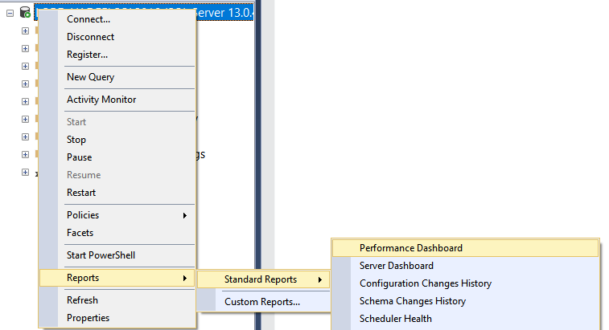
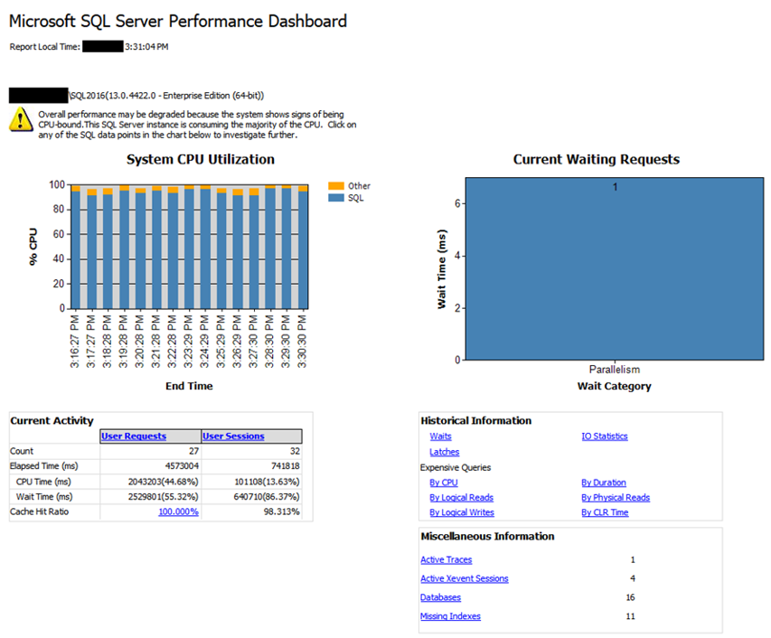

# Performance Dashboard
[!INCLUDE [SQL Server SQL MI](../../includes/applies-to-version/sql-asdbmi.md)]

[!INCLUDE[ssManStudioFull](../../includes/ssmanstudiofull-md.md)] version 17.2 and later includes the Performance Dashboard. This dashboard was designed to visually provide fast insight into the performance state of [!INCLUDE[ssNoVersion](../../includes/ssnoversion-md.md)] (Starting with [!INCLUDE[ssKatmai](../../includes/ssKatmai-md.md)]) and [!INCLUDE[ssazure_md](../../includes/ssazure_md.md)] Managed Instance. 

The Performance Dashboard helps to quickly identify whether [!INCLUDE[ssNoVersion](../../includes/ssnoversion-md.md)] or [!INCLUDE[ssazure_md](../../includes/ssazure_md.md)] is experiencing a performance bottleneck. And if a bottleneck is found, easily capture additional diagnostic data that may be necessary to resolve the problem. Some common performance problems which the Performance Dashboard can help identify include:
-  CPU bottlenecks (and what queries are consuming the most CPU)
-  I/O bottlenecks (and what queries are performing the most I/O)
-  Index recommendations generated by the Query Optimizer (missing indexes)
-  Blocking
-  Resource contention (including latch contention)

The Performance Dashboard also helps to identify expensive queries that may have been executed before, and several metrics are available to define high cost: CPU, Logical Writes, Logical Reads, Duration, Physical Reads, and CLR Time.

The Performance dashboard is divided into the following sections and sub-reports:
-  System CPU Utilization
-  Current Waiting Requests
-  Current Activity
   -  User Requests
   -  User Sessions
   -  Cache Hit Ratio
-  Historical Information
   -  Waits
   -  Latches
   -  I/O Statistics
   -  Expensive Queries
- Miscellaneous Information
  -  Active Traces
  -  Active xEvent Sessions
  -  Databases
  -  Missing Indexes

> [!NOTE] 
> Internally, the Performance Dashboard uses [Execution](../../relational-databases/system-dynamic-management-views/execution-related-dynamic-management-views-and-functions-transact-sql.md), [Index](../../relational-databases/system-dynamic-management-views/index-related-dynamic-management-views-and-functions-transact-sql.md), and [I/O](../../relational-databases/system-dynamic-management-views/i-o-related-dynamic-management-views-and-functions-transact-sql.md) related Dynamic Management Views (DMVs) and Functions (DMFs).

## To view the Performance Dashboard 
  
To view the Performance Dashboard, right-click on the [!INCLUDE[ssNoVersion](../../includes/ssnoversion-md.md)] instance name in Object Explorer, select **Reports**, **Standard Reports**, and click on **Performance Dashboard**.  
  
  
  
The Performance Dashboard will appear as a new tab. Below is an example where a CPU bottleneck is clearly present:  
  
  
  
## Remarks
The **Missing Indexes** report shows potentially missing indexes that the Query Optimizer identified during query compilation. However, these recommendations should not be taken at face value. Microsoft recommends that indexes with a score greater than 100,000 should be evaluated for creation, as those have the highest anticipated improvement for user queries. 

> [!TIP]
> Always evaluate if a new index suggestion is comparable to an existing index in the same table, where the same practical results can be achieved simply by changing an existing index instead of creating a new index. For example, given a new suggested index on columns C1, C2 and C3, first evaluate if there is an existing index over columns C1 and C2. If so, then it may be preferable to simply add column C3 to the existing index (preserving the order of pre-existing columns) to avoid creating a new index.
> For more information, see the [Index Architecture and Design Guide](../../relational-databases/sql-server-index-design-guide.md).

The **Waits** report filters out all idle and sleep waits. For more information about waits, see [sys.dm_os_wait_stats &#40;Transact-SQL&#41;](../../relational-databases/system-dynamic-management-views/sys-dm-os-wait-stats-transact-sql.md) and [SQL Server 2005 Performance Tuning Using Waits and Queues](https://download.microsoft.com/download/4/7/a/47a548b9-249e-484c-abd7-29f31282b04d/performance_tuning_waits_queues.doc).

The **Expensive Queries** reports are reset when [!INCLUDE[ssNoVersion](../../includes/ssnoversion-md.md)] restarts because the data in the underlying DMVs is cleared. Starting with [!INCLUDE[sssql16-md](../../includes/sssql16-md.md)], detailed information about expensive queries can be found in the Query Store. 

> [!NOTE]
> The Performance Dashboard was first released as a standalone download for [SQL Server 2005](https://techcommunity.microsoft.com/t5/SQL-Server-Support/SQL-Server-2005-Performance-Dashboard-Reports/ba-p/315415), and later updated for [SQL Server 2012](https://www.microsoft.com/download/details.aspx?id=29063). While the SQL Server Management Studio report renderer does not support clipboard access to text contained in the reports, the text can be accessed via the standalone reports.  Download the standlone reports if you need to copy query text from the reports.

## Permissions  
On [!INCLUDE[ssNoVersion](../../includes/ssnoversion-md.md)], requires `VIEW SERVER STATE` and `ALTER TRACE` permissions. 
On [!INCLUDE[ssazure_md](../../includes/ssazure_md.md)], requires the `VIEW DATABASE STATE` permission in the database.

## See Also  
 [Monitor and Tune for Performance](../../relational-databases/performance/monitor-and-tune-for-performance.md)     
 [Performance Monitoring and Tuning Tools](../../relational-databases/performance/performance-monitoring-and-tuning-tools.md)     
 [Open Activity Monitor &#40;SQL Server Management Studio&#41;](../../relational-databases/performance-monitor/open-activity-monitor-sql-server-management-studio.md)     
 [Activity Monitor](../../relational-databases/performance-monitor/activity-monitor.md)     
 [Monitoring Performance By Using the Query Store](../../relational-databases/performance/monitoring-performance-by-using-the-query-store.md)     
