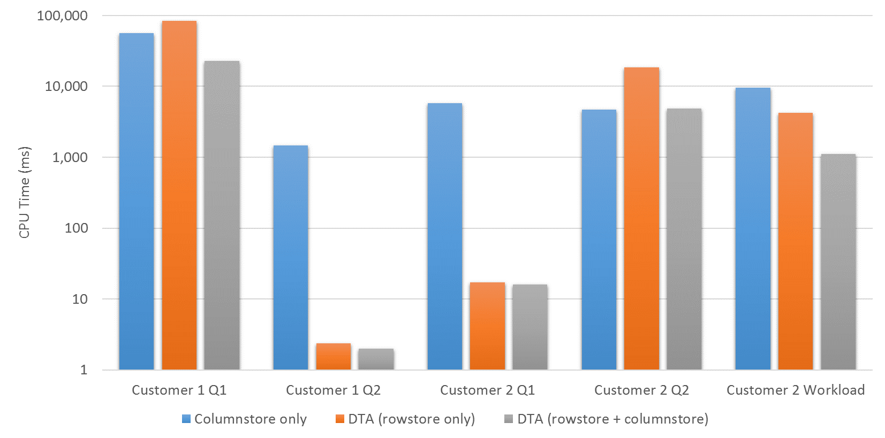

# Performance Improvements using DTA recommendations
[!INCLUDE[appliesto-ss-xxxx-xxxx-xxx-md](../../includes/appliesto-ss-xxxx-xxxx-xxx-md.md)]

---
The performance of data warehousing and analytic workloads can greatly benefit from **columnstore** indexes, particularly for queries that need to scan large tables. **Rowstore** (B+-tree) indexes are most effective for queries that access relatively small amounts of data searching for a particular value or range of values. Since rowstore indexes can deliver rows in sorted order, they can also reduce the cost of sorting in query execution plans. Therefore, the choice of which combination of rowstore and columnstore indexes to build is dependent on your application's workload.

The Database Engine Tuning Advisor (DTA), starting in SQL Server 2016, can recommend a suitable **combination of rowstore and columnstore** indexes by analyzing a given database workload. 

To demonstrate the benefits of DTA's recommendations on workload performance, we experimented with several real customer workloads. For each customer workload, we let DTA analyze individual queries as well as the full workload of queries. We consider three alternatives:
  
  1. **Columnstore only**: Build only columnstore indexes for all tables without using DTA. 
  2. **DTA (rowstore only)**: Run DTA with the option to recommend rowstore indexes only.
  3. **DTA (rowstore + columnstore)**: Run DTA with the option to recommend both rowstore and columnstore indexes.  
   
In each case, we then implemented the recommended indexes. We report the CPU Time (in milliseconds) averaged over multiple runs of the query or the workload. The figure below plots the CPU time in milliseconds for workloads across two different customer databases. Note that the y-axis (CPU Time) uses a logarithmic scale.   

**Need for mixed physical designs**: The first set of bars corresponding to Customer 1 Query 1. DTA (rowstore + columnstore) recommends a set of four columnstore and six rowstore indexes which results in 2.5X - 4X lower CPU time compared to columnstore index only and DTA (rowstore only). This demonstrates the benefits of mixed physical designs consisting of rowstore and columnstore indexes *even for a single query*. 

**Effectiveness of rowstore index recommendations**: The second and third set of bars (corresponding to Customer 1 Query 2 and Customer 2 Query 1) are cases where the queries have selective filter predicates that benefit from suitable rowstore indexes. For both these queries, DTA (rowstore only) and DTA (rowstore + columnstore) recommends rowstore indexes only. These examples also show that even when DTA is invoked with the option to recommend columnstore indexes, its cost-based approach ensures that it recommends a columnstore index only if the workload can actually benefit from it.

**Effectiveness of columnstore index recommendations**: The fourth set of bars corresponding to Customer 2 Query 2 represents a case where the query scans large tables which would benefit from columnstore indexes. DTA (rowstore only) generates a recommendation whose CPU Time is higher compared to when columnstore indexes are present. DTA (rowstore + columnstore) recommends suitable columnstore indexes, thus matching the query execution performance of the columnstore only option.

**Effectiveness of recommendations for workload with multiple queries**: The final set of bars corresponding to the full workload for Customer 2 exemplifies DTA's ability to analyze multiple queries in the workload to recommend a suitable set of rowstore and columnstore indexes which can improve the overall workload's execution cost. DTA (rowstore + columnstore) recommends four columnstore indexes and tens of rowstore indexes that result in over an order of magnitude improvement for the workload when compared to the option that builds only columnstore indexes; and about 4X-5X improvement when compared to DTA (rowstore only).

In summary, the above examples illustrate DTA's ability to suitably leverage both rowstore and columnstore indexes supported in the SQL Server Database Engine, and recommend an appropriate combination of indexes that can significantly reduce CPU Time for the workload. 

See Also
---
[Database Engine Tuning Advisor](../../relational-databases/performance/database-engine-tuning-advisor.md)

[Columnstore index recommendations in Database Engine Tuning Advisor (DTA)](../../relational-databases/performance/columnstore-index-recommendations-in-database-engine-tuning-advisor-dta.md)

[Columnstore Indexes Guide](~/relational-databases/indexes/columnstore-indexes-overview.md)

[Columnstore Indexes for Data Warehousing](~/relational-databases/indexes/columnstore-indexes-data-warehouse.md)

[CREATE COLUMNSTORE INDEX (Transact-SQL)](../../t-sql/statements/create-columnstore-index-transact-sql.md)

[CREATE INDEX (Transact-SQL)](../../t-sql/statements/create-index-transact-sql.md)

