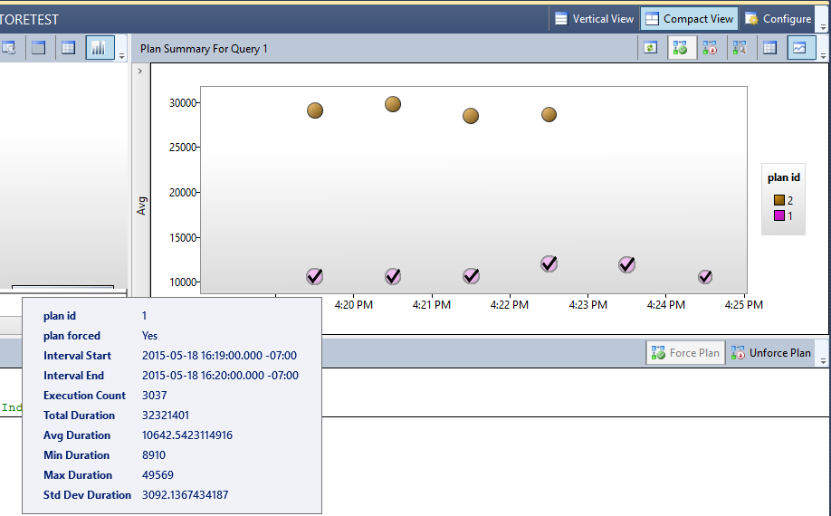
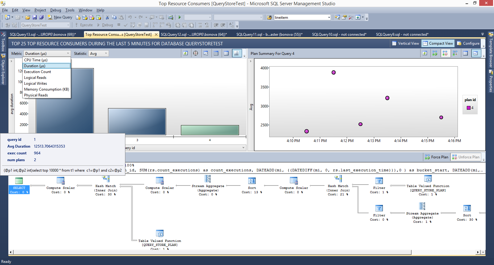
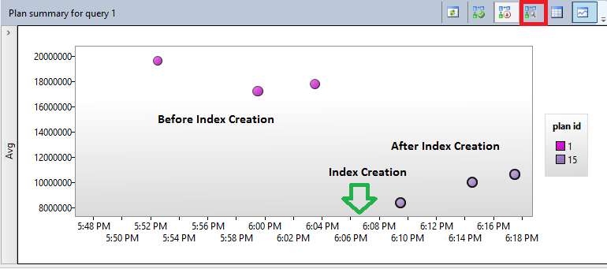
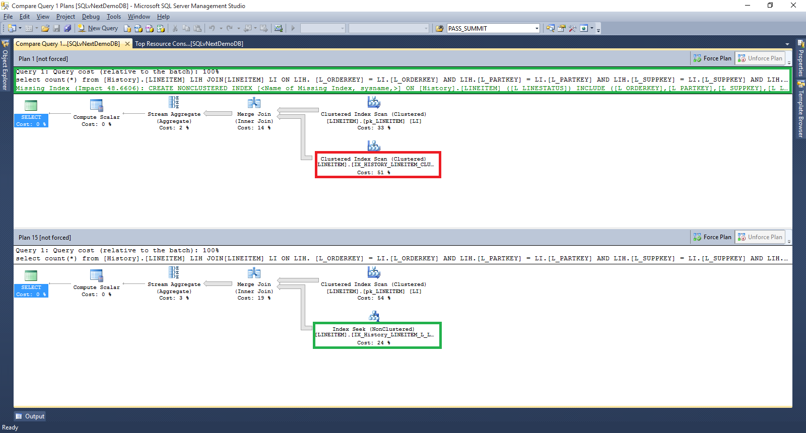
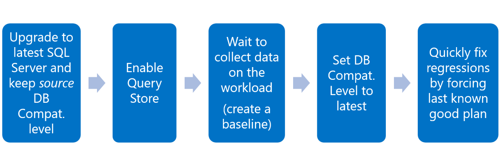
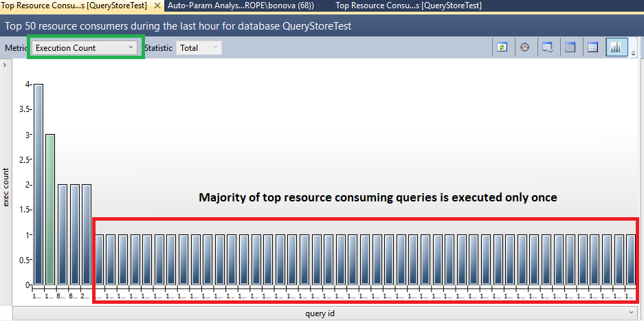
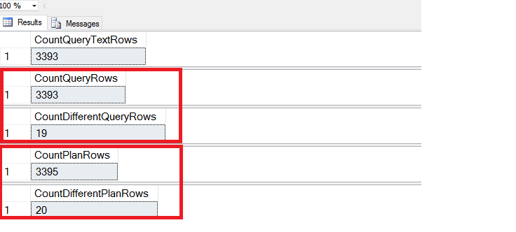
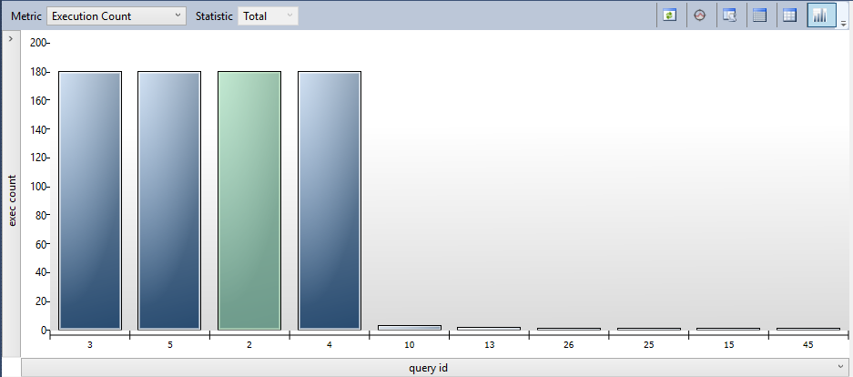

# Query Store Usage Scenarios
[!INCLUDE[appliesto-ss-asdb-asdw-xxx-md](../../includes/appliesto-ss-asdb-asdw-xxx-md.md)]

  Query Store can be used in wide set of scenarios when tracking and ensuring predictable workload performance is critical. Here are some examples you can consider:  
  
-   Pinpoint and fix queries with plan choice regressions  
-   Identify and tune top resource consuming queries  
-   A/B testing  
-   Keep performance stability during the upgrade to newer [!INCLUDE[ssNoVersion](../../includes/ssnoversion-md.md)]  
-   Identify and improve ad hoc workloads  
  
## Pinpoint and fix queries with plan choice regressions  
 During its regular query execution, Query Optimizer may decide to choose a different plan because important inputs became different: data cardinality has changed, indexes have been created, altered, or dropped, statistics have been updated, etc. For the most part, the new plan is better, or about the same than the plan used previously. However, there are cases when new plan is significantly worse - this situation is referred to as plan choice change regression. Prior to Query Store, it was an issue difficult to identify and fix as [!INCLUDE[ssNoVersion](../../includes/ssnoversion-md.md)] did not provide built-in data store, for users to look at for execution plans that were used over time.  
  
 With the Query Store, you can quickly:  
  
-   Identify all queries which execution metrics have been degraded, in the period of time of interest (last hour, day, week, etc.). Use **Regressed Queries** in [!INCLUDE[ssManStudioFull](../../includes/ssmanstudiofull-md.md)] to speed up your analysis.  
  
-   Among the regressed queries, it's easy to find those that had multiple plans and which degraded because of the bad plan choice. Use **Plan Summary** pane in **Regressed Queries** to visualize all plans for a regressed query and their query performance over time.  
  
-   Force the previous plan from the history, if it proved to be better. Use **Force Plan** button in **Regressed Queries** to force selected plan for the query.  
  
   
  
 For detailed description of the scenario refer to [Query Store: A flight data recorder for your database](https://azure.microsoft.com/blog/query-store-a-flight-data-recorder-for-your-database/) blog.  
  
## Identify and tune top resource consuming queries  
 Although your workload may generate thousands of queries, typically only a handful of them actually use the most of the system resources and therefore require your attention. Among top resource consuming queries, you will typically find queries that are either regressed or those that can be improved with additional tuning.  
  
 The easiest way to start exploration is to open **Top Resource Consuming Queries** in [!INCLUDE[ssManStudio](../../includes/ssmanstudio-md.md)]. User interface is separated into three panes: A histogram representing top resource consuming queries (left), a plan summary for selected query (right) and visual query plan for selected plan (bottom). Click the **Configure** button to control how many queries you want to analyze and the time interval of interest. Additionally, you can choose between different resource consumption dimensions (duration, CPU, memory, IO, number of executions) and the baseline (Average, Min, Max, Total, Standard Deviation).  
  
   
  
 Look at the plan summary on the right to analyze the execution history and learn about the different plans and their runtime statistics. Use the bottom pane to examine the different plans or to compare them visually, rendered side by side (use the Compare button).  
  
When you identify a query with suboptimal performance, your action depends on the nature of the problem:  
  
1.  If the query was executed with multiple plans and the last plan is significantly worse than previous plan, you can use the plan forcing mechanism to ensure [!INCLUDE[ssNoVersion](../../includes/ssnoversion-md.md)] will use the optimal plan for future executions  
  
2.  Check if the optimizer is suggesting any missing indexes in XML plan. If yes, create the missing index and use the Query Store to evaluate query performance after the index creation  
  
3.  Make sure that the statistics are up-to-date for the underlying tables used by the query.  
  
4.  Make sure that indexes used by the query are defragmented.  
  
5.  Consider rewriting expensive query. For example, take advantages of query parameterization and reduce usage of dynamic SQL. Implement optimal logic when read the data (apply data filtering on database side, not on application side).  
  
## A/B testing  
 Use Query Store to compare workload performance before and after the application change you plan to introduce. The following list contains several examples where you can use Query Store to assess impact of the environment or application change to the workload performance:  
  
-   Rolling out new application version.  
  
-   Adding new hardware to the server.  
  
-   Creating missing indexes on tables referenced by expensive queries.  
  
-   Applying filtering policy for row-level security. For more information, see [Optimizing Row Level Security with Query Store](https://blogs.msdn.com/b/sqlsecurity/archive/2015/07/21/optimizing-rls-performance-with-the-query-store.aspx).  
  
-   Adding temporal system-versioning to tables that are frequently modified by your OLTP applications.  
  
In any of these scenarios apply the following workflow:  
  
1.  Run your workload with the Query Store before the planned change to generate performance baseline.  
  
2.  Apply application change at the controlled moment in time.  
  
3.  Continue running the workload long enough to generate performance image of the system after the change  
  
4.  Compare results from #1 and #3.  
  
    1.  Open **Overall Database Consumption** to determine impact to the entire database.  
  
    2.  Open **Top Resource Consuming Queries** (or run your own analysis using [!INCLUDE[tsql](../../includes/tsql-md.md)]) to analyze impact of the change to the most important queries.  
  
5.  Decide whether to keep the change or perform roll back in case when new performance is unacceptable.  
  
The following illustration shows Query Store analysis (step 4) in case of missing index creation. Open **Top Resource Consuming Queries** / Plan summary pane to get this view for the query that should be impacted by the index creation:  
  
  
  
Additionally, you can compare plans before and after index creation by rendering them side by side. ("Compare the plans for the selected query in a separate window" toolbar option, which is marked with red square on the toolbar.)  
  
  
  
Plan before index creation (plan_id  = 1, above) has missing index hint and you can inspect that Clustered Index Scan was the most expensive operator in the query (red rectangle).  
  
Plan after missing index creation (plan_id  = 15, below) now has Index Seek (Nonclustered) which reduces the overall cost of the query and improves it performance (green rectangle).  
  
Based on analysis you would likely keep the index as query performance has been improved.  
  
## <a name="CEUpgrade"></a> Keep performance stability during the upgrade to newer [!INCLUDE[ssNoVersion](../../includes/ssnoversion-md.md)]  
Prior to [!INCLUDE[ssSQL14](../../includes/sssql14-md.md)], users were exposed to the risk of performance regression during the upgrade to the latest platform version. The reason for that was the fact that latest version of Query Optimizer became active immediately once new bits are installed.  
  
Starting with [!INCLUDE[ssSQL14](../../includes/sssql14-md.md)] all Query Optimizer changes are tied to the latest [database compatibility level](../../relational-databases/databases/view-or-change-the-compatibility-level-of-a-database.md), so plans are not changed right at point of upgrade but rather when a user changes the `COMPATIBILITY_LEVEL` to the latest one. This capability, in combination with Query Store gives you a great level of control over the query performance in the upgrade process. Recommended upgrade workflow is shown in the following picture:  
  
  
  
1.  Upgrade [!INCLUDE[ssNoVersion](../../includes/ssnoversion-md.md)] without changing the database compatibility level. It doesn't expose the latest Query Optimizer changes but still provides newer [!INCLUDE[ssNoVersion](../../includes/ssnoversion-md.md)] features including Query Store.  
  
2.  Enable Query Store. For more information on this topic, see [Keep Query Store adjusted to your workload](../../relational-databases/performance/best-practice-with-the-query-store.md#Configure).

3.  Allow Query Store to capture queries and plans, and establishes a performance baseline with the source/previous database compatibility level. Stay at this step long enough to capture all plans and get a stable baseline. This can be the duration of a usual business cycle for a production workload.  
  
4.  Move to latest database compatibility level: get your workload exposed to the latest Query Optimizer changes and let it potentially create new plans.  
  
5.  Use Query Store for analysis and regression fixes: for the most part, the new Query Optimizer changes should produce better plans. However, Query Store will provide an easy way to identify plan choice regressions and fix them using a plan forcing mechanism. Starting with [!INCLUDE[ssSQL17](../../includes/sssql17-md.md)], when using the [Automatic Plan Correction](../../relational-databases/automatic-tuning/automatic-tuning.md#automatic-plan-correction) feature, this step becomes automatic.  

    a.  For cases where there are regressions, force the previously known good plan in the Query Store.  
  
    b.  If there are query plans that fail to force, or if performance is still insufficient, consider reverting the [database compatibility level](../../relational-databases/databases/view-or-change-the-compatibility-level-of-a-database.md) to the prior setting, and then engaging Microsoft Customer Support.  
  
## Identify and improve ad hoc workloads  
Some workloads do not have dominant queries that you can tune to improve overall application performance. Those workloads are typically characterized with relatively large number of different queries each of them consuming portion of system resources. Being unique, those queries are executed very rarely (usually only once, thus name ad hoc), so their runtime consumption is not critical. On the other hand, given that application is generating net new queries all the time, significant portion of system resources is spent on query compilation, which is not optimal. This is not ideal situation for Query Store either given that large number of queries and plans flood the space you have reserved which means that Query Store will likely end up in the read-only mode very quickly. If you activated **Size Based Cleanup Policy** ([highly recommended](best-practice-with-the-query-store.md) to keep Query Store always up and running), then background process will be cleaning Query Store structures most of the time also taking significant system resources.  
  
 **Top Resource Consuming Queries** view gives you first indication of the ad hoc nature of your workload:  
  
  
  
Use **Execution Count** metric to analyze whether your top queries are ad hoc (this requires you to run Query Store with `QUERY_CAPTURE_MODE = ALL`). From the diagram above, you can see that 90% of your **Top Resource Consuming Queries** are executed only once.  
  
Alternatively, you can run [!INCLUDE[tsql](../../includes/tsql-md.md)] script to get total number of query texts, queries, and plans in the system and determine how different they are by comparing the query_hash and plan_hash:  
  
```sql  
--Do cardinality analysis when suspect on ad hoc workloads
SELECT COUNT(*) AS CountQueryTextRows FROM sys.query_store_query_text;  
SELECT COUNT(*) AS CountQueryRows FROM sys.query_store_query;  
SELECT COUNT(DISTINCT query_hash) AS CountDifferentQueryRows FROM  sys.query_store_query;  
SELECT COUNT(*) AS CountPlanRows FROM sys.query_store_plan;  
SELECT COUNT(DISTINCT query_plan_hash) AS  CountDifferentPlanRows FROM  sys.query_store_plan;  
```  
  
This is one potential result you can get in case of workload with ad hoc queries:  
  
  
  
Query result shows that despite the large number of queries and plans in the Query Store their query_hash and query_plan_hash are actually not different. A ratio between unique query texts and unique query hashes, which is much bigger than 1, is an indication that workload is a good candidate for parameterization, as the only difference between the queries is literal constant (parameter) provided as part of the query text.  
  
Usually, this situation happens if your application generates queries (instead of invoking stored procedures or parameterized queries) or if it relies on object-relational mapping frameworks that generate queries by default.  
  
If you are in control of the application code, you may consider rewriting of the data access layer to utilize stored procedures or parameterized queries. However, this situation can be also significantly improved without application changes by forcing query parameterization for the entire database (all queries) or for the individual query templates with the same query_hash.  
  
Approach with individual query templates requires plan guide creation:  
  
```sql  
--Apply plan guide for the selected query template 
DECLARE @stmt nvarchar(max);  
DECLARE @params nvarchar(max);  
EXEC sp_get_query_template   
    N'<your query text goes here>',  
    @stmt OUTPUT,   
    @params OUTPUT;  
  
EXEC sp_create_plan_guide   
    N'TemplateGuide1',   
    @stmt,   
    N'TEMPLATE',   
    NULL,   
    @params,   
    N'OPTION (PARAMETERIZATION FORCED)';  
```  
  
Solution with plan guides is more precise but it requires more work.  
  
If all your queries (or the majority of them) are candidates for auto-parameterization, then changing `FORCED PARAMETERIZATION` for the entire database may be a better option:  
  
```sql  
--Apply forced parameterization for entire database  
ALTER DATABASE <database name> SET PARAMETERIZATION FORCED;  
```  

> [!NOTE]
> For more information on this topic, see [Guidelines for Using Forced Parameterization](../../relational-databases/query-processing-architecture-guide.md#ForcedParamGuide).

After you apply any of these steps, **Top Resource Consuming Queries** will show you different picture of your workload.  
  
  
  
In some cases, your application may generate lots of different queries which are not good candidates for auto-parameterization. In that case, you see large number of queries in the system but the ratio between unique queries and unique `query_hash` is likely close to 1.  
  
In that case, you may want to enable the [**Optimize for Ad hoc Workloads**](../../database-engine/configure-windows/optimize-for-ad-hoc-workloads-server-configuration-option.md) server option to prevent wasting cache memory on queries that won't likely be executed again. To prevent capture of those queries in the Query Store, set `QUERY_CAPTURE_MODE` to `AUTO`.  
  
```sql  
EXEC sys.sp_configure N'show advanced options', N'1' RECONFIGURE WITH OVERRIDE
GO
EXEC sys.sp_configure N'optimize for ad hoc workloads', N'1'
GO
RECONFIGURE WITH OVERRIDE
GO 
  
ALTER DATABASE [QueryStoreTest] SET QUERY_STORE CLEAR;  
ALTER DATABASE [QueryStoreTest] SET QUERY_STORE = ON   
    (OPERATION_MODE = READ_WRITE, QUERY_CAPTURE_MODE = AUTO);  
```  
  
## See Also  
 [Monitoring Performance By Using the Query Store](../../relational-databases/performance/monitoring-performance-by-using-the-query-store.md)   
 [Best Practice with the Query Store](../../relational-databases/performance/best-practice-with-the-query-store.md)  
  
  
