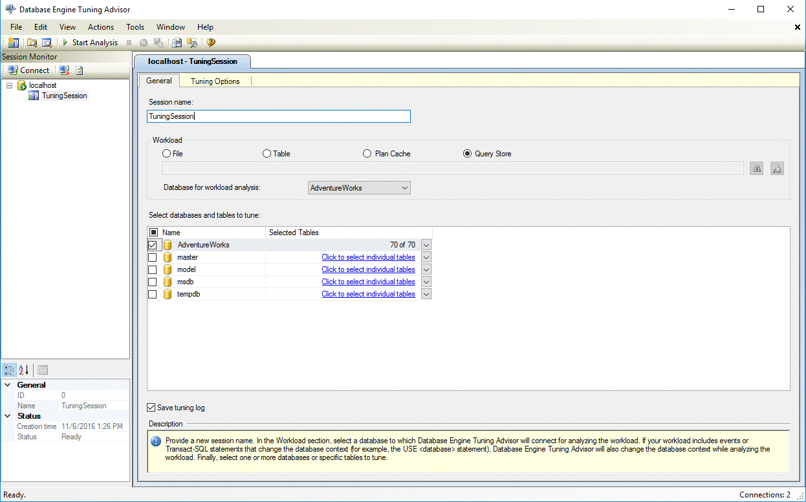

# Tuning Database Using Workload from Query Store with the Database Engine Tuning Advisor
 [!INCLUDE [SQL Server](../../includes/applies-to-version/sqlserver.md)]

The [Query Store](../../relational-databases/performance/how-query-store-collects-data.md) feature in [!INCLUDE[ssNoVersion](../../includes/ssnoversion-md.md)] automatically captures a history of queries, plans, and runtime statistics, and persists this information in the database. The [Database Engine Tuning Advisor (DTA)](../../relational-databases/performance/database-engine-tuning-advisor.md) supports a new option to use the Query Store to automatically select an appropriate workload for tuning. For many users, this can take away the need to explicitly collect a workload for tuning. 

This feature is only available if the database has the Query Store feature turned on. For more information, see [Enabling the Query Store](../../relational-databases/performance/monitoring-performance-by-using-the-query-store.md#Enabling).
  
This feature is available with [!INCLUDE[ssManStudioFull](../../includes/ssmanstudiofull-md.md)] **v16.4** or higher. 
  
## How To Tune a Workload from Query Store in Database Engine Tuning Advisor GUI
From the DTA GUI, select the radio button **Query Store** in the **General** pane to enable this feature (see figure below).

 
## How To Tune a Workload from Query Store in dta.exe command line Utility
From the command line (dta.exe), choose the **-iq** option to select the workload from Query Store. 

There are two additional options available via the command line that helps tune the behavior of DTA when selecting the workload from Query Store. These options not available via the GUI:
  1. **Number of workload events to tune**: This option, specified using **-n** command line argument, allows the user to control how many events from the Query Store are tuned. By default, DTA uses a value of 1000 for this option. DTA always chooses the most expensive events by total duration. 
  
  2. **Time windows of events to tune**: Since the Query Store may contain queries that have executed a long time ago, this option allows the user to specify a past time window (in hours) when a query must have executed for it to be considered by DTA for tuning. This option is specified using **-I** command line argument. 

See [dta Utility](../../tools/dta/dta-utility.md) for more information.

## Difference between using workload from Query Store and Plan Cache 

The difference between the Query Store and Plan Cache options is that the former contains a longer history of queries that have executed against the database, persisted across server restarts. On the other hand, the Plan Cache only contains a subset of recently executed queries whose plans are cached in memory. When the server restarts, the entries in the Plan Cache are discarded.

## Next steps

- [Database Engine Tuning Advisor](../../relational-databases/performance/database-engine-tuning-advisor.md)     
- [Tutorial: Database Engine Tuning Advisor](../../tools/dta/tutorial-database-engine-tuning-advisor.md)        
- [How Query Store Collects Data](../../relational-databases/performance/how-query-store-collects-data.md)     
- [Query Store Best Practices](../../relational-databases/performance/best-practice-with-the-query-store.md)
