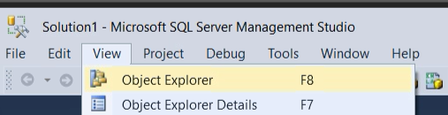
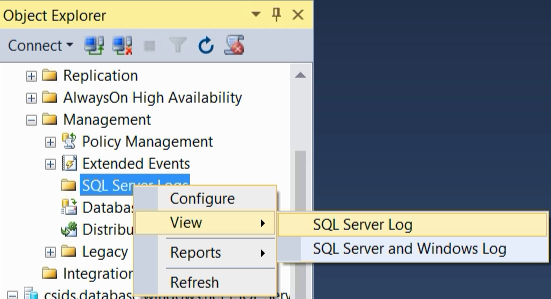

# View the SQL Server error log (SQL Server Management Studio)
[!INCLUDE[appliesto-ss-xxxx-xxxx-xxx-md](../../includes/appliesto-ss-xxxx-xxxx-xxx-md.md)]
The [!INCLUDE[ssNoVersion](../../includes/ssnoversion-md.md)] error log contains user-defined events and certain system events you can use for troubleshooting. 

## View the logs

1. In SQL Server Management Studio, select **Object Explorer**. To open **Object Explorer**, select F8. Or on the top menu, select **View**, and then select **Object Explorer**:
    
     

2. In **Object Explorer**, connect to an instance of SQL Server, and then expand that instance.
  
3. Find and expand the **Management** section (assuming you have permissions to see it).

4. Right-click **SQL Server Logs**, select **View**, and then choose **SQL Server Log**.

     
 
5. The **Log File Viewer** appears (it might take a moment) with a list of logs for you to view.
  
  ## See also
  For more information, see [MSSQLTips.com's](https://www.mssqltips.com/) helpful post [Identify location of the SQL Server Error Log file](https://www.mssqltips.com/sqlservertip/2506/identify-location-of-the-sql-server-error-log-file/).

