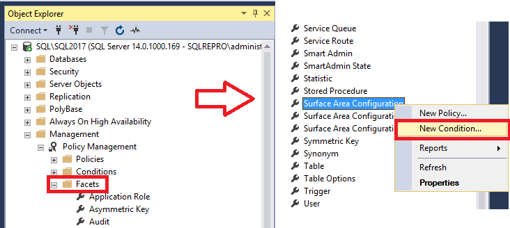
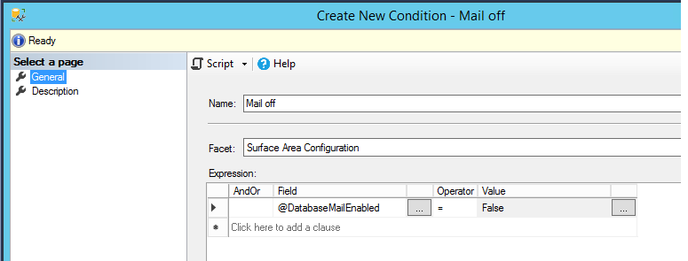
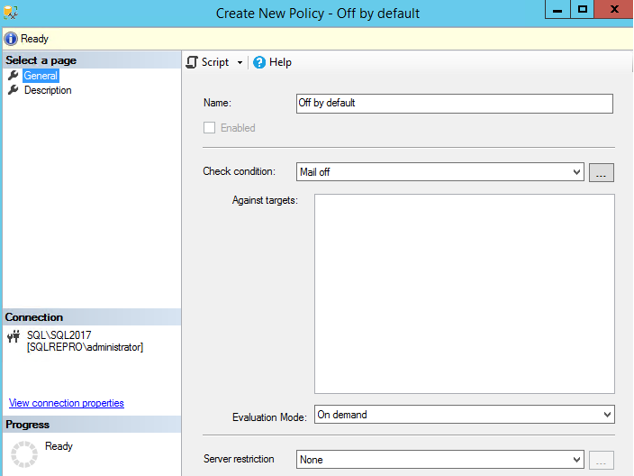
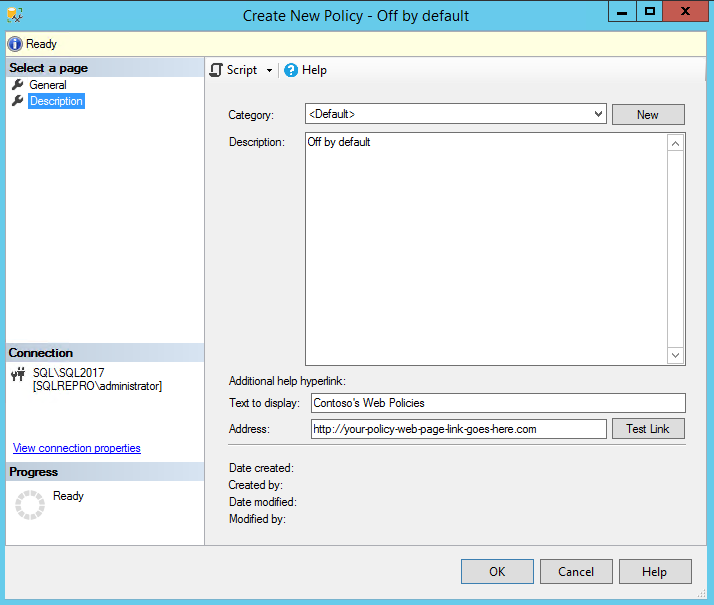
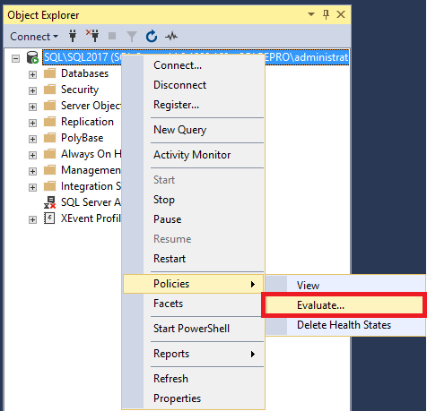
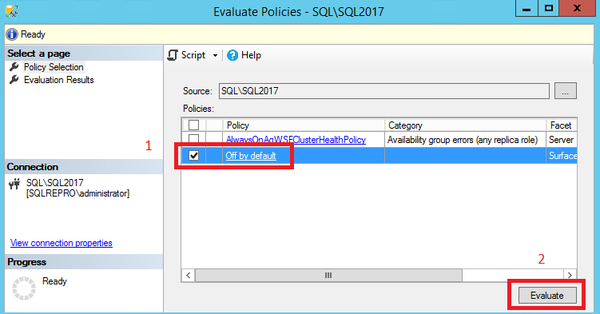
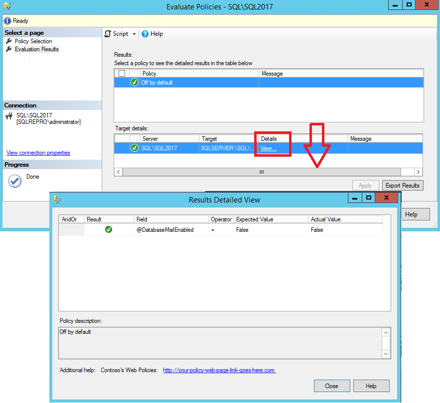

# Lesson 1: Create and Apply an Off By Default Policy
 [!INCLUDE [SQL Server](../../includes/applies-to-version/sqlserver.md)]
Using Policy-Based Management policies, you can administer one or more instances of [!INCLUDE[ssNoVersion](../../includes/ssnoversion-md.md)], one or more instance objects, server instances, one or more databases, or one or more database objects. As the database administrator, you want to ensure that certain servers do not have Database Mail enabled. In this lesson, you will create a condition and a policy that sets that server option. You will test the server to see whether it complies with the policy. Then, you will use the policy to reconfigure the server to bring the server into compliance.  

## Prerequisites
To complete this tutorial, you need SQL Server Management Studio, and access to a server that's running SQL Server. 

- Install [SQL Server Management Studio](../../ssms/download-sql-server-management-studio-ssms.md).
- Install [SQL Server 2017 Developer Edition](https://www.microsoft.com/sql-server/sql-server-downloads).
  
## Create the mail-off condition

1.  In Object Explorer, expand **Management**, expand **Policy Management**, expand **Facets**, right-click **Surface Area Configuration**, and then click **New Condition**.  

    
  
2.  In the **Create New Condition** dialog box, in the **Name** box, type **Mail Off**.   
    1. In the **Facet** box, confirm that **Surface Area Configuration** facet is selected.
    1. In the **Expression** area, in the **Field** box, select **\@DatabaseMailEnabled**, in the **Operator** box select **=**, and in the **Value** select **False**.  
    1. On the **Description** page, type a description of the condition, and then click **OK** to create the condition.  

     
  
## Create the off-by-default policy  
  
1.  In Object Explorer, right-click **Surface Area Configuration**, and then click **New Policy**.  
  
2.  In the **Create New Policy** dialog box, in the **Name** box, type **Off By Default**. 
    1. Leave the **Enabled** checkbox unchecked. The **Enabled** checkbox applies to automated policies, and this policy will be executed on demand.
    1. In the **Check condition** checkbox, scroll down to the **Surface Area Configuration** area, and then select **Mail Off** as the condition to check.
    1. The **Against targets** box will be blank because this is a server-scoped policy. 
    1. In the **Evaluation Mode** checkbox, select **On demand** as the evaluation mode.
    1. In the **Server restriction** checkbox, select **None**.
    1. On the **Description** page, type a description of the policy.  

    
  
9. On the description page, you can provide a hyperlink to a Web page for your policies in the **Additional help hyperlink** area. In the **Text to display** box, type the text that will appear for the hyperlink.
    1. In the **Address** box, type a hyperlink to a Help page, such as the home page for the IT department of your company.
    1. To confirm the address by opening the Web page, click **Test Link**.
    1. Select **OK**.

    

## Configure server to run off-by-default policy 

1.  In Object Explorer, right-click your instance of [!INCLUDE[ssNoVersion](../../includes/ssnoversion-md.md)], point to **Policies**, and then click **Evaluate**.  

    
  
2.  In the **Evaluate Policies** dialog box you can select policies from another instance of [!INCLUDE[ssNoVersion](../../includes/ssnoversion-md.md)] or from a file. For this step, leave **Source** set to your instance of the [!INCLUDE[ssDE](../../includes/ssde-md.md)].  
    1. In the **Policies** section, select the **Off By Default** policy.
    1. To see whether the server is in compliance with the policy, click **Evaluate**.
    1. In the **Results** area, you will see a green circle with a check mark if the [!INCLUDE[ssDE](../../includes/ssde-md.md)] complies with the policy. You will see a red circle with an X if the [!INCLUDE[ssDE](../../includes/ssde-md.md)] does not comply with the policy. 

   

  
6.  In the **Target Details** area, you will see additional information in the **Message** column if an error occurs. In the **Message** column, click **View** to see a report that contains the results of the check for each facet property that was checked. 

    
  
7.  The policy description is displayed at the bottom of the page, and the **Additional help** section displays the hyperlink that you have configured for the policy. Click the message hyperlink to open the Web page that you specified when you created the policy.   

1.  Close the browser, and then close the **Results Detailed View** dialog box.  

1. If the server is out of compliance and you want to disable Database Mail, click **Apply** in the **Evaluation Results** page.  
  
10. Close both the **Results Detailed View** and the **Evaluate Policies** dialog boxes.   

   
## Next Lesson  
[Lesson 2: Create and Apply a Naming Standards Policy](../../relational-databases/policy-based-management/lesson-2-create-and-apply-a-naming-standards-policy.md)  
  
  
