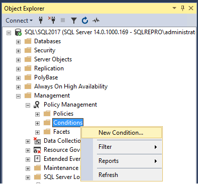
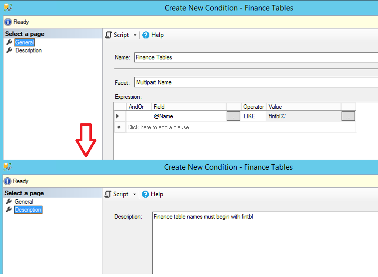
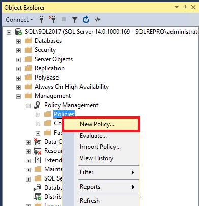
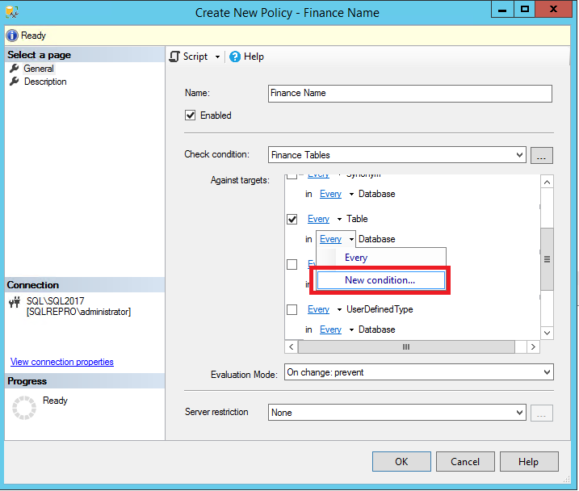
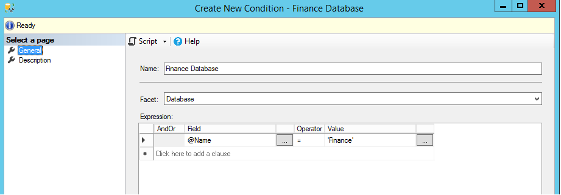
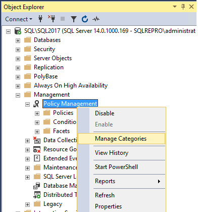
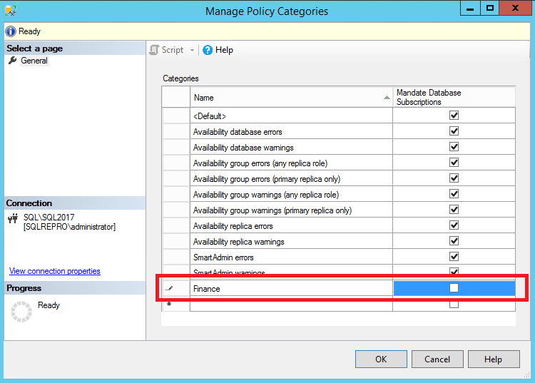
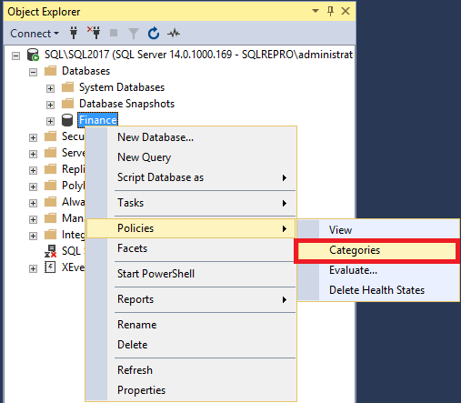
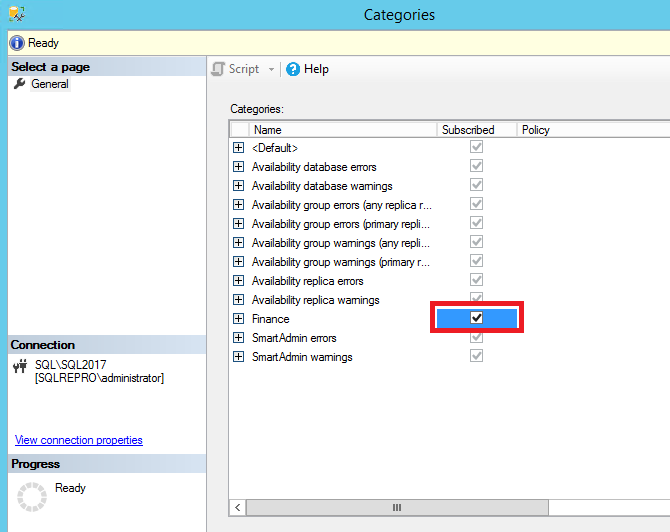

# Lesson 2: Create and Apply a Naming Standards Policy
[!INCLUDE[appliesto-ss-xxxx-xxxx-xxx-md](../../includes/appliesto-ss-xxxx-xxxx-xxx-md.md)]
Some types of Policy-Based Management policies can create triggers to enforce future compliance with the policy. In this lesson, you create a policy that enforces a naming standard for tables. Then, you test the policy by trying to create a table that violates the policy.  


## Prerequisites
To complete this tutorial, you need SQL Server Management Studio, access to a server that's running SQL Server.

- Install [SQL Server Management Studio](https://docs.microsoft.com/sql/ssms/download-sql-server-management-studio-ssms).
- Install [SQL Server 2017 Developer Edition](https://www.microsoft.com/sql-server/sql-server-downloads).
  
## Create the Finance database  
  
1.  In [!INCLUDE[ssManStudio](../../includes/ssmanstudio-md.md)], open a query window and execute the following statement:  
  
    ```sql  
    CREATE DATABASE Finance ;  
    GO  
    ```  
  
2.  In Object Explorer, click **Databases**, and then press F5 to refresh the list of databases.  


## Create the Finance tables condition 

1.  In Object Explorer, expand **Management**, expand **Policy Management**, right-click **Conditions**, and then click **New Condition**. 

   
  
2.  In the **Create New Condition** dialog box, in the **Name** box, type **Finance Tables**.  
    1. In the **Facet** list, select **Multipart Name**. 
    1. In the **Expression** area, in the **Field** box, select **@Name**; in the **Operator** box, select **Like**; and in the **Value** box, type ```'fintbl%'``` to force all table names to start with the letters **fintbl**.
    1. On the **Description** page, type **Finance table names must begin with fintbl**, and then click **OK** to create the condition.  

    
 
## Create the Finance name policy  
  
1.  In Object Explorer, right-click **Policies**, and then click **New Policy**.  

   
  
2.  In the **Create New Policy** dialog box, in the **Name** box, type **Finance Name**.
    1. In the **Check condition** list, select **Finance Tables**. This is in the **Multipart Name** area. 
    1. In the **Against** area you will see a list of the database objects that could apply this policy. Select the check box for **Every Table**.
    1. Select the **Enabled** list. (The **Enabled** box does not apply to **On demand** policies.)
    1. In the **Evaluation Mode** list, select **On change: prevent**. This will enforce the policy by creating a database trigger on the Finance database. 
    1. In the **Server restriction** list, select **None**. 
    1. On the **Description** page, add the description 'Table names in the Finance database must contain 'fintbl%'.' 
    1. Go back to the **General** page, and in the **Every Database** area, expand **Every**, and then click **New condition**.

    
  
6.  In the **Create New Condition** dialog box, in the **Name** box, type **Finance Database**.
    1. In the **Expression** box, complete the expression to include @Name = 'Finance', and then click **OK** to close the condition page. 
  
    

    > [!NOTE]  
    > You might have to tab out of the **Value** box to enable the **OK** button.  
  
11. [!INCLUDE[clickOK](../../includes/clickok-md.md)]  
  
## Create the Finance policy category  
  
1.  In Object Explorer, expand **Management**, right-click **Policy Management**, and then click **Manage Categories**.  

   
  
2.  In the **Manage Policy Categories** dialog box, under **Name**, type **Finance** in the blank box, and then clear **Mandate Database Subscriptions**. **Mandate Database Subscriptions** will force every database in the instance to subscribe to the policies that belong to this policy category. For this lesson, only the Finance database should subscribe to the Finance Name policy.  

    
  
3.  [!INCLUDE[clickOK](../../includes/clickok-md.md)]  

## Subscribe to the Finance policy category  
  
1.  In Object Explorer, expand **Databases**, right-click **Finance**, point to **Policies**, and then click **Categories**. 

   
  
2.  Select the **Subscribed** checkbox for the **Finance** category.  

   
  
3.  [!INCLUDE[clickOK](../../includes/clickok-md.md)]  
  
## Test the enforcement of the Finance Name policy  
  
1.  In [!INCLUDE[ssManStudio](../../includes/ssmanstudio-md.md)], open a query window. Execute the following statements that try to create a table that violates the **Finance Name** policy. The table violates the policy because the table name does not begin with the letters **fintbl**.  
  
    ```sql  
    USE Finance ;  
    GO  
    CREATE TABLE NewTable  
    (Col1 int) ;  
    GO    
    ```  
  
    Notice that the policy prevents the table from being created and returns an informational message that provides the policy name. 

   ```
     Policy 'Finance Name' has been violated by 'SQLSERVER:\SQL\SQL\SQL2017\Databases\Finance\Tables\dbo.NewTable'.
     This transaction will be rolled back.
     Policy condition: '@Name LIKE 'fintbl%''
     Policy description: 'Tables names in the Finance database must contain 'fintbl%''.
     Additional help: '' : ''
     Statement: 'CREATE TABLE NewTable  
         (Col1 int)'.
     Msg 515, Level 16, State 2, Procedure msdb.sys.sp_syspolicy_execute_policy, Line 69 [Batch Start Line 2]
     Cannot insert the value NULL into column 'target_query_expression', table 'msdb.dbo.syspolicy_policy_execution_history_details_internal'; column does not allow nulls. INSERT fails.
     The statement has been terminated.
   ``` 
  
2.  To provide a valid name, modify the code as follows and run the statement again.  
  
    ```sql  
    USE Finance ;  
    GO  
    CREATE TABLE fintblNewTable  
    (Col1 int) ;  
    GO    
    ```  
  
    This time, the table is created.  
  
## Apply the policy to the whole server  
  
1.  Currently, only the Finance database subscribes to the Finance policy category. In many cases, it is easier to apply the policy category to the whole server. In Object Explorer, expand **Management**, right-click **Policy Management**, and then click **Manage Categories**.  
  
2.  In the **Manage Policy Categories** dialog box, locate the Finance category, and select the **Mandate Database Subscriptions** checkbox for the Finance category.  
  
3.  [!INCLUDE[clickOK](../../includes/clickok-md.md)] Now the Finance category applies to all databases, but the condition that you have created restricts the Finance Name policy to the Finance database. This shows how you can use complex combinations of conditions to target policies in ways that will apply correctly on many servers.  
  
## Summary  
This tutorial has shown you how to create Policy-Based Management conditions, policies and policy groups, and how to apply filters and check the compliance of Policy-Based Management targets.  
  
## Next  
This tutorial is finished. To return to the start, visit [Tutorial: Administering Servers by Using Policy-Based Management](../../relational-databases/policy-based-management/tutorial-administering-servers-by-using-policy-based-management.md).  
  
For a list of tutorials, see [Tutorials for SQL Server 2016](../../sql-server/tutorials-for-sql-server-2016.md).  
  
## See Also  
[Administer Servers by Using Policy-Based Management](../../relational-databases/policy-based-management/administer-servers-by-using-policy-based-management.md)  
