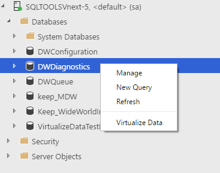
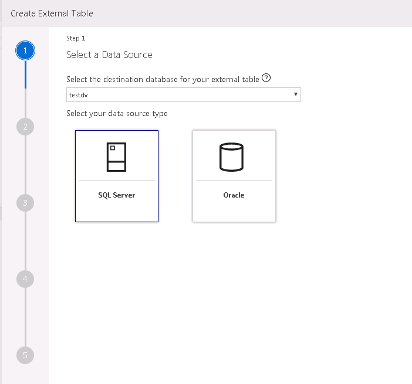
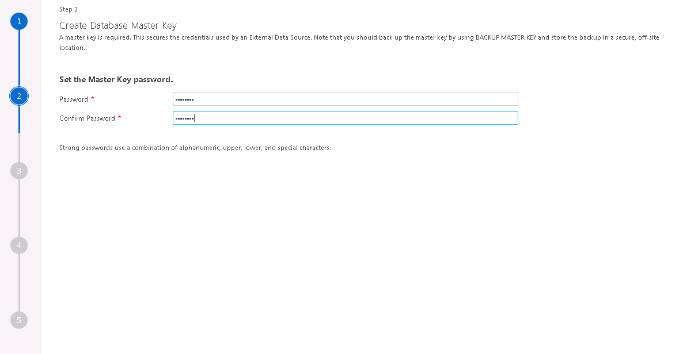
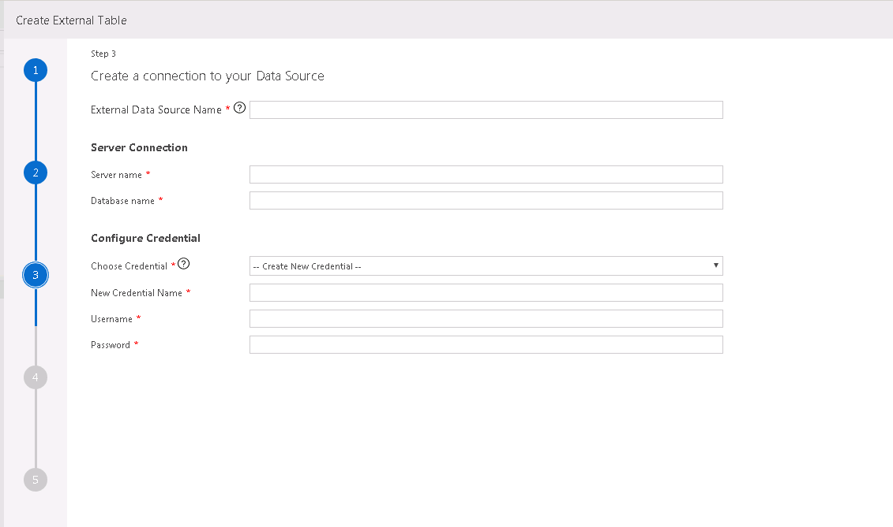
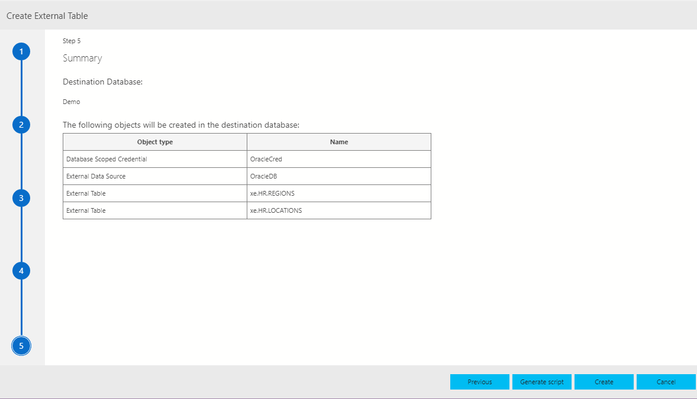
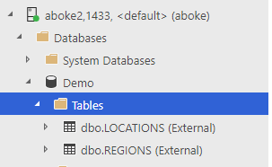
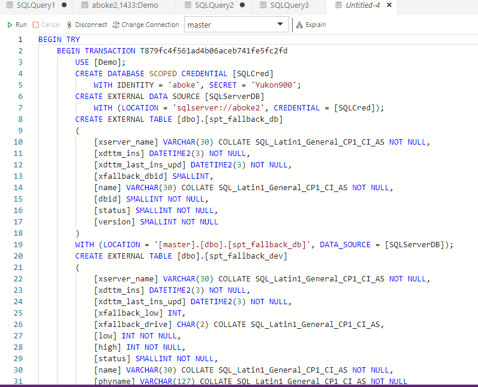

# Use the External Table Wizard with relational data sources

One of the key scenarios for SQL Server 2019 CTP 2.0 is the ability to virtualize data. This process allows the data to stay in its original location. You can *virtualize* the data in a SQL Server instance so that it can be queried there like any other table in SQL Server. This process minimizes the need for ETL processes. This process is possible with the use of PolyBase connectors. For more information on data virtualization, see [Get started with PolyBase](polybase-guide.md).

## Start the External Table wizard

Connect to the master instance by using the IP address/port number of the **sql-server-master** endpoint obtained by using [**mssqlctl cluster endpoints list**](../../big-data-cluster/deployment-guidance.md#endpoints) command. Expand your **Databases** node in the Object Explorer. Then select one of the databases where you want to virtualize the data from an existing SQL Server instance. Right-click the database, and select **Create External Table** to start the Virtualize Data wizard. You also can start the Virtualize Data wizard from the command palette. Use Ctrl+Shift+P in Windows, or use Cmd+Shift+P with a Mac.

## Select a data source

If you started the wizard from one of the databases, the destination drop-down box fills automatically. You also have the option to enter or change the destination database on this page. The external data source types supported by the wizard are SQL Server and Oracle.

> [!NOTE]
>SQL Server is highlighted by default.

Select **Next** to proceed.

## Create a database master key

In this step, you create a database master key. Creating a master key is required. A master key secures the credentials used by an external data source. Choose a strong password for your master key. Also, back up the master key by using **BACKUP MASTER KEY**. Store the backup in a secure off-site location.

> [!IMPORTANT]
> If you already have a database master key, the input fields are restricted and you can bypass this step. Select **Next** to proceed.

> [!NOTE]
> If you don't choose a strong password, the wizard does so in the last step. This is a known issue.

## Enter external data source credentials

In this step, enter your external data source and the credential details to create an external data source object. The credentials are used for the database object to connect to the data source. Enter a name for the external data source. An example is Test. Provide the external data source SQL Server connection details. Enter the **Server name** and the **Database name** where you want your external data source created.

The next step is to configure a credential. Enter a name for the credential. This name is the database scoped credential that's used to securely store the sign-in information for the external data source you create. An example is TestCred. Enter a username and password to connect to the data source.

## External data table mapping

On the next page, select the tables for which you want to create external views. When you select parent databases, the child tables are included, too. After you select tables, a mapping table appears on the right. Here, you can make changes to types. You also can change the name of the selected external table itself.

> [!NOTE]
>To change the mapping view, double-click another selected table.

> [!IMPORTANT]
>The photo type isn't supported by the External Table tool. If you create an external view with a photo type in it, an error appears after the table is created. The table is still created though.

## Summary

This step shows a summary of your selections. It provides the name of the database scoped credential and the external data source objects created in the destination database. Select **Generate script** to script out in T-SQL the syntax that's used to create the external data source. Select **Create** to create the external data source object.

If you select **Create**, you see the external data source object created in the destination database.

If you select **Generate script**, you see the T-SQL query that's generated to create the external data source object.

> [!NOTE]
> **Generate script** should be visible only on the last page of the wizard. Currently, it shows on all pages.

## Next steps

For more information on SQL Server big data clusters and related scenarios, see [What are SQL Server big data clusters?](../../big-data-cluster/big-data-cluster-overview.md).
