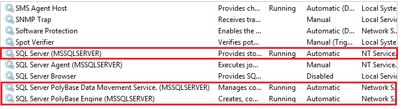
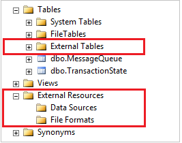

# Configure PolyBase to access external data in Hadoop

[!INCLUDE [SQL Server Windows Only - ASDBMI ](../../includes/applies-to-version/sql-windows-only-asdbmi.md)]

The article explains how to use PolyBase on a SQL Server instance to query external data in Hadoop.

## Prerequisites

- If you haven't installed PolyBase, see [PolyBase installation](polybase-installation.md). The installation article explains the prerequisites.

<!--SQL Server 2019-->
::: moniker range=">= sql-server-ver15 "

- Starting with [!INCLUDE[sssql19-md](../../includes/sssql19-md.md)], you must also [enable the PolyBase feature](polybase-installation.md#enable).

::: moniker-end

- PolyBase supports two Hadoop providers, Hortonworks Data Platform (HDP) and Cloudera Distributed Hadoop (CDH). Hadoop follows the "Major.Minor.Version" pattern for its new releases, and all versions within a supported Major and Minor release are supported. For information on Hortonworks Data Platform (HDP) and Cloudera Distributed Hadoop (CDH) versions supported, see [PolyBase Connectivity Configuration](../../database-engine/configure-windows/polybase-connectivity-configuration-transact-sql.md).

> [!NOTE]
> PolyBase supports Hadoop encryption zones starting with SQL Server 2016 SP1 CU7 and SQL Server 2017 CU3. If you are using [PolyBase scale-out groups](polybase-scale-out-groups.md), all compute nodes must also be on a build that includes support for Hadoop encryption zones.

### Configure Hadoop connectivity

First, configure SQL Server PolyBase to use your specific Hadoop provider.

1. Run [sp_configure](../../relational-databases/system-stored-procedures/sp-configure-transact-sql.md) with 'hadoop connectivity' and set an appropriate value for your provider. To find the value for your provider, see [PolyBase Connectivity Configuration](../../database-engine/configure-windows/polybase-connectivity-configuration-transact-sql.md).

   ```sql  
   -- Values map to various external data sources.  
   -- Example: value 7 stands for Hortonworks HDP 2.1 to 2.6 on Linux,
   -- 2.1 to 2.3 on Windows Server, and Azure Blob Storage  
   sp_configure @configname = 'hadoop connectivity', @configvalue = 7;
   GO

   RECONFIGURE
   GO
   ```  

1. You must restart SQL Server using **services.msc**. Restarting SQL Server restarts these services:  

   - SQL Server PolyBase Data Movement Service  
   - SQL Server PolyBase Engine  
  
     
  
## <a id="pushdown"></a> Enable pushdown computation  

To improve query performance, enable pushdown computation to your Hadoop cluster:  
  
1. Find the file **yarn-site.xml** in the installation path of SQL Server. Typically, the path is:  

   ```xml  
   C:\Program Files\Microsoft SQL Server\MSSQL13.MSSQLSERVER\MSSQL\Binn\PolyBase\Hadoop\conf\  
   ```  

1. On the Hadoop machine, find the analogous file in the Hadoop configuration directory. In the file, find and copy the value of the configuration key yarn.application.classpath.  
  
1. On the SQL Server machine, in the **yarn-site.xml file,** find the **yarn.application.classpath** property. Paste the value from the Hadoop machine into the value element.  
  
1. For all CDH 5.X versions, you will need to add the mapreduce.application.classpath configuration parameters either to the end of your yarn-site.xml file or into the mapred-site.xml file. HortonWorks includes these configurations within the yarn.application.classpath configurations. See [PolyBase configuration](../../relational-databases/polybase/polybase-configuration.md) for examples.

>[!IMPORTANT]
>To use the computation pushdown functionality with Hadoop, the target Hadoop cluster must have the core components of HDFS, YARN and MapReduce, with the job history server enabled. PolyBase submits the pushdown query via MapReduce and pulls status from the job history server. Without either component, the query fails.

## Configure an external table

To query the data in your Hadoop data source, you must define an external table to use in Transact-SQL queries. The following steps describe how to configure the external table.

1. Create a master key on the database, if one does not already exist. This is required to encrypt the credential secret.

     ```sql
      CREATE MASTER KEY ENCRYPTION BY PASSWORD = 'password';  
     ```
    ## Arguments
    PASSWORD ='password'

    Is the password that is used to encrypt the master key in the database. password must meet the Windows password policy requirements of the computer that is hosting the instance of SQL Server.
1. Create a database scoped credential for Kerberos-secured Hadoop clusters.

   ```sql
   -- IDENTITY: the Kerberos user name.  
   -- SECRET: the Kerberos password  
   CREATE DATABASE SCOPED CREDENTIAL HadoopUser1
   WITH IDENTITY = '<hadoop_user_name>', Secret = '<hadoop_password>';  
   ```

2. Create an external data source with [CREATE EXTERNAL DATA SOURCE](../../t-sql/statements/create-external-data-source-transact-sql.md).

   ```sql
   -- LOCATION (Required) : Hadoop Name Node IP address and port.  
   -- RESOURCE MANAGER LOCATION (Optional): Hadoop Resource Manager location to enable pushdown computation.  
   -- CREDENTIAL (Optional):  the database scoped credential, created above.  
   CREATE EXTERNAL DATA SOURCE MyHadoopCluster WITH (  
         TYPE = HADOOP,
         LOCATION ='hdfs://10.xxx.xx.xxx:xxxx',
         RESOURCE_MANAGER_LOCATION = '10.xxx.xx.xxx:xxxx',
         CREDENTIAL = HadoopUser1
   );  
   ```

3. Create an external file format with [CREATE EXTERNAL FILE FORMAT](../../t-sql/statements/create-external-file-format-transact-sql.md).

   ```sql
   -- FORMAT TYPE: Type of format in Hadoop (DELIMITEDTEXT,  RCFILE, ORC, PARQUET).
   CREATE EXTERNAL FILE FORMAT TextFileFormat WITH (  
         FORMAT_TYPE = DELIMITEDTEXT,
         FORMAT_OPTIONS (FIELD_TERMINATOR ='|',
               USE_TYPE_DEFAULT = TRUE))
   ```

4. Create an external table pointing to data stored in Hadoop with [CREATE EXTERNAL TABLE](../../t-sql/statements/create-external-table-transact-sql.md). In this example, the external data contains car sensor data.

   ```sql
   -- LOCATION: path to file or directory that contains the data (relative to HDFS root).  
   CREATE EXTERNAL TABLE [dbo].[CarSensor_Data] (  
         [SensorKey] int NOT NULL,
         [CustomerKey] int NOT NULL,
         [GeographyKey] int NULL,
         [Speed] float NOT NULL,
         [YearMeasured] int NOT NULL  
   )  
   WITH (LOCATION='/Demo/',
         DATA_SOURCE = MyHadoopCluster,  
         FILE_FORMAT = TextFileFormat  
   );  
   ```

5. Create statistics on an external table.

   ```sql
   CREATE STATISTICS StatsForSensors on CarSensor_Data(CustomerKey, Speed)  
   ```

## PolyBase queries

There are three functions that PolyBase is suited for:  
  
- Ad hoc queries against external tables.  
- Importing data.  
- Exporting data.  

The following queries provide example with fictional car sensor data.

### Ad hoc queries  

The following ad hoc query joins relational with Hadoop data. It selects customers who drive faster than 35 mph, joining structured customer data stored in SQL Server with car sensor data stored in Hadoop.  

```sql  
SELECT DISTINCT Insured_Customers.FirstName,Insured_Customers.LastName,
       Insured_Customers. YearlyIncome, CarSensor_Data.Speed  
FROM Insured_Customers, CarSensor_Data  
WHERE Insured_Customers.CustomerKey = CarSensor_Data.CustomerKey and CarSensor_Data.Speed > 35
ORDER BY CarSensor_Data.Speed DESC  
OPTION (FORCE EXTERNALPUSHDOWN);   -- or OPTION (DISABLE EXTERNALPUSHDOWN)  
```  

### Importing data  

The following query imports external data into SQL Server. This example imports data for fast drivers into SQL Server to do more in-depth analysis. To improve performance, the sample uses a columnstore index.  

```sql
SELECT DISTINCT
      Insured_Customers.FirstName, Insured_Customers.LastName,   
      Insured_Customers.YearlyIncome, Insured_Customers.MaritalStatus  
INTO Fast_Customers from Insured_Customers INNER JOIN   
(  
      SELECT * FROM CarSensor_Data where Speed > 35   
) AS SensorD  
ON Insured_Customers.CustomerKey = SensorD.CustomerKey  
ORDER BY YearlyIncome  
  
CREATE CLUSTERED COLUMNSTORE INDEX CCI_FastCustomers ON Fast_Customers;  
```  

### Exporting data  

The following query exports data from SQL Server to Hadoop. To do this, you first have to enable PolyBase export. Then, create an external table for the destination before exporting data to it.

```sql
-- Enable INSERT into external table  
sp_configure 'allow polybase export', 1;  
reconfigure  
  
-- Create an external table.
CREATE EXTERNAL TABLE [dbo].[FastCustomers2009] (  
      [FirstName] char(25) NOT NULL,
      [LastName] char(25) NOT NULL,
      [YearlyIncome] float NULL,
      [MaritalStatus] char(1) NOT NULL  
)  
WITH (  
      LOCATION='/old_data/2009/customerdata',  
      DATA_SOURCE = HadoopHDP2,  
      FILE_FORMAT = TextFileFormat,  
      REJECT_TYPE = VALUE,  
      REJECT_VALUE = 0  
);  

-- Export data: Move old data to Hadoop while keeping it query-able via an external table.  
INSERT INTO dbo.FastCustomer2009  
SELECT T.* FROM Insured_Customers T1 JOIN CarSensor_Data T2  
ON (T1.CustomerKey = T2.CustomerKey)  
WHERE T2.YearMeasured = 2009 and T2.Speed > 40;  
```  

## View PolyBase objects in SSMS  

In SSMS, external tables are displayed in a separate folder **External Tables**. External data sources and external file formats are in subfolders under **External Resources**.  
  
  

## Next steps

For more tutorials on creating external data sources and external tables to a variety of data sources, see [PolyBase Transact-SQL reference](polybase-t-sql-objects.md).

Explore more ways to use and monitor PolyBase in the following articles:

 - [PolyBase scale-out groups](../../relational-databases/polybase/polybase-scale-out-groups.md).  
 - [PolyBase troubleshooting](polybase-troubleshooting.md).  
