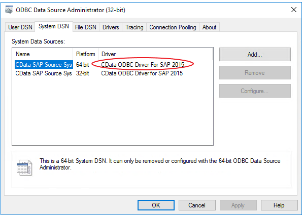

# Configure PolyBase to access external data in SQL Server

[!INCLUDE[appliesto-ss-xxxx-xxxx-xxx-md](../../includes/appliesto-ss-xxxx-xxxx-xxx-md.md)]

PolyBase in SQL Server 2019 allows you to connect to ODBC -compatible data sources through the ODBC connector. 

## Prerequisites

Note = feature only works on SQL Server on Windows. 

If you haven't installed PolyBase, see [PolyBase installation](polybase-installation.md).

First download and install the ODBC driver of the data source you want to connect to on each of the PolyBase nodes. Once the driver is properly installed, you can view and test the driver from the "ODBC Data Source Administrator".

 

> **IMPORTANT!**
> 
> In order to improve query performance make sure that the driver has connection pooling enabled. This can be accomplished from the "ODBC Data Source Administrator".
> 
> **Note**
> 
> The name of the driver (example circled above) will need to be specified when creating the external data source (Step 3 below).

## Create an External Table

To query the data from an ODBC data source, you must create external tables to reference the external data. This section provides sample code to create external tables.

These objects will be created in this section:

- CREATE DATABASE SCOPED CREDENTIAL (Transact-SQL) 
- CREATE EXTERNAL DATA SOURCE (Transact-SQL) 
- CREATE EXTERNAL TABLE (Transact-SQL) 
- CREATE STATISTICS (Transact-SQL)

1. Create a master key on the database, if one does not already exist. This is required to encrypt the credential secret.

     ```sql
      CREATE MASTER KEY ENCRYPTION BY PASSWORD = 'password';  
     ```
    ## Arguments
    PASSWORD ='password'

    Is the password that is used to encrypt the master key in the database. password must meet the Windows password policy requirements of the computer that is hosting the instance of SQL Server.

1. Create a database scoped credential for accessing the ODBC data source.

     ```sql
     /*  specify credentials to external data source
     *  IDENTITY: user name for external source.  
     *  SECRET: password for external source.
     */
     CREATE DATABASE SCOPED CREDENTIAL credential_name
     WITH IDENTITY = 'username', Secret = 'password';
     ```

1. Create an external data source with [CREATE EXTERNAL DATA SOURCE](../../t-sql/statements/create-external-data-source-transact-sql.md).

     ```sql
    /*  LOCATION: Location string should be of format '<type>://<server>[:<port>]'.
    *  PUSHDOWN: specify whether computation should be pushed down to the source. ON by default.
    *CONNECTION_OPTIONS: Specify driver location
    *  CREDENTIAL: the database scoped credential, created above.
    */  
    CREATE EXTERNAL DATA SOURCE external_data_source_name
    WITH ( 
    LOCATION = odbc://<ODBC server address>[:<port>],
    CONNECTION_OPTIONS = 'Driver={<Name of Installed Driver>};
    ServerNode = <name of server  address>:<Port>',
    -- PUSHDOWN = ON | OFF,
      CREDENTIAL = credential_name
    );

     ```


1.  Create external tables that represents data in external data source using  [CREATE EXTERNAL TABLE](../../t-sql/statements/create-external-table-transact-sql.md).
 
     ```sql
     /*  LOCATION: ODBC data source table/view
     *  DATA_SOURCE: the external data source, created above.
     */
     CREATE EXTERNAL TABLE customer(
     C_CUSTKEY INT NOT NULL,
     C_NAME VARCHAR(25) NOT NULL,
     C_ADDRESS VARCHAR(40) NOT NULL,
     C_NATIONKEY INT NOT NULL,
     C_PHONE CHAR(15) NOT NULL,
     C_ACCTBAL DECIMAL(15,2) NOT NULL,
     C_MKTSEGMENT CHAR(10) NOT NULL,
     C_COMMENT VARCHAR(117) NOT NULL
      )
      WITH (
      LOCATION='customer',
      DATA_SOURCE= external_data_source_name
     );
      ```

1. **Optional:** Create statistics on an external table.

    We recommend creating statistics on external table columns, especially the ones used for joins, filters and aggregates, for optimal query performance.

     ```sql
      CREATE STATISTICS statistics_name ON customer (C_CUSTKEY) WITH FULLSCAN; 
     ```

## Next steps

To learn more about PolyBase, see [Overview of SQL Server PolyBase](polybase-guide.md).
