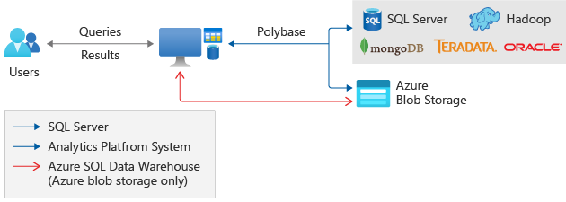

# What is PolyBase?

[!INCLUDE[appliesto-ss-xxxx-asdw-pdw-md](../../includes/appliesto-ss-xxxx-asdw-pdw-md.md)]

<!--SQL Server 2016/2017-->
::: moniker range="= sql-server-2016 || = sql-server-2017"

PolyBase enables your SQL Server 2016 instance to process Transact-SQL queries that read data from Hadoop. The same query can also access relational tables in your SQL Server. PolyBase enables the same query to also join the data from Hadoop and SQL Server. In SQL Server, an [external table](../../t-sql/statements/create-external-table-transact-sql.md) or [external data source](../../t-sql/statements/create-external-data-source-transact-sql.md) provides the connection to Hadoop.

PolyBase pushes some computations to the Hadoop node to optimize the overall query. However, PolyBase external access is not limited to Hadoop. Other unstructured non-relational tables are also supported, such as delimited text files.

> [!TIP]
> SQL Server 2019 CTP 2.0 introduces new connectors for PolyBase, including SQL Server, Oracle, Teradata, and MongoDB. For more information, see the [PolyBase documentation for SQL Server 2019 CTP 2.0](polybase-guide.md?view=sql-server-ver15)

::: moniker-end
<!--SQL Server 2019-->
::: moniker range=">= sql-server-linux-ver15 || >= sql-server-ver15 || =sqlallproducts-allversions"

PolyBase enables your SQL Server instance to process Transact-SQL queries that read data from external data sources. SQL Server 2016 and higher can access external data in Hadoop and Azure Blob Storage. Starting in SQL Server 2019 CTP 2.0, you can now use PolyBase to access external data in [SQL Server](polybase-configure-sql-server.md), [Oracle](polybase-configure-oracle.md), [Teradata](polybase-configure-teradata.md), and [MongoDB](polybase-configure-mongodb.md).

The same queries that access external data can also target relational tables in your SQL Server instance. This allows you to combine data from external sources with high-value relational data in your database. In SQL Server, an [external table](../../t-sql/statements/create-external-table-transact-sql.md) or [external data source](../../t-sql/statements/create-external-data-source-transact-sql.md) provides the connection to Hadoop.

PolyBase pushes some computations to the Hadoop node to optimize the overall query. However, PolyBase external access is not limited to Hadoop. Other unstructured non-relational tables are also supported, such as delimited text files.

::: moniker-end

### Supported SQL products and services

PolyBase provides these same functionalities for the following SQL products from Microsoft:

- SQL Server 2016 and later versions (Windows only)
- Analytics Platform System (formerly Parallel Data Warehouse)
- Azure SQL Data Warehouse

### Azure integration

With the underlying help of PolyBase, T-SQL queries can also import and export data from Azure Blob Storage. Further, PolyBase enables Azure SQL Data Warehouse to import and export data from Azure Data Lake Store, and from Azure Blob Storage.

## Why use PolyBase?

In the past it was more difficult to join your SQL Server data with external data. You had the two following unpleasant options:

- Transfer half your data so that all your data was in one format or the other.
- Query both sources of data, then write custom query logic to join and integrate the data at the client level.

PolyBase avoids those unpleasant options by using T-SQL to join the data.

To keep things simple, PolyBase does not require you to install additional software to your Hadoop environment. You query external data by using the same T-SQL syntax used to query a database table. The support actions implemented by PolyBase all happen transparently. The query author does not need any knowledge about Hadoop.

### PolyBase uses

PolyBase enables the following scenarios in SQL Server:

- **Query data stored in Hadoop from SQL Server or PDW.** Users are storing data in cost-effective distributed and scalable systems, such as Hadoop. PolyBase makes it easy to query the data by using T-SQL.

- **Query data stored in Azure Blob Storage.** Azure blob storage is a convenient place to store data for use by Azure services.  PolyBase makes it easy to access the data by using T-SQL.

- **Import data from Hadoop, Azure Blob Storage, or Azure Data Lake Store.** Leverage the speed of Microsoft SQL's columnstore technology and analysis capabilities by importing data from Hadoop, Azure Blob Storage, or Azure Data Lake Store into relational tables. There is no need for a separate  ETL or import tool.

- **Export data to Hadoop, Azure Blob Storage, or Azure Data Lake Store.** Archive data to Hadoop, Azure Blob Storage, or Azure Data Lake Store to achieve cost-effective storage and keep it online for easy access.

- **Integrate with BI tools.** Use PolyBase with Microsoft's business intelligence and analysis stack, or use any third party tools that are compatible with SQL Server.

## Performance

- **Push computation to Hadoop.** The query optimizer makes a cost-based decision to push computation to Hadoop when doing so will improve query performance.  It uses statistics on external tables to make the cost-based decision. Pushing computation creates MapReduce jobs and leverages Hadoop's distributed computational resources.

- **Scale compute resources.** To improve query performance, you can use SQL Server [PolyBase scale-out groups](../../relational-databases/polybase/polybase-scale-out-groups.md). This enables parallel data transfer between SQL Server instances and Hadoop nodes, and it adds compute resources for operating on the external data.

## Next steps

Before using PolyBase, you must [install the PolyBase feature](polybase-installation.md). Then see the following configuration guides depending on your data source:

<!--SQL Server 2016/2017-->
::: moniker range="= sql-server-2016 || = sql-server-2017"

- [Hadoop](polybase-configure-hadoop.md)
- [Azure Blob Storage](polybase-configure-azure-blob-storage.md)

::: moniker-end
<!--SQL Server 2019-->
::: moniker range=">= sql-server-linux-ver15 || >= sql-server-ver15 || =sqlallproducts-allversions"

- [Hadoop](polybase-configure-hadoop.md)
- [Azure Blob Storage](polybase-configure-azure-blob-storage.md)
- [SQL Server](polybase-configure-sql-server.md)
- [Oracle](polybase-configure-oracle.md)
- [Teradata](polybase-configure-teradata.md)
- [MongoDB](polybase-configure-mongodb.md)

::: moniker-end
