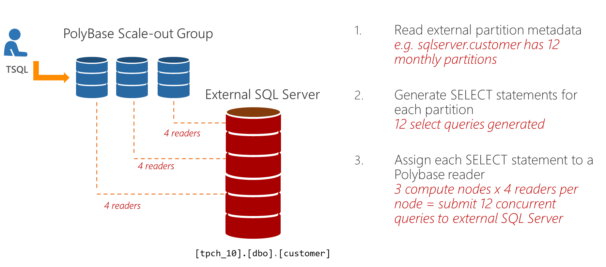

# PolyBase scale-out groups

[!INCLUDE[appliesto-ss-xxxx-asdw-pdw-md-winonly](../../includes/appliesto-ss-xxxx-xxxx-xxx-md-winonly.md)]

A standalone SQL Server instance with PolyBase can become a performance bottleneck when dealing with massive data sets in Hadoop or Azure Blob Storage. The PolyBase Group feature allows you to create a cluster of SQL Server instances to process large data sets from external data sources, such as Hadoop or Azure Blob Storage, in a scale-out fashion for better query performance. You can now scale your SQL Server compute to meet the performance demands of your workload. PolyBase Scale-out Groups, a group of SQL Server instances, enable you to process large external data sets in a parallel processing architecture. Data loading and query performance can increase linearly as you add more SQL Server instances to the group. 
  
See [Get started with PolyBase](../../relational-databases/polybase/get-started-with-polybase.md) and [PolyBase Guide](../../relational-databases/polybase/polybase-guide.md).
  
  
  
## Head node  

The head node contains the SQL Server instance to which PolyBase queries are submitted. Each PolyBase group can have only one head node. A head node is a logical group of SQL Database Engine, PolyBase Engine and PolyBase Data Movement Service on the SQL Server instance.
  
## Compute node  

A compute node contains the SQL Server instance that assists with scale-out query processing on external data. A compute node is a logical group of SQL Server and the PolyBase data movement service on the SQL Server instance. A PolyBase group can have multiple compute nodes. The head node and the compute nodes must all run the same version of SQL Server.

## Scale-out Reads

When querying external SQL Server, Oracle or Teradata instances, partitioned tables will benefit from scale-out reads. Each node in a PolyBase scale-out group can spin up to 8 readers to read external data. And each reader is assigned one partition to read in the external table. 

For e.g., let's say you have an external SQL Server table with 12 monthly partitions and a 3-node PolyBase scale-out group, each node will use 4 PolyBase readers to process each of the 12 partitions. This is illustrated in the image below. 

> [!NOTE]
>  that this is different from scale-out reads over Hadoop. 

  
## Distributed query processing  

PolyBase queries are submitted to the SQL Server on the head node. The part of the query that refers to external tables is handed-off to the PolyBase engine.
  
The PolyBase engine is the key component  behind PolyBase queries. It parses the query on external data, generates the query plan and distributes the work to the data movement service on the compute nodes for execution. After completion of the work, it receives the results from the compute nodes and submits them to SQL Server for processing and returning to the client.
  
The PolyBase data movement service receives instructions from the PolyBase engine and transfers data between HDFS and SQL Server, and between SQL Server instances on the head and compute nodes.
  
## Editions availability  

After setup of SQL Server, the instance can be designated as either a head node or a compute node. The choice depends on which version of SQL Server PolyBase is running on. On an Enterprise edition installation, the instance can be designated either as head node or a compute node. On a Standard edition, the instance can only be designated as a compute node.

## Next steps

To configure a PolyBase scale-out group, see the following guide:

[Improve PolyBase scale-out groups on Windows](configure-scale-out-groups-windows.md)
