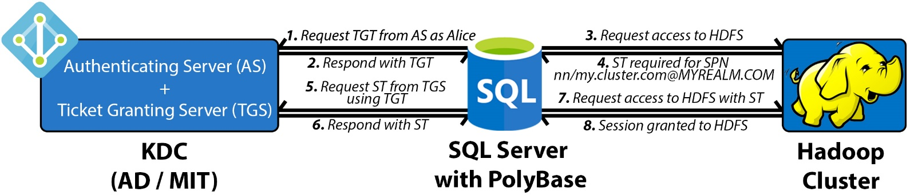

# Troubleshoot PolyBase Kerberos connectivity

[!INCLUDE[appliesto-ss-xxxx-asdw-pdw-md-winonly](../../includes/appliesto-ss-xxxx-xxxx-xxx-md-winonly.md)]

You can use an interactive diagnostics tool that has been built into PolyBase to help troubleshoot authentication problems when using PolyBase against a Kerberos-secured Hadoop cluster. 

This article serves as a guide to walk through the debugging process of such issues by leveraging this tool.

## Prerequisites

1. SQL Server 2016 RTM CU6 / SQL Server 2016 SP1 CU3 / SQL Server 2017 or higher with PolyBase installed
1. A Hadoop cluster (Cloudera or Hortonworks) secured with Kerberos (Active Directory or MIT)

## Introduction

It helps to first understand the Kerberos protocol at a high level. There are three actors involved:

1. Kerberos client (SQL Server)
1. Secured resource (HDFS, MR2, YARN, Job History, etc.)
1. Key distribution center (referred to as a domain controller in Active Directory)

Each Hadoop secured resource is registered in the **Key Distribution Center (KDC)** with a unique **Service Principal Name (SPN)** when Kerberos is configured on the Hadoop cluster. The goal is for the client to obtain a temporary user ticket, called a **Ticket Granting Ticket (TGT)**, in order to request another temporary ticket, called a **Service Ticket (ST)**, from the KDC against the particular SPN that it wants to access.  

In PolyBase, when authentication is requested against any Kerberos-secured resource, the following four-round-trip handshake takes place:

1. SQL Server connects to the KDC and obtains a TGT for the user. The TGT is encrypted using the KDC private key.
1. SQL Server calls the Hadoop secured resource, HDFS,  and determines which SPN it needs an ST for.
1. SQL Server goes back to the KDC, passes the TGT back, and requests an ST to access that particular secured resource. The ST is encrypted using the secured service's private key.
1. SQL Server forwards the ST to Hadoop and gets authenticated to have a session created against that service.



Issues with authentication fall into one or more of the above four steps. To help with faster debugging, PolyBase has introduced an integrated diagnostics tool to help identify the point of failure.

## Troubleshooting

PolyBase has the following configuration XML files containing properties of the Hadoop cluster:

- core-site.xml
- hdfs-site.xml
- hive-site.xml
- jaas.conf
- mapred-site.xml
- yarn-site.xml

These files are located under:

`\[System Drive\]:{install path}\{instance}\{name}\MSSQL\Binn\PolyBase\Hadoop\conf`

For example, the default for SQL Server 2016 is `C:\Program Files\Microsoft SQL Server\MSSQL13.MSSQLSERVER\MSSQL\Binn\PolyBase\Hadoop\conf`.

Update **core-site.xml**, add the three properties below. Set the values according to the environment:

```xml
<property>
	<name>polybase.kerberos.realm</name>
	<value>CONTOSO.COM</value>
</property>
<property>
	<name>polybase.kerberos.kdchost</name>
	<value>kerberos.contoso.com</value>
</property>
<property>
	<name>hadoop.security.authentication</name>
    <value>KERBEROS</value>
</property>
```

The other XMLs will later need to be updated as well if pushdown operations are desired, but with just this file configured, the HDFS file system should at least be able to be accessed.

The tool runs independently of SQL Server, so it does not need to be running, nor does it need to be restarted if updates are made to the configuration XMLs. To run the tool, execute the following commands on the host with SQL Server installed:

```cmd
> cd C:\Program Files\Microsoft SQL Server\MSSQL13.MSSQLSERVER\MSSQL\Binn\PolyBase  
> java -classpath ".\Hadoop\conf;.\Hadoop\*;.\Hadoop\HDP2_2\*" com.microsoft.polybase.client.HdfsBridge {Name Node Address} {Name Node Port} {Service Principal} {Filepath containing Service Principal's Password} {Remote HDFS file path (optional)}
```

## Arguments

| Argument | Description|
| --- | --- |
| *Name Node Address* | The IP or FQDN of the name node. Refers to the "LOCATION" argument in your CREATE EXTERNAL DATA SOURCE T-SQL.|
| *Name Node Port* | The port of the name node. Refers to the "LOCATION" argument in your CREATE EXTERNAL DATA SOURCE T-SQL. For example, 8020. |
| *Service Principal* | The admin service principal to your KDC. Matches the "IDENTITY" argument in your `CREATE DATABASE SCOPED CREDENTIAL` T-SQL.|
| *Service Password* | Instead of typing your password at the console, store it in a file and pass the file path here. The contents of the file should match what you use as your "SECRET" argument in your `CREATE DATABASE SCOPED CREDENTIAL` T-SQL. |
| *Remote HDFS file path (optional) * | The path of an existing file to access. If not specified, the root "/" will be used. |

## Example

```cmd
java -classpath ".\Hadoop\conf;.\Hadoop\*;.\Hadoop\HDP2_2\*" com.microsoft.polybase.client.HdfsBridge 10.193.27.232 8020 admin_user C:\temp\kerberos_pass.txt
```

The output is verbose for enhanced debugging, but there are only four main checkpoints to look for regardless of whether you are using MIT or AD. They correspond to the four steps outlined above. 

The following excerpts are from an MIT KDC. You may refer to complete sample outputs from both MIT and AD at the end of this article in the References.

## Checkpoint 1

There should be a hex dump of a ticket with `Server Principal = krbtgt/MYREALM.COM@MYREALM.COM`. It indicates that SQL Server successfully authenticated against the KDC and received a TGT. If not, the problem lies strictly between SQL Server and the KDC, and not Hadoop.

PolyBase does **not** support trust relationships between AD and MIT and must be configured against the same KDC as configured in the Hadoop cluster. In such environments, manually creating a service account on that KDC and using that to perform authentication will work.

```cmd
|>>> KrbAsReq creating message 
 >>> KrbKdcReq send: kdc=kerberos.contoso.com UDP:88, timeout=30000, number of retries =3, #bytes=143 
 >>> KDCCommunication: kdc=kerberos.contoso.com UDP:88, timeout=30000,Attempt =1, #bytes=143 
 >>> KrbKdcReq send: #bytes read=646 
 >>> KdcAccessibility: remove kerberos.contoso.com 
 >>> EType: sun.security.krb5.internal.crypto.Des3CbcHmacSha1KdEType 
 >>> KrbAsRep cons in KrbAsReq.getReply myuser 
 [2017-04-25 21:34:33,548] INFO 687[main] - com.microsoft.polybase.client.KerberosSecureLogin.secureLogin(KerberosSecureLogin.java:97) - Subject: 
 Principal: admin_user@CONTOSO.COM 
 Private Credential: Ticket (hex) = 
 0000: 61 82 01 48 30 82 01 44 A0 03 02 01 05 A1 0E 1B a..H0..D........ 
 0010: 0C 41 50 53 48 44 50 4D 53 2E 43 4F 4D A2 21 30 .CONTOSO.COM.!0 
 0020: 1F A0 03 02 01 02 A1 18 30 16 1B 06 6B 72 62 74 ........0...krbt 
 0030: 67 74 1B 0C 41 50 53 48 44 50 4D 53 2E 43 4F 4D gt..CONTOSO.COM 
 0040: A3 82 01 08 30 82 01 04 A0 03 02 01 10 A1 03 02 ....0........... 
 *[...Condensed...]* 
 0140: 67 6D F6 41 6C EB E0 C3 3A B2 BD B1 gm.Al...:... 
 Client Principal = admin_user@CONTOSO.COM 
 Server Principal = krbtgt/CONTOSO.COM@CONTOSO.COM 
 *[...Condensed...]* 
 [2017-04-25 21:34:34,500] INFO 1639[main] - com.microsoft.polybase.client.HdfsBridge.main(HdfsBridge.java:1579) - Successfully authenticated against KDC server. 
```

## Checkpoint 2

PolyBase will make an attempt to access the HDFS and fail because the request did not contain the necessary Service Ticket.

```cmd
 [2017-04-25 21:34:34,501] INFO 1640[main] - com.microsoft.polybase.client.HdfsBridge.main(HdfsBridge.java:1584) - Attempting to access external filesystem at URI: hdfs://10.193.27.232:8020 
 Found ticket for admin_user@CONTOSO.COM to go to krbtgt/CONTOSO.COM@CONTOSO.COM expiring on Wed Apr 26 21:34:33 UTC 2017 
 Entered Krb5Context.initSecContext with state=STATE_NEW 
 Found ticket for admin_user@CONTOSO.COM to go to krbtgt/CONTOSO.COM@CONTOSO.COM expiring on Wed Apr 26 21:34:33 UTC 2017 
 Service ticket not found in the subject 
```

## Checkpoint 3

A second hex dump indicates that SQL Server successfully used the TGT and acquired the applicable Service Ticket for the name node's SPN from the KDC.

```cmd
 >>> KrbKdcReq send: kdc=kerberos.contoso.com UDP:88, timeout=30000, number of retries =3, #bytes=664 
 >>> KDCCommunication: kdc=kerberos.contoso.com UDP:88, timeout=30000,Attempt =1, #bytes=664 
 >>> KrbKdcReq send: #bytes read=669 
 >>> KdcAccessibility: remove kerberos.contoso.com 
 >>> EType: sun.security.krb5.internal.crypto.Des3CbcHmacSha1KdEType 
 >>> KrbApReq: APOptions are 00100000 00000000 00000000 00000000 
 >>> EType: sun.security.krb5.internal.crypto.Des3CbcHmacSha1KdEType 
 Krb5Context setting mySeqNumber to: 1033039363 
 Created InitSecContextToken: 
 0000: 01 00 6E 82 02 4B 30 82 02 47 A0 03 02 01 05 A1 ..n..K0..G...... 
 0010: 03 02 01 0E A2 07 03 05 00 20 00 00 00 A3 82 01 ......... ...... 
 0020: 63 61 82 01 5F 30 82 01 5B A0 03 02 01 05 A1 0E ca.._0..[....... 
 0030: 1B 0C 41 50 53 48 44 50 4D 53 2E 43 4F 4D A2 26 ..CONTOSO.COM.& 
 0040: 30 24 A0 03 02 01 00 A1 1D 30 1B 1B 02 6E 6E 1B 0$.......0...nn. 
 0050: 15 73 68 61 73 74 61 2D 68 64 70 32 35 2D 30 30 .hadoop-hdp25-00 
 0060: 2E 6C 6F 63 61 6C A3 82 01 1A 30 82 01 16 A0 03 .local....0..... 
 0070: 02 01 10 A1 03 02 01 01 A2 82 01 08 04 82 01 04 ................ 
 *[...Condensed...]* 
 0240: 03 E3 68 72 C4 D2 8D C2 8A 63 52 1F AE 26 B6 88 ..hr.....cR..&.. 
 0250: C4 . 
```

## Checkpoint 4

Finally, the file properties of the target path should be printed along with a confirmation message. The file properties confirm SQL Server was authenticated by Hadoop using the ST and a session was granted to access the secured resource.

Reaching this point confirms that: (i) the three actors are able to communicate correctly, (ii) the core-site.xml and jaas.conf are correct, and (iii) your KDC recognized your credentials.

```cmd
 [2017-04-25 21:34:35,096] INFO 2235[main] - com.microsoft.polybase.client.HdfsBridge.main(HdfsBridge.java:1586) - File properties for "/": FileStatus{path=hdfs://10.193.27.232:8020/; isDirectory=true; modification_time=1492028259862; access_time=0; owner=hdfs; group=hdfs; permission=rwxr-xr-x; isSymlink=false} 
 [2017-04-25 21:34:35,098] INFO 2237[main] - com.microsoft.polybase.client.HdfsBridge.main(HdfsBridge.java:1587) - Successfully accessed the external file system. 
```

## Common errors

If the tool was run and the file properties of the target path were *not* printed (Checkpoint 4), there should be an exception thrown midway. Review it and consider the context of where in the four-step flow it occurred. Consider the following common issues that may have occurred, in order:

| Exception and messages | Cause | 
| --- | --- |
| org.apache.hadoop.security.AccessControlException<br>SIMPLE authentication is not enabled. Available:[TOKEN, KERBEROS] | The core-site.xml doesn't have the hadoop.security.authentication property set to "KERBEROS".|
|javax.security.auth.login.LoginException<br>Client not found in Kerberos database  (6) - CLIENT_NOT_FOUND |	The admin Service Principal supplied does not exist in the realm specified in core-site.xml.|
| javax.security.auth.login.LoginException<br> Checksum failed |Admin Service Principal exists, but bad password. |
| Native config name: C:\Windows\krb5.ini<br>Loaded from native config | This message indicates that Java's krb5LoginModule detected custom client configurations on your machine. Check your custom client settings as they may be causing the issue. |
| javax.security.auth.login.LoginException<br>java.lang.IllegalArgumentException<br>Illegal principal name admin_user@CONTOSO.COM: org.apache.hadoop.security.authentication.util.KerberosName$NoMatchingRule: No rules applied to admin_user@CONTOSO.COM | Add the property "hadoop.security.auth_to_local" to core-site.xml with the appropriate rules per the Hadoop cluster. |
| java.net.ConnectException<br>Attempting to access external filesystem at URI: hdfs://10.193.27.230:8020<br>Call From IAAS16981207/10.107.0.245 to 10.193.27.230:8020 failed on connection exception |	Authentication against the KDC was successful, but it failed to access the Hadoop name node. Check the name node IP and port. Verify the firewall is disabled on Hadoop. |
| java.io.FileNotFoundException<br>File does not exist: /test/data.csv |	Authentication was successful, but the location specified does not exist. Check the path or test with root "/" first. |

## Debugging tips

### MIT KDC  

All the SPNs registered with the KDC, including the admins, can be viewed by running **kadmin.local** > (admin login) > **listprincs** on the KDC host or any configured KDC client. If Kerberos is properly configured on the Hadoop cluster, there should be one SPN for each one of the services available in the cluster (for example: `nn`, `dn`, `rm`, `yarn`, `spnego`, etc.) Their corresponding keytab files (password substitutes) can be seen under **/etc/security/keytabs**, by default. They are encrypted using the KDC private key.  

Also consider using [`kinit`](https://web.mit.edu/kerberos/krb5-1.12/doc/user/user_commands/kinit.html) to verify the admin credentials on the KDC locally. An example usage would be: `kinit identity@MYREALM.COM`. A prompt for a password indicates the identity exists.  
The KDC logs are available in **/var/log/krb5kdc.log**, by default, which includes all of the requests for tickets including the client IP that made the request. There should be two requests from the SQL Server machine's IP wherein the tool was run: first for the TGT from the Authenticating Server as an **AS\_REQ**, followed by a **TGS\_REQ** for the ST from the Ticket Granting Server.

```bash
 [root@MY-KDC log]# tail -2 /var/log/krb5kdc.log 
 May 09 09:48:26 MY-KDC.local krb5kdc[2547](info): **AS_REQ** (3 etypes {17 16 23}) 10.107.0.245: ISSUE: authtime 1494348506, etypes {rep=16 tkt=16 ses=16}, admin_user@CONTOSO.COM for **krbtgt/CONTOSO.COM@CONTOSO.COM** 
 May 09 09:48:29 MY-KDC.local krb5kdc[2547](info): **TGS_REQ** (3 etypes {17 16 23}) 10.107.0.245: ISSUE: authtime 1494348506, etypes {rep=16 tkt=16 ses=16}, admin_user@CONTOSO.COM for **nn/hadoop-hdp25-00.local@CONTOSO.COM** 
```

### Active Directory 

In Active Directory, the SPNs can be viewed by browsing to Control Panel > Active Directory Users and Computers > *MyRealm* > *MyOrganizationalUnit*. If Kerberos is properly configured on the Hadoop cluster, there is one SPN for each one of the services available (for example: `nn`, `dn`, `rm`, `yarn`, `spnego`, etc.)

### General debugging tips

It is helpful to have some java experience to look into the logs and debug the Kerberos issues, which are independent of SQL server PolyBase feature.

If you are still having issues accessing Kerberos, follow the steps below to debug:

1. Make sure you can access the Kerberos HDFS data from outside SQL server. You can either: 

    - Write your own java program
      or
    - Use `HdfsBridge` class from PolyBase installation folder. For example:

      ```java
      -classpath ".\Hadoop\conf;.\Hadoop\*;.\Hadoop\HDP2_2\*" com.microsoft.polybase.client.HdfsBridge 10.193.27.232 8020 admin_user C:\temp\kerberos_pass.txt
      ```

     In the example above, `admin_user` includes only the user name - not any domain part.

2. If you can’t access Kerberos HDFS data from outside PolyBase:
    - There are two types of Kerberos authentication: Active directory Kerberos authentication, and MIT Kerberos authentication.
    - Make sure the user exists in domain account and use the same user account while trying to access HDFS.

3. For active directory Kerberos, make sure you can see cached ticket using `klist` command on Windows.
    - Log in into PolyBase machine and run  `klist` and `klist tgt` in command prompt to see if the KDC, username, and encryption types are correct.

4.	If KDC can only support AES256, make sure [JCE policy files](http://www.oracle.com/technetwork/java/javase/downloads/index.html) are installed.

## See also

[Integrating PolyBase with Cloudera using Active Directory Authentication](https://blogs.msdn.microsoft.com/microsoftrservertigerteam/2016/10/17/integrating-polybase-with-cloudera-using-active-directory-authentication)  
[Cloudera's Guide to setting up Kerberos for CDH](https://www.cloudera.com/documentation/enterprise/5-6-x/topics/cm_sg_principal_keytab.html)  
[Hortonworks' Guide to Setting up Kerberos for HDP](https://docs.hortonworks.com/HDPDocuments/Ambari-2.2.0.0/bk_Ambari_Security_Guide/content/ch_configuring_amb_hdp_for_kerberos.html)  
[PolyBase troubleshooting](polybase-troubleshooting.md)
