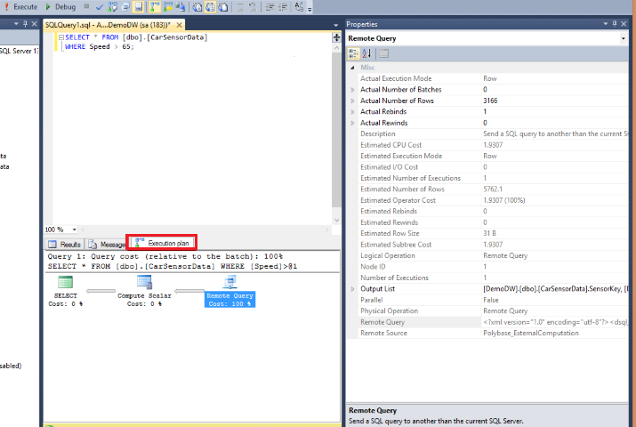

# PolyBase troubleshooting
[!INCLUDE[tsql-appliesto-ss2016-xxxx-xxxx-xxx_md](../../includes/tsql-appliesto-ss2016-xxxx-xxxx-xxx-md.md)]

  To troubleshoot PolyBase, use the techniques found in this topic.  
  
## Catalog views  
 Use the catalog views listed here to manage PolyBase operations.  
  
|||  
|-|-|  
|View|Description|  
|[sys.external_tables &#40;Transact-SQL&#41;](../../relational-databases/system-catalog-views/sys-external-tables-transact-sql.md)|Identifies external tables.|  
|[sys.external_data_sources &#40;Transact-SQL&#41;](../../relational-databases/system-catalog-views/sys-external-data-sources-transact-sql.md)|Identifies external data sources.|  
|[sys.external_file_formats &#40;Transact-SQL&#41;](../../relational-databases/system-catalog-views/sys-external-file-formats-transact-sql.md)|Identifies external file formats.|  
  
## Dynamic Management Views  
  
|||  
|-|-|  
|[sys.dm_exec_compute_node_errors &#40;Transact-SQL&#41;](../../relational-databases/system-dynamic-management-views/sys-dm-exec-compute-node-errors-transact-sql.md)|[sys.dm_exec_compute_node_status &#40;Transact-SQL&#41;](../../relational-databases/system-dynamic-management-views/sys-dm-exec-compute-node-status-transact-sql.md)|  
|[sys.dm_exec_compute_nodes &#40;Transact-SQL&#41;](../../relational-databases/system-dynamic-management-views/sys-dm-exec-compute-nodes-transact-sql.md)|[sys.dm_exec_distributed_request_steps &#40;Transact-SQL&#41;](../../relational-databases/system-dynamic-management-views/sys-dm-exec-distributed-request-steps-transact-sql.md)|  
|[sys.dm_exec_distributed_requests &#40;Transact-SQL&#41;](../../relational-databases/system-dynamic-management-views/sys-dm-exec-distributed-requests-transact-sql.md)|[sys.dm_exec_distributed_sql_requests &#40;Transact-SQL&#41;](../../relational-databases/system-dynamic-management-views/sys-dm-exec-distributed-sql-requests-transact-sql.md)|  
|[sys.dm_exec_dms_services &#40;Transact-SQL&#41;](../../relational-databases/system-dynamic-management-views/sys-dm-exec-dms-services-transact-sql.md)|[sys.dm_exec_dms_workers &#40;Transact-SQL&#41;](../../relational-databases/system-dynamic-management-views/sys-dm-exec-dms-workers-transact-sql.md)|  
|[sys.dm_exec_external_operations &#40;Transact-SQL&#41;](../../relational-databases/system-dynamic-management-views/sys-dm-exec-external-operations-transact-sql.md)|[sys.dm_exec_external_work &#40;Transact-SQL&#41;](../../relational-databases/system-dynamic-management-views/sys-dm-exec-external-work-transact-sql.md)|  
  
  PolyBase queries are broken into a series of steps within sys.dm_exec_distributed_request_steps. The following table provides a mapping from the step name to the associated DMV.
  
 |PolyBase Step|Associated DMV|  
 |-|-| 
 |HadoopJobOperation | sys.dm_exec_external_operations|
 |RandomIdOperation | sys.dm_exec_distributed_request_steps|
 |HadoopRoundRobinOperation | sys.dm_exec_dms_workers|
 |StreamingReturnOperation | sys.dm_exec_dms_workers|
 |OnOperation | sys.dm_exec_distributed_sql_requests |
  
  
## To monitor PolyBase queries using DMVs  
 Monitor and troubleshoot PolyBase queries using the following DMVs.  
  
1.  **Find the longest running queries**  
  
     Record the execution ID of the longest running query.  
  
    ```tsql  
     -- Find the longest running query  
    SELECT execution_id, st.text, dr.total_elapsed_time  
    FROM sys.dm_exec_distributed_requests  dr  
         cross apply sys.dm_exec_sql_text(sql_handle) st  
    ORDER BY total_elapsed_time DESC;  
  
    ```  
  
2.  **Find the longest running step of the distributed query**  
  
     Use the execution ID recorded in the previous step. Record the step index of the longest running step.  
  
     Check the location_type of longest running step:  
  
    -   Head or Compute: implies a SQL operation. Proceed with Step 3a.  
  
    -   DMS: implies a PolyBase Data Movement Service operation. Proceed with Step 3b.  
  
    ```tsql  
    -- Find the longest running step of the distributed query plan  
    SELECT execution_id, step_index, operation_type, distribution_type,   
    location_type, status, total_elapsed_time, command   
    FROM sys.dm_exec_distributed_request_steps   
    WHERE execution_id = 'QID4547'   
    ORDER BY total_elapsed_time DESC;  
  
    ```  
  
3.  **Find the execution progress of the longest running step**  
  
    1.  **Find the execution progress of a SQL step**  
  
         Use the execution ID and step index recorded in the previous steps. Use the execution ID and step index recorded in the previous steps.  
  
        ```tsql  
        -- Find the execution progress of SQL step    
        SELECT execution_id, step_index, distribution_id, status,   
        total_elapsed_time, row_count, command   
        FROM sys.dm_exec_distributed_sql_requests   
        WHERE execution_id = 'QID4547' and step_index = 1;  
  
        ```  
  
    2.  **Find the execution progress of a DMS step**  
  
         Use the execution ID and step index recorded in the previous steps.  
  
        ```tsql  
        -- Find the execution progress of DMS step    
        SELECT execution_id, step_index, dms_step_index, status,   
        type, bytes_processed, total_elapsed_time  
        FROM sys.dm_exec_dms_workers   
        WHERE execution_id = 'QID4547'   
        ORDER BY total_elapsed_time DESC;  
  
        ```  
  
4.  **Find the information about external DMS operations**  
  
     Use the execution ID and step index recorded in the previous steps.  
  
    ```tsql  
    SELECT execution_id, step_index, dms_step_index, compute_node_id,   
    type, input_name, length, total_elapsed_time, status   
    FROM sys.dm_exec_external_work   
    WHERE execution_id = 'QID4547' and step_index = 7   
    ORDER BY total_elapsed_time DESC;  
  
    ```  
  
## To view the  PolyBase query plan  
  
1.  In SSMS, enable **Include Actual Execution Plan** (Ctrl + M) and run the query.  
  
2.  Click the **Execution plan** tab.  
  
       
  
3.  Right-click on the **Remote Query operator** and select **Properties**.  
  
4.  Copy and paste the Remote Query value into a text editor to view the XML remote query plan.  An example is shown below.  
  
    ```xml  
  
    <dsql_query number_nodes="1" number_distributions="8" number_distributions_per_node="8">  
      <sql>ExecuteMemo explain query</sql>  
      <dsql_operations total_cost="0" total_number_operations="6">  
        <dsql_operation operation_type="RND_ID">  
          <identifier>TEMP_ID_74</identifier>  
        </dsql_operation>  
        <dsql_operation operation_type="ON">  
          <location permanent="false" distribution="AllDistributions" />  
          <sql_operations>  
            <sql_operation type="statement">CREATE TABLE [tempdb].[dbo].[TEMP_ID_74] ([SensorKey] INT NOT NULL, [CustomerKey] INT NOT NULL, [GeographyKey] INT, [Speed] FLOAT(53) NOT NULL, [YearMeasured] INT NOT NULL ) WITH(DATA_COMPRESSION=PAGE);</sql_operation>  
          </sql_operations>  
        </dsql_operation>  
        <dsql_operation operation_type="ON">  
          <location permanent="false" distribution="AllDistributions" />  
          <sql_operations>  
            <sql_operation type="statement">EXEC [tempdb].[sys].[sp_addextendedproperty] @name=N'IS_EXTERNAL_STREAMING_TABLE', @value=N'true', @level0type=N'SCHEMA', @level0name=N'dbo', @level1type=N'TABLE', @level1name=N'TEMP_ID_74'</sql_operation>  
          </sql_operations>  
        </dsql_operation>  
        <dsql_operation operation_type="ON">  
          <location permanent="false" distribution="AllDistributions" />  
          <sql_operations>  
            <sql_operation type="statement">UPDATE STATISTICS [tempdb].[dbo].[TEMP_ID_74] WITH ROWCOUNT = 2401, PAGECOUNT = 7</sql_operation>  
          </sql_operations>  
        </dsql_operation>  
        <dsql_operation operation_type="MULTI">  
          <dsql_operation operation_type="STREAMING_RETURN">  
            <operation_cost cost="1" accumulative_cost="1" average_rowsize="24" output_rows="5762.1" />  
            <location distribution="AllDistributions" />  
            <select>SELECT [T1_1].[SensorKey] AS [SensorKey],  
           [T1_1].[CustomerKey] AS [CustomerKey],  
           [T1_1].[GeographyKey] AS [GeographyKey],  
           [T1_1].[Speed] AS [Speed],  
           [T1_1].[YearMeasured] AS [YearMeasured]  
    FROM   (SELECT [T2_1].[SensorKey] AS [SensorKey],  
                   [T2_1].[CustomerKey] AS [CustomerKey],  
                   [T2_1].[GeographyKey] AS [GeographyKey],  
                   [T2_1].[Speed] AS [Speed],  
                   [T2_1].[YearMeasured] AS [YearMeasured]  
            FROM   [tempdb].[dbo].[TEMP_ID_74] AS T2_1  
            WHERE  ([T2_1].[Speed] > CAST (6.50000000000000000E+001 AS FLOAT))) AS T1_1</select>  
          </dsql_operation>  
          <dsql_operation operation_type="ExternalRoundRobinMove">  
            <operation_cost cost="16.594848" accumulative_cost="17.594848" average_rowsize="24" output_rows="19207" />  
            <external_uri>hdfs://10.193.26.177:8020/Demo/car_sensordata.tbl/</external_uri>  
            <destination_table>[TEMP_ID_74]</destination_table>  
          </dsql_operation>  
        </dsql_operation>  
        <dsql_operation operation_type="ON">  
          <location permanent="false" distribution="AllDistributions" />  
          <sql_operations>  
            <sql_operation type="statement">DROP TABLE [tempdb].[dbo].[TEMP_ID_74]</sql_operation>  
          </sql_operations>  
        </dsql_operation>  
      </dsql_operations>  
    </dsql_query>  
    ```  
  
## To monitor nodes in a PolyBase group  
 After configuring a set of machines as part of a PolyBase scale out group, you can monitor the status of the machines. For details on creating a scale out group, see [PolyBase scale-out groups](../../relational-databases/polybase/polybase-scale-out-groups.md).  
  
1.  Connect to SQL Server on the head node of a group.  
  
2.  Run the DMV [sys.dm_exec_compute_nodes &#40;Transact-SQL&#41;](../../relational-databases/system-dynamic-management-views/sys-dm-exec-compute-nodes-transact-sql.md) to view all the nodes in the PolyBase Group.  
  
3.  Run the DMV [sys.dm_exec_compute_node_status &#40;Transact-SQL&#41;](../../relational-databases/system-dynamic-management-views/sys-dm-exec-compute-node-status-transact-sql.md) to view the status of all the nodes in the PolyBase Group.  
  
 ## Known Limitations
 
 PolyBase has the following limitations: 
 - The maximum possible row size, including the full length of variable length columns, can not exceed 1 MB. 
 - PolyBase doesn’t support the Hive 0.12+ data types (i.e. Char(), VarChar())   
 - When exporting data into an ORC File Format from SQL Server or Azure SQL Data Warehouse text heavy columns can be limited to as few as 50 columns due to java out of memory errors. To work around this, export only a subset of the columns.
- [PolyBase doesn't install when you add a node to a SQL Server 2016 Failover Cluster](https://support.microsoft.com/en-us/help/3173087/fix-polybase-feature-doesn-t-install-when-you-add-a-node-to-a-sql-server-2016-failover-cluster)
  
## Error messages and possible solutions

To troubleshoot external table errors, see Murshed Zaman's blog [https://blogs.msdn.microsoft.com/sqlcat/2016/06/21/polybase-setup-errors-and-possible-solutions/](https://blogs.msdn.microsoft.com/sqlcat/2016/06/21/polybase-setup-errors-and-possible-solutions/ "PolyBase setup errors and possible solutions").

## See Also
[Troubleshoot PolyBase Kerberos connectivity](polybase-troubleshoot-connectivity.md)
