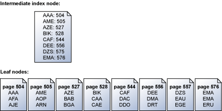

# Reading Pages
[!INCLUDE[appliesto-ss-xxxx-xxxx-xxx-md](../includes/appliesto-ss-xxxx-xxxx-xxx-md.md)]

The I/O from an instance of the SQL Server [!INCLUDE[ssDE](../includes/ssde-md.md)] includes logical and physical reads. A logical read occurs every time the [!INCLUDE[ssDE](../includes/ssde-md.md)] requests a page from the [buffer cache](../relational-databases/memory-management-architecture-guide.md). If the page is not currently in the buffer cache, a physical read first copies the page from disk into the cache.

The read requests generated by an instance of the [!INCLUDE[ssDE](../includes/ssde-md.md)] are controlled by the relational engine and optimized by the storage engine. The relational engine determines the most effective access method (such as a table scan, an index scan, or a keyed read); the access methods and buffer manager components of the storage engine determine the general pattern of reads to perform, and optimize the reads required to implement the access method. The thread executing the batch schedules the reads.

## Read-Ahead
The [!INCLUDE[ssDE](../includes/ssde-md.md)] supports a performance optimization mechanism called read-ahead. Read-ahead anticipates the data and index pages needed to fulfill a query execution plan and brings the pages into the buffer cache before they are actually used by the query. This allows computation and I/O to overlap, taking full advantage of both the CPU and the disk. 

The read-ahead mechanism allows the [!INCLUDE[ssDE](../includes/ssde-md.md)] to read up to 64 contiguous pages (512KB) from one file. The read is performed as a single scatter-gather read to the appropriate number of (probably non-contiguous) buffers in the buffer cache. If any of the pages in the range are already present in the buffer cache, the corresponding page from the read will be discarded when the read completes. The range of pages may also be "trimmed" from either end if the corresponding pages are already present in the cache.

There are two kinds of read-ahead: one for data pages and one for index pages.

### Reading Data Pages
Table scans used to read data pages are very efficient in the [!INCLUDE[ssDE](../includes/ssde-md.md)]. The index allocation map (IAM) pages in a SQL Server database list the extents used by a table or index. The storage engine can read the IAM to build a sorted list of the disk addresses that must be read. This allows the storage engine to optimize its I/Os as large sequential reads that are performed in sequence, based on their location on the disk. For more information about IAM pages, see [Managing Space Used by Objects](../relational-databases/pages-and-extents-architecture-guide.md).

### Reading Index Pages
The storage engine reads index pages serially in key order. For example, this illustration shows a simplified representation of a set of leaf pages that contains a set of keys and the intermediate index node mapping the leaf pages. For more information about the structure of pages in an index, see [Clustered Index Structures](../relational-databases/pages-and-extents-architecture-guide.md).

The storage engine uses the information in the intermediate index page above the leaf level to schedule serial read-aheads for the pages that contain the keys. If a request is made for all the keys from ABC to DEF, the storage engine first reads the index page above the leaf page. However, it does not just read each data page in sequence from page 504 to page 556 (the last page with keys in the specified range). Instead, the storage engine scans the intermediate index page and builds a list of the leaf pages that must be read. The storage engine then schedules all the reads in key order. The storage engine also recognizes that pages 504/505 and 527/528 are contiguous and performs a single scatter read to retrieve the adjacent pages in a single operation. When there are many pages to be retrieved in a serial operation, the storage engine schedules a block of reads at a time. When a subset of these reads is completed, the storage engine schedules an equal number of new reads until all the required reads have been scheduled.

The storage engine uses prefetching to speed base table lookups from nonclustered indexes. The leaf rows of a nonclustered index contain pointers to the data rows that contain each specific key value. As the storage engine reads through the leaf pages of the nonclustered index, it also starts scheduling asynchronous reads for the data rows whose pointers have already been retrieved. This allows the storage engine to retrieve data rows from the underlying table before it has completed the scan of the nonclustered index. Prefetching is used regardless of whether the table has a clustered index. SQL Server Enterprise uses more prefetching than other editions of SQL Server, allowing more pages to be read ahead. The level of prefetching is not configurable in any edition. For more information about nonclustered indexes, see [Nonclustered Index Structures](../relational-databases/pages-and-extents-architecture-guide.md).

## Advanced Scanning
In SQL Server Enterprise, the advanced scan feature allows multiple tasks to share full table scans. If the execution plan of a Transact-SQL statement requires a scan of the data pages in a table and the [!INCLUDE[ssDE](../includes/ssde-md.md)] detects that the table is already being scanned for another execution plan, the [!INCLUDE[ssDE](../includes/ssde-md.md)] joins the second scan to the first, at the current location of the second scan. The [!INCLUDE[ssDE](../includes/ssde-md.md)] reads each page one time and passes the rows from each page to both execution plans. This continues until the end of the table is reached. 

At that point, the first execution plan has the complete results of a scan, but the second execution plan must still retrieve the data pages that were read before it joined the in-progress scan. The scan for the second execution plan then wraps back to the first data page of the table and scans forward to where it joined the first scan. Any number of scans can be combined like this. The [!INCLUDE[ssDE](../includes/ssde-md.md)] will keep looping through the data pages until it has completed all the scans. This mechanism is also called "merry-go-round scanning" and demonstrates why the order of the results returned from a SELECT statement cannot be guaranteed without an ORDER BY clause. 

For example, assume that you have a table with 500,000 pages. UserA executes a Transact-SQL statement that requires a scan of the table. When that scan has processed 100,000 pages, UserB executes another Transact-SQL statement that scans the same table. The [!INCLUDE[ssDE](../includes/ssde-md.md)] schedules one set of read requests for pages after 100,001, and passes the rows from each page back to both scans. When the scan reaches the 200,000th page, UserC executes another Transact-SQL statement that scans the same table. Starting with page 200,001, the [!INCLUDE[ssDE](../includes/ssde-md.md)] passes the rows from each page it reads back to all three scans. After it reads the 500,000th row, the scan for UserA is complete, and the scans for UserB and UserC wrap back and start to read the pages starting with page 1. When the [!INCLUDE[ssDE](../includes/ssde-md.md)] gets to page 100,000, the scan for UserB is completed. The scan for UserC then keeps going alone until it reads page 200,000. At this point, all the scans have been completed. 

Without advanced scanning, each user would have to compete for buffer space and cause disk arm contention. The same pages would then be read once for each user, instead of read one time and shared by multiple users, slowing down performance and taxing resources.

## See Also
[Pages and Extents Architecture Guide](../relational-databases/pages-and-extents-architecture-guide.md)   
 [Writing Pages](../relational-databases/writing-pages.md)
