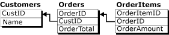
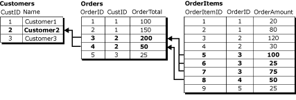
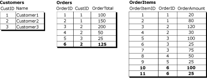
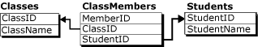

# Group changes to related rows with logical records
[!INCLUDE [SQL Server](../../../includes/applies-to-version/sqlserver.md)]
    
> [!NOTE]  
>  [!INCLUDE[ssNoteDepFutureAvoid](../../../includes/ssnotedepfutureavoid-md.md)]  
  
 By default, Merge Replication processes data changes on a row-by-row basis. In many circumstances, this approach is appropriate, but for some applications, it's essential that related rows be processed as a unit. The logical records feature of Merge Replication allows you to define a relationship between related rows in different tables so that the rows are processed as a unit.  
  
> [!NOTE]  
>  You can use the logical records feature alone or in conjunction with join filters. For more information about join filters, see [Join Filters](../../../relational-databases/replication/merge/join-filters.md). To use logical records, the compatibility level of the publication must be at least 90RTM.  
  
 Consider these three related tables:  
  
   
  
 The **Customers** table is the parent table in this relationship and has a primary key column **CustID**. The **Orders** table has a primary key column **OrderID**, with a foreign key constraint on the **CustID** column that references the **CustID** column in the **Customers** table. Similarly, the **OrderItems** table has a primary key column **OrderItemID**, with a foreign key constraint on the **OrderID** column that references the **OrderID** column in the **Orders** table.  
  
 In this example, a logical record consists of all the rows in the **Orders** table that are related to a single **CustID** value and all of the rows in the **OrderItems** table that are related to those rows in the **Orders** table. This diagram shows all the rows in the three tables that are in the logical record for Customer2:  
  
   
  
 To define a logical record relationship between articles, see [Define a Logical Record Relationship Between Merge Table Articles](../../../relational-databases/replication/publish/define-a-logical-record-relationship-between-merge-table-articles.md).  
  
## Benefits of logical records  
 The logical records feature has two primary benefits:  
  
-   Application of data changes as a unit.  
  
-   The detection and resolution of conflicts simultaneously on multiple rows from multiple tables.  
  
### The application of changes as a unit  
 If merge processing is interrupted, such as in the case of a dropped connection, the process rolls back the partially completed set of related replicated changes if logical records are used. For example, consider the case where a Subscriber adds a new order with **OrderID** = 6 and two new rows in the **OrderItems** table with **OrderItemID** = 10 and **OrderItemID** = 11 for **OrderID** = 6.  
  
   
  
 If the replication process is interrupted after the **Orders** row for **OrderID** = 6 is complete, but before the **OrderItems** 10 and 11 are complete, and logical records aren't used, the **OrderTotal** value for **OrderID** = 6 isn't consistent with the sum of the **OrderAmount** values for the **OrderItems** rows. If logical records are used, the **Orders** row for **OrderID** = 6 isn't committed until the related **OrderItems** changes are replicated.  
  
 In a different scenario, if logical records are used, and someone is querying tables when the merge process is applying changes, the user doesn't see the partially replicated changes until they're all complete. For example, the replication process uploads the **Orders** row for **OrderID** = 6, but a user queries the tables before the replication process replicates the **OrderItems** rows, the **OrderTotal** value isn't the same as the sum of the **OrderAmount** values. If logical records are used, the **Orders** row isn't visible until the **OrderItems** rows are complete and the transaction is committed as a unit.  
  
### The application of conflict handling to more than one table  
 Consider the case where two Subscribers have the preceding data set:  
  
-   A user at the first Subscriber changes the **OrderAmount** of **OrderItemID** 5 from 100 to 150 and the **OrderTotal** of **OrderID** 3 from 200 to 250.  
  
-   A user at the second Subscriber changes the **OrderAmount** of **OrderItemID** 6 from 25 to 125 and the **OrderTotal** of **OrderID** 3 from 200 to 300.  
  
 If these changes are replicated without using logical records, the different **OrderTotal** values result in a conflict and only one of them is replicated. But the non-conflicting changes in the **OrderItems** table are replicated without conflict, leaving the final **OrderTotal** values in an inconsistent state with respect to the **OrderItems** rows. If logical records are used in this scenario, the **OrderItems** change associated with the losing **Orders** table change is also rolled back, and the final **OrderTotal** value is an accurate summary of the **OrderItems** rows.  
  
 For more information about options related to conflict detection and resolution with logical records, see [Detecting and Resolving Conflicts in Logical Records](../../../relational-databases/replication/merge/advanced-merge-replication-conflict-resolving-in-logical-record.md).  
  
## Considerations for using logical records  
 Keep the following considerations in mind when using logical records.  
  
### General considerations  
  
-   Keep the number of tables in a logical record as low as possible. Use five tables or fewer.  
  
-   Logical records can't reference columns with any of the following data types:  
  
    -   **varchar(max)** and **nvarchar(max)**  
  
    -   **varbinary(max)**  
  
    -   **text** and **ntext**  
  
    -   **image**  
  
    -   **XML**  
  
    -   **UDT**  
  
-   You can't define foreign key relationships in published tables by using the CASCADE option. For more information, see [CREATE TABLE (Transact-SQL)](../../../t-sql/statements/create-table-transact-sql.md) and [ALTER TABLE (Transact-SQL)](../../../t-sql/statements/alter-table-transact-sql.md).  
  
-   You can't update any columns that are used in the logical relation clause.  
  
-   Custom conflict resolution by using business logic handlers or custom resolvers isn't supported for articles that are included in a logical record.  
  
-   If you use logical records in a publication that includes parameterized filters, you must initialize each Subscriber with a snapshot for its partition. If you initialize a Subscriber by using another method, the Merge Agent fails. For more information, see [Snapshots for Merge Publications with Parameterized Filters](../../../relational-databases/replication/create-a-snapshot-for-a-merge-publication-with-parameterized-filters.md).  
  
-   Conflicts that involve logical records don't appear in Conflict Viewer. To view information about these conflicts, use replication stored procedures. For more information, see [View Conflict Information for Merge Publications (Replication Transact-SQL Programming)](../view-and-resolve-data-conflicts-for-merge-publications.md).  
  
### Publication settings  
  
-   The publication must have a compatibility level of 90RTM or greater. For more information, see the "Publication Compatibility Level" section of [Replication Backward Compatibility](../../../relational-databases/replication/replication-backward-compatibility.md).  
  
-   The publication must use native snapshot mode. This mode is the default unless you're replicating to [!INCLUDE[ssEW](../../../includes/ssew-md.md)], which doesn't support logical records.  
  
-   The publication can't allow Web synchronization. For more information about Web synchronization, see [Web Synchronization for Merge Replication](../../../relational-databases/replication/web-synchronization-for-merge-replication.md).  
  
-   To use logical records on a filtered publication:  
  
    -   You must also use precomputed partitions. The requirements of precomputed partitions also apply to logical records. For more information, see [Optimize Parameterized Filter Performance with Precomputed Partitions](../../../relational-databases/replication/merge/parameterized-filters-optimize-for-precomputed-partitions.md).  
  
    -   You can't use nonoverlapping parameterized filters. For more information, see the "Setting 'partition options'" section of [Parameterized Row Filters](../../../relational-databases/replication/merge/parameterized-filters-parameterized-row-filters.md).  
  
-   If the publication uses join filters, you must set the **join unique key** property to **true** for all join filters that are involved in logical record relationships. For more information, see [Join Filters](../../../relational-databases/replication/merge/join-filters.md).  
  
### Relationships between tables  
  
-   Tables related through logical records must have a primary key-foreign key relationship.  
  
-   You can't set the NOT FOR REPLICATION option for foreign key constraints.  
  
-   Child tables can have only one parent table.  
  
     For example, a database tracking classes and students might have a design similar to:  
  
       
  
     You can't use a logical record to represent the three tables in this relationship, because the rows in **ClassMembers** aren't associated with a single primary key row. The tables **Classes** and **ClassMembers** could still form a logical record, as could the tables **ClassMembers** and **Students**, but not all three.  
  
-   The publication can't contain circular join filter relationships.  
  
     Using the example with the tables **Customers**, **Orders**, and **OrderItems**, you can't use logical records if the **Orders** table also has a foreign key constraint that references the **OrderItems** table.  
  
## Performance implications of logical records  
 The logical record feature comes with a performance cost. If you don't use logical records, the replication agent can process all of the changes for a given article at the same time. Because the changes are applied in a row-by-row fashion, the locking and transaction log requirements necessary for applying the changes are minimal.  
  
 If you use logical records, the Merge Agent must process the changes for each entire logical record together. This process affects the amount of time it takes the Merge Agent to replicate the rows. Additionally, because the agent opens a separate transaction for each logical record, locking requirements can increase.  
  
## Related content

- [Article Options for Merge Replication](article-options-for-merge-replication.md)
