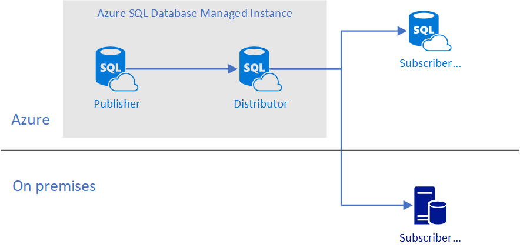
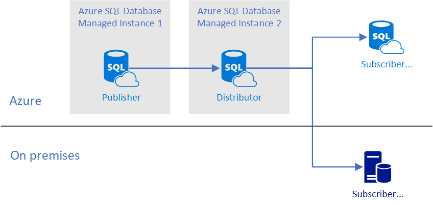

---
title: "Replication with SQL Database Managed Instance| Microsoft Docs"
ms.custom: ""
ms.date: "06/15/2018"
ms.prod: sql
ms.prod_service: "database-engine, sql-database"
ms.component: "replication"
ms.reviewer: ""
ms.suite: "sql"
ms.technology:
 - "replication"
ms.tgt_pltfrm: ""
ms.topic: conceptual
helpviewer_keywords:
 - "SQL Database replication"
 - "replication, SQL Database"
ms.assetid: e8484da7-495f-4dac-b38e-bcdc4691f9fa
caps.latest.revision: 15
author: "MashaMSFT"
ms.author: "mathoma"
manager: craigg
monikerRange: "= azuresqldb-current || >= sql-server-2016 || = sqlallproducts-allversions"
---
# Replication with SQL Database Managed Instance

[!INCLUDE[appliesto-ss-asdbmi-xxxx-xxx-md](../../includes/appliesto-ss-asdbmi-xxxx-xxx-md.md)]

Azure SQL Database Managed Instance (preview) supports transactional replication. Managed Instance can host publisher, distributor, and subscriber databases.

## Common configurations

Managed instance can host replication databases in the follwoing configurations:

- **Publisher with local distributor on managed instance**

   

   Publisher and distributor databases are configured on a single managed instance.

- **Publisher with remote distributor on managed instance**

   

   Publisher and distributor are configured on two managed instances. In this configuration:

   - Both managed instances are in the same vNet.

   - Both managed instances are in the same location.

- **Publisher and distributor on premises with subscriber on managed instance**

   

   In this configuration managed instance is a subscriber. This configuration supports migration from on-premises to Azure. In the subscriber role, SQL database does not require managed instance, you can use a SQL Database Managed Instance as a step in migration from on-premises to the Azure. For more information about Azure SQL Database subscribers, see [Replication to SQL Database](replication-to-sql-database.md).

## Requirements

- All instances of SQL Server need to be on the same vNet

- Connectivity between replication participants use SQL Authentication

- Managed instance distributors and publishers use an Azure storage account for the working directory

## Features

- Supports mix of on-premises and Azure SQL Database Managed Instance instances.

## Configure publishing and distribution 

## Remarks

## Replication Architecture
 
## Scenarios

### Typical Replication Scenario

- Migrate from on premises to Azure SQL Database Managed instance. 

#### Data Migration Scenario

## Limitations

## Examples

## See Also
