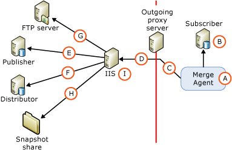

# Security Architecture for Web Synchronization
[!INCLUDE[appliesto-ss-xxxx-xxxx-xxx-md](../../../includes/appliesto-ss-xxxx-xxxx-xxx-md.md)]
  [!INCLUDE[msCoName](../../../includes/msconame-md.md)] [!INCLUDE[ssNoVersion](../../../includes/ssnoversion-md.md)] enables fine-grained control over the configuration of Web synchronization security. This topic provides a comprehensive list of all the components that can be included in a Web synchronization configuration and information about the connections that are made between components. [!INCLUDE[ssNoteWinAuthentication](../../../includes/ssnotewinauthentication-md.md)]  
  
 The following illustration shows all the possible connections, but some connections might not be required in a particular topology. For example, a connection to an FTP server is required only if the snapshot is delivered by using FTP.  
  
   
  
 The following tables describe the components and connections that are shown in the illustration.  
  
## A. Windows User Under Which the Merge Agent Runs  
 During synchronization, the Merge Agent (A) is started at the Subscriber. The Merge Agent can be started from a [!INCLUDE[ssNoVersion](../../../includes/ssnoversion-md.md)] Agent job step or from a stand-alone custom application. If the Merge Agent is started from a [!INCLUDE[ssNoVersion](../../../includes/ssnoversion-md.md)] Agent job step, the Merge Agent runs under the context of a Windows user that you specify. If you do not specify a Windows user, the Merge Agent runs under the context of the Windows service account for [!INCLUDE[ssNoVersion](../../../includes/ssnoversion-md.md)] Agent.  
  
|Type of account|Where the account is specified|  
|---------------------|------------------------------------|  
|Windows user|[!INCLUDE[tsql](../../../includes/tsql-md.md)]: the **@job_login** and **@job_password** parameters of [sp_addmergepullsubscription_agent](../../../relational-databases/system-stored-procedures/sp-addmergepullsubscription-agent-transact-sql.md).   RMO (Replication Management Objects): the <xref:Microsoft.SqlServer.Replication.IProcessSecurityContext.Login%2A> and <xref:Microsoft.SqlServer.Replication.IProcessSecurityContext.Password%2A> properties for <xref:Microsoft.SqlServer.Replication.PullSubscription.SynchronizationAgentProcessSecurity%2A>.|  
|Windows service account for [!INCLUDE[ssNoVersion](../../../includes/ssnoversion-md.md)] Agent|[!INCLUDE[ssNoVersion](../../../includes/ssnoversion-md.md)] Configuration Manager|  
|Stand-alone application|The Merge Agent runs under the context of the Windows user that is running the application.|  
  
## B. Connection to the Subscriber  
 The Merge Agent connects to the Subscriber by using Windows Authentication or [!INCLUDE[ssNoVersion](../../../includes/ssnoversion-md.md)] Authentication. The Windows user or [!INCLUDE[ssNoVersion](../../../includes/ssnoversion-md.md)] login that you specify must be associated with a database user that is a member of the **dbowner** fixed database role in the subscription database.  
  
> [!NOTE]  
>  Windows Authentication is always used when the Merge Agent is started from a [!INCLUDE[ssNoVersion](../../../includes/ssnoversion-md.md)] Agent job. Windows Authentication is also used when the Merge Agent is started programmatically unless [!INCLUDE[ssNoVersion](../../../includes/ssnoversion-md.md)] Authentication is explicitly specified.  
  
|Type of authentication|Where the authentication is specified|  
|----------------------------|-------------------------------------------|  
|-   Windows Authentication.|The Merge Agent makes connections under the context of the Windows user that is specified for the Merge Agent (A).|  
|[!INCLUDE[ssNoVersion](../../../includes/ssnoversion-md.md)] Authentication is used only if the following is specified:   -   RMO: a value of <xref:Microsoft.SqlServer.Replication.SecurityMode.Standard> for <xref:Microsoft.SqlServer.Replication.MergeSynchronizationAgent.SubscriberSecurityMode%2A>. -   Merge Agent command line: a value of **0** for **SubscriberSecurityMode**.|RMO: <xref:Microsoft.SqlServer.Replication.MergeSynchronizationAgent.SubscriberLogin%2A> and <xref:Microsoft.SqlServer.Replication.MergeSynchronizationAgent.SubscriberPassword%2A>.   Merge Agent command line: **-SubscriberLogin** and **-SubscriberLogin**.|  
  
## C. Connection to an Outgoing Proxy Server  
 Specify a Windows user for this connection only if there is an outgoing proxy server that restricts access to the internal network of the Subscriber.  
  
|Type of authentication|Where the authentication is specified|  
|----------------------------|-------------------------------------------|  
|Windows Authentication|RMO: <xref:Microsoft.SqlServer.Replication.MergeSynchronizationAgent.InternetProxyLogin%2A> and <xref:Microsoft.SqlServer.Replication.MergeSynchronizationAgent.InternetProxyPassword%2A> with <xref:Microsoft.SqlServer.Replication.MergeSynchronizationAgent.InternetProxyServer%2A>.   Merge Agent command line: **-InternetProxyLogin** and **-InternetProxyPassword** with **-InternetProxyServer**.|  
  
## D. Connection to IIS  
 After connecting to the Subscriber and extracting any changes from the subscription database, the Merge Agent makes an HTTPS request to [!INCLUDE[msCoName](../../../includes/msconame-md.md)] Internet Information Services (IIS) and uploads data changes as an XML message. The Merge Agent must have logon permissions to IIS.  
  
|Type of authentication|Where the authentication is specified|  
|----------------------------|-------------------------------------------|  
|Basic Authentication is used if one of the following is specified:   -   [!INCLUDE[tsql](../../../includes/tsql-md.md)]: a value of **0** for the **@internet_security_mode** parameter of [sp_addmergepullsubscription_agent](../../../relational-databases/system-stored-procedures/sp-addmergepullsubscription-agent-transact-sql.md). -   RMO: a value of <xref:Microsoft.SqlServer.Replication.SecurityMode.Standard> for <xref:Microsoft.SqlServer.Replication.MergeSynchronizationAgent.InternetSecurityMode%2A>. -   Merge Agent command line: a value of **0** for **-InternetSecurityMode**.|[!INCLUDE[tsql](../../../includes/tsql-md.md)]: the **@internet_login** and **@internet_password** parameters of [sp_addmergepullsubscription_agent](../../../relational-databases/system-stored-procedures/sp-addmergepullsubscription-agent-transact-sql.md).   RMO: <xref:Microsoft.SqlServer.Replication.MergeSynchronizationAgent.InternetLogin%2A> and <xref:Microsoft.SqlServer.Replication.MergeSynchronizationAgent.InternetPassword%2A>.   Merge Agent command line: **-InternetLogin** and **-InternetPassword**.|  
|Integrated Authentication1 is used if one of the following is specified:   -   [!INCLUDE[tsql](../../../includes/tsql-md.md)]: a value of **1** for the **@internet_security_mode** parameter of [sp_addmergepullsubscription_agent](../../../relational-databases/system-stored-procedures/sp-addmergepullsubscription-agent-transact-sql.md). -   RMO: a value of <xref:Microsoft.SqlServer.Replication.SecurityMode.Integrated> for <xref:Microsoft.SqlServer.Replication.MergeSynchronizationAgent.InternetSecurityMode%2A>. -   Merge Agent command line: a value of **1** for **-InternetSecurityMode**.|The Merge Agent makes connections under the context of the Windows user that is specified for the Merge Agent (A).|  
  
 1 Integrated authentication can be used only if all computers are in the same domain or are in multiple domains that have trust relationships with each other.  
  
> [!NOTE]  
>  Delegation is required if you use Integrated Authentication. We recommend that you use Basic Authentication and SSL for connections from the Subscriber to IIS.  
  
## E. Connection to the Publisher  
 The [!INCLUDE[ssNoVersion](../../../includes/ssnoversion-md.md)] Replication Listener and Merge Replication Reconciler components are hosted on the computer that is running IIS. These components perform the following actions:  
  
-   Pick up the HTTPS request that is described in the section "D. Connection to IIS".  
  
-   Make an SQL connection to the publication database and apply the uploaded changes to the publication database.  
  
-   Extract the downloaded changes and send an HTTPS response back to the Merge Agent.  
  
 The Merge Replication Reconciler connects to the Publisher by using either Windows Authentication or [!INCLUDE[ssNoVersion](../../../includes/ssnoversion-md.md)] Authentication. The Windows user or [!INCLUDE[ssNoVersion](../../../includes/ssnoversion-md.md)] login that you specify must comply with the following:  
  
-   Be in the publication access list (PAL). For more information, see [Secure the Publisher](../../../relational-databases/replication/security/secure-the-publisher.md).  
  
-   Be associated with a user in the publication database.  
  
|Type of authentication|Where the authentication is specified|  
|----------------------------|-------------------------------------------|  
|Windows Authentication is used if one of the following is specified:   -   [!INCLUDE[tsql](../../../includes/tsql-md.md)]: a value of **1** for the **@publisher_security_mode** parameter of [sp_addmergepullsubscription_agent](../../../relational-databases/system-stored-procedures/sp-addmergepullsubscription-agent-transact-sql.md). -   RMO: a value of <xref:Microsoft.SqlServer.Replication.SecurityMode.Integrated> for <xref:Microsoft.SqlServer.Replication.MergeSynchronizationAgent.PublisherSecurityMode%2A>. -   Merge Agent command line: a value of **1** for **-PublisherSecurityMode**.|The Merge Agent makes connections to the Publisher under the context of the Windows user that is specified for the connection to IIS (D). If the Publisher and IIS are on different computers and Integrated Authentication is used for the connection (D), you must enable Kerberos delegation on the computer that is running IIS. For more information, see the Windows documentation.|  
|[!INCLUDE[ssNoVersion](../../../includes/ssnoversion-md.md)] Authentication is used if one of the following is specified:   -   [!INCLUDE[tsql](../../../includes/tsql-md.md)]: a value of **0** for the **@publisher_security_mode** parameter of [sp_addmergepullsubscription_agent](../../../relational-databases/system-stored-procedures/sp-addmergepullsubscription-agent-transact-sql.md). -   RMO: a value of <xref:Microsoft.SqlServer.Replication.SecurityMode.Standard> for <xref:Microsoft.SqlServer.Replication.MergeSynchronizationAgent.PublisherSecurityMode%2A>. -   Merge Agent command line: a value of **0** for **-PublisherSecurityMode**.|[!INCLUDE[tsql](../../../includes/tsql-md.md)]: the **@publisher_login** and **@publisher_password** parameters of [sp_addmergepullsubscription_agent](../../../relational-databases/system-stored-procedures/sp-addmergepullsubscription-agent-transact-sql.md).   RMO: <xref:Microsoft.SqlServer.Replication.MergeSynchronizationAgent.PublisherLogin%2A> and <xref:Microsoft.SqlServer.Replication.MergeSynchronizationAgent.PublisherPassword%2A>.   Merge Agent command line: **-PublisherLogin** and **-PublisherPassword**.|  
  
## F. Connection to the Distributor  
 The Merge Replication Reconciler that is hosted on the computer that is running IIS also makes connections to the Distributor. The Merge Replication Reconciler connects to the Distributor by using either Windows Authentication or [!INCLUDE[ssNoVersion](../../../includes/ssnoversion-md.md)] Authentication. The Windows user or [!INCLUDE[ssNoVersion](../../../includes/ssnoversion-md.md)] login that you specify must comply with the following:  
  
-   Be in the publication access (PAL). For more information, see [Secure the Publisher](../../../relational-databases/replication/security/secure-the-publisher.md).  
  
-   Be associated with a database user in the distribution database. The user can be the **Guest** user.  
  
 The snapshot share is typically on the Distributor. For more information about snapshot shares, see the section "H. Access to the snapshot share" later in this topic.  
  
|-   Type of authentication|Where the authentication is specified|  
|-------------------------------|-------------------------------------------|  
|Windows Authentication is used if one of the following is specified:   -   [!INCLUDE[tsql](../../../includes/tsql-md.md)]: a value of **1** for the **@distributor_security_mode** parameter of [sp_addmergepullsubscription_agent](../../../relational-databases/system-stored-procedures/sp-addmergepullsubscription-agent-transact-sql.md). -   RMO: a value of <xref:Microsoft.SqlServer.Replication.SecurityMode.Integrated> for <xref:Microsoft.SqlServer.Replication.MergeSynchronizationAgent.DistributorSecurityMode%2A>. -   Merge Agent command line: a value of **1** for **-DistributorSecurityMode**.|The Merge Agent makes connections to the Distributor under the context of the Windows user that is specified for the connection to IIS (D). If the Distributor and IIS are on different computers and Integrated Authentication is used for the connection (D), you must enable Kerberos delegation on the computer that is running IIS. For more information, see the Windows documentation.|  
|[!INCLUDE[ssNoVersion](../../../includes/ssnoversion-md.md)] Authentication is used if one of the following is specified:   -   [!INCLUDE[tsql](../../../includes/tsql-md.md)]: a value of **0** for the **@distributor_security_mode** parameter of [sp_addmergepullsubscription_agent](../../../relational-databases/system-stored-procedures/sp-addmergepullsubscription-agent-transact-sql.md). -   RMO: a value of <xref:Microsoft.SqlServer.Replication.SecurityMode.Standard> for <xref:Microsoft.SqlServer.Replication.MergeSynchronizationAgent.DistributorSecurityMode%2A>. -   Merge Agent command line: a value of **0** for **-DistributorSecurityMode**.|[!INCLUDE[tsql](../../../includes/tsql-md.md)]: the **@distributor_login** and **@distributor_password** parameters of [sp_addmergepullsubscription_agent](../../../relational-databases/system-stored-procedures/sp-addmergepullsubscription-agent-transact-sql.md).   RMO: <xref:Microsoft.SqlServer.Replication.MergeSynchronizationAgent.DistributorLogin%2A> and <xref:Microsoft.SqlServer.Replication.MergeSynchronizationAgent.DistributorPassword%2A>   Merge Agent command line: **-DistributorLogin** and **-DistributorPassword**.|  
  
## G. Connection to an FTP Server  
 Specify a Windows user for this connection only if you will download snapshot files from an FTP server, instead of from a UNC location, to the computer that is running IIS before you apply the snapshot to the Subscriber. For more information, see [Transfer Snapshots Through FTP](../../../relational-databases/replication//publish/deliver-a-snapshot-through-ftp.md).  
  
|Type of authentication|Where the authentication is specified|  
|----------------------------|-------------------------------------------|  
|Windows Authentication|[!INCLUDE[tsql](../../../includes/tsql-md.md)]: the **@ftp_login** and **@ftp_password** parameters of [sp_addmergepublication](../../../relational-databases/system-stored-procedures/sp-addmergepublication-transact-sql.md).   RMO: <xref:Microsoft.SqlServer.Replication.Publication.FtpLogin%2A> and <xref:Microsoft.SqlServer.Replication.Publication.FtpPassword%2A>.|  
  
## H. Access to the Snapshot Share  
 The snapshot share is accessed by the Merge Replication Reconciler that is hosted on the computer that is running IIS.  
  
|Type of authentication|Where the authentication is specified|  
|----------------------------|-------------------------------------------|  
|Windows Authentication|The Merge Agent accesses the snapshot share under the context of the Windows user that is specified for the connection to IIS (D). If the snapshot share and IIS are on different computers and Integrated Authentication is used for the connection (D), you must enable Kerberos delegation on the computer that is running IIS. For more information, see the Windows documentation.|  
  
## I. Application Pool Account for IIS  
 This account is used to start the W3wp.exe process on the computer that is running IIS for [!INCLUDE[winxpsvr](../../../includes/winxpsvr-md.md)] or the Dllhost.exe process on [!INCLUDE[win2kfamily](../../../includes/win2kfamily-md.md)]. These processes host applications on the computer that is running IIS, such as the [!INCLUDE[ssNoVersion](../../../includes/ssnoversion-md.md)] Replication Listener and Merge Replication Reconciler. This account should have read and execute permissions on the following replication DLLs on the computer that is running IIS:  
  
-   Replisapi  
  
-   Replrec  
  
-   Replprov  
  
-   Msgprox  
  
-   Xmlsub  
  
 The account should also be part of IIS_WPG group. For more information, see the section "Setting Permissions for the [!INCLUDE[ssNoVersion](../../../includes/ssnoversion-md.md)] Replication Listener" in [Configure IIS for Web Synchronization](../../../relational-databases/replication/configure-iis-for-web-synchronization.md).  
  
|Type of account|Where the account is specified|  
|---------------------|------------------------------------|  
|Any Windows user that has the required permissions.|Internet Information Services (IIS) Manager. |  
  
## See Also  
 [Configure Web Synchronization](../../../relational-databases/replication/configure-web-synchronization.md)   
 [Replication Merge Agent](../../../relational-databases/replication/agents/replication-merge-agent.md)  
  
  
