# Troubleshooter: Find errors with SQL Server transactional replication 
[!INCLUDE [SQL Server SQL MI](../../includes/applies-to-version/sql-asdbmi.md)]

Troubleshooting replication errors can be frustrating without a basic understanding of how transactional replication works. The first step in creating a publication is having the Snapshot Agent create the snapshot and save it to the snapshot folder. Next, the Distribution Agent applies the snapshot to the subscriber. 

This process creates the publication and puts it in the *synchronizing* state. Synchronization works in three phases:
1. Transactions occur on objects that are replicated, and are marked "for replication" in the transaction log. 
2. The Log Reader Agent scans through the transaction log and looks for transactions that are marked "for replication." These transactions are then saved to the distribution database. 
3. The Distribution Agent scans through the distribution database by using the reader thread. Then, by using the writer thread, this agent connects to the subscriber to apply those changes to the subscriber.

Errors can occur in any step of this process. Finding those errors can be the most challenging aspect of troubleshooting synchronization issues. Thankfully, the use of Replication Monitor makes this process easy. 

>[!NOTE]
> - The purpose of this troubleshooting guide is to teach troubleshooting methodology. It's designed not to solve your specific error, but to provide general guidance in finding errors with replication. Some specific examples are provided, but the resolution to them can vary depending on the environment. 
> - The errors that this guide provides as examples are based on the [Configuring transactional replication](../../relational-databases/replication/tutorial-replicating-data-between-continuously-connected-servers.md) tutorial.


## Troubleshooting methodology 

### Questions to ask
1. Where in the synchronization process is replication failing?
2. Which agent is experiencing an error?
1. When was the last time replication worked successfully? Has anything changed since then?  

### Steps to take
1. Use Replication Monitor to identify at which point replication is encountering the error (which agent?):
   - If errors are occurring in the **Publisher to Distributor** section, the issue is with the Log Reader Agent. 
   - If errors are occurring in the **Distributor to Subscriber** section, the issue is with the Distribution Agent.  
2. Look through that agent's job history in Job Activity Monitor to identify details of the error. If the job history is not showing enough details, you can [enable verbose logging](#enable-verbose-logging-on-any-agent) on that specific agent.
3. Try to determine a solution for the error.


## Find errors with the Snapshot Agent
The Snapshot Agent generates the snapshot and writes it to the specified snapshot folder. 

1. View the status of your Snapshot Agent:

    a. In Object Explorer, expand the **Local Publication** node under **Replication**.

    b. Right-click your publication **AdvWorksProductTrans** > **View Snapshot Agent Status**. 

    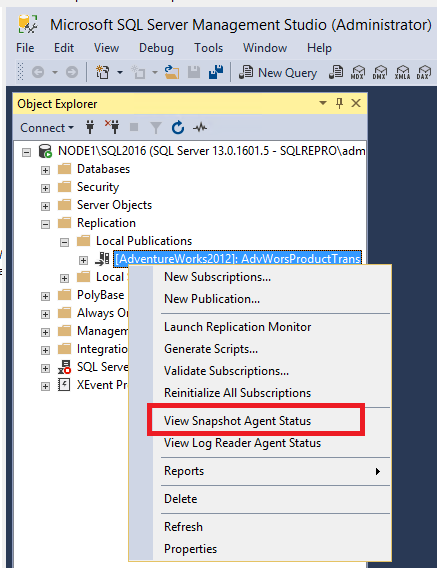

1. If an error is reported in the Snapshot Agent status, you can find more details in the Snapshot Agent job history:

    a. Expand **SQL Server Agent** in Object Explorer and open Job Activity Monitor. 

    b. Sort by **Category** and identify the Snapshot Agent by the category **REPL-Snapshot**.

    c. Right-click the Snapshot Agent and then select **View History**. 

   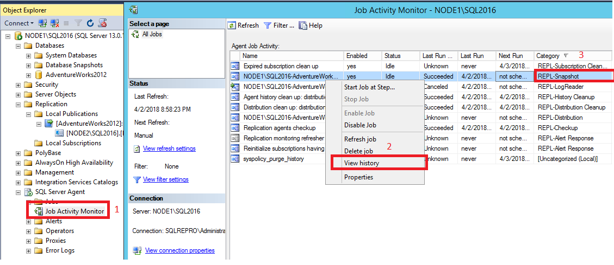
    
1. In the Snapshot Agent history, select the relevant log entry. This is usually a line or two *before* the entry that's reporting the error. (A red X indicates errors.) Review the message text in the box below the logs: 

    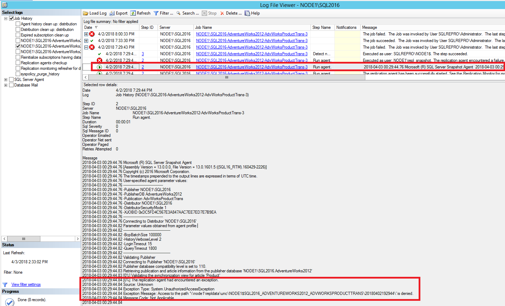

    ```console
    The replication agent had encountered an exception.
    Exception Message: Access to path '\\node1\repldata.....' is denied.
    ```

If your Windows permissions are not configured correctly for your snapshot folder, you'll see an "access is denied" error for the Snapshot Agent. You'll need to verify permissions to the folder where your snapshot is stored, and make sure that the account used to run the Snapshot Agent has permissions to access the share.  

## Find errors with the Log Reader Agent
The Log Reader Agent connects to your publisher database and scans the transaction log for any transactions that are marked "for replication." It then adds those transactions to the distribution database. 

1.  Connect to the publisher in [!INCLUDE[ssManStudioFull](../../includes/ssmanstudiofull-md.md)]. Expand the server node, right-click the **Replication** folder, and then select **Launch Replication Monitor**:  

    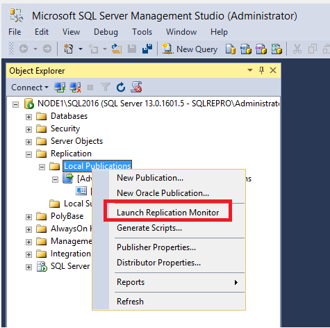
  
    Replication Monitor opens: 
    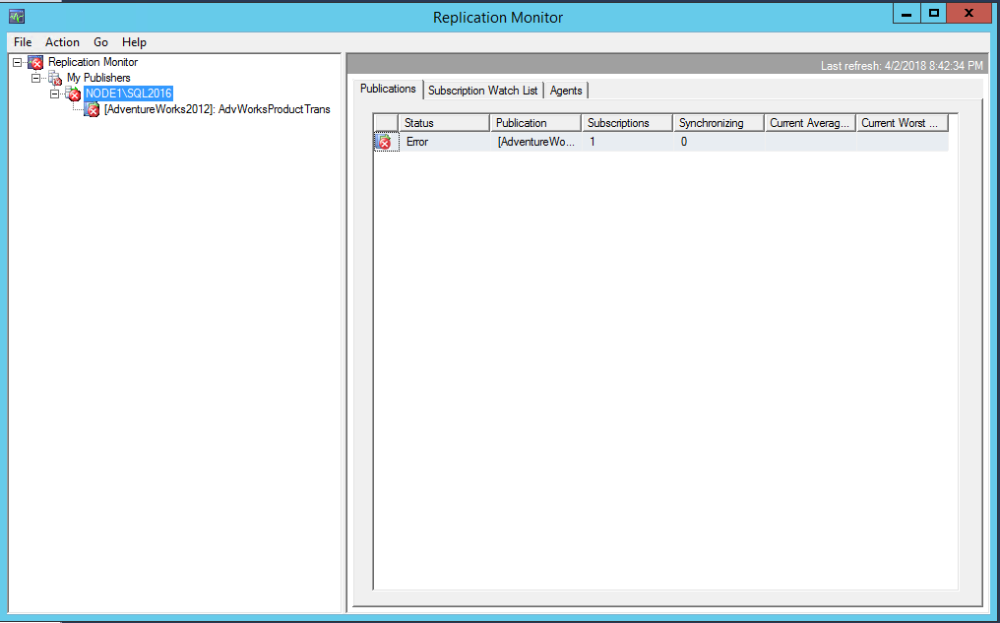 
   
2. The red X indicates that the publication is not synchronizing. Expand **My Publishers** on the left side, and then expand the relevant publisher server.  
  
3.  Select the **AdvWorksProductTrans** publication on the left, and then look for the red X on one of the tabs to identify where the issue is. In this case, the red X is on the **Agents** tab, so one of the agents is encountering an error: 

    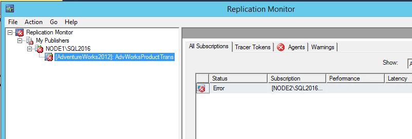

4. Select the **Agents** tab to identify which agent is encountering the error: 

    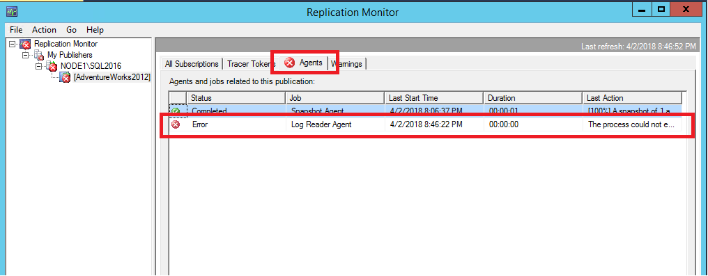


5. This view shows you two agents, the Snapshot Agent and the Log Reader Agent. The one that's encountering an error has the red X. In this case, it's the Log Reader Agent. 

    Double-click the line that's reporting the error to open the agent history for the Log Reader Agent. This history provides more information about the error: 
    
    

    ```console
    Status: 0, code: 20011, text: 'The process could not execute 'sp_replcmds' on 'NODE1\SQL2016'.'.
    The process could not execute 'sp_replcmds' on 'NODE1\SQL2016'.
    Status: 0, code: 15517, text: 'Cannot execute as the database principal because the principal "dbo" does not exist, this type of principal cannot be impersonated, or you do not have permission.'.
    Status: 0, code: 22037, text: 'The process could not execute 'sp_replcmds' on 'NODE1\SQL2016'.'.        
    ```

6. The error typically occurs when the owner of the publisher database is not set correctly. This can happen when a database is restored. To verify this:

    a. Expand **Databases** in Object Explorer.

    b. Right-click **AdventureWorks2012** > **Properties**. 

    c. Verify that an owner exists under the **Files** page. If this box is blank, this is the likely cause of your issue. 

   

7. If the owner is blank on the **Files** page, open a **New Query** window within the context of the AdventureWorks2012 database. Run the following T-SQL code:

    ```sql
    -- set the owner of the database to 'sa' or a specific user account, without the brackets. 
    EXECUTE sp_changedbowner '<useraccount>'
    -- example for sa: exec sp_changedbowner 'sa'
    -- example for user account: exec sp_changedbowner 'sqlrepro\administrator' 
    ```

8. You might need to restart the Log Reader Agent:

    a. Expand the **SQL Server Agent** node in Object Explorer and open Job Activity Monitor.

    b. Sort by **Category** and identify the Log Reader Agent by the **REPL-LogReader** category. 

    c. Right-click the **Log Reader Agent** job and select **Start Job at Step**. 

    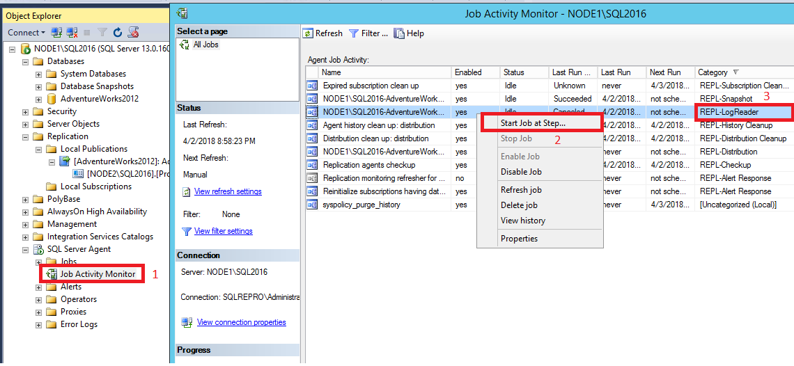

9. Validate that your publication is now synchronizing by opening Replication Monitor again. If it's not already open, you can find it by right-clicking **Replication** in Object Explorer. 
10. Select the **AdvWorksProductTrans** publication, select the **Agents** tab, and double-click the Log Reader Agent to open the agent history. You should now see that the Log Reader Agent is running and either is replicating commands or has "no replicated transactions":

    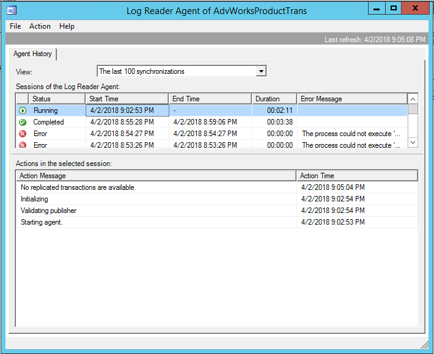

## Find errors with the Distribution Agent
The Distribution Agent finds data in the distribution database and then applies it to the subscriber. 

1. Connect to the publisher in [!INCLUDE[ssManStudioFull](../../includes/ssmanstudiofull-md.md)]. Expand the server node, right-click the **Replication** folder, and then select **Launch Replication Monitor**.  
2. In **Replication Monitor**, select the **AdvWorksProductTrans** publication, and select the **All Subscriptions** tab. Right-click the subscription and select **View Details**:

    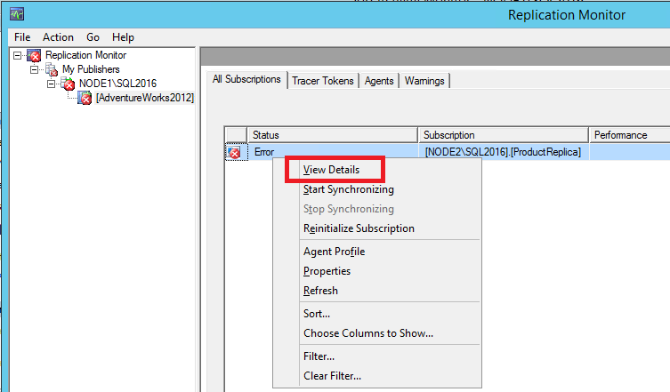

2. The **Distributor to Subscriber History** dialog box opens and clarifies what error the agent is encountering: 

     

    ```console
    Error messages:
    Agent 'NODE1\SQL2016-AdventureWorks2012-AdvWorksProductTrans-NODE2\SQL2016-7' is retrying after an error. 89 retries attempted. See agent job history in the Jobs folder for more details.
    ```

3. The error indicates that the Distribution Agent is retrying. To find more information, check the job history for the Distribution Agent: 

    a. Expand **SQL Server Agent** in Object Explorer > **Job Activity Monitor**. 
    
    b. Sort the jobs by **Category**. 

    c. Identify the Distribution Agent by the category **REPL-Distribution**. Right-click the agent and select **View History**.

    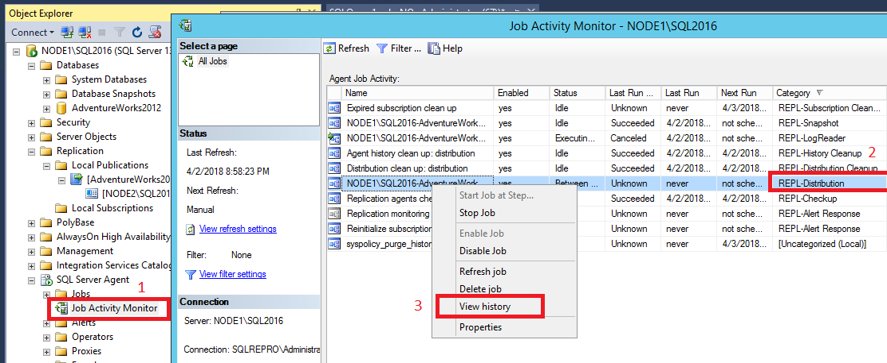

5. Select one of the error entries and view the error text at the bottom of the window:  

    

    ```console
    Message:
    Unable to start execution of step 2 (reason: Error authenticating proxy NODE1\repl_distribution, system error: The user name or password is incorrect.)
    ```

6. This error indicates that the password that the Distribution Agent used is incorrect. To resolve it:

    a. Expand the **Replication** node in Object Explorer.
    
    b. Right-click the subscription > **Properties**.
    
    c. Select the ellipsis (...) next to **Agent Process Account** and modify the password.

    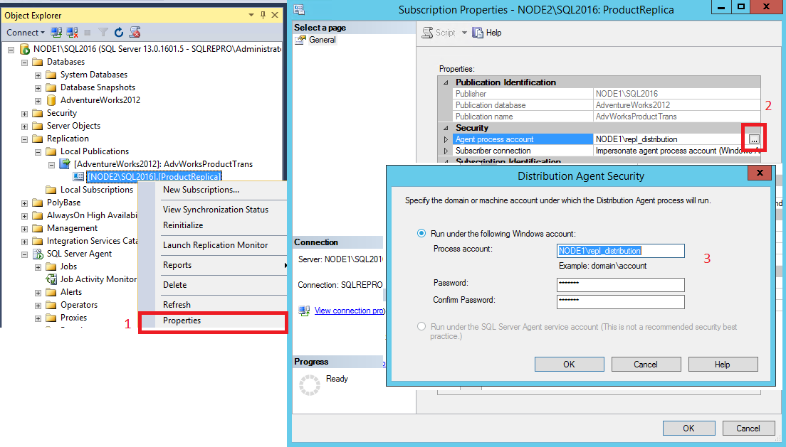

7. Check Replication Monitor again, by right-clicking **Replication** in Object Explorer. A red X under **All Subscriptions** indicates that the Distribution Agent is still encountering an error. 

    Open the **Distribution to Subscriber** history by right-clicking the subscription in **Replication Monitor** > **View Details**. Here, the error is now different: 

    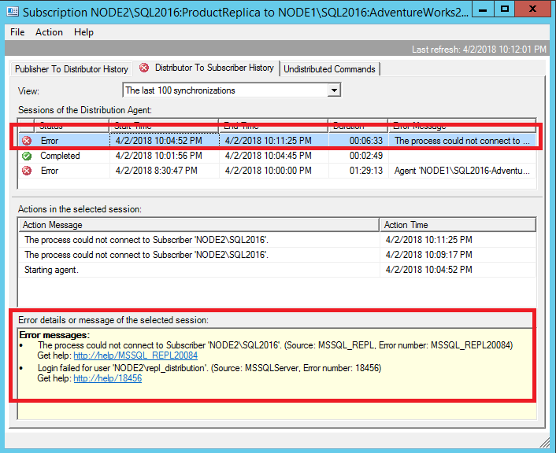

    ```console
    Connecting to Subscriber 'NODE2\SQL2016'        
    Agent message code 20084. The process could not connect to Subscriber 'NODE2\SQL2016'.
    Number:  18456
    Message: Login failed for user 'NODE2\repl_distribution'.
    ```

8. This error indicates that the Distribution Agent could not connect to the subscriber, because the login failed for user **NODE2\repl_distribution**. To investigate further, connect to the subscriber and open the *current* SQL Server error log under the **Management** node in Object Explorer: 

    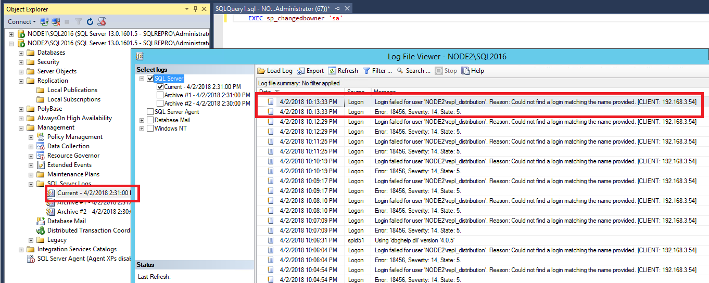
    
    If you're seeing this error, the login is missing on the subscriber. To resolve this error, see [Permissions for replication](../../relational-databases/replication/security/security-role-requirements-for-replication.md).

9. After the login error is resolved, check Replication Monitor again. If all issues have been addressed, you should see a green arrow next to **Publication Name** and a status of **Running** under **All Subscriptions**. 

    Right-click the subscription to open the **Distributor To Subscriber** history once more to verify success. If this is the first time you're running the Distribution Agent, you'll see that the snapshot has been bulk copied to the subscriber: 

     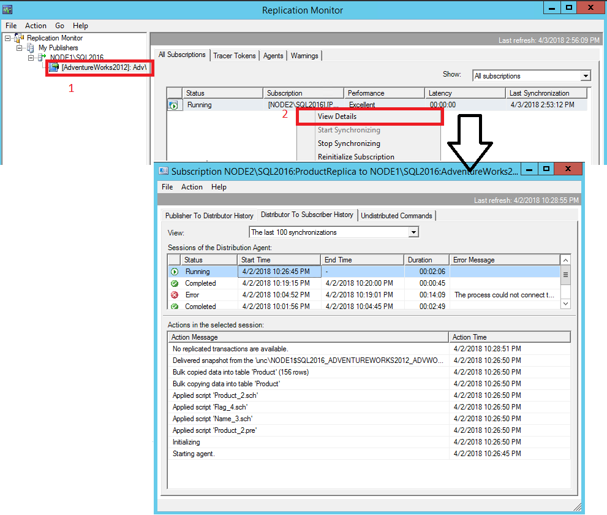   


## Enable verbose logging on any agent
You can use verbose logging to see more detailed information about errors occurring with any agent in the replication topology. The steps are the same for each agent. Just make sure that you're selecting the correct agent in Job Activity Monitor. 

   >[!NOTE]   
   > The agents can be on either the publisher or the subscriber, depending on whether it's a pull or push subscription. If you can't find the agent you're looking for on the server you're looking at, try checking the other server.  

1. Decide where you want the verbose logging to be saved, and ensure that the folder exists. This example uses c:\temp. 
2. Expand the **SQL Server Agent** node in Object Explorer and open Job Activity Monitor. 

        

1. Sort by **Category** and identify the agent of interest. This example uses the Log Reader Agent. Right-click the agent of interest > **Properties**.

    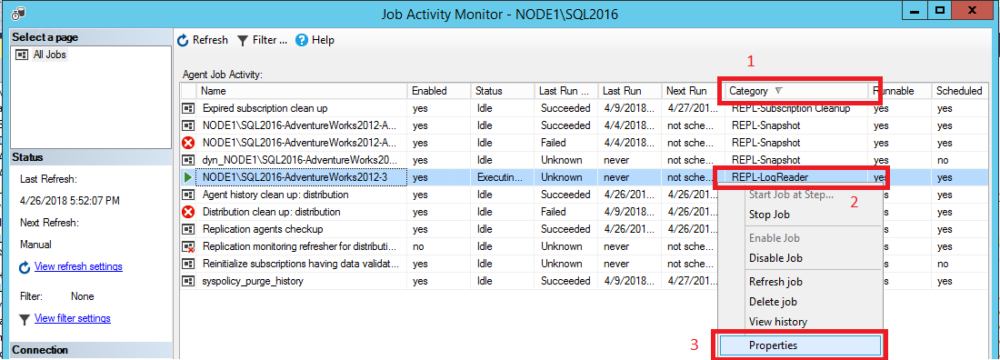

1. Select the **Steps** page, and then highlight the **Run agent** step. Select **Edit**. 

    

1. In the **Command** box, start a new line, enter the following text, and select **OK**: 

    ```console
    -Output C:\Temp\OUTPUTFILE.txt -Outputverboselevel 3
    ```

    You can modify the location and verbosity level according to your preference.

    

   > [!NOTE]
   > These things might cause your agent to fail, or the output file to be missing, when you're adding the verbose output parameter:
   > - There's a formatting issue where the dash became a hyphen. 
   > - The location doesn't exist on disk, or the account that's running the agent lacks permission to write to the specified location. 
   > - There's a space missing between the last parameter and the `-Output` parameter. 
   > - Different agents support different levels of verbosity. If you enable verbose logging but your agent fails to start, try decreasing the specified verbosity level by 1. 

1. Restart the Log Reader Agent by right-clicking the agent > **Stop Job at Step**. Refresh by selecting the **Refresh** icon from the toolbar. Right-click the agent > **Start Job at Step**.
2. Review the output on disk. 

    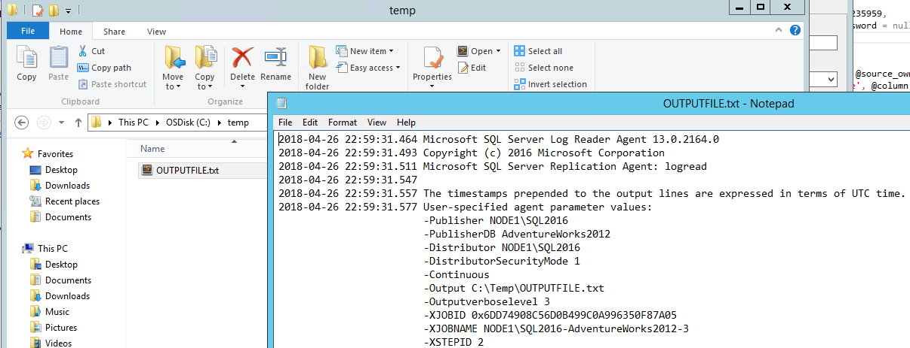

    
1. To disable verbose logging, follow the same previous steps to remove the entire `-Output` line that you added earlier. 

For more information, see [Enabling verbose logging for replication agents](https://support.microsoft.com/help/312292/how-to-enable-replication-agents-for-logging-to-output-files-in-sql-se). 


## See also
<br>[Transactional replication overview](../../relational-databases/replication/transactional/transactional-replication.md)
<br>[Replication tutorials](../../relational-databases/replication/replication-tutorials.md)
<br>[ReplTalk blog](https://blogs.msdn.microsoft.com/repltalk)

[!INCLUDE[get-help-options](../../includes/paragraph-content/get-help-options.md)]

