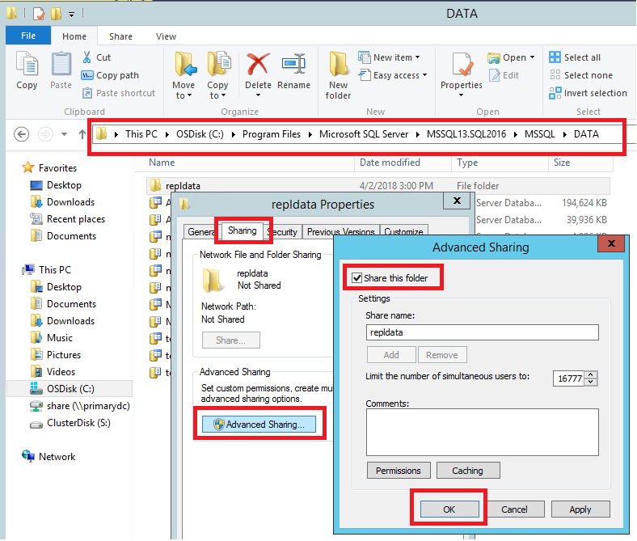
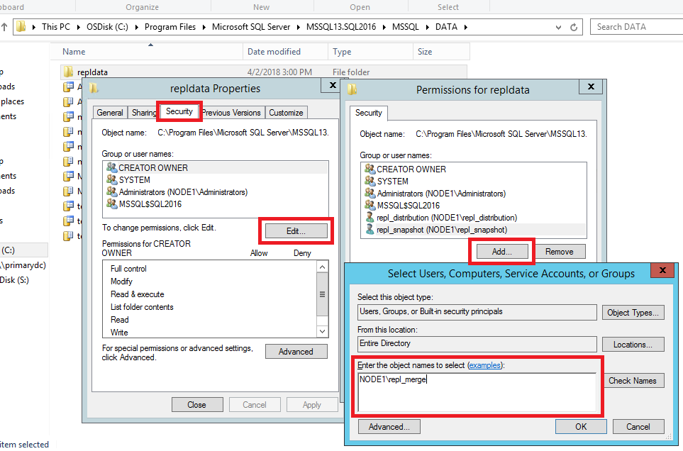
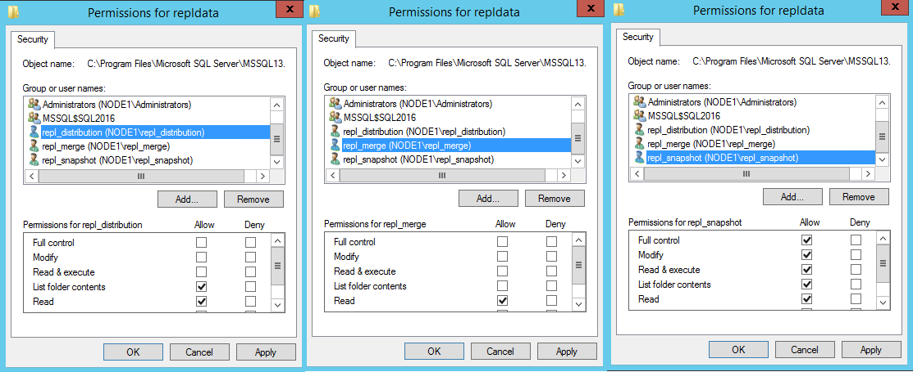

# Tutorial: Preparing the Server for Replication
[!INCLUDE[appliesto-ss-xxxx-xxxx-xxx-md](../../includes/appliesto-ss-xxxx-xxxx-xxx-md.md)]
It is important to plan for security before you configure your replication topology. This tutorial shows you how to better secure a replication topology as well as how to configure distribution, which is the first step in replicating data. You must complete this tutorial before any of the others.  
  
> [!NOTE]  
> To replicate data securely between servers, you should implement all of the recommendations in [Replication Security Best Practices](../../relational-databases/replication/security/replication-security-best-practices.md).  
  
## What You Will Learn  
This tutorial teachs you to prepare a server so that replication can run securely with least privileges.  

In this tutorial, you will learn how to:
> [!div class="checklist"]
> * Create Windows Accounts for Replication
> * Prepare the Snapshot folder
> * Configure Distribution

## Prerequisites
This Tutorial is intended for users familiar with fundamental database operations, but who have limited exposure to replication. To complete this Tutorial, you need SQL Server Management Studio, access to a SQL Server, and the AdventureWorks2012 database. 

- Install [SQL Server Management Studio](https://docs.microsoft.com/en-us/sql/ssms/download-sql-server-management-studio-ssms).
- Install [SQL Server 2017 Developer Edition](https://www.microsoft.com/en-us/sql-server/sql-server-downloads).
- Download an [AdventureWorks Sample Databases](https://github.com/Microsoft/sql-server-samples/releases). Instructions for restoring databases in SSMS can be found here: [Restoring a Database](https://docs.microsoft.com/en-us/sql/relational-databases/backup-restore/restore-a-database-backup-using-ssms). 

**Estimated time to complete this tutorial: 30 minutes**
  
## Create Windows Acounts for Replication
[!INCLUDE[appliesto-ss-xxxx-xxxx-xxx-md](../../includes/appliesto-ss-xxxx-xxxx-xxx-md.md)]
In this section, you will create Windows accounts to run replication agents. You will create a separate Windows account on the local server for the following agents:  
  
|Agent|Location|Account name|  
|---------|------------|----------------|  
|Snapshot Agent|Publisher|\<*machine_name*>\repl_snapshot|  
|Log Reader Agent|Publisher|\<*machine_name*>\repl_logreader|  
|Distribution Agent|Publisher and Subscriber|\<*machine_name*>\repl_distribution|  
|Merge Agent|Publisher and Subscriber|\<*machine_name*>\repl_merge|  
  
> [!NOTE]  
> In the replication tutorials, the Publisher and Distributor share the same instance (NODE1\SQL2016) of [!INCLUDE[ssNoVersion](../../includes/ssnoversion-md.md)]. The subscriber is on NODE2\SQL2016. The Publisher and Subscriber may share the same instance of [!INCLUDE[ssNoVersion](../../includes/ssnoversion-md.md)], but it is not a requirement. If the Publisher and Subscriber share the same instance, the steps that are used to create accounts at the Subscriber are not required.  

### Create local Windows accounts for replication agents at the Publisher
  
1.  At the Publisher, open **Computer Management** from **Administrative Tools** in Control Panel.  
  
2.  In **System Tools**, expand **Local Users and Groups**.  
  
3.  Right-click **Users** and then click **New User**.  
     
4.  Enter **repl_snapshot** in the **User name** box, provide the password and other relevant information, and then click **Create** to create the repl_snapshot account.  

       
  
5.  Repeat the previous step to create the repl_logreader, repl_distribution, and repl_merge accounts.  
 
    
  
6.  Click **Close**.  
  
### To create local Windows accounts for replication agents at the Subscriber  
  
1.  At the Subscriber, open **Computer Management** from **Administrative Tools** in Control Panel.  
  
2.  In **System Tools**, expand **Local Users and Groups**.  
  
3.  Right-click **Users** and then click **New User**.  
  
4.  Enter **repl_distribution** in the **User name** box, provide the password and other relevant information, and then click **Create** to create the repl_distribution account.  
  
5.  Repeat the previous step to create the repl_merge account.  
  
6.  Click **Close**.  

**See Also**:
[Replication Agents Overview](../../relational-databases/replication/agents/replication-agents-overview.md)  

## Prepare the Snapshot Folder
In this section, you will learn to configure the snapshot folder that is used to create and store the publication snapshot. 

### Create a share for the snapshot folder and assign permissions  
  
1.  In Windows Explorer, navigate to the [!INCLUDE[ssNoVersion](../../includes/ssnoversion-md.md)] data folder. The default location is C:\Program Files\Microsoft SQL Server\MSSQL.X\MSSQL\Data.  
  
2.  Create a new folder named **repldata**.  
  
3.  Right-click this folder and click **Properties**.  
  
4.  On the **Sharing** tab in the **repldata Properties** dialog box, click **Advanced Sharing**.  
  
5.  In the **Advanced Sharing** dialog box, click **Share this Folder**, and then click **Ok**.  

    
  
6.  On the **Security** tab, click **Edit**.  
  
7.  In the **Permissions** dialog box, click **Add.** In the **Select User, Computers, Service Account, or Groups** text box, type the name of the Snapshot Agent account created in Lesson 1, as \<*Machine_Name>***\repl_snapshot**, where \<*Machine_Name>* is the name of the Publisher. Click **Check Names**, and then click **OK**.  

    
  
8.  Repeat the previous step to add permissions for the Distribution Agent, as \<*Machine_Name>***\repl_distribution**, and for the Merge Agent as \<*Machine_Name>***\repl_merge**.  
    
  
9. Verify the following permissions are allowed:  
  
    -   repl_snapshot - Full Control   
    -   repl_distribution - Read  
    -   repl_merge - Read  

       

 
10. Click **OK** to close the **repldata Properties** dialog box and create the repldata share. 
 
**See Also**:  
[Secure the Snapshot Folder](../../relational-databases/replication/security/secure-the-snapshot-folder.md)  
  

## Configuring Distribution
[!INCLUDE[appliesto-ss-xxxx-xxxx-xxx-md](../../includes/appliesto-ss-xxxx-xxxx-xxx-md.md)]
In this section, you will configure distribution at the Publisher and set the required permissions on the publication and distribution databases. If you have already configured the Distributor, you must first disable publishing and distribution before you begin this lesson. Do not do this if you must retain an existing replication topology.  
  
Configuring a Publisher with a remote Distributor is outside the scope of this tutorial.  

### Configuring distribution at the Publisher  
  
1.  Connect to the Publisher in [!INCLUDE[ssManStudioFull](../../includes/ssmanstudiofull-md.md)], and then expand the server node.  
  
2.  Right-click the **Replication** folder and click **Configure Distribution**.  

    
  
    > [!NOTE]  
    > If you have connected to [!INCLUDE[ssNoVersion](../../includes/ssnoversion-md.md)] using **localhost** rather than the actual server name you will be prompted with a warning that [!INCLUDE[ssNoVersion](../../includes/ssnoversion-md.md)] is unable to connect to server **'localhost'**. Click **OK** on the warning dialog. In the **Connect to Server** dialog change the **Server name** from **localhost** to the name of your server. Click **Connect**.  
  
    The Distribution Configuration Wizard launches.  
  
3.  On the **Distributor** page, select **'ServerName' will act as its own Distributor; SQL Server will create a distribution database and log**, and then click **Next**.  

    
  
4.  If the [!INCLUDE[ssNoVersion](../../includes/ssnoversion-md.md)] Agent is not running, on the [!INCLUDE[ssNoVersion](../../includes/ssnoversion-md.md)] **Agent Start** page, select **Yes**, configure the [!INCLUDE[ssNoVersion](../../includes/ssnoversion-md.md)] Agent service to start automatically. Click **Next**.  

     
5.  Enter **\\\\**\<*Machine_Name>***\repldata** in the **Snapshot folder** text box, where \<*Machine_Name>* is the name of the Publisher, and then click **Next**. This path should match what you see under **Network Path** of your repldata properties folder. 

    
  
6.  Accept the default values on the remaining pages of the wizard.  
    
    
  
7.  Click **Finish** to enable distribution. 

    You might see this error when configuring the Distributor. It's an indication that the account used to start the SQL Server Agent account is not an administrator on the system. You'll either need to grant those permissions to the existing account, modify which account the SQL Server Agent is using, or just start the SQL Agent manually. 

     

    If your SQL Server Management Studio is running with administrative rights, you can start the SQL Agent manually from within SSMS:  
        

    
  
### Setting database permissions at the Publisher  
  
1.  In [!INCLUDE[ssManStudioFull](../../includes/ssmanstudiofull-md.md)], expand **Security**, right-click **Logins**, and then select **New Login**.  

    
  
2.  On the **General** page, click **Search**, enter \<*Machine_Name>***\repl_snapshot** in the **Enter the object name to select** box, where \<*Machine_Name>* is the name of the local Publisher server, click **Check Names**, and then click **OK**.  

    
  
3.  On the **User Mapping** page, in the **Users mapped to this login** list select both the **distribution** and [!INCLUDE[ssSampleDBobject](../../includes/sssampledbobject-md.md)] databases.  
  
    In the **Database role membership** list select the **db_owner** role for the login for both databases.  

    
  
4.  Click **OK** to create the login.  
  
5.  Repeat steps 1-4 to create a login for the other local accounts (repl_distribution, repl_logreader, and repl_merge) the local repl_distribution and repl_logreader. These logins must also be mapped to users that are members of the **db_owner** fixed database role in the **distribution** and **AdventureWorks** databases.  
  
6. Repeat steps 1-4 to create a login for the local repl_merge account. This login must have user mappings in the **distribution** and **AdventureWorks** databases.  
  
**See Also**:  
[Configure Distribution](../../relational-databases/replication/configure-distribution.md)  
[Replication Agent Security Model](../../relational-databases/replication/security/replication-agent-security-model.md)  

## Next steps
The next article teaches you how to configure Transactional Replication. 

Advance to the next article to learn more
> [!div class="nextstepaction"]
> [Next steps button](scripting-ssms.md)

  
  
